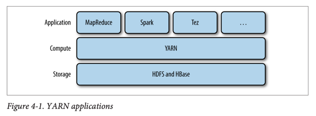
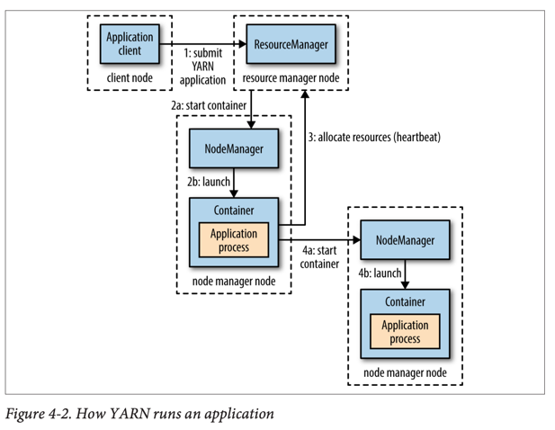
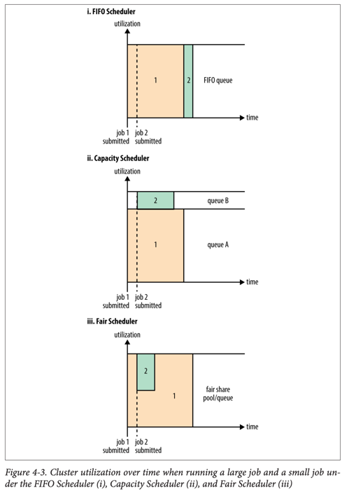
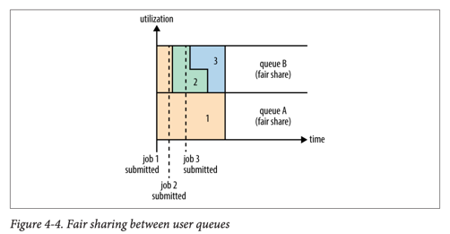

# YARN



### YARN이란?

- Hadoop의 **클러스터 자원 관리 시스템** (cluster resource management system)
- Hadoop 2에서 MapReduce 개선을 위해 도입
- MapReduce뿐만 아니라 **다양한 분산 컴퓨팅 패러다임 지원**
- 사용자는 직접 YARN API를 사용하지 않고 상위 레벨 프레임워크 사용

### YARN 아키텍처

- **클러스터 컴퓨트 레이어**: YARN
- **클러스터 스토리지 레이어**: HDFS, HBase
- **분산 컴퓨팅 프레임워크**: MapReduce, Spark, Tez 등이 YARN 애플리케이션으로 실행

## YARN 애플리케이션 실행 구조



### 핵심 컴포넌트

- **리소스 매니저** (Resource Manager): 클러스터당 1개, 클러스터 자원 관리
- **노드 매니저** (Node Manager): 모든 노드에서 실행, 컨테이너 실행 및 모니터링
- **컨테이너** (Container): 제한된 자원(메모리, CPU)으로 실행되는 애플리케이션별 프로세스
- **애플리케이션 마스터** (Application Master): 각 애플리케이션마다 하나씩 실행

### 애플리케이션 실행 과정

1. **클라이언트**: 리소스 매니저에 애플리케이션 마스터 실행 요청
2. **리소스 매니저**: 노드 매니저에서 애플리케이션 마스터를 컨테이너로 실행
3. **애플리케이션 마스터**: 추가 컨테이너 요청 (필요 시)
4. **분산 계산**: 할당받은 컨테이너들에서 작업 실행

### 자원 요청 (Resource Requests)

- **컴퓨터 자원**: 메모리, CPU 양 지정
- **지역성 제약** (Locality Constraints): 특정 노드, 랙, 또는 클러스터 어디든
- **동적 요청**: 실행 중 필요에 따라 추가 자원 요청 가능
- **지역성 완화**: 요청한 위치에 자원이 없으면 점진적으로 제약 완화

## 애플리케이션 수명주기

### 수명주기 모델

1. **작업당 하나의 애플리케이션**: MapReduce 방식
2. **워크플로우/세션당 하나의 애플리케이션**: Spark 방식 (컨테이너 재사용, 중간 데이터 캐싱)
3. **장기 실행 공유 애플리케이션**: Impala, Apache Slider 방식 (낮은 지연시간)

### YARN 애플리케이션 구축

- **기존 프레임워크 활용**: Spark, Tez, Storm, Samza 등
- **Apache Slider**: 기존 분산 애플리케이션을 YARN에서 실행
- **Apache Twill**: Java Runnable 기반 분산 애플리케이션 개발 모델
- **분산 셸 애플리케이션**: 복잡한 스케줄링이 필요한 경우 참조 구현

## MapReduce 1 vs YARN 비교

### 컴포넌트 매핑

| MapReduce 1          | YARN                           |
|----------------------|--------------------------------|
| 잡트래커 (JobTracker)    | 리소스 매니저 + 애플리케이션 마스터 + 타임라인 서버 |
| 태스크트래커 (TaskTracker) | 노드 매니저                         |
| 슬롯 (Slot)            | 컨테이너                           |

### YARN의 장점

#### 확장성 (Scalability)

- MapReduce 1: 4,000노드, 40,000태스크 한계
- YARN: 10,000노드, 100,000태스크까지 확장 가능
- **분할된 아키텍처**: 리소스 매니저/애플리케이션 마스터 역할 분담

#### 가용성 (Availability)

- MapReduce 1: 잡트래커의 복잡한 상태로 인한 고가용성 구현 어려움
- YARN: 리소스 매니저와 애플리케이션 마스터 각각 고가용성 구현

#### 활용도 (Utilization)

- MapReduce 1: **고정 크기 슬롯** (맵 슬롯, 리듀스 슬롯)으로 자원 낭비
- YARN: **세밀한 자원 할당** (fine-grained resources)으로 필요한 만큼만 사용

#### 멀티테넌시 (Multitenancy)

- MapReduce 외 다른 분산 애플리케이션 지원
- 같은 클러스터에서 **다른 버전의 MapReduce** 실행 가능

## YARN 스케줄링

### 스케줄러 종류





#### FIFO 스케줄러

- **선입선출** (First In, First Out) 방식
- 설정이 간단하지만 **공유 클러스터에 부적합**
- 큰 애플리케이션이 모든 자원을 독점

#### 용량 스케줄러 (Capacity Scheduler)

- **조직별 전용 큐** 할당으로 클러스터 공유
- **계층적 큐 구조** 지원
- **큐 탄력성** (Queue Elasticity): 유휴 자원을 다른 큐에서 사용 가능
- 기본적으로 **선점하지 않음** (non-preemptive)

#### 공정 스케줄러 (Fair Scheduler)

- **동적 자원 균형**: 실행 중인 모든 작업이 동등한 자원 공유
- **큐 간 공정 공유**: 사용자별 큐 간에도 공정하게 자원 분배
- **선점 지원**: 자원을 독점하는 작업의 컨테이너 종료 가능

### 용량 스케줄러 설정

```xml
<!-- 큐 계층: root -> prod(40%), dev(60%) -> eng(50%), science(50%) -->
<property>
    <name>yarn.scheduler.capacity.root.queues</name>
    <value>prod,dev</value>
</property>
<property>
<name>yarn.scheduler.capacity.root.dev.maximum-capacity</name>
<value>75</value>
</property>
```

### 공정 스케줄러 설정

```xml

<allocations>
    <queue name="prod">
        <weight>40</weight>
        <schedulingPolicy>fifo</schedulingPolicy>
    </queue>
    <queue name="dev">
        <weight>60</weight>
        <queue name="eng"/>
        <queue name="science"/>
    </queue>
</allocations>
```

### 큐 배치 정책 (Queue Placement)

- **용량 스케줄러**: `mapreduce.job.queuename` 속성으로 큐 지정
- **공정 스케줄러**: 규칙 기반 시스템으로 큐 결정
    - `specified`: 명시적으로 지정된 큐
    - `primaryGroup`: 사용자의 기본 Unix 그룹
    - `user`: 사용자 이름으로 큐 생성
    - `default`: 기본 큐

## 고급 스케줄링 기능

### 선점 (Preemption)

- **공정 스케줄러**에서 지원
- **최소 공유 선점**: 최소 보장 자원을 받지 못하면 다른 컨테이너 종료
- **공정 공유 선점**: 공정 공유의 절반 이하로 떨어지면 선점 수행
- 클러스터 효율성 감소 (종료된 컨테이너 재실행 필요)

### 지연 스케줄링 (Delay Scheduling)

- **지역성 요청 향상**: 짧은 시간 대기로 원하는 노드에서 실행 확률 증가
- **하트비트 기반**: 노드 매니저가 1초마다 리소스 매니저에 하트비트 전송
- **스케줄링 기회**: 각 하트비트가 컨테이너 할당 기회
- 용량 스케줄러: `yarn.scheduler.capacity.node-locality-delay`
- 공정 스케줄러: `yarn.scheduler.fair.locality.threshold.node`

### 지배적 자원 공정성 (Dominant Resource Fairness, DRF)

- **다중 자원 타입**: 메모리와 CPU 모두 고려한 공정성 계산
- **지배적 자원**: 각 사용자의 가장 많이 사용하는 자원 타입 기준
- **예시**:
    - 애플리케이션 A: (2 CPU, 300GB) → 메모리가 지배적 (3% vs 2%)
    - 애플리케이션 B: (6 CPU, 100GB) → CPU가 지배적 (6% vs 1%)
- 용량 스케줄러: `DominantResourceCalculator` 사용
- 공정 스케줄러: `defaultQueueSchedulingPolicy`를 `drf`로 설정
