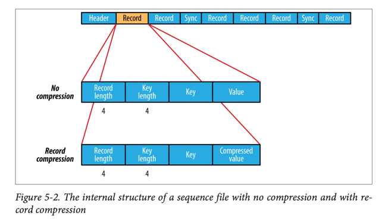
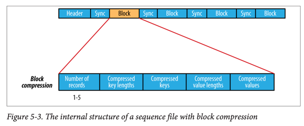
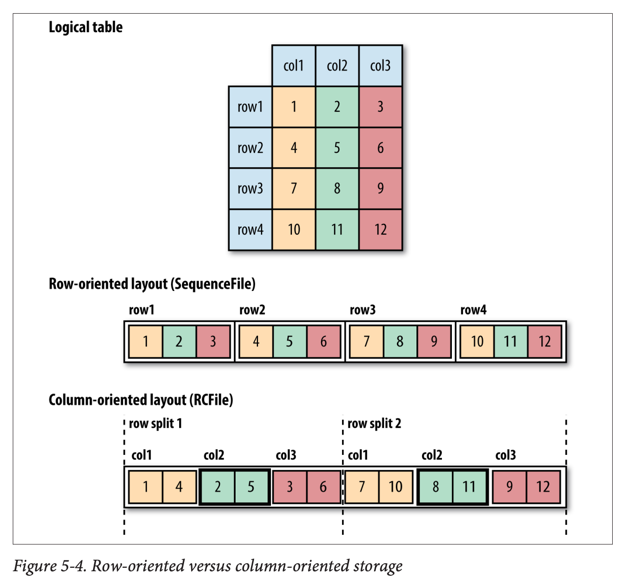

# Hadoop I/O

## 데이터 무결성 (Data Integrity)

### 체크섬 메커니즘

- **체크섬 계산**: 데이터가 시스템에 들어올 때와 전송될 때마다 계산
- **CRC-32C**: HDFS에서 사용하는 효율적인 순환 중복 검사 (Cyclic Redundancy Check)
- **오류 검출**: 체크섬 불일치 시 데이터 손상 감지 (복구는 불가능)

### HDFS 데이터 무결성

- **자동 체크섬 생성**: 모든 데이터 쓰기 시 투명하게 체크섬 생성
- **기본 설정**: 512바이트마다 4바이트 CRC-32C 체크섬 (1% 미만 오버헤드)
- **데이터노드 검증**: 데이터 수신 시와 클라이언트 읽기 시 체크섬 검증
- **DataBlockScanner**: 백그라운드에서 모든 블록을 주기적으로 검증
- **자동 복구**: 손상된 블록 발견 시 다른 복제본으로 새 복제본 생성

### LocalFileSystem

- **클라이언트 사이드 체크섬**: `.filename.crc` 숨김 파일로 체크섬 저장
- **RawLocalFileSystem**: 체크섬 기능을 비활성화한 버전
- **ChecksumFileSystem**: 다른 파일시스템에 체크섬 기능 추가하는 래퍼

## 압축 (Compression)

### 압축 포맷 비교

| 압축 포맷   | 도구    | 알고리즘    | 확장자      | 분할 가능?   |
|---------|-------|---------|----------|----------|
| DEFLATE | N/A   | DEFLATE | .deflate | 아니오      |
| gzip    | gzip  | DEFLATE | .gz      | 아니오      |
| bzip2   | bzip2 | bzip2   | .bz2     | 예        |
| LZO     | lzop  | LZO     | .lzo     | 인덱스 시 가능 |
| LZ4     | N/A   | LZ4     | .lz4     | 아니오      |
| Snappy  | N/A   | Snappy  | .snappy  | 아니오      |

### 압축 특성

- **gzip**: 범용 압축기, 공간/시간 절충점의 중간
- **bzip2**: 높은 압축률, 느린 속도, 분할 지원
- **LZO/LZ4/Snappy**: 속도 최적화 (gzip보다 10배 빠름), 낮은 압축률

### Hadoop 압축 코덱 (Codecs)

| 압축 포맷   | Hadoop CompressionCodec 클래스 |
|---------|-----------------------------|
| DEFLATE | DefaultCodec                |
| gzip    | GzipCodec                   |
| bzip2   | BZip2Codec                  |
| LZO     | LzopCodec (별도 설치 필요)        |
| LZ4     | Lz4Codec                    |
| Snappy  | SnappyCodec                 |

### 압축 사용 시 고려사항

- **분할 가능성**: MapReduce에서 중요한 요소
- **압축과 입력 분할**: 분할 불가능한 포맷은 지역성 손실 초래
- **권장사항**:
    1. 컨테이너 파일 포맷 사용 (SequenceFile, Avro, ORC, Parquet)
    2. 분할 지원 포맷 사용 (bzip2, 인덱싱된 LZO)
    3. 애플리케이션에서 청크 단위로 분할 후 압축
    4. 압축하지 않고 저장

### MapReduce에서 압축 사용

```
// 출력 압축 설정
FileOutputFormat.setCompressOutput(job, true);
FileOutputFormat.setOutputCompressorClass(job, GzipCodec .class);

// 맵 출력 압축 설정 (중간 결과)
conf.setBoolean(Job.MAP_OUTPUT_COMPRESS, true);
conf.setClass(Job.MAP_OUTPUT_COMPRESS_CODEC, GzipCodec .class, CompressionCodec .class);
```

### 네이티브 라이브러리

- **성능 향상**: 네이티브 구현이 Java 구현보다 최대 50% 빠른 압축해제
- **자동 감지**: 플랫폼에 맞는 네이티브 라이브러리 자동 로드
- **CodecPool**: 압축/해제 객체 재사용으로 객체 생성 비용 절약

## 직렬화 (Serialization)

### 직렬화 요구사항

- **컴팩트**: 네트워크 대역폭 효율적 사용
- **빠름**: 최소한의 성능 오버헤드
- **확장 가능**: 프로토콜 진화 지원
- **상호 운용성**: 다양한 언어 지원

### Writable 인터페이스

```java
public interface Writable {

    void write(DataOutput out) throws IOException;

    void readFields(DataInput in) throws IOException;
}
```

### WritableComparable과 비교자

- **WritableComparable**: Writable + Comparable 인터페이스
- **RawComparator**: 객체 역직렬화 없이 바이트 스트림에서 직접 비교
- **WritableComparator**: RawComparator의 범용 구현체

### 기본 Writable 클래스들

| Java 원시 타입 | Writable 구현     | 직렬화 크기 (바이트) |
|------------|-----------------|--------------|
| boolean    | BooleanWritable | 1            |
| byte       | ByteWritable    | 1            |
| int        | IntWritable     | 4            |
| int        | VIntWritable    | 1-5          |
| long       | LongWritable    | 8            |
| long       | VLongWritable   | 1-9          |
| float      | FloatWritable   | 4            |
| double     | DoubleWritable  | 8            |

### 가변 길이 인코딩

- **VIntWritable/VLongWritable**: 작은 값 (-112~127)은 1바이트로 저장
- **공간 효율성**: 균등하지 않은 분포의 숫자에 유리
- **호환성**: VInt와 VLong 간 인코딩 호환

### Text 클래스

- **UTF-8 인코딩**: 표준 UTF-8 사용으로 다른 도구와 상호 운용성
- **바이트 인덱싱**: 문자가 아닌 바이트 오프셋 기준 인덱싱
- **가변성**: String과 달리 값 수정 가능
- **유니코드 지원**: 서로게이트 페어 (surrogate pair) 처리

### 사용자 정의 Writable 구현

```java
public class TextPair implements WritableComparable<TextPair> {

    private Text first;
    private Text second;

    // 생성자, getter/setter 메소드들

    @Override
    public void write(DataOutput out) throws IOException {
        first.write(out);
        second.write(out);
    }

    @Override
    public void readFields(DataInput in) throws IOException {
        first.readFields(in);
        second.readFields(in);
    }

    // hashCode, equals, toString, compareTo 구현
}
```

### RawComparator 최적화

- **성능 향상**: 역직렬화 없이 바이트 레벨에서 직접 비교
- **MapReduce 정렬**: 키 비교 시 객체 생성 비용 절약
- **WritableComparator 상속**: 편의 메소드와 기본 구현 제공

## 파일 기반 데이터 구조

### SequenceFile

- **용도**: 바이너리 키-값 쌍의 영속적 데이터 구조
- **작은 파일 해결책**: 여러 작은 파일을 하나의 SequenceFile로 패킹
- **로그 파일 형식**: 바이너리 타입을 로깅할 때 적합

#### SequenceFile 쓰기

```
SequenceFile.Writer writer = SequenceFile.createWriter(fs, conf, path, key.getClass(), value.getClass());
writer.append(key, value);
writer.close();
```

#### SequenceFile 읽기

```
SequenceFile.Reader reader = new SequenceFile.Reader(fs, path, conf);
while(reader.next(key, value)){
    // 키-값 쌍 처리
    }
    reader.close();
```

### SequenceFile 내부 구조





- **헤더**: 매직 넘버 (SEQ), 버전, 키/값 클래스명, 압축 정보, 메타데이터
- **동기화 마커**: 임의의 위치에서 레코드 경계로 재동기화 가능
- **압축 옵션**:
    - **압축 없음**: 레코드 길이 + 키 길이 + 키 + 값
    - **레코드 압축**: 값만 압축
    - **블록 압축**: 여러 레코드를 블록 단위로 압축 (권장)

### 동기화와 분할

- **sync() 메소드**: 다음 동기화 점으로 이동
- **MapReduce 분할**: 동기화 점을 이용해 파일을 여러 맵 태스크로 분할
- **임의 접근**: seek()와 sync() 메소드로 파일 내 특정 위치 접근

### MapFile

- **정렬된 SequenceFile**: 키로 검색 가능한 인덱스 포함
- **인덱스 구조**: 128번째 키마다 별도 SequenceFile로 인덱스 생성
- **순서 쓰기**: 키를 정렬된 순서로만 추가 가능

#### MapFile 변형

- **SetFile**: Writable 키 집합 저장
- **ArrayFile**: 정수 인덱스를 키로 사용하는 배열
- **BloomMapFile**: 블룸 필터로 빠른 존재 여부 검사

### 다른 파일 포맷들

#### 행 지향 vs 열 지향



- **행 지향** (Sequence Files, Avro): 각 행의 값들이 연속적으로 저장
- **열 지향** (ORC, Parquet): 열별로 데이터 분리 저장
- **열 지향 장점**:
    - 쿼리에서 사용하지 않는 열 건너뛰기 가능
    - 열 단위 압축으로 더 높은 압축률
- **열 지향 단점**:
    - 더 많은 메모리 필요 (행 분할 버퍼링)
    - 스트리밍 쓰기에 부적합 (플러시/동기화 제어 어려움)

#### 주요 파일 포맷

- **Avro 데이터파일**: 언어 중립적, 스키마 진화 지원
- **ORCFile**: Hive 최적화 열 지향 포맷
- **Parquet**: 범용 열 지향 포맷, 광범위한 Hadoop 생태계 지원
- **RCFile**: 초기 열 지향 포맷 (현재는 ORC로 대체)

### 파일 포맷 선택 가이드

1. **새 프로젝트**: Avro 데이터파일 (기본 권장)
2. **분석 쿼리 중심**: ORC 또는 Parquet (열 지향)
3. **스트리밍 처리**: Avro 데이터파일 (행 지향)
4. **레거시 호환**: SequenceFile
5. **키-값 검색**: MapFile

## 직렬화 프레임워크

### 플러그인 가능한 직렬화

- **Serialization 인터페이스**: 타입을 Serializer/Deserializer로 매핑
- **io.serializations 속성**: 콤마로 구분된 직렬화 구현체 클래스명
- **기본 지원**: WritableSerialization, Avro Specific/Reflect 직렬화

### 다른 직렬화 옵션

- **Java Object Serialization**: 편리하지만 비효율적
- **IDL 기반**: Apache Thrift, Google Protocol Buffers
- **Avro**: Hadoop에 최적화된 IDL 기반 직렬화 (12장에서 상세 다룸)
