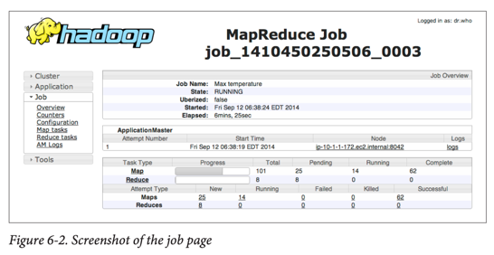
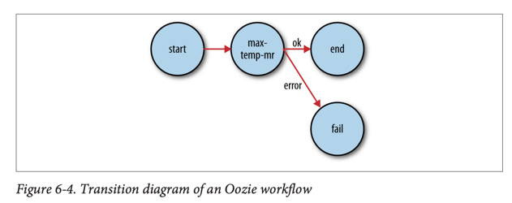

# Developing a MapReduce Application

## Configuration API

### 설정 관리

- **Configuration 클래스**: Hadoop 컴포넌트 설정을 위한 API
- **XML 기반**: 이름-값 쌍으로 속성 정의
- **타입 지원**: 기본 타입(boolean, int, long, float), String, Class, File 등

### 설정 파일 구조

```xml

<configuration>
    <property>
        <name>속성명</name>
        <value>속성값</value>
        <final>true</final>  <!-- 덮어쓰기 방지 -->
        <description>설명</description>
    </property>
</configuration>
```

### 리소스 결합 (Combining Resources)

- **우선순위**: 나중에 추가된 리소스가 이전 정의 덮어쓰기
- **final 속성**: `<final>true</final>`로 표시된 속성은 덮어쓰기 불가
- **변수 확장**: `${속성명}` 형태로 다른 속성이나 시스템 속성 참조 가능

## 개발 환경 설정

### Maven 의존성

```xml

<dependencies>
    <!-- Hadoop 클라이언트 -->
    <dependency>
        <groupId>org.apache.hadoop</groupId>
        <artifactId>hadoop-client</artifactId>
        <version>${hadoop.version}</version>
    </dependency>

    <!-- 테스트 도구 -->
    <dependency>
        <groupId>org.apache.mrunit</groupId>
        <artifactId>mrunit</artifactId>
        <version>1.1.0</version>
        <classifier>hadoop2</classifier>
        <scope>test</scope>
    </dependency>

    <!-- 미니 클러스터 -->
    <dependency>
        <groupId>org.apache.hadoop</groupId>
        <artifactId>hadoop-minicluster</artifactId>
        <version>${hadoop.version}</version>
        <scope>test</scope>
    </dependency>
</dependencies>
```

### 설정 관리 방법

- **hadoop-local.xml**: 로컬 실행 (`fs.defaultFS=file:///`, `mapreduce.framework.name=local`)
- **hadoop-localhost.xml**: 의사분산 모드 (`fs.defaultFS=hdfs://localhost/`)
- **hadoop-cluster.xml**: 클러스터 모드 (실제 클러스터 주소)

### 사용자 식별

- **HADOOP_USER_NAME**: 환경변수로 Hadoop 사용자명 설정
- **hadoop.user.group.static.mapping.overrides**: 사용자-그룹 매핑 덮어쓰기

## Tool 인터페이스와 GenericOptionsParser

### Tool 인터페이스

```java
public interface Tool extends Configurable {

    int run(String[] args) throws Exception;
}
```

### 구현 패턴

```java
public class MyTool extends Configured implements Tool {

    @Override
    public int run(String[] args) throws Exception {
        Configuration conf = getConf();
        // 작업 수행
        return 0; // 성공 시 0, 실패 시 0이 아닌 값
    }

    public static void main(String[] args) throws Exception {
        int exitCode = ToolRunner.run(new MyTool(), args);
        System.exit(exitCode);
    }
}
```

### GenericOptionsParser 옵션

| 옵션                                | 설명               |
|-----------------------------------|------------------|
| `-D property=value`               | Hadoop 설정 속성 설정  |
| `-conf filename`                  | 설정 파일 추가         |
| `-fs uri`                         | 기본 파일시스템 설정      |
| `-jt host:port`                   | YARN 리소스 매니저 설정  |
| `-files file1,file2,...`          | 분산 캐시에 파일 추가     |
| `-archives archive1,archive2,...` | 분산 캐시에 아카이브 추가   |
| `-libjars jar1,jar2,...`          | 클래스패스에 JAR 파일 추가 |

## 단위 테스트 (MRUnit)

### 매퍼 테스트

```java

@Test
public void testMapper() throws IOException, InterruptedException {
    new MapDriver<LongWritable, Text, Text, IntWritable>().withMapper(new MaxTemperatureMapper())
                                                          .withInput(new LongWritable(0),
                                                                     new Text("0043011990999991950051518004..."))
                                                          .withOutput(new Text("1950"), new IntWritable(-11))
                                                          .runTest();
}
```

### 리듀서 테스트

```java

@Test
public void testReducer() throws IOException, InterruptedException {
    new ReduceDriver<Text, IntWritable, Text, IntWritable>().withReducer(new MaxTemperatureReducer())
                                                            .withInput(new Text("1950"),
                                                                       Arrays.asList(new IntWritable(10),
                                                                                     new IntWritable(5)))
                                                            .withOutput(new Text("1950"), new IntWritable(10))
                                                            .runTest();
}
```

### 드라이버 테스트

- **로컬 작업 실행기** 사용: 작은 테스트 데이터셋으로 전체 작업 테스트
- **미니 클러스터** 사용: 실제 HDFS, MapReduce, YARN 환경에서 테스트

## 로컬 실행

### 로컬 작업 실행기 (Local Job Runner)

- **설정**: `mapreduce.framework.name=local`
- **용도**: 단일 JVM에서 MapReduce 작업 실행
- **디버깅**: IDE에서 디버거로 매퍼/리듀서 단계별 실행 가능

### 드라이버 구현 예제

```java
public class MaxTemperatureDriver extends Configured implements Tool {

    @Override
    public int run(String[] args) throws Exception {
        Job job = new Job(getConf(), "Max temperature");
        job.setJarByClass(getClass());

        FileInputFormat.addInputPath(job, new Path(args[0]));
        FileOutputFormat.setOutputPath(job, new Path(args[1]));

        job.setMapperClass(MaxTemperatureMapper.class);
        job.setCombinerClass(MaxTemperatureReducer.class);
        job.setReducerClass(MaxTemperatureReducer.class);

        job.setOutputKeyClass(Text.class);
        job.setOutputValueClass(IntWritable.class);

        return job.waitForCompletion(true) ? 0 : 1;
    }
}
```

## 클러스터 실행

### 작업 패키징

- **JAR 파일 생성**: 모든 클래스를 포함한 작업 JAR 생성
- **의존성 처리**:
    1. JAR 내부에 라이브러리 언패킹 후 재패키징
    2. `lib/` 디렉터리에 라이브러리 JAR 포함
    3. `-libjars` 옵션으로 분산 캐시 사용

### 클래스패스 관리

- **클라이언트 클래스패스**: 작업 JAR + lib 디렉터리 + HADOOP_CLASSPATH
- **태스크 클래스패스**: 작업 JAR + lib 디렉터리 + `-libjars`로 추가된 파일
- **우선순위 제어**: `HADOOP_USER_CLASSPATH_FIRST`, `mapreduce.job.user.classpath.first`

### 작업 실행

```bash
# 환경변수 정리
unset HADOOP_CLASSPATH

# 작업 실행
hadoop jar hadoop-examples.jar MaxTemperatureDriver \
    -conf conf/hadoop-cluster.xml \
    input/ncdc/all output
```

### 작업/태스크/시도 ID 구조

- **애플리케이션 ID**: `application_1410450250506_0003`
- **작업 ID**: `job_1410450250506_0003`
- **태스크 ID**: `task_1410450250506_0003_m_000003`
- **태스크 시도 ID**: `attempt_1410450250506_0003_m_000003_0`

## 웹 UI와 모니터링

### 리소스 매니저 페이지 (포트 8088)

- **클러스터 메트릭**: 실행 중인 애플리케이션, 가용 자원, 노드 매니저 정보
- **애플리케이션 목록**: 실행 중이거나 완료된 모든 애플리케이션
- **작업 히스토리**: 완료된 MapReduce 작업의 이벤트와 설정 정보

### MapReduce job 페이지



- **작업 진행률**: 맵/리듀스 태스크의 대기/실행/완료 상태
- **태스크 시도**: 실패/종료된 태스크 시도 정보
- **설정 링크**: 작업 실행 시 적용된 모든 속성 값 확인 가능

## 디버깅

### 디버깅 기법

1. **카운터 사용**: 의심스러운 레코드 개수 추적

```
enum Temperature {
    OVER_100,
    MALFORMED
}

// 카운터 증가
context.getCounter(Temperature.OVER_100).increment(1);
```

2. **상태 메시지**: 태스크 상태 업데이트

```
context.setStatus("Detected possibly corrupt record: see logs.");
```

3. **표준 에러 로깅**: 의심스러운 입력 데이터 기록

```
System.err.println("Temperature over 100 degrees for input: "+value);
```

### 로그 관리

| 로그 타입             | 대상  | 설명                     | 위치                    |
|-------------------|-----|------------------------|-----------------------|
| 시스템 데몬 로그         | 관리자 | 각 Hadoop 데몬의 log4j 로그  | HADOOP_LOG_DIR        |
| HDFS 감사 로그        | 관리자 | 모든 HDFS 요청 기록          | 네임노드 로그               |
| MapReduce 작업 히스토리 | 사용자 | 작업 완료 이벤트              | HDFS 중앙 저장            |
| MapReduce 태스크 로그  | 사용자 | syslog, stdout, stderr | YARN_LOG_DIR/userlogs |

### 원격 디버깅 옵션

1. **로컬 재현**: 실패한 입력 파일을 로컬에서 재실행
2. **JVM 옵션**: 메모리 덤프 생성 (`-XX:+HeapDumpOnOutOfMemoryError`)
3. **태스크 프로파일링**: HPROF 프로파일러 사용
4. **중간 파일 보존**: `mapreduce.task.files.preserve.failedtasks=true`

## 성능 튜닝

### 튜닝 체크리스트

| 영역         | 모범 사례                          |
|------------|--------------------------------|
| 매퍼 수       | 매퍼가 1분 정도 실행되도록 조정             |
| 리듀서 수      | 리듀서가 5분 정도 실행되고 블록 크기만큼 데이터 생성 |
| 컴바이너       | 셔플 데이터 양 감소를 위한 컴바이너 활용        |
| 중간 압축      | 맵 출력 압축 활성화                    |
| 사용자 정의 직렬화 | RawComparator 구현으로 성능 최적화      |
| 셔플 조정      | 메모리 관리 관련 매개변수 조정              |

### 프로파일링

```bash
# HPROF 프로파일러 활성화
hadoop jar hadoop-examples.jar MaxTemperatureDriver \
    -conf conf/hadoop-cluster.xml \
    -D mapreduce.task.profile=true \
    input/ncdc/all max-temp
```

## MapReduce 워크플로우

### 문제 분해 원칙

- **복잡성을 여러 작업으로 분산**: 복잡한 맵/리듀스 함수보다 더 많은 MapReduce 작업 선호
- **구성 가능성**: 간단한 매퍼/리듀서로 유지보수성 향상
- **체인 매퍼**: `ChainMapper`와 `ChainReducer`로 여러 매퍼 연결

### 작업 제어 (JobControl)

```
// 선형 체인
JobClient.runJob(conf1);
JobClient.runJob(conf2);

// DAG 워크플로우
JobControl jobControl = new JobControl("workflow");
jobControl.addJob(job1);
jobControl.addJob(job2);
jobControl.addJobCollection(Arrays.asList(job1),job2); // job2는 job1에 의존
```

### Apache Oozie



- **워크플로우 엔진**: 다양한 Hadoop 작업 (MapReduce, Pig, Hive) 실행
- **코디네이터 엔진**: 일정과 데이터 가용성 기반 워크플로우 실행
- **XML 정의**: Hadoop Process Definition Language 사용

#### Oozie 워크플로우 정의 예제

```xml

<workflow-app xmlns="uri:oozie:workflow:0.1" name="max-temp-workflow">
    <start to="max-temp-mr"/>

    <action name="max-temp-mr">
        <map-reduce>
            <job-tracker>${resourceManager}</job-tracker>
            <name-node>${nameNode}</name-node>
            <prepare>
                <delete path="${nameNode}/user/${wf:user()}/output"/>
            </prepare>
            <configuration>
                <property>
                    <name>mapreduce.job.map.class</name>
                    <value>MaxTemperatureMapper</value>
                </property>
                <!-- 기타 설정 -->
            </configuration>
        </map-reduce>
        <ok to="end"/>
        <error to="fail"/>
    </action>

    <kill name="fail">
        <message>MapReduce failed</message>
    </kill>
    <end name="end"/>
</workflow-app>
```

#### Oozie 애플리케이션 구조

```
max-temp-workflow/
├── lib/
│   └── hadoop-examples.jar
└── workflow.xml
```

#### Oozie 실행

```bash
# 워크플로우 업로드
hadoop fs -put max-temp-workflow max-temp-workflow

# 작업 실행
export OOZIE_URL="http://localhost:11000/oozie"
oozie job -config max-temp-workflow.properties -run

# 상태 확인
oozie job -info <job-id>
```

## 개발 워크플로우 요약

1. **단위 테스트 작성**: MRUnit으로 매퍼/리듀서 테스트
2. **로컬 테스트**: 작은 데이터셋으로 전체 드라이버 테스트
3. **패키징**: 작업 JAR 파일 생성
4. **클러스터 실행**: 전체 데이터셋으로 실행
5. **디버깅**: 로그와 카운터로 문제 분석
6. **튜닝**: 성능 최적화 적용
7. **워크플로우**: 복잡한 처리를 여러 작업으로 분해

