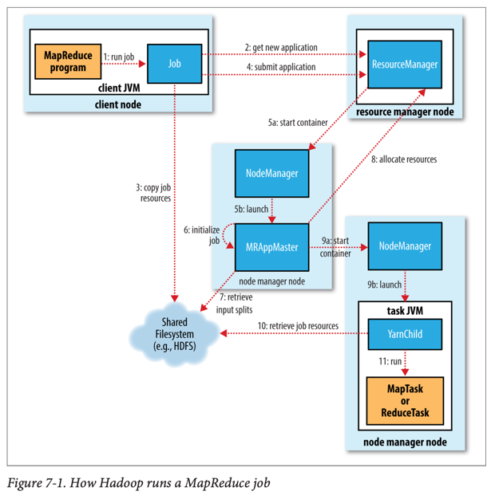
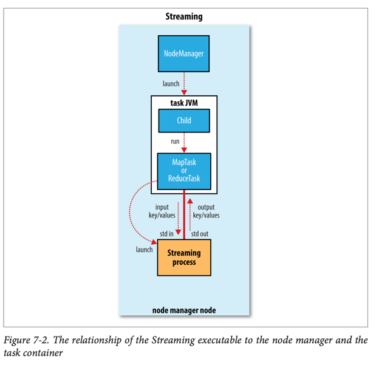
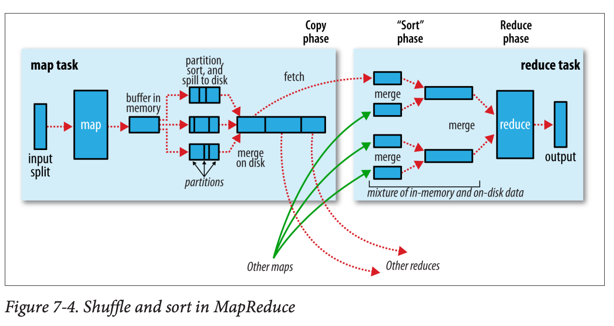
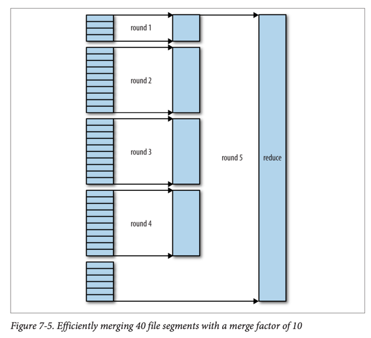

# How MapReduce Works

## MapReduce 작업 실행 구조

### 주요 엔티티 (5개 독립 엔티티)

1. **클라이언트** (Client): MapReduce 작업 제출
2. **YARN 리소스 매니저** (Resource Manager): 클러스터 컴퓨팅 자원 할당 조정
3. **YARN 노드 매니저** (Node Manager): 클러스터 머신에서 컨테이너 실행 및 모니터링
4. **MapReduce 애플리케이션 마스터** (Application Master): MapReduce 작업의 태스크 조정
5. **분산 파일시스템** (HDFS): 엔티티 간 작업 파일 공유

### 작업 제출 (Job Submission)

1. **애플리케이션 ID 요청**: 리소스 매니저에서 새 애플리케이션 ID 획득
2. **출력 사양 검사**: 출력 디렉터리 미지정/기존 존재 시 에러
3. **입력 분할 계산**: 분할 계산 불가 시 (입력 경로 없음) 에러
4. **자원 복사**: 작업 JAR, 설정 파일, 입력 분할을 공유 파일시스템에 복사
    - JAR 파일은 높은 복제 팩터 (기본 10)로 복사
5. **작업 제출**: `submitApplication()`으로 리소스 매니저에 작업 제출

### 작업 초기화 (Job Initialization)

1. **컨테이너 할당**: YARN 스케줄러가 컨테이너 할당
2. **애플리케이션 마스터 실행**: 노드 매니저 관리 하에 MRAppMaster 프로세스 실행
3. **진행 추적 객체 생성**: 작업 진행률과 완료 리포트 추적용 객체들 생성
4. **입력 분할 검색**: 공유 파일시스템에서 계산된 입력 분할 검색
5. **태스크 객체 생성**: 각 분할에 대한 맵 태스크와 리듀스 태스크 객체 생성

### 우버 태스크 (Uber Task)

- **개념**: 애플리케이션 마스터와 같은 JVM에서 태스크 실행
- **조건**:
    - 맵퍼 10개 미만
    - 리듀서 1개
    - 입력 크기가 HDFS 블록 크기 미만
- **설정**: `mapreduce.job.ubertask.enable=true`

### 태스크 할당 (Task Assignment)

- **우선순위**: 맵 태스크 > 리듀스 태스크 (모든 맵 완료 후 리듀스 시작)
- **리듀스 지연 시작**: 맵 태스크 5% 완료 후 리듀스 태스크 요청
- **데이터 지역성 제약**:
    1. **데이터 로컬**: 분할이 있는 노드에서 실행
    2. **랙 로컬**: 같은 랙 내 다른 노드에서 실행
    3. **오프 랙**: 다른 랙 노드에서 실행
- **자원 요구사항**:
    - 기본: 각 태스크마다 1,024MB 메모리, 1 가상 코어
    - 설정 가능: `mapreduce.map.memory.mb`, `mapreduce.reduce.memory.mb`

### 태스크 실행 (Task Execution)

1. **컨테이너 시작**: 애플리케이션 마스터가 노드 매니저에 연락하여 컨테이너 시작
2. **YarnChild 실행**: 메인 클래스가 YarnChild인 Java 애플리케이션으로 태스크 실행
3. **자원 로컬라이제이션**: 작업 설정, JAR 파일, 분산 캐시 파일 로컬화
4. **맵/리듀스 태스크 실행**: 전용 JVM에서 사용자 정의 함수 실행

### 스트리밍 (Streaming)

- **특수 태스크**: 사용자 제공 실행 파일 실행을 위한 특수 맵/리듀스 태스크
- **통신 방식**: 표준 입출력 스트림으로 Java 프로세스와 외부 프로세스 간 통신
- **키-값 전달**: Java 프로세스가 외부 프로세스에 키-값 쌍 전달

## 진행률과 상태 업데이트

### 진행률 구성 요소

- **맵 태스크**: 처리된 입력 비율
- **리듀스 태스크**: 3단계 (복사/정렬/리듀스)로 나누어 계산
    - 예: 입력의 절반 처리 시 → 5/6 진행률

### 진행률로 인정되는 작업

- 입력 레코드 읽기 (매퍼/리듀서)
- 출력 레코드 쓰기 (매퍼/리듀서)
- 상태 설명 설정 (`setStatus()`)
- 카운터 증가 (`increment()`)
- `progress()` 메소드 호출

### 상태 업데이트 흐름

1. **태스크 → 애플리케이션 마스터**: 3초마다 엄비리컬 인터페이스 (umbilical interface)로 보고
2. **애플리케이션 마스터**: 작업 전체 상태 집계
3. **클라이언트 → 애플리케이션 마스터**: 1초마다 폴링으로 상태 확인
4. **웹 UI**: 리소스 매니저 UI에서 모든 실행 중인 애플리케이션 표시

### 작업 완료 (Job Completion)

1. **완료 알림**: 마지막 태스크 완료 시 애플리케이션 마스터가 작업 상태를 "성공"으로 변경
2. **통계 출력**: Job이 완료 확인 시 작업 통계와 카운터 콘솔에 출력
3. **HTTP 알림**: `mapreduce.job.end-notification.url` 설정 시 HTTP 콜백 전송
4. **정리 작업**: 중간 출력 삭제, `OutputCommitter.commitJob()` 호출
5. **히스토리 저장**: 작업 히스토리 서버에 작업 정보 보관

## 장애 처리 (Failures)

### 태스크 장애 (Task Failure)

- **런타임 예외**: 사용자 코드 예외 발생 시 JVM이 애플리케이션 마스터에 오류 보고
- **JVM 갑작스런 종료**: 노드 매니저가 프로세스 종료 감지하여 애플리케이션 마스터에 알림
- **태스크 행잉**: 10분간 진행 업데이트 없으면 실패로 처리 (`mapreduce.task.timeout`)
- **재시도**: 4회 실패까지 재시도 (`mapreduce.map.maxattempts`, `mapreduce.reduce.maxattempts`)
- **작업 실패 허용**: `mapreduce.map.failures.maxpercent`로 일정 비율 실패 허용

### 애플리케이션 마스터 장애 (Application Master Failure)

- **재시도**: 기본 2회까지 재시도 (`mapreduce.am.max-attempts`)
- **복구**: 작업 히스토리를 사용해 완료된 태스크 상태 복구 (`yarn.app.mapreduce.am.job.recovery.enable`)
- **클라이언트 처리**: 타임아웃 시 리소스 매니저에서 새 애플리케이션 마스터 주소 요청

### 노드 매니저 장애 (Node Manager Failure)

- **감지**: 10분간 하트비트 없으면 장애로 판단 (`yarn.resourcemanager.nm.liveness-monitor.expiry-interval-ms`)
- **태스크 복구**: 장애 노드의 모든 태스크와 애플리케이션 마스터 복구
- **맵 출력 재실행**: 완료된 맵 태스크도 중간 출력 접근 불가로 재실행
- **블랙리스트**: 3개 이상 태스크 실패 시 해당 노드 블랙리스트 처리

### 리소스 매니저 장애 (Resource Manager Failure)

- **고가용성**: Active-Standby 구성으로 HA 구현
- **상태 저장소**: ZooKeeper 또는 HDFS에 실행 중인 애플리케이션 정보 저장
- **페일오버**: ZooKeeper 리더 선출로 단일 액티브 리소스 매니저 보장
- **복구**: 새 리소스 매니저가 모든 애플리케이션 마스터 재시작

## 셔플과 정렬 (Shuffle and Sort)

### 맵 사이드 (Map Side)

1. **원형 메모리 버퍼**: 기본 100MB (`mapreduce.task.io.sort.mb`)
2. **스필 임계값**: 80% 도달 시 백그라운드 스레드가 디스크에 스필 (`mapreduce.map.sort.spill.percent`)
3. **파티셔닝과 정렬**: 리듀서별 파티션으로 나누고 키별 인메모리 정렬
4. **컴바이너 실행**: 정렬 출력에 컴바이너 함수 실행 (압축된 맵 출력 생성)
5. **스필 파일 병합**: 여러 스필 파일을 단일 파티션되고 정렬된 출력 파일로 병합
6. **HTTP 서비스**: 리듀서가 HTTP로 맵 출력 파일 파티션 접근

### 리듀스 사이드 (Reduce Side)

1. **복사 단계** (Copy Phase):
    - 기본 5개 복사 스레드로 맵 출력 병렬 가져오기
    - 작은 맵 출력은 메모리에, 큰 출력은 디스크에 복사
    - 백그라운드 스레드가 더 큰 정렬된 파일로 병합

2. **정렬 단계** (Sort/Merge Phase):
    - 모든 맵 출력 복사 완료 후 병합 수행
    - 여러 라운드로 병합 (기본 병합 팩터 10)
    - 최종 라운드는 디스크 쓰기 없이 직접 리듀스 함수로 전달

3. **리듀스 단계** (Reduce Phase):
    - 정렬된 출력의 각 키에 대해 리듀스 함수 호출
    - 출력을 HDFS에 직접 쓰기 (첫 번째 블록 복제본은 로컬 디스크)

### 설정 튜닝

#### 맵 사이드 튜닝

| 속성                                 | 기본값   | 설명                 |
|------------------------------------|-------|--------------------|
| `mapreduce.task.io.sort.mb`        | 100   | 메모리 버퍼 크기 (MB)     |
| `mapreduce.map.sort.spill.percent` | 0.80  | 스필 시작 임계값          |
| `mapreduce.task.io.sort.factor`    | 10    | 병합 시 최대 스트림 수      |
| `mapreduce.map.combine.minspills`  | 3     | 컴바이너 실행 최소 스필 파일 수 |
| `mapreduce.map.output.compress`    | false | 맵 출력 압축 여부         |

#### 리듀스 사이드 튜닝

| 속성                                              | 기본값  | 설명                  |
|-------------------------------------------------|------|---------------------|
| `mapreduce.reduce.shuffle.parallelcopies`       | 5    | 병렬 복사 스레드 수         |
| `mapreduce.reduce.shuffle.input.buffer.percent` | 0.70 | 맵 출력 버퍼 힙 비율        |
| `mapreduce.reduce.merge.inmem.threshold`        | 1000 | 인메모리 병합 임계값         |
| `mapreduce.reduce.input.buffer.percent`         | 0.0  | 리듀스 단계 맵 출력 보관 힙 비율 |

### 최적화 원칙

- **메모리 최대 활용**: 셔플에 가능한 많은 메모리 할당
- **스필 최소화**: 맵 출력 크기 추정하여 단일 스필로 최적화
- **중간 데이터 메모리 보관**: 리듀스 함수 메모리 요구사항이 적으면 중간 데이터를 메모리에 보관

## 태스크 실행

### 태스크 실행 환경

| 속성                          | 설명           | 예시                                   |
|-----------------------------|--------------|--------------------------------------|
| `mapreduce.job.id`          | 작업 ID        | job_200811201130_0004                |
| `mapreduce.task.id`         | 태스크 ID       | task_200811201130_0004_m_000003      |
| `mapreduce.task.attempt.id` | 태스크 시도 ID    | attempt_200811201130_0004_m_000003_0 |
| `mapreduce.task.partition`  | 작업 내 태스크 인덱스 | 3                                    |
| `mapreduce.task.ismap`      | 맵 태스크 여부     | true                                 |

### 스트리밍 환경 변수

- Hadoop이 작업 설정 매개변수를 환경변수로 설정
- 비영숫자 문자는 언더스코어로 대체
- Python 예시: `os.environ["mapreduce_job_id"]`

## 추측 실행 (Speculative Execution)

### 동작 원리

- **목적**: 느린 태스크로 인한 전체 작업 지연 방지
- **방식**: 평균보다 현저히 느린 태스크에 대해서만 중복 태스크 실행
- **완료 처리**: 먼저 완료되는 태스크 유지, 나머지는 종료

### 설정

| 속성                             | 기본값  | 설명            |
|--------------------------------|------|---------------|
| `mapreduce.map.speculative`    | true | 맵 태스크 추측 실행   |
| `mapreduce.reduce.speculative` | true | 리듀스 태스크 추측 실행 |

### 비활성화 고려 사항

- **클러스터 효율성**: 중복 태스크로 전체 처리량 감소
- **리듀스 태스크**: 동일한 맵 출력 다시 가져와 네트워크 트래픽 증가
- **비동일성 태스크**: 태스크가 멱등하지 않은 경우

## 출력 커미터 (Output Committers)

### 주요 메소드

- **`setupJob()`**: 작업 실행 전 초기화
- **`commitJob()`**: 작업 성공 시 호출
- **`abortJob()`**: 작업 실패/종료 시 호출
- **`setupTask()`**: 태스크 실행 전 호출
- **`commitTask()`**: 태스크 성공 시 호출
- **`abortTask()`**: 태스크 실패 시 호출

### FileOutputCommitter 동작

- **작업 설정**: 최종 출력 디렉터리와 `_temporary` 작업 공간 생성
- **작업 커밋**: 임시 작업 공간 삭제, `_SUCCESS` 마커 파일 생성
- **태스크 커밋**: 임시 태스크 출력을 최종 출력 경로로 이동
- **추측 실행 처리**: 여러 태스크 시도 중 하나만 커밋, 나머지는 중단

### 태스크 사이드 이펙트 파일

- **작업 디렉터리**: `mapreduce.task.output.dir` 또는 `FileOutputFormat.getWorkOutputPath()`
- **자동 승격**: 성공한 태스크의 사이드 파일이 출력 디렉터리로 자동 승격
- **실패 시 삭제**: 실패한 태스크의 사이드 파일은 자동 삭제
