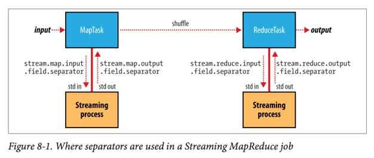
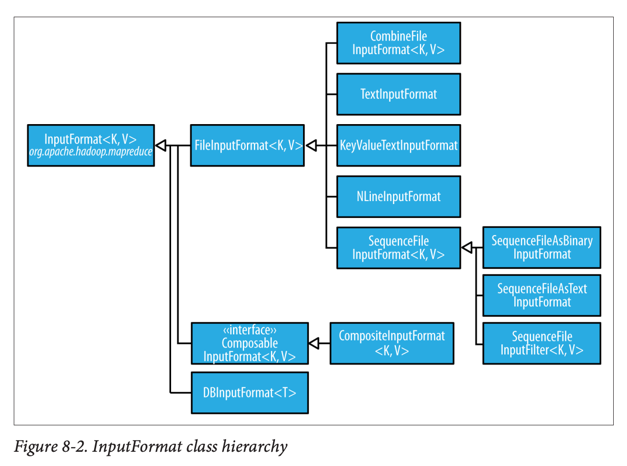
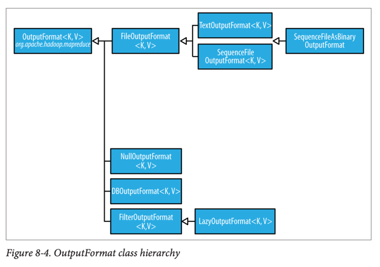

# MapReduce Types and Formats

## MapReduce 타입

### 기본 함수 시그니처

```
map: (K1, V1) → list(K2, V2)
combiner: (K2, list(V2)) → list(K2, V2)
reduce: (K2, list(V2)) → list(K3, V3)
partition: (K2, V2) → integer
```
### Java API 타입 매개변수

```java
public class Mapper<KEYIN, VALUEIN, KEYOUT, VALUEOUT> {

    protected void map(KEYIN key, VALUEIN value, Context context) { /*...*/ }
}

public class Reducer<KEYIN, VALUEIN, KEYOUT, VALUEOUT> {

    protected void reduce(KEYIN key, Iterable<VALUEIN> values, Context context) { /*...*/ }
}

public abstract class Partitioner<KEY, VALUE> {

    public abstract int getPartition(KEY key, VALUE value, int numPartitions);
}
```

### 타입 제약사항

- **맵 출력 타입 = 리듀스 입력 타입**: (K2, V2)가 동일해야 함
- **컴바이너**: 리듀서와 같은 형태지만 출력 타입이 중간 타입 (K2, V2)
- **타입 소거** (Type Erasure): Java 제네릭 한계로 런타임에 타입 정보 명시 필요

### 타입 설정 방법 (New API)

| 속성                                 | 설정 메소드                     | 타입     |
|------------------------------------|----------------------------|--------|
| `mapreduce.job.inputformat.class`  | `setInputFormatClass()`    | K1, V1 |
| `mapreduce.map.output.key.class`   | `setMapOutputKeyClass()`   | K2     |
| `mapreduce.map.output.value.class` | `setMapOutputValueClass()` | V2     |
| `mapreduce.job.output.key.class`   | `setOutputKeyClass()`      | K3     |
| `mapreduce.job.output.value.class` | `setOutputValueClass()`    | V3     |

## 기본 MapReduce 작업

### 최소 MapReduce 프로그램 기본값

- **입력 포맷**: `TextInputFormat` (키: 바이트 오프셋, 값: 텍스트 라인)
- **매퍼**: 기본 `Mapper` 클래스 (입력을 그대로 출력)
- **파티셔너**: `HashPartitioner` (키의 해시값으로 파티션 결정)
- **리듀서 수**: 1개 (단일 리듀서)
- **리듀서**: 기본 `Reducer` 클래스 (모든 입력을 그대로 출력)
- **출력 포맷**: `TextOutputFormat` (탭으로 구분된 키-값 쌍)

### 리듀서 수 선택 지침

- **단일 리듀서**: 새 사용자의 함정, 성능 저하 원인
- **권장**: 각 리듀서가 5분 정도 실행되고 최소 HDFS 블록 크기만큼 출력 생성
- **특수 경우**: 0개 (맵 전용 작업), 1개 (작은 데이터 결합용)

### Streaming 기본 작업

```bash
hadoop jar hadoop-streaming-*.jar \
  -input input/sample.txt \
  -output output \
  -mapper /bin/cat
```

- 기본적으로 키는 매퍼에 전달하지 않고 값만 전달
- 전체 효과는 입력의 정렬



## 입력 포맷 (Input Formats)



### InputFormat 구조

```java
public abstract class InputFormat<K, V> {

    // 입력 분할 생성
    public abstract List<InputSplit> getSplits(JobContext context);

    // 분할에 대한 RecordReader 생성
    public abstract RecordReader<K, V> createRecordReader(InputSplit split, TaskAttemptContext context);
}
```

### InputSplit 특성

- **길이**: 바이트 단위 크기
- **위치**: 데이터가 저장된 호스트명 배열
- **용도**: 맵 태스크 배치와 분할 크기 순서 결정

### FileInputFormat

#### 입력 경로 설정

```
// 경로 추가
FileInputFormat.addInputPath(job, new Path(path));
FileInputFormat.addInputPaths(job, "path1,path2,path3");

// 경로 설정 (덮어쓰기)
FileInputFormat.setInputPaths(job, path1, path2);
```

#### 입력 분할 크기 제어

**분할 크기 계산 공식**:

```
max(minimumSize, min(maximumSize, blockSize))
```

| 속성                                              | 기본값            | 설명         |
|-------------------------------------------------|----------------|------------|
| `mapreduce.input.fileinputformat.split.minsize` | 1              | 최소 분할 크기   |
| `mapreduce.input.fileinputformat.split.maxsize` | Long.MAX_VALUE | 최대 분할 크기   |
| `dfs.blocksize`                                 | 128MB          | HDFS 블록 크기 |

#### 작은 파일 문제와 CombineFileInputFormat

- **문제**: 파일당 하나의 맵 태스크로 인한 비효율성
- **해결책**: `CombineFileInputFormat` 사용
    - 여러 파일을 하나의 분할로 패킹
    - 노드와 랙 지역성 고려
    - 큰 파일에서도 노드당 하나의 분할 생성 가능

#### 분할 방지

```
// 방법 1: 최소 분할 크기를 최대값으로 설정
job.getConfiguration().setLong("mapreduce.input.fileinputformat.split.minsize", Long.MAX_VALUE);

// 방법 2: isSplitable() 메소드 오버라이드
public class NonSplittableTextInputFormat extends TextInputFormat {
    @Override
    protected boolean isSplitable(JobContext context, Path file) {
        return false;
    }
}
```

### 텍스트 입력 포맷

#### TextInputFormat

- **기본 입력 포맷**: 각 레코드가 텍스트 라인
- **키**: `LongWritable` (파일 내 바이트 오프셋)
- **값**: `Text` (라인 내용, 줄바꿈 문자 제외)
- **최대 라인 길이**: `mapreduce.input.linerecordreader.line.maxlength`로 제한 가능

#### KeyValueTextInputFormat

- **용도**: 키-값 쌍으로 구성된 라인 처리
- **구분자**: 기본 탭 문자 (`mapreduce.input.keyvaluelinerecordreader.key.value.separator`)
- **예시**: `line1→On the top of the Crumpetty Tree`

#### NLineInputFormat

- **용도**: 매퍼가 고정된 라인 수 처리
- **설정**: `mapreduce.input.lineinputformat.linespermap`로 라인 수 지정
- **사용 사례**: 시뮬레이션, 데이터베이스 부트스트래핑

### 바이너리 입력 포맷

#### SequenceFileInputFormat

- **용도**: Hadoop 시퀀스 파일 읽기
- **장점**: 분할 가능, 압축 지원, 임의 직렬화 프레임워크 지원
- **MapFile 지원**: MapFile의 데이터 파일도 읽기 가능

#### SequenceFileAsTextInputFormat

- **변환**: 시퀀스 파일의 키/값을 `Text` 객체로 변환
- **방법**: 키/값의 `toString()` 메소드 호출
- **용도**: Streaming에서 시퀀스 파일 사용

#### FixedLengthInputFormat

- **용도**: 고정 폭 바이너리 레코드 읽기
- **설정**: `fixedlengthinputformat.record.length`로 레코드 크기 지정

### 전체 파일을 레코드로 처리

```java
public class WholeFileInputFormat extends FileInputFormat<NullWritable, BytesWritable> {

    @Override
    protected boolean isSplitable(JobContext context, Path file) {
        return false; // 분할 방지
    }

    @Override
    public RecordReader<NullWritable, BytesWritable> createRecordReader(InputSplit split, TaskAttemptContext context) {
        return new WholeFileRecordReader();
    }
}
```

### 다중 입력 (Multiple Inputs)

```
// 서로 다른 포맷과 매퍼 사용
MultipleInputs.addInputPath(job, ncdcInputPath, 
    TextInputFormat.class, MaxTemperatureMapper.class);
MultipleInputs.addInputPath(job, metOfficeInputPath, 
    TextInputFormat.class, MetOfficeMaxTemperatureMapper.class);
```

## 출력 포맷 (Output Formats)



### 텍스트 출력

#### TextOutputFormat

- **기본 출력 포맷**: 레코드를 텍스트 라인으로 출력
- **변환**: 키/값의 `toString()` 메소드 호출
- **구분자**: 기본 탭 (`mapreduce.output.textoutputformat.separator`)
- **억제**: `NullWritable`로 키 또는 값 억제 가능

### 바이너리 출력

#### SequenceFileOutputFormat

- **용도**: 시퀀스 파일 출력 생성
- **장점**: 압축 지원, 다음 MapReduce 작업의 입력으로 적합
- **압축**: 정적 메소드로 압축 제어

#### MapFileOutputFormat

- **제약**: 키가 정렬된 순서로 출력되어야 함
- **용도**: 맵 파일 생성 (인덱싱된 시퀀스 파일)

### 다중 출력 (Multiple Outputs)

#### MultipleOutputs 사용법

```java
public class MultipleOutputsReducer extends Reducer<Text, Text, NullWritable, Text> {

    private MultipleOutputs<NullWritable, Text> multipleOutputs;

    @Override
    protected void setup(Context context) {
        multipleOutputs = new MultipleOutputs<>(context);
    }

    @Override
    protected void reduce(Text key, Iterable<Text> values, Context context) {
        for (Text value : values) {
            // 키를 파일명으로 사용
            multipleOutputs.write(NullWritable.get(), value, key.toString());
        }
    }

    @Override
    protected void cleanup(Context context) {
        multipleOutputs.close();
    }
}
```

#### 파일 명명 규칙

- **맵 출력**: `name-m-nnnnn`
- **리듀스 출력**: `name-r-nnnnn`
- **서브디렉터리**: 경로 구분자(`/`)로 임의 깊이 디렉터리 구조 생성

#### 계층적 출력 예시

```
// 스테이션별, 연도별 디렉터리 구조
String basePath = String.format("%s/%s/part", 
    parser.getStationId(), parser.getYear());
multipleOutputs.write(NullWritable.get(), value, basePath);
```

### 지연 출력 (Lazy Output)

- **문제**: 빈 파일도 생성됨 (part-r-nnnnn)
- **해결**: `LazyOutputFormat` 사용
- **동작**: 첫 번째 레코드 출력 시에만 파일 생성
- **설정**: `LazyOutputFormat.setOutputFormatClass(job, TextOutputFormat.class)`

## Streaming에서의 키-값 처리

### 구분자 설정

| 속성                                     | 기본값  | 설명                 |
|----------------------------------------|------|--------------------|
| `stream.map.input.field.separator`     | `\t` | 맵 입력 키-값 구분자       |
| `stream.map.output.field.separator`    | `\t` | 맵 출력 키-값 구분자       |
| `stream.num.map.output.key.fields`     | 1    | 맵 출력 키로 사용할 필드 수   |
| `stream.reduce.input.field.separator`  | `\t` | 리듀스 입력 키-값 구분자     |
| `stream.reduce.output.field.separator` | `\t` | 리듀스 출력 키-값 구분자     |
| `stream.num.reduce.output.key.fields`  | 1    | 리듀스 출력 키로 사용할 필드 수 |

### 다중 필드 키 처리

- **예시**: 출력이 `a,b,c`이고 `n=2`인 경우
- **키**: `a,b`
- **값**: `c`

## 데이터베이스 입출력

### DBInputFormat/DBOutputFormat

- **용도**: JDBC를 통한 관계형 데이터베이스 접근
- **주의**: 샤딩 기능 없음, 너무 많은 매퍼로 데이터베이스 과부하 주의
- **권장**: 작은 데이터셋 로딩, HDFS 데이터와 조인용

### HBase 지원

- **TableInputFormat**: HBase 테이블에서 MapReduce 프로그램 실행
- **TableOutputFormat**: MapReduce 출력을 HBase 테이블에 쓰기

## 파일 정보 접근

### 매퍼에서 파일 정보 얻기

```
// New API
InputSplit split = context.getInputSplit();
if (split instanceof FileSplit) {
    FileSplit fileSplit = (FileSplit) split;
    Path path = fileSplit.getPath();        // 파일 경로
    long start = fileSplit.getStart();      // 시작 오프셋
    long length = fileSplit.getLength();    // 분할 길이
}
```

| FileSplit 메소드 | 속성명                          | 타입   | 설명            |
|---------------|------------------------------|------|---------------|
| `getPath()`   | `mapreduce.map.input.file`   | Path | 입력 파일 경로      |
| `getStart()`  | `mapreduce.map.input.start`  | long | 분할 시작 바이트 오프셋 |
| `getLength()` | `mapreduce.map.input.length` | long | 분할 길이 (바이트)   |

## 주요 설계 원칙

1. **타입 안전성**: 컴파일 타임에 타입 불일치 검출 불가, 런타임 테스트 필요
2. **분할 전략**: 대용량 파일은 분할, 소용량 파일은 결합
3. **지역성 고려**: 데이터 지역성을 최대화하는 분할과 매퍼 배치
4. **유연한 출력**: MultipleOutputs로 복잡한 출력 요구사항 충족
5. **성능 최적화**: 적절한 분할 크기와 리듀서 수 선택
