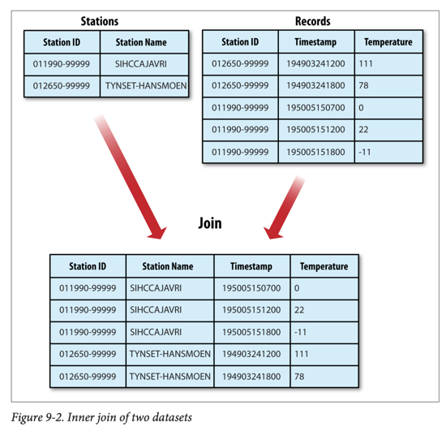

# MapReduce Features

## 카운터 (Counters)

### 카운터의 용도

- **통계 수집**: 작업에 대한 통계 정보 수집
- **품질 관리**: 데이터 품질 확인
- **문제 진단**: 로그 메시지 대신 특정 조건 발생 횟수 기록
- **효율성**: 대규모 분산 작업에서 로그보다 값 검색이 쉬움

### 내장 카운터 그룹

| 그룹                                | 설명             |
|-----------------------------------|----------------|
| MapReduce 태스크 카운터 (`TaskCounter`) | 태스크 실행 중 정보 수집 |
| 파일시스템 카운터 (`FileSystemCounter`)   | 파일시스템 I/O 통계   |
| FileInputFormat 카운터               | 입력 포맷 통계       |
| FileOutputFormat 카운터              | 출력 포맷 통계       |
| 작업 카운터 (`JobCounter`)             | 작업 레벨 통계       |

### 주요 태스크 카운터

| 카운터                     | 설명                 |
|-------------------------|--------------------|
| `MAP_INPUT_RECORDS`     | 모든 맵이 소비한 입력 레코드 수 |
| `MAP_OUTPUT_RECORDS`    | 모든 맵이 생성한 출력 레코드 수 |
| `MAP_OUTPUT_BYTES`      | 압축되지 않은 맵 출력 바이트 수 |
| `COMBINE_INPUT_RECORDS` | 컴바이너가 소비한 입력 레코드 수 |
| `REDUCE_INPUT_GROUPS`   | 리듀서가 소비한 고유 키 그룹 수 |
| `REDUCE_OUTPUT_RECORDS` | 리듀서가 생성한 출력 레코드 수  |
| `SPILLED_RECORDS`       | 디스크에 스필된 레코드 총 수   |
| `CPU_MILLISECONDS`      | 태스크의 누적 CPU 시간     |

### 사용자 정의 카운터

#### Java 카운터 정의

```
enum Temperature {
    MISSING,
    MALFORMED
}

// 카운터 증가
context.getCounter(Temperature.MALFORMED).increment(1);

// 동적 카운터 (문자열 기반)
context.getCounter("TemperatureQuality", parser.getQuality()).increment(1);
```

#### 카운터 조회

```java
Cluster cluster = new Cluster(getConf());
Job job = cluster.getJob(JobID.forName(jobID));
Counters counters = job.getCounters();

long missing = counters.findCounter(Temperature.MISSING).getValue();
long total = counters.findCounter(TaskCounter.MAP_INPUT_RECORDS).getValue();
```

#### Streaming 카운터

```
# 카운터 증가
sys.stderr.write("reporter:counter:Temperature,Missing,1\n")

# 상태 메시지
sys.stderr.write("reporter:status:Processing data\n")
```

## 정렬 (Sorting)

### 준비 단계

- **문제**: 정수를 Text로 저장하면 사전순 정렬 불가
- **해결**: 시퀀스 파일로 변환 (키: IntWritable, 값: Text)

### 부분 정렬 (Partial Sort)

```java
public class SortByTemperatureUsingHashPartitioner {
    // 기본 HashPartitioner 사용
    // 각 파티션은 정렬되지만 전체적으로는 정렬되지 않음
}
```

- **특징**: 각 리듀서의 출력 파일은 정렬됨
- **제한**: 파일을 연결해도 전역 정렬 아님
- **용도**: 키별 검색용 MapFile 생성

### 전체 정렬 (Total Sort)

#### TotalOrderPartitioner 사용

```
// 샘플러로 파티션 경계 결정
InputSampler.Sampler<IntWritable, Text> sampler =
    new InputSampler.RandomSampler<>(0.1, 10000, 10);
InputSampler.writePartitionFile(job, sampler);

// TotalOrderPartitioner 설정
job.setPartitionerClass(TotalOrderPartitioner.class);
```

#### 샘플러 종류

| 샘플러               | 설명               | 적합한 데이터 |
|-------------------|------------------|---------|
| `RandomSampler`   | 균일한 확률로 키 선택     | 범용      |
| `IntervalSampler` | 분할 내 정기적 간격으로 선택 | 정렬된 데이터 |
| `SplitSampler`    | 분할의 첫 n개 레코드 선택  | 무작위 데이터 |

### 보조 정렬 (Secondary Sort)

#### 개념

- **목적**: 키별로 값의 순서 제어
- **예시**: 연도별로 그룹화하되 온도 내림차순 정렬

#### 구현 방법

1. **복합 키 생성**: 자연 키 + 자연 값
2. **정렬 비교자**: 복합 키 전체로 정렬
3. **파티셔너**: 자연 키로만 파티셔닝
4. **그룹 비교자**: 자연 키로만 그룹화

#### Java 구현

```
// 1. 복합 키 (연도, 온도)
context.write(new IntPair(year, temperature), NullWritable.get());

// 2. 파티셔너: 연도로만 파티셔닝
public class FirstPartitioner extends Partitioner<IntPair, NullWritable> {
    @Override
    public int getPartition(IntPair key, NullWritable value, int numPartitions) {
        return Math.abs(key.getFirst() * 127) % numPartitions;
    }
}

// 3. 정렬 비교자: 연도 오름차순, 온도 내림차순
public class KeyComparator extends WritableComparator {
    @Override
    public int compare(WritableComparable w1, WritableComparable w2) {
        IntPair ip1 = (IntPair) w1;
        IntPair ip2 = (IntPair) w2;
        int cmp = IntPair.compare(ip1.getFirst(), ip2.getFirst());
        if (cmp != 0) return cmp;
        return -IntPair.compare(ip1.getSecond(), ip2.getSecond()); // 역순
    }
}

// 4. 그룹 비교자: 연도로만 그룹화
public class GroupComparator extends WritableComparator {
   @Override
    public int compare(WritableComparable w1, WritableComparable w2) {
        IntPair ip1 = (IntPair) w1;
        IntPair ip2 = (IntPair) w2;
        return IntPair.compare(ip1.getFirst(), ip2.getFirst());
    }
}
```

#### Streaming 보조 정렬

```bash
hadoop jar hadoop-streaming-*.jar \
  -D stream.num.map.output.key.fields=2 \
  -D mapreduce.partition.keypartitioner.options=-k1,1 \
  -D mapreduce.job.output.key.comparator.class=\
     org.apache.hadoop.mapred.lib.KeyFieldBasedComparator \
  -D mapreduce.partition.keycomparator.options="-k1n -k2nr" \
  -partitioner org.apache.hadoop.mapred.lib.KeyFieldBasedPartitioner
```

## 조인 (Joins)



### 조인 유형에 따른 선택

| 데이터 크기  | 방법         | 설명                |
|---------|------------|-------------------|
| 한쪽이 작음  | 맵 사이드 조인   | 작은 데이터를 분산 캐시로 배포 |
| 양쪽 모두 큼 | 리듀스 사이드 조인 | 셔플을 통한 조인         |

### 맵 사이드 조인 (Map-Side Join)

- **조건**:
    - 입력이 동일한 수의 파티션으로 분할
    - 동일한 키(조인 키)로 정렬
    - 특정 키의 모든 레코드가 같은 파티션에 위치
- **사용**: `CompositeInputFormat` 클래스
- **장점**: 셔플 단계 불필요로 빠름
- **제한**: 입력 데이터의 특정 구조 필요

### 리듀스 사이드 조인 (Reduce-Side Join)

#### 구현 요소

1. **다중 입력** (`MultipleInputs`): 각 데이터 소스에 다른 매퍼
2. **태그 추가**: 각 레코드의 소스 표시
3. **보조 정렬**: 특정 소스의 데이터를 먼저 처리

#### 구현 예시

```java
// 스테이션 레코드 매퍼 (태그: 0)
public class JoinStationMapper extends Mapper<LongWritable, Text, TextPair, Text> {

    protected void map(LongWritable key, Text value, Context context) {
        context.write(new TextPair(stationId, "0"), new Text(stationName));
    }
}

// 날씨 레코드 매퍼 (태그: 1)
public class JoinRecordMapper extends Mapper<LongWritable, Text, TextPair, Text> {

    protected void map(LongWritable key, Text value, Context context) {
        context.write(new TextPair(stationId, "1"), value);
    }
}

// 리듀서: 스테이션 정보를 먼저 받아 날씨 레코드와 조인
public class JoinReducer extends Reducer<TextPair, Text, Text, Text> {

    protected void reduce(TextPair key, Iterable<Text> values, Context context) {
        Iterator<Text> iter = values.iterator();
        Text stationName = new Text(iter.next()); // 첫 번째 값 (스테이션)
        while (iter.hasNext()) {
            Text record = iter.next();
            context.write(key.getFirst(), new Text(stationName + "\t" + record));
        }
    }
}
```

#### 주의사항

- **값 복사**: 리듀서의 값 반복자는 객체 재사용 → 첫 번째 값 복사 필요

```java
Text stationName = new Text(iter.next()); // 복사 필수!
```

## 사이드 데이터 배포 (Side Data Distribution)

### 작업 설정 사용

- **용도**: 작은 메타데이터 (수 킬로바이트)
- **방법**: `Configuration` 객체의 setter 메소드

```
conf.set("my.property", "value");
// 태스크에서 읽기
String value = context.getConfiguration().get("my.property");
```

- **제한**: 큰 데이터에는 부적합 (메모리 압박)

### 분산 캐시 (Distributed Cache)

#### 사용 방법

```bash
# 파일 배포
hadoop jar job.jar ClassName \
  -files stations.txt,lookup.dat \
  -archives data.zip \
  -libjars lib1.jar,lib2.jar \
  input output
```

#### GenericOptionsParser 옵션

| 옵션                       | 설명                |
|--------------------------|-------------------|
| `-files file1,file2,...` | 파일을 태스크 노드에 복사    |
| `-archives archive1,...` | 아카이브를 복사 후 압축 해제  |
| `-libjars jar1,jar2,...` | JAR 파일을 클래스패스에 추가 |

#### Java API

```
// 파일 추가
job.addCacheFile(new URI("hdfs://path/to/file"));

// 아카이브 추가
job.addCacheArchive(new URI("hdfs://path/to/archive.zip"));

// 클래스패스에 추가
job.addFileToClassPath(new Path("lib.jar"));
```

#### 태스크에서 파일 접근

```
@Override
protected void setup(Context context) throws IOException {
    // 심볼릭 링크로 접근 (파일명 그대로)
    metadata = new Metadata();
    metadata.initialize(new File("stations.txt"));
}
```

#### 동작 원리

1. **작업 시작**: 파일을 분산 파일시스템(HDFS)에 복사
2. **태스크 실행 전**: 노드 매니저가 로컬 디스크(캐시)에 복사
3. **로컬라이제이션**: 태스크 작업 디렉터리에서 심볼릭 링크로 접근
4. **참조 카운트**: 파일 사용 태스크 수 추적
5. **LRU 삭제**: 캐시 크기 초과 시 (기본 10GB) 가장 오래된 파일 삭제

### 분산 캐시 vs 작업 설정

| 특성     | 작업 설정      | 분산 캐시       |
|--------|------------|-------------|
| 데이터 크기 | 수 킬로바이트    | 수 기가바이트     |
| 배포 방식  | 설정 파일에 포함  | 별도 파일로 배포   |
| 메모리 압박 | 높음         | 낮음          |
| 재사용    | 매 태스크마다 읽기 | 노드당 한 번만 복사 |

## MapReduce 라이브러리 클래스

| 클래스                               | 설명                              |
|-----------------------------------|---------------------------------|
| `ChainMapper`, `ChainReducer`     | 여러 매퍼를 체인으로 연결 (M+RM*)          |
| `FieldSelectionMapper/Reducer`    | 입력 키/값에서 필드 선택 (Unix cut 명령 유사) |
| `IntSumReducer`, `LongSumReducer` | 정수 값을 합산하는 리듀서                  |
| `InverseMapper`                   | 키와 값을 교환하는 매퍼                   |
| `MultithreadedMapper`             | 별도 스레드에서 매퍼 동시 실행               |
| `TokenCounterMapper`              | 입력 값을 단어로 토큰화하고 카운트             |
| `RegexMapper`                     | 정규 표현식 매칭 결과 출력                 |

## 핵심 설계 패턴

### 카운터 활용 패턴

1. **데이터 품질 검증**: 유효하지 않은 레코드 카운트
2. **진행 상황 추적**: 처리된 레코드 수 확인
3. **디버깅**: 로그 대신 특정 조건 발생 횟수 기록

### 정렬 전략

1. **부분 정렬**: 파티션 내 정렬, 파티션 간 순서 없음
2. **전체 정렬**: 샘플링 + TotalOrderPartitioner
3. **보조 정렬**: 키별 값의 순서 제어

### 조인 전략

1. **데이터 크기 평가**: 한쪽이 작으면 맵 사이드 조인
2. **데이터 구조 확인**: 특정 구조면 맵 사이드, 아니면 리듀스 사이드
3. **성능 고려**: 맵 사이드 조인이 더 빠름 (셔플 불필요)
