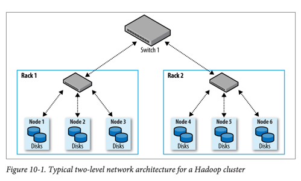
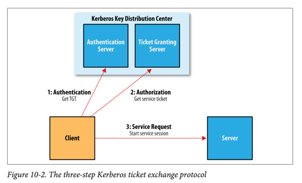

# Setting Up a Hadoop Cluster

## 클러스터 사양(Cluster Specification)

### 하드웨어 권장 사양 (2014년 기준)

- **프로세서**: 2개의 hex/octo-core 3 GHz CPU
- **메모리**: 64-512 GB ECC RAM
- **스토리지**: 12-24개의 1-4 TB SATA 디스크
- **네트워크**: 기가비트 이더넷(링크 애그리게이션 포함)

### RAID를 사용하지 않는 이유

- HDFS는 노드 간 복제로 자체 중복성 제공
- **JBOD**(Just a Bunch of Disks) 구성이 RAID 0보다 10-30% 더 빠름
- RAID 0은 가장 느린 디스크 속도에 제한됨
- JBOD는 디스크 독립 작동으로 평균 속도가 더 빠름
- 디스크 장애 시 JBOD는 계속 작동, RAID는 전체 노드 중단

### 클러스터 크기 결정

- 데이터 증가율 기반 계산 예시:
    - 일일 1TB 데이터 증가
    - 3-way HDFS 복제 = 3TB/day
    - 중간 파일과 로그 30% 추가
    - 결과: 주당 약 1대의 머신 필요
    - 2년 데이터 보관 → 약 100대 머신 클러스터

### 마스터 노드 구성

- **소규모 클러스터** (약 10노드): 단일 마스터에서 네임노드와 리소스 매니저 실행 가능
- **대규모 클러스터**: 마스터 분리 권장
    - 네임노드의 높은 메모리 요구사항
    - 세컨더리 네임노드도 유사한 메모리 필요
    - **고가용성**(High Availability)을 위해 별도 하드웨어에서 실행

## 네트워크 토폴로지(Network Topology)

### 일반적인 아키텍처

- **2계층 네트워크 토폴로지**
- 랙당 30-40대 서버
- 랙당 10 Gb 스위치
- 코어 스위치/라우터로 10 Gb 이상 업링크
- 같은 랙 내 노드 간 대역폭이 다른 랙 간보다 훨씬 큼

### 랙 인식(Rack Awareness)

- Hadoop이 네트워크 토폴로지를 인식하도록 구성 필요
- **네트워크 위치** 예시: `/rack1`, `/rack2`
- `DNSToSwitchMapping` 인터페이스로 노드-랙 매핑 정의
- 기본 구현: `ScriptBasedMapping` (사용자 정의 스크립트 실행)
- 랙 내 전송 우선, 랙 간 전송 최소화로 성능 향상
- HDFS 블록 복제본 배치 최적화

## 클러스터 설치

### Java 설치

- Hadoop은 Unix와 Windows에서 실행
- Java 설치 필수
- 프로덕션 환경: 벤더 인증 조합 사용 권장

### Unix 사용자 계정 생성

- 전용 Unix 사용자 계정 생성 권장
- **hdfs**: HDFS 서비스용
- **mapred**: MapReduce 서비스용
- **yarn**: YARN 서비스용
- 모두 동일한 `hadoop` 그룹에 속함

### SSH 구성

- Hadoop 제어 스크립트는 SSH 사용
- **패스워드 없는 로그인** 설정 필요 (hdfs, yarn 사용자)
- RSA 키 페어 생성: `ssh-keygen -t rsa`
- `ssh-agent` 사용으로 패스프레이즈 자동 처리

### HDFS 파일시스템 포맷

- 새 HDFS 설치 시 포맷 필요
- 빈 파일시스템 생성 및 네임노드의 영속 데이터 구조 초기화
- 데이터노드는 초기 포맷에 관여하지 않음
- 명령어: `hdfs namenode -format`

## Hadoop 구성(Configuration)

### 주요 구성 파일

- **hadoop-env.sh**: 환경 변수 설정
- **core-site.xml**: Hadoop Core 설정 (I/O 등)
- **hdfs-site.xml**: HDFS 데몬 설정
- **mapred-site.xml**: MapReduce 데몬 설정
- **yarn-site.xml**: YARN 데몬 설정
- **slaves**: 데이터노드와 노드 매니저 실행 머신 목록

### 환경 설정

#### Java 설정

- `JAVA_HOME` 환경 변수로 Java 위치 지정
- hadoop-env.sh에서 설정 권장

#### 메모리 힙 크기

- 기본값: 데몬당 1,000 MB (1 GB)
- `HADOOP_HEAPSIZE`로 조정
- 개별 데몬 힙 크기 조정 가능 (예: `YARN_RESOURCEMANAGER_HEAPSIZE`)

#### 네임노드 메모리 계산

- 블록 100만 개당 약 1,000 MB 메모리 필요
- 예시: 200노드, 24TB/노드, 128MB 블록, 3-way 복제
    - 약 200만 블록 → 12,000 MB 네임노드 메모리 권장
- `HADOOP_NAMENODE_OPTS`로 JVM 옵션 설정

#### 시스템 로그파일

- 기본 위치: `$HADOOP_HOME/logs`
- `HADOOP_LOG_DIR`로 변경 권장 (예: `/var/log/hadoop`)
- 각 데몬은 2개 로그파일 생성:
    - `.log`: log4j 출력 (일별 로테이션)
    - `.out`: 표준 출력/에러 (재시작 시 로테이션, 최근 5개 보관)

### 중요 데몬 속성

#### HDFS 설정

- **fs.defaultFS**: 네임노드의 URI (기본 포트 8020)
    - 예: `hdfs://namenode/`
- **dfs.namenode.name.dir**: 네임노드 메타데이터 저장 디렉토리
    - 로컬 디스크 1-2개 + 원격 디스크 (NFS 등) 권장
- **dfs.datanode.data.dir**: 데이터노드 블록 저장 디렉토리
    - 라운드 로빈 방식으로 쓰기, 성능 향상 위해 로컬 디스크마다 지정
- **dfs.namenode.checkpoint.dir**: 세컨더리 네임노드 체크포인트 디렉토리

#### YARN 설정

- **yarn.resourcemanager.hostname**: 리소스 매니저 호스트명
- **yarn.nodemanager.local-dirs**: 노드 매니저 로컬 임시 저장소
    - 사용 가능한 모든 로컬 디스크 사용 권장
- **yarn.nodemanager.aux-services**: 보조 서비스
    - MapReduce용으로 `mapreduce_shuffle` 설정 필수
- **yarn.nodemanager.resource.memory-mb**: 컨테이너에 할당 가능한 물리 메모리 (MB)
- **yarn.nodemanager.resource.cpu-vcores**: 컨테이너에 할당 가능한 CPU 코어 수

### 메모리 설정 (YARN & MapReduce)

#### YARN 메모리 계산

- 노드 매니저 메모리 = 전체 메모리 - 데몬 메모리 - 기타 프로세스 메모리
- 각 Hadoop 데몬: 1,000 MB
- 데이터노드 + 노드 매니저 = 2,000 MB
- 기본값 8,192 MB는 대부분 환경에서 낮음

#### MapReduce 컨테이너 설정

- **mapreduce.map.memory.mb**: 맵 컨테이너 메모리 (기본 1,024 MB)
- **mapreduce.reduce.memory.mb**: 리듀스 컨테이너 메모리 (기본 1,024 MB)
- **mapred.child.java.opts**: JVM 힙 크기 (기본 -Xmx200m)
- 힙 크기는 컨테이너 크기보다 작아야 함
- JVM 프로세스 메모리가 할당량 초과 시 노드 매니저가 종료 가능

#### 메모리 제약사항

- 최소 할당: `yarn.scheduler.minimum-allocation-mb` (기본 1,024 MB)
- 최대 할당: `yarn.scheduler.maximum-allocation-mb` (기본 8,192 MB)
- 가상 메모리 제약: `yarn.nodemanager.vmem-pmem-ratio` (기본 2.1)

### CPU 설정 (YARN & MapReduce)

- **yarn.nodemanager.resource.cpu-vcores**: 노드당 할당 가능 코어 수
    - 전체 코어 - 데몬 프로세스 코어
- **mapreduce.map.cpu.vcores**: 맵 태스크 코어 수 (기본 1)
- **mapreduce.reduce.cpu.vcores**: 리듀스 태스크 코어 수 (기본 1)
- Linux cgroups로 CPU 제한 강제 가능
    - `LinuxContainerExecutor` 사용 필요

## 데몬 주소와 포트

### RPC 서버 주요 포트

- **네임노드**: 8020 (`fs.defaultFS`)
- **데이터노드**: 50020 (`dfs.datanode.ipc.address`)
- **리소스 매니저**: 8032 (`yarn.resourcemanager.address`)
- **노드 매니저**: 별도 설정

### HTTP 서버 주요 포트

- **네임노드**: 50070 (`dfs.namenode.http-address`)
- **세컨더리 네임노드**: 50090
- **데이터노드**: 50075
- **리소스 매니저**: 8088 (`yarn.resourcemanager.webapp.address`)
- **노드 매니저**: 8042
- **잡 히스토리 서버**: 19888

### 서버 바인딩 설정

- 여러 네트워크 인터페이스 바인딩: `0.0.0.0` 사용
- 별도 바인드 호스트 설정 가능
    - 예: `yarn.resourcemanager.bind-host`

## 기타 Hadoop 속성

### 클러스터 멤버십

- **dfs.hosts**: 인증된 데이터노드 목록 파일
- **yarn.resourcemanager.nodes.include-path**: 인증된 노드 매니저 목록
- **dfs.hosts.exclude**: 디커미션할 데이터노드 목록
- **yarn.resourcemanager.nodes.exclude-path**: 디커미션할 노드 매니저 목록

### 버퍼 크기

- **io.file.buffer.size**: I/O 버퍼 크기 (기본 4 KB)
- 128 KB (131,072 bytes)로 증가 권장

### HDFS 블록 크기

- **dfs.blocksize**: 블록 크기 (기본 128 MB)
- 대규모 클러스터: 256 MB (268,435,456 bytes) 권장
- 네임노드 메모리 압박 감소, 매퍼 처리 데이터 증가

### 예약 스토리지 공간

- **dfs.datanode.du.reserved**: 비-HDFS 용도로 예약할 공간 (바이트)

### 휴지통(Trash)

- **fs.trash.interval**: 파일이 휴지통에 남는 최소 시간 (분)
- 기본값 0 (휴지통 비활성화)
- 파일 복구 경로: `~/.Trash`
- 명령어: `hadoop fs -expunge` (휴지통 비우기)

### 작업 스케줄러

- 다중 사용자 환경: 큐 구성 업데이트 권장
- 조직별/그룹별 큐 설정

### 리듀스 슬로우 스타트

- **mapreduce.job.reduce.slowstart.completedmaps**: 리듀스 시작 시점
- 기본값: 0.05 (맵 5% 완료 후)
- 대규모 작업: 0.80 (80%)로 증가 권장

### 단축 로컬 읽기(Short-circuit Local Reads)

- 클라이언트와 블록이 같은 노드에 있을 때 네트워크 우회
- **dfs.client.read.shortcircuit**: `true`로 설정
- Unix 도메인 소켓 사용
- **dfs.domain.socket.path**: 소켓 경로 지정 (예: `/var/run/hadoop-hdfs/dn_socket`)

## 보안(Security)

### Kerberos 인증

- 초기 Hadoop: 보안 환경의 협력 사용자 대상, 인증 부재
- **Kerberos**: 네트워크 인증 프로토콜 사용
- Hadoop은 인증(Authentication)만 Kerberos 사용, 권한(Authorization)은 자체 관리

### Kerberos 3단계 프로세스

1. **인증**(Authentication): TGT(Ticket-Granting Ticket) 받기
2. **권한 부여**(Authorization): 서비스 티켓 요청
3. **서비스 요청**: 서비스 티켓으로 서버 인증

### Kerberos 설정

- **hadoop.security.authentication**: `kerberos`로 설정 (core-site.xml)
- **hadoop.security.authorization**: `true`로 설정
- ACL(Access Control List): hadoop-policy.xml에서 구성
- 사용자 인증: `kinit` 명령어
- TGT 유효기간: 기본 10시간 (최대 1주일 갱신 가능)
- 무인 작업: keytab 파일 사용

### 위임 토큰(Delegation Tokens)

- Kerberos 티켓 교환 오버헤드 감소
- 서버가 생성한 공유 비밀(Shared Secret)
- 첫 RPC 호출: Kerberos 인증 → 위임 토큰 발급
- 이후 호출: 위임 토큰으로 인증
- **블록 액세스 토큰**(Block Access Token): HDFS 블록 접근용 특수 위임 토큰
- MapReduce 작업 종료 시 위임 토큰 무효화

### 기타 보안 기능

- 작업 제출 사용자 계정으로 태스크 실행
    - `LinuxContainerExecutor` 사용
    - 운영체제 레벨 격리
- 분산 캐시 보안
- 사용자별 작업 보기/수정 권한 제어
- 안전한 셔플 방식
- 데몬 인증으로 악의적 노드 차단
- 데이터노드 특권 포트(1024 미만) 실행 가능
- 네트워크 데이터 암호화
    - RPC: `hadoop.rpc.protection`
    - HDFS 블록 전송: `dfs.encrypt.data.transfer`
    - MapReduce 셔플: `mapreduce.shuffle.ssl.enabled`
    - Web UI: `hadoop.ssl.enabled`

## 벤치마킹

### Hadoop 벤치마크

- 테스트 JAR 파일 포함: `hadoop-mapreduce-*-tests.jar`
- 하드웨어 번인(Burn-in) 테스트로 초기 장애 발견

### TeraSort 벤치마크

1. **teragen**: 랜덤 데이터 생성 (100바이트 행)
2. **terasort**: 전체 정렬 수행
3. **teravalidate**: 정렬 정확성 검증

- HDFS와 MapReduce 통합 벤치마킹
- 전체 입력 데이터셋이 셔플 통과

### 기타 벤치마크

- **TestDFSIO**: HDFS I/O 성능 테스트
- **MRBench**: 소규모 작업 반복 실행, 응답성 확인
- **NNBench**: 네임노드 하드웨어 부하 테스트
- **Gridmix**: 실제 클러스터 워크로
