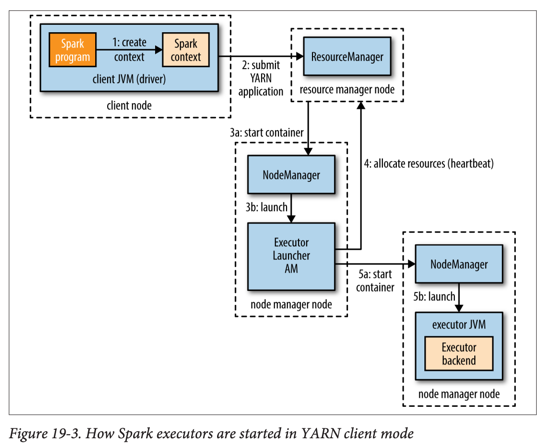

# Spark

## Spark 개요

- 클러스터 컴퓨팅 프레임워크(Cluster Computing Framework)로 대규모 데이터 처리용
- MapReduce와 달리 자체 분산 런타임(Distributed Runtime) 사용
- YARN에서 실행 가능하며 HDFS 등 Hadoop 파일 포맷 및 스토리지와 통합
- **메모리 내 데이터셋 캐싱** 능력으로 MapReduce 대비 10배 이상 성능 향상 가능

## 주요 특징

- **DAG 엔진**(DAG Engine): 임의의 파이프라인을 단일 작업으로 처리
- **풍부한 API**: Scala, Java, Python 지원
- **REPL 제공**: 대화형 데이터 탐색 가능 (Read-Eval-Print Loop)
- **통합 모듈**: MLlib(머신러닝), GraphX(그래프), Spark Streaming, Spark SQL

## RDD (Resilient Distributed Dataset)

- Spark의 핵심 추상화 개념
- **읽기 전용 객체 컬렉션**으로 클러스터의 여러 머신에 분산
- 손실된 파티션을 자동으로 재계산하여 복원 가능(Resilient)

### RDD 생성 방법

1. **메모리 내 컬렉션 병렬화**(Parallelizing): `sc.parallelize()`
2. **외부 스토리지에서 데이터셋 로드**: `sc.textFile()`, `sc.sequenceFile()`
3. **기존 RDD 변환**(Transformation)

### 변환(Transformations)과 액션(Actions)

- **변환**: 새로운 RDD 생성, 지연 실행(Lazy)
    - `map()`, `filter()`, `flatMap()`, `reduceByKey()` 등
- **액션**: 실제 계산 실행, 결과 반환 또는 저장
    - `foreach()`, `collect()`, `saveAsTextFile()` 등

### 집계 변환(Aggregation Transformations)

- **reduceByKey()**: 이진 함수를 반복 적용하여 단일 값 생성
- **foldByKey()**: 초기값(Zero Value)과 함께 집계
- **aggregateByKey()**: 값 타입 변경 가능한 집계

```java
public class MaxTemperatureSpark {

    public static void main(String[] args) throws Exception {
        if (args.length != 2) {
            System.err.println("Usage: MaxTemperatureSpark <input path> <output path>");
            System.exit(-1);
        }
        SparkConf conf = new SparkConf();
        JavaSparkContext sc = new JavaSparkContext("local", "MaxTemperatureSpark", conf);
        JavaRDD<String> lines = sc.textFile(args[0]);
        JavaRDD<String[]> records = lines.map(new Function<String, String[]>() {

            @Override
            public String[] call(String s) {
                return s.split("\t");
            }
        });
        JavaRDD<String[]> filtered = records.filter(new Function<String[], Boolean>() {

            @Override
            public Boolean call(String[] rec) {
                return rec[1] != "9999" && rec[2].matches("[01459]");
            }
        });
        JavaPairRDD<Integer, Integer> tuples = filtered.mapToPair(new PairFunction<String[], Integer, Integer>() {

            @Override
            public Tuple2<Integer, Integer> call(String[] rec) {
                return new Tuple2<Integer, Integer>(Integer.parseInt(rec[0]), Integer.parseInt(rec[1]));
            }
        });
        JavaPairRDD<Integer, Integer> maxTemps = tuples.reduceByKey(new Function2<Integer, Integer, Integer>() {

            @Override
            public Integer call(Integer i1, Integer i2) {
                return Math.max(i1, i2);
            }
        });
        maxTemps.saveAsTextFile(args[1]);
    }
}
```

## 영속성(Persistence)

- `cache()` 또는 `persist()`: RDD를 메모리에 캐싱
- 후속 작업의 성능 향상
- 반복 알고리즘(Iterative Algorithms)과 대화형 분석에 유용

### 영속성 레벨(Storage Level)

- **MEMORY_ONLY**: 기본값, 메모리에만 저장
- **MEMORY_ONLY_SER**: 직렬화하여 메모리에 저장 (압축)
- **MEMORY_AND_DISK**: 메모리 부족 시 디스크로 스필
- **MEMORY_AND_DISK_SER**: 직렬화 후 메모리 부족 시 디스크로 스필

## 직렬화(Serialization)

### 데이터 직렬화

- 기본: Java 직렬화
- **권장: Kryo 직렬화** - 더 효율적
    - `conf.set("spark.serializer", "org.apache.spark.serializer.KryoSerializer")`
    - 클래스 등록으로 추가 최적화 가능

### 함수 직렬화

- Scala 함수는 표준 Java 직렬화로 자동 처리

## 공유 변수(Shared Variables)

### 브로드캐스트 변수(Broadcast Variables)

- 각 익스큐터에 한 번만 전송되어 캐싱
- MapReduce의 분산 캐시(Distributed Cache)와 유사
- 사용: `sc.broadcast(variable)`

### 어큐뮬레이터(Accumulators)

- 태스크가 추가만 가능한 변수
- MapReduce의 카운터(Counters)와 유사
- 작업 완료 후 드라이버에서 최종값 조회
- 사용: `sc.accumulator(initialValue)`

## Spark 작업 실행 구조


### 주요 컴포넌트

- **드라이버**(Driver): 애플리케이션 호스팅, 작업 스케줄링
- **익스큐터**(Executors): 애플리케이션 전용, 태스크 실행

### 작업 제출 과정

1. 액션 수행 시 자동으로 작업(Job) 제출
2. **DAG 스케줄러**: 작업을 스테이지(Stages) DAG로 분해
3. **태스크 스케줄러**: 각 스테이지의 태스크를 클러스터에 제출

### 태스크 유형

- **셔플 맵 태스크**(Shuffle Map Tasks): 마지막 스테이지 제외 모든 스테이지
- **결과 태스크**(Result Tasks): 최종 스테이지에서 결과 반환

### DAG 구성

- `reduceByKey()` 같은 셔플 연산은 여러 스테이지로 분할
- 각 스테이지는 하나 이상의 RDD 변환 포함
- 이전 작업에서 영속화된 RDD는 재계산 생략


## 클러스터 매니저(Cluster Managers)

### 지원 클러스터 매니저

- **Local**: 단일 JVM에서 실행, 테스트용
- **Standalone**: Spark 자체 분산 구현
- **Mesos**: 범용 클러스터 리소스 매니저
- **YARN**: Hadoop 리소스 매니저, Kerberos 보안 통합

### YARN에서 Spark 실행

#### YARN 클라이언트 모드(yarn-client)



- 드라이버가 클라이언트에서 실행
- 대화형 프로그램(spark-shell, pyspark) 필수
- 디버깅에 유용

#### YARN 클러스터 모드(yarn-cluster)


- 드라이버가 YARN 애플리케이션 마스터에서 실행
- 프로덕션 작업에 적합
- 로그 파일 보존 용이
- 애플리케이션 마스터 실패 시 재시도

## Spark vs MapReduce

### Spark의 장점

- 메모리 내 캐싱으로 반복 작업 성능 향상
- DAG 엔진으로 복잡한 파이프라인 단일 작업 처리
- 풍부한 API와 우수한 사용자 경험
- 대화형 데이터 탐색 지원

### MapReduce와의 관계

- `flatMap()`이 MapReduce의 map과 유사 (다중 출력 가능)
- `reduceByKey()` 등이 reduce와 유사
- 그러나 직접 대응보다는 필요한 연산만 선택적 사용 권장
