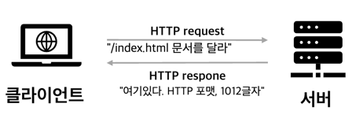
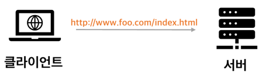
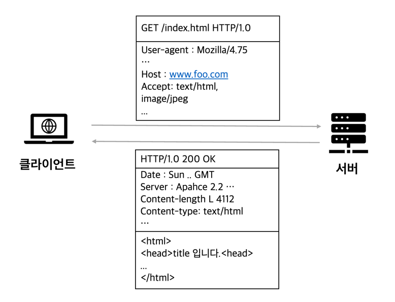

<h1>1장 HTTP 개관</h1>

- HTTP는 현대 인터넷의 공용어
- 얼마나 많은 클라이언트와 서버가 통신하는가
- 리소스 웹 콘텐츠 가 어디서 오는지
- 웹 트랜잭션이 어떻게 동작하는지
- HTTP통신을 위해 사용하는 메시지 형식
- HTTP 기저의 TCP 네트워크 전송
- 여러 종류의 HTTP 프로토콜
- 인터넷 곳곳에 설치된 다양한 HTTP 구성요소

## 1. HTTP: 인터넷의 멀티미디어 배달부

- 수십억개의 리소스 ex. jpg, html, text, wav 등 들이 HTTP로 인터넷에 항해중
- HTTP **신뢰성** : 메시지 손상, 왜곡, 중복 되지 않음을 보장

## 2. 웹 클라이언트와 서버

  

- 클라이언트 : HTTP를 요청하는 자 (브라우저 등)
- (웹)서버 : 웹 리소스를 HTTP 프로토콜로 클라이언트와 통신하는 서버
    
## 3. 리소스

#### 웹 서버는 웹 리소스를 관리하고 제공한다. 

- 웹 리소스 : 정적 파일 ex. js, css, jpeg, html, word 
- 리소스 : 웹 리소스 + **동적** 파일 ex. 주식 거래, 데이터베이스 검색, 실시간 엔진

### 1. 미디어 타입

#### 웹 서버는 모든 HTTP 객체 데이터에 MIME Multipurpose Internet Mail Extensions 타입이라는 데이터 포맷 라벨을 붙인다.

- MIME 타입 : 리소스의 **성격**을 라벨링
- MIME 타입은 웹 브라우저가 리소스를 처리하는 방법을 결정
- 수백가지의 MIME 타입과 실험용, 특정 용도로 사용되는 타입이 존재
- 포맷 : 주타입 / 부타입 primary object type / specific subtype
  - ex. text/html html로 작성된 텍스트, text/plain일반 ASCII 텍스트, image/jpegjpeg 형식의 이미지, image/gifgif 형식의 이미지, ...

### 2. URI

웹 리소스는 각자 이름을 가지고 있고, 클라이언트는 그 이름을 지목하여 리소스를 요청한다.

#### URI Uniform Resource Identifier : 리소스를 고유하게 식별하고 위치를 지정할 수 있다.

  

#### URI 구성요소

- http : http 프로토콜을 사용
- www.foo.com : 리소스를 소유한 도메인
- /index.html : / 경로에 위치한 index.html 파일 요청

### 3. URL

#### URL Uniform Resource Locator : 통합 자원 지시자

- **오늘날 대부분의 URI 는 URL**
- URL 구성요소
  - 스킴 scheme : 리소스에 접근하기 위해 사용할 프로토콜
  - 서버의 인터넷 주소 ex. www.naver.com 
  - 웹 서버의 리소스 ex. /myPage/orderInfo.html

### 4. URN

#### URN Uniform Resource Name : 리소스 위치에 의존하지 않는 지시자

- 리소스 위치를 옮겨도 URN으로 찾아 들어감  
- 아직 실험중이고, 미래성이 있음   

## 4. 트랜잭션

HTTP 트랜잭션 = 요청 명령 HTTP 메시지 + 응답 결과 HTTP 메시지

### 1. 메서드

#### 모든 HTTP 요청 메시지는 하나의 메서드를 가진다.

#### 메서드 : 서버가 어떤 동작을 취해야하는지 지정

- ex. 웹페이지 가져오기, 게이트웨이 프로그램 실행하기, 파일 삭제하기 등
- 대표적인 메서드
  - GET : 서버에서 리소스를 가져온다.
  - PUT : 서버에 리소스를 저장한다.
  - DELETE : 서버에서 리소스를 삭제한다.
  - POST : 클라이언트 데이터를 서버 게이트웨이 애플리케이션으로 보내라.
  - HEAD : 지정한 리소스의 응답 중 HTTP 헤더만 보내라.

### 2. 상태 코드

- 세자리 숫자
- 클라이언트의 요청이 성공 or 실패 or 추가 조치 필요 한지 알려줌
- ex. 200, 302, 404 등
- reason phrase 사유 구절 : 상태 코드에 대한 짧은 설명
- ex. 404 'Not Found' 없음, 리소스가 존재하지 않음

### 3. 웹페이지는 여러 객체로 이루어질 수 있다.

- 애플리케이션은 하나의 작업을 위해 1개 이상의 HTTP 트랜잭션 수행
- ex. 브라우저 naver.com 화면은 여러 웹 리소스 트랜잭션로 이루어짐

## 5. 메시지

#### HTTP 메시지는 단순한 줄 단위의 문자열이다.

- 요청 메시지 : **클라이언트에서 서버로** 보낸 HTTP 요청 메시지
- 응답 메시지 : **서버에서 클라이언트로** 보낸 HTTP 응답 메시지

#### HTTP 메시지 구성 요소

- 시작줄 : 요청이라면 서버의 동작에 대해서, 응답이라면 무슨 일이 일어났는지
- 헤더 :  0개 이상 존재
- 본문 : 메시지 본문, 어떤 종류의 데이터든 포함 가능
  - 요청일 경우 웹 서버로 실어 보내는 데이터
  - 응답일 경우 클라이언트에 반환하는 데이터
  - ex. HTML 문서, 이미지, 동영상, JSON 데이터 등

### 1. 간단한 메시지의 예
  

6. TCP 커넥션
    > HTTP는 TCP/IP 계층 위에서 이루어짐  
    > TCP 커넥션이 맺어져아 HTTP 프로토콜 가능  

    01. TCP/IP
        > HTTP는 애플리케이션 계층 프로토콜  
        > TCP / IP에 기초 네트워크, 하드웨어 특성을 숨김  
        > TCP 커넥션이 맺어지면, 손실, 손상, 순서 뒤바뀌지 않음을 보장  

    02. 접속, IP 주소 그리고 포트번호
        > **TCP 커넥션을 맺은 후,** HTTP 프로토콜이 가능  
        > TCP 커넥션 맺기 = 전화걸기  
        > 전화번호 = IP 주소 도메인, 호스트 + 포트 80이면 생략  

    03. 텔넷(Telnet)을 이용한 실제 예제
        > Telnet을 통해 웹서버와 직접 대화 가능  
        > Telnet 이 웹서버와 TCP 커넥션을 먼저 맺어줌  
        > nc (netcat)도 쓸만함  
        > ~~~~
        > ## TCP 커넥션 맺음
        > telnet www.example.com 80
        > 
        > ## reqeust 
        > GET http://www.example.com HTTP/1.1     
        > 
        > ## response 
        > HTTP/1.1 200 OK
        > ..... 
        > ~~~~  
        > ㅤ
        
7. 프로토컬 버전
    > HTTP/0.9 ~ 1.0  
    > HTTP/1.1    
    > HTTP/2.0

8. 웹의 구성요소
    > 웹 애플리케이션 = 웹 브라우저 + 웹 서버  
    > 웹 애플리키에션의 종류들

    01. 프락시
        > 사용자 대신 서버에 접근하는 서버   
        > 보안 ex. 회사에서 리소스 다운시 바이러스 검사, 성인 컨텐츠 차단  
        > 중개자, 보안, 필터링, 성능 최적화  

    02. 캐시
        > 자주 찾는 문서들의 사본을 저장한는 HTTP 프락시 서버  
        > 웹서버에 가는것 보다 더 빨리 응답 가능  

    03. 게이트웨이
        > HTTP 프로토콜을 다른 프로토콜로 변환하는 어플리케이션  
        > ex. 사용자의 HTTP 요청 -> 게이트웨이의 FTP 요청 / 응답 -> 게이트웨이의 HTTP 응답

    04. 터널
        > raw 데이터를 열지않고 그대로 전달해주는 어플리케이션  
        > 주로 비 HTTP 데이터를 HTTP 연결을 맺어 전달  
        > ex. 회사에서 클라이언트의 SSSL 트래픽을 그대로 HTTP 커넥션을 맺어 서버에 전달

    05. 에이전트
        > HTTP 요청을 본인이 만듦  
        > 스스로 웹을 돌아다니며 HTTP 트랜잭션을 일으켜 사용자를 위해 업무를 수행  
        > ex. 스파이더, 웹 로봇

9. 시작의 끝
    
10. 추가 정보
    > https://www.w3.org/ 
    > 월드 와이드 웹 컨소시엄
    01. HTTP 프로토콜에 대한 정보
    02. 역사적 시각
    03. 기타 월드 와이드 웹 정보
