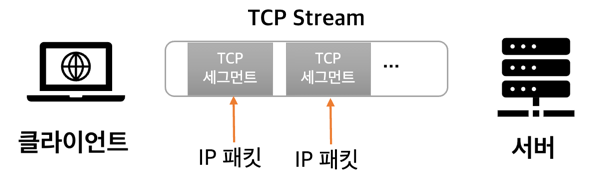
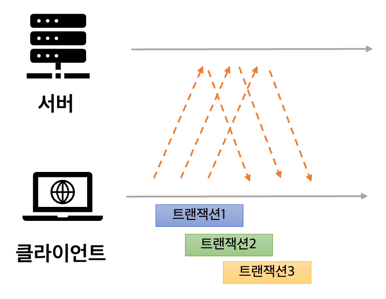
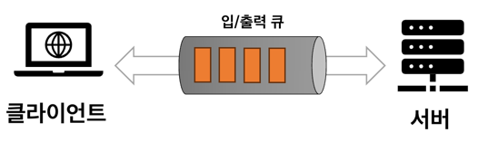

<h1>4장 커넥션 관리</h1>

>

- HTTP 커넥션과 그것이 어떻게 사용되는지
- TCP 커넥션의 지연, 병목, 막힘
- 병렬, keep-alive, 파이프라인 커넥션 을 활용한 HTTP 최적화
- 커넥션 관리 시 따라야하는 규칙들

# contents

## 1. TCP 커넥션

#### 모든 HTTP 통신은 TCP 커넥션 위에서 이루어진다

- 따라서 커넥션이 맺어지면 메시지들의 손실, 손상 되지 않고 순서를 보장한다
- 브라우저에 http://www.foo.com/myPage/index.html 요청 시
    1. 브라우저가 URL에서 호스트명 추출
    2. DNS 서버에 호스트명을 보내 IP 주소를 받음
    3. 브라우저가 포트번호 추출
    4. 브라우저가 IP + port 번호로 TCP 커넥션 생성
    5. 브라우저가 HTTP 요청 메시지 생성 후 요청
    6. 브라우저가 응답 메시지 읽음
    7. 브라우저가 커넥션 끊음

### 1. 신뢰할 수 있는 데이터 전송 통로인 TCP

- HTTP 커넥션은 TCP 커넥션에 불과함 몇몇 사용 규칙을 제외하면
- TCP 커넥션의 한쪽에 있는 바이트들은 순서에 맞게 정확히 전달됨

### 2. TCP 스트림은 세그먼트로 나뉘어 IP 패킷을 통해 전송된다

- TCP 는 IP 패킷에 데이터를 담아 전송
- HTTP 메시지 전송 시
    1. TCP가 세그먼트라는 단위로 데이터 스트림을 잘게 나눔
    2. 세그먼트를 IP 패킷 **봉투**에 담아서 인터넷을 통해 전달
- IP 패킷의 구성요소
    - IP 패킷 헤더 : 발신지, 목적지 IP 주소, 기타 플래그
    - TCP 세그먼트 헤더 : 발신, 수신 포트, TCP 순서 번호, 편승 확인 응답 편승
    - TCP 데이터 조각 : TCP 체크섬, HTTP 메시지 등

### 3. TCP 커넥션 유지하기

- 컴퓨터는 항상 TCP 커넥션을 여러개 가지고 있음
- TCP 커넥션 식별값 : <발신지 IP, 발신지 포트, 수신지 IP, 수신지 포트>
- 네가지 구성요소가 모두 같은 커넥션은 2개 이상 있을 수 없음

### 4. TCP 소켓 프로그래밍

- 운영체제가 제공하는 소켓 API를 사용하여 TCP 커넥션을 생성
- 유닉스 용으로 개발했으나 대부분의 운영체제, 프로그럼 언어에서 사용 가능
- 소켓 API를 사용하여 TCP 커넥션을 생성하고 데이터 스트림을 읽고 쓸 수 있음

#### 클라이언트-서버 간 소켓 통신 과정

1. 서버 준비
    1. socket : 소켓 생성
    2. 80포트로 소켓 묶음
    3. listen : 소켓 커넥션 생성
    4. accept : **커넥션 기다림**
2. 클라이언트 준비
    1. IP주소, 포트 획득
    2. socket : 소켓 생성
    3. connect : **서버에 연결**
3. 서버 : 커넥션 식별 및 요청 읽기
    1. 애플리케이션에 커넥션 통지
    2. read : 클라이언트 요청 읽기 시작
4. 클라이언트 : 연결, HTTP 요청,
    1. 연결 식별
    2. write : HTTP 요청 전송
    3. read : HTTP 응답 기다림
5. 서버 : HTTP 응답
7. 클라이언트 : 응답 읽고, 커넥션 닫음
8. 서버 : 커넥션 닫음

2. TCP 성능에 대한 고려
   > TCP 커넥션을 알고 튜닝하여 HTTP 성능 향상 가능  
   튜닝시에는 **확신을 가질 정도로 잘 알고 수정할 것**

    1. HTTP 트랜잭션 지연
       > 대부분의 HTTP 지연은 TCP 네트워크 지연 때문 응답 지연 등

    2. 성능 관련 중요 요소
       > 고성능 HTTP 소프트웨어 개발자라면 알아야함  
       핸드셰이크, slow-start, Nagle 알고리즘, TIME_WAIT, 포트 고갈

    3. TCP 커넥션 핸드셰이크 지연
       > TCP 커넥션을 맺기위한 핸드셰이크   
       HTTP 데이터 자체가 작다면 전체 시간의 많은 비율을 핸드셰이크가 차지  
       **이미 맺어진 커넥션이 있다면 재활용하는 방법은 없을까?**

    4. 확인 응답 지연
       > 확인 응답을 **piggyback** 편승 시키기 위해 기다림    
       지연 원인이나 관련 기능을 수정 가능

    5. TCP 느린 시작 (slow start)
       > 확인응답에 따라 패킷 수를 늘려 줌 = 처음에는 느림  
       이미 맺어진튜닝된 커넥션을 재활용한다면 느린 시작을 건너뛸 수 있음 **지속 커넥션**

    6. Nagle (Nagle) 알고리즘과 TCP_NODELAY
       > 전송하기에 충분할 만큼 패킷 크기가 되야 전송  
       **TCP_NODELAY** 옵션을 사용하여 Nagle 알고리즘을 무시하고 바로 전송

    7. TIME_WAIT의 누적과 포트 고갈
       > 성능 측정 시에 TCP 커넥션의 유일 값 4 요소 때문에 문제 발생    
       2MSL 동안 새로운 커넥션을 못 맺는데,   
       2SML 안에 새로운 커넥션이 생성되야 할정도의 부하 성능을 측정하면 포트 고갈 발생

3. HTTP 커넥션 관리
    1. 흔히 잘못 이해하는 Connection 헤더
       > hop은 수신한 헤더를 모두 적용하고 다음 hop에 보낼 때 받은 헤더를 삭제한다

    2. 순차적인 트랜잭션 처리에 의한 지연
       > 물리적인 지연과 심리적인 지연 발생

4. 병렬 커넥션
   > 물리/심리적으로 해소 가능하나 물리적으로 한계가 있음  
   사용자는 물리적 한계를 느끼지 못하고 빠르게 **느낄수도** 있음

    1. 병렬 커넥션은 페이지를 더 빠르게 내려받는다
       > 물리 / 심리적 지연 해소

    2. 병렬 커넥션이 항상 더 빠르지는 않다
       > 대역폭이 좁으면 물리적 한계, 많은 커넥션은 서버 메모리 부하  
       보통 브라우저가 6~8개의 병렬 커넥션 맺음

    3. 병렬 커넥션은 더 빠르게 '느껴질 수' 있다
       > 사용자는 병렬적으로 로딩하는 걸 빠르게 **느낀다**

5. 지속 커넥션
   > 지속커넥션을 통해 TCP 커넥션의 단점을 극복 가능  
   단, dumb멍청한 프락시를 주의할 것

    1. 지속 커넥션 vs 병렬 커넥션
       > 웹 어플리케이션이 적은 수의 병렬 커넥션을 맺고 지속 커넥션으로서 유지

    2. HTTP/1.0+의 Keep-Alive 커넥션
       > 커넥션은 맺고 끊음에 시간 쓸 필요 없음

    3. Keep-Alive 동작
       > 헤더에 Connection: keep-alive를 추가하면 커넥션을 끊지 않음 단, 서버가 응답을 해줘야함

    4. Keep-Alive 옵션
       > Keep-Alive 헤더는 클라이언트의 희망사항일 뿐 서버가 응답 시 끊어버릴 수 있음
       > ~~~~
          >  ## 1000개의 트랜잭션을 수행하거나, 5초가 지나면 커넥션을 끊는다
          >  Connection: keep-alive
          >  Keep-Alive: timeout=5, max=1000
          >  ~~~~

    5. Keep-ALive 커넥션 제한과 규칙
       > - 커넥션을 유지하려면, 모든 메시지에 keep-alive를 포함해야 한다
       > - 클라이언트는 서버의 응답에 keep-alive가 없는 것을 보고 커넥션이 끊어짐을 알 수 있다
       > - 엔터티 바디가 있는 응답은 **정확한** Content-Length를 포함해야 한다
       > - 프락시와 게이트웨이는 Connection 해더 규칙을 지킨다
       > - Connection 헤더를 해석 못하는 프락시와는 keep-alive 커넥션을 맺지 않는다
       > - HTTP/1.0 을 따르는 기기로부터 온 Connection 헤더필드는 무시
       > - 클라이언트는 응답 전체를 받기 전에 커넥션이 끊어졌을 경우 문제없을 때 다시 요청을 보내도록 준비되어야한다

    6. Keep-Alive와 멍청한 (dumb) 프락시
       > keep-alive 할줄 모르는 프락시가 홉별 헤더를 그대로 전달하면 클라이언트-서버가 타임아웃때까지 기다리게 됨

    7. Proxy-Connection 살펴보기
       > proxy-connection은 영리한 프락시가 Connection으로 수정해서 보내줌  
       그러나 멍청한 프락시랑 같이 있을경우 문제는 여전함

    8. HTTp/1.1의 지속 커넥션
       > HTTP/1.1은 기본적으로 지속 커넥션을 사용함  
       Connection: close를 명시해야 끊어짐

    9. 지속 커넥션의 제한과 규칙
       > - 서버가 커넥션을 끊고 싶으면 응답에 Connection: close를 포함시킨다.
       > - 클라이언트가 커넥션을 끊고 싶으면 요청에 Connection: close를 포함시킨다.
       > - 모든 메시지가 자신의 길이 정보를 정확하게 가지고 있을 때만 지속 커넥션이 가능하다
       > - HTTP/1.1 프락시는 클라이언트-서버 각각에 대해 별도 지속 커넥션을 관리한다.
       > - HTTP/1.1 프락시는 클라이언트의 커넥션 관련 기능 지원범위를 알고 있지 않으면 지속 커넥션을 맺지 않는다.
       > - HTTP/1.1 기기는 Connection 헤더 값과 상관없이 언제든 커넥션을 끊을 수 있다.
       > - HTTP/1.1 애플리케이션은 중간에 끊어진 커넥션을 복구 할 수 있어야 한다.
       > - 하나의 클라이언트는 서버 부하 방지를 위해 2개정도의 지속 커넥션만을 유지한다.

## 6. 파이프라인 커넥션

  

- 지속커넥션을 파이프라이닝 할 수 있음
- 클라이언트는 요청의 응답이 오기 전까지 큐에 요청을 계속 쌓음
- 대기시간이 긴 네트워크 상황에서 네트워크 왕복 시간을 줄여서 성능을 높임

### 파이프라인 제약 사항

> - 클라이언트는 지속커넥션인지 확인하기 전까지 파이프라인 이어선 안된다.
> - 클라이언트는 완료되지 않은 요청이 파이프라인에 있을 시 다시 커넥션을 맺고 요청 가능해야 한다.
> - 비멱등 요청 ex. POST은 파이프라인을 이용해선 안된다. 에러 발생 시 파이프라인에 어떤 요청이 실패했는지 알 수 없음

## 7. 커넥션 끊기에 대한 미스터리

### 1. '마음대로' 커넥션 끊기

- **일반적으로 메시지가 다 전송되면 커넥션을 끊음**
- HTTP 클라이언트, 서버, 프락시는 언제든 TCp 전송 커넥션을 끊을 수 있음
- ex. 지속 커넥션을 맺은 뒤 유휴 상황 클라이언트가 요청을 보내지 않음
- **서버가 유휴 커넥션을 끊은 뒤 클라이언트의 요청이 없을거라는 확신할 수 있을까?**

### 2. Content-Length 와 Truncation

- HTTP 응답은 정확한 Content-Length 헤더를 가져야함
- 응답받은 본문 길이와 Content-Length가 다를 경우, 다시 서버에 물어봐야함
- **수신자가 캐시 프락시일 경우,** Content-Length를 정정하려하지 말고 그대로 전달 할 것
    - 안그러면 잠재적인 에러로 상황이 복잡해짐

### 3. 커넥션 끊기의 허용, 재시도, 멱등성

에러가 없어도 커넥션이 끊어질 수 있기 떄문에     
HTTP 어플리케이션은 커넥션이 끊어졌을 때 적절히 대응하도록 준비되어있어야 한다.

#### 비멱등 메서드는 파이프라인 커넥션에 태우면 안된다.

- 비멱등 요청을 다시 보내야하는 상황이 벌어지면?
    - 이전 요청의 응답을 받을 떄까지 기다린다.
    - 재요청을 다시 보낼 수 있게 자동화하지 마라
    - ex. 브라우저는 캐시된 POST 요청에 대해 사용자에게 재요청 여부를 물음

> **멱등** idempotent : 실행횟수에 상관없이 결과가 같은 연산  
> ex. GET, HEAD, PUT, DELETE, TRACE, OPTIONS

### 4. 우아한 커넥션 끊기

#### TCP 커넥션은 양방향이다.

- 한 쪽의 출력큐 데이터는 다른 쪽의 입력 큐에 보내짐
- 애플리케이션서버은 입/출력 중 하나 혹은 둘다 끊을 수 있음

### 전체 끊기와 절반 끊기

- 전체 끊기 : 애플리케이션의 입/출력 채널 모두 닫음 
    ~~~~
    close();
    ~~~~
- 절반 끊기 : 입/출력 채널 중 하나만 닫음
    ~~~~
    shutdown();
    ~~~~

### TCP 끊기와 리셋 에러

#### 출력 채널을 끊는 절반 끊기를 사용하는 것이 안전하다

- 각기 다른 HTTP 서버와 통신할 때 기기에 예상치 못한 쓰기에러 방지
- 입력 채널을 끊는 것은 위험
    - **클라이언트가 더이상 데이터를 보내지 않을 것이라 확신할 수 있는가?**
    - 클라이언트가 입력채널이 끊어진 서버에 데이터를 보내면 TCP 'connection reset' 에러 발생, 버퍼에 있는 데이터가 모두 사라짐
    - 파이프라인 지속 커넥션에서는 더 악화
        - 입력채널이 끊긴 서버에 요청을 보내면 TCP 'connection reset'를 맞고 이미 응답을 받은 버퍼의 아직 읽지 않은데이터까지 삭제

### 우아하게 커넥션 끊기

#### 우아하게 끊는 방법은 애플리케이션 자신의 출력 채널을 먼저 끊고 다른 쪽에 있는 기기의 출력 채널이 끊기기를 기다리는 것

- 즉 양쪽에서 더는 데이터를 전송하지 않을 것이라고 알려주는 것
- 상대방이 절반 끊기를 구현했다는 보장을 못함
    - 따라서 출력 절반 끊기를 한 후 입력 채널 상태 검사를 주기적으로 해서 끊어졌나 확인
    - 끊어지지 않으면 애플리케이션 리소스를 보호하기 위해 강제로 커넥션 끊을수도 있음

## 8. 추가 정보

### 1. HTTP 커넥션 관련 참고자료

### 2. HTTP 성능 이슈 관련 참고자료

### 3. TCP/IP 관련 참고자료

    
   
