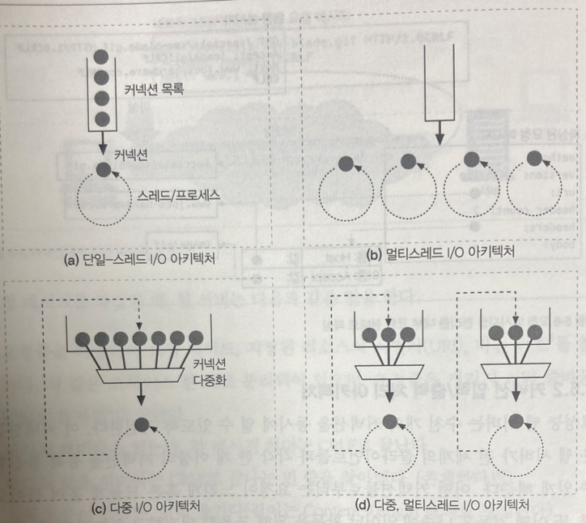

<h1>5장 웹 서버</h1>

- 웹서버는 www의 일꾼
- 여러 종류의 소프트웨어 및 하드웨어 웹 서버
- HTTP 통신을 진단하는 간단한 웹서버 Perl
- 웹 서버의 HTTP 트랜잭션 처리 순서

# Contents

## 1. 다채로운 웹 서버

웹 서버란

- HTTP 요청을 처리하고 응답을 제공한다.
- 웹 서버 소프트웨어와 소프트웨어가 설치된 장비 모두를 가리킨다.

### 1.1. 웹 서버 구현

#### 웹 서버가 구현한 기능

- HTTP 프로토콜 구현
- 웹 리소스 관리
- 웹 서버 관리기능 제공
- TCP 커넥션 관리 책임을 운영체제와 나눠가짐

운영체제는 컴퓨터 시스템의 하드웨어 관리, TCP/IP 네트워크 지원, 웹 리소스를 위한 파일시스템, 프로세스 관리 기능 등을 제공 <sup>support</sup>한다.

#### 웹서버의 두가지 형태

- 다목적 소프트웨어 웹서버를 표준 컴퓨터 시스템에 설치, 수행
- 사용자 전자기기 안에 컴퓨터 칩으로 웹서버를 내장시켜 관리 콘솔 제공

### 1.2. 다목적 소프트웨어 웹 서버

네트워크에 연결된 표준 컴퓨터 시스템에 설치되어 동작한다.  
ex. apache, nginx, IIS, 등

#### 2022년 기준 웹 서버 점유율 (출처 : 넷크래프트 https://news.netcraft.com/archives/2022/)

  

### 1.3. 임베디드 웹 서버

소비자용 전자 제품 <sub>ex. 프린터, 냉장고 등</sub>에 내장할 목적으로 만든 웹 서버  
소비자용 기기에 간편한 웹 브라우저 인터페이스를 제공하기 위해 사용

## 2. 간단한 펄 웹 서버

완전한 기능을 갖춘 웹서버를 구축하는 것은 어렵다. <sub>웹서버 설치, 호스팅, 접근제어, 로깅 등</sub>  
최소한의 기능을 갖춘 HTTP 서버를 Perl 코드로 작성 가능하다.

#### 펄 코드로 작성한 웹서버가 하는 일

- HTTP 커넥션 기다리기
- 클라이언트에게 응답할 메시지를 타이핑 받기
- 응답 메시지 생성 및 전송

## 3. 진짜 웹 서버가 하는 일

1. 커넥션 맺기 : 클라이언트의 접속을 허용하거나 거절
2. 요청 메시지 받기 : HTTP 요청 메시지를 네트워크로부터 읽어 들임
3. 요청 처리 : 요청 메시지를 해석하고 행동을 취함
4. 리소스 접근 : 메시지에서 지정한 리소스에 접근
5. 응답 만들기 : 올바른 헤더를 포함한 HTTP 응답 메시지 생성
6. 응답 보내기 : 응답을 클라이언트에게 보냄
7. 트랜잭션 로깅 : 로그파일에 트랜잭션 기록

## 4. 단계 1 : 클라이언트 커넥션 수락

클라이언트가 지속 커넥션을 통해 이전의 커넥션을 사용 가능하다면, 커넥션 요청이 필요 없으나  
**그렇지 않다면, 클라이언트는 서버에 대한 새 커넥션을 열어야 한다.**

### 4.1. 새 커넥션 다루기

#### 클라이언트가 TCP 커넥션 요청 시

- 웹서버는 커넥션을 맺고
- TCP 커넥션에서 IP 주소를 추출하여 클라이언트 확인
- 그리고 커넥션에 오가는 데이터를 지켜보기 위한 준비

웹서버는 어떤 커넥션이건 마음대로 수락하고 거절할 수 있다.   
인가되지 않은 호스트나 IP를 악의적인 접근으로 간주하여 커넥션을 닫기도 한다.

### 4.2. 클라이언트 호스트 명 식별

대부분의 웹 서버는 reverse DNS <sup>역방향 DNS</sup>를 사용하여 클라이언트의 IP를 호스트 명으로 변환하도록 설정되어있다.  
웹 서버는 알아낸 호스트명으로 접근제어, 로깅에 사용한다.

hostname lookup 은 시간이 오래 걸리기 때문에, 트랜잭션의 성능을 저하시킨다.  
따라서 **특정 리소스에 대해서만** hostname resolution <sup>호스트명 분석</sup>을 수행하도록 설정하자.

### 4.3. ident를 통해 클라이언트 사용자 알아내기

ident <sup>신원확인</sup> 프로토콜은 웹서버가 HTTP 커넥션을 초기화한 사용자 이름을 알아내는데 사용된다.

#### ident 프로토콜 순서

1. 클라이언트가 HTTP 커넥션 <sup>80 port</sup>, ident 커넥션 <sup>80 port</sup> 요청
2. 웹 서버가 HTTP 커넥션을 맺음
3. 웹 서버가 클라이언트 113 포트에 ident 커넥션을 맺음
4. 클라이언트가 ident 응답 반환 <sub>ex. 4322,80:USERID:UNIX:mary</sub>

#### ident 프로토콜은 내부 조직에서만 쓰고 공공 인터넷에서는 안쓰인다.

- 많은 클라이언트가 ident 프로토콜 데몬 소프트웨어을 실행 안함
- 트랜잭션 지연
- 방화벽이 ident 트래픽을 막는 경우가 많음
- 안전하지 않고, 조작 쉬움
- 가상 IP 주소 지원 어려움
- 클라이언트 식별값 노출하여 사생활 침해 우려

## 5. 단계 2 :  요청 메시지 수신

웹 서버가 요청메시지를 커넥션으로부터 읽어들여 파싱하는 과정

#### 요청 메시지 파싱 방법

- 요청줄을 파싱하여 요청 메서드, URI, HTTP 버전을 알아냄
    - 스페이스로 값이 구분되어있고, CRLF로 끝남 <sup>LF도 인식 가능하도록 되어있는 웹서버도 많음, 사용자 실수</sup>
- 헤더를 읽음. CRLF로 끝남
- 헤더의 끝을 의미하는 CRLF로 끝나는 빈줄을 찾는다 (존재한다면)
- 요청 메시지 본문을 읽음
    - 길이는 Content-Length 헤더에 명시되어있음

#### 해석이 가능한 메시지 분량이 확볼될 때까지 메모리에 메시지 일부분 저장할 필요가 있다

### 5.1. 메시지의 내부 표현

어느 웹서버는 메시지를 자료구조에 저장하기도 한다.  
이를테면, 헤더 부분을 룩업 테이블에 저장하여 필드에 신속하게 접근할 수 있도록 한다.

### 5.2. 커넥션 입력/출력 처리 아키텍처

웹 서버는 요청이 언제든 도착할 수 있기 떄문에, 새 요청을 주시하고 있다.  
처리 과정도 요청 종류에 따라 빠르게, 느리게, 드물게, 대기하면서 등 다양해서 요청을 처리하는 방식도 달라진다.

  

#### 단일 스레드 웹 서버 (a)

- 한번에 하나씩 요청 처리
- 트랜잭션이 완료되면 다음 커넥션 처리
- 구현은 간단하나 성능은 별로
- 로즈다 적은 서버, type-o-serve 같은 진단도구에 적합

#### 멀티프로세스와 멀티스레드 웹 서버 (b)

- 여러 요청을 동시에 처리
    - 그러기 위해 여러 프로세스 혹은 고효율 스레드를 할당
- 스레드를 미리 만들 수 도 있고 미리 만들어질 수도 있음
    - worker pool 시스템 : 스레드가 미리 만들어져 pool에서 기다리고 있음
- 스레드/프로세스 개수에 제한을 둠
    - 리소스 부족으로 인한 성능 저하를 막기 위해

#### 다중 I/O 웹 서버 (c)

- 모든 커넥션 활동 감시당함
- 커넥션의 상태가 바뀌면 커넥션에 대한 작은 양의 처리 수행
- 처리가 완료되면, 커넥션은 다음번 상태변경을 위해 열린 커넥션 목록으로 복귀
- 유휴 상태의 커넥션에 매여서 기다리는 리소스 낭비 없음

#### 다중 멀티스레드 웹 서버 (d)

- 멀티 코어 시스템의 장점을 살리기 위해 멀티 스레딩과 다중화 <sup>multiplexing</sup>를 결합
- 여러 개의 스레드 <sup>보통 하나의 물리 프로세스</sup> 는 각각 열려있는 커넥션을 감시하고
- 각 커넥션에 대해 조금씩 작업 수행

## 6. 단계 3 : 요청 처리

HTTP 트랜잭션의 외적인 부분

요청 메시지로부터 정보를 얻어내어 처리한다.    
POST는 본문을 요구하고, GET은 본문을 금지시키는 등 처리를 위해 메시지 내용이 필요하다.

## 7. 단계 4 : 리소스의 매핑과 접근

클라이언트에게 리소스를 반환하기 위해서는 URI에 알맞는 리소스를 찾아서 그 리소스의 원천을 식별해내야 한다.

### 7.1. Docroot

- 리소스 매핑의 가장 단순한 형태
- URI의 경로를 파일 시스템의 경로로 변환
- Docroot <sup>문서루트</sup> : 일반적으로 웹서버 파일시스템의 특정 경로를 지정해둠
- 리소스의 경로를 찾기 위해 URI의 경로를 Docroot에 붙임
- client가 /img/icon.png로 요청 시, **/usr/local/httpd/files**/img/icon.png로 변환
- 상대경로를 이용해 Docroot를 벗어나지 못하도록 주의

```shell
## 아파치 설정  
## httpd.conf  
DocumentRoot "/usr/local/httpd/files"
```

#### 가상 호스팅된 docroot

가상 호스팅 <sup>virtual hosting</sup>  
한 웹 서버에 여러 개의 웹사이트를 호스팅하여, 웹사이트별로 그들만의 분리된 문서루트를 설정한다.  
이를 위해 웹 서버는 호스트 헤더의 IP 주소나 호스트명을 보고 어느 웹사이트에 대한 요청인지 판단한다.

```shell
## 아파치 설정  
## httpd.conf  
<VirtualHost www.nike.com>
    DocumentRoot "/usr/local/httpd/files/nike"
</VirtualHost>

<VirtualHost www.adidas.com>
    DocumentRoot "/usr/local/httpd/files/adidas"
</VirtualHost>
```

#### 사용자 홈 디렉터리 docroots

- 한대의 웹서버에 여러개의 웹사이트를 만들 수 있게 함
- '~' 이나 '/' 다음에 사용자 이름이 오는것으로 URI 조합
- GET /~joe/index.html -> /home/joe/public_html/index.html
- GET /~mary/index.html -> /home/mary/public_html/index.html

### 7.2. 디렉터리 목록

웹 서버는 파일이 아니라 디렉터리에 대한 접근을 요청 받을 수 있다.

#### 디렉터리 목록 요청시 응답

- 에러 반환
- '색인 파일' 반환
- 디렉터리를 탐색해서 그 내용을 담은 html 반환
    - 디렉터리 목록 <sup>directory listing</sup> : 디렉터리 내의 파일 목록을 보여주는 것

```shell

## 아파치 설정 > 색인파일 우선순위  
## httpd.conf  
DirectoryIndex index.html index.htm index.php index.cgi
```

### 7.3. 동적 콘텐츠 리소스 매핑

웹 서버는 대부분 백엔드 애플리케이션 <sup>java servlet</sup>과 연동되어 동적 콘텐츠를 제공한다.
이 떄 웹 서버는 동적 콘텐츠 생성 프로그램이 어디에있는지<sup>1</sup>,   
어떻게 그 프로그램을 실행하는지 <sup>2</sup> 알아야 한다.

```shell
## 아파치 설정 > 프로그램 위치 매핑
## httpd.conf
## /cgi-bin/ 요청이 들어오면 아래 경로로 매핑
ScriptAlias /cgi-bin/ /usr/local/httpd/cgi-bin/
```

### 7.4. 서버 사이드 인클루드 (Server-Sdie Includes, SSI)

만일, 어떤 리소스가 SSI를 포함하고 있다면, 웹 서버는 SSI를 처리하고 클라이언트에게 리소스를 반환한다.

### 7.5. 접근 제어

- 웹 서버가 각 리소스에게 접근 제어를 할당
- 제어는 사용자 IP 주소에 근거할 수도 있고, 비밀번호를 물을 수도 있음

## 8. 단계 5 : 응답 만들기

### 8.1. 응답 엔터티

트랜잭션이 응답 본문을 생성해야한다면 응답 메시지에 본문을 함께 보내야 한다.

#### 본문이 있는 응답 메시지 내용

- Content-Type : 본문의 MIME 유형
- Content-Length : 본문의 길이
- 응답 본문

### 8.2. MIME 유형 결정하기

웹 서버는 응답 본문의 MIME 타입을 지정해야할 의무가 있다.

#### MIME 타입 결정 방법

- mime.types : 파일의 확장자를 보고 MIME 타입을 결정한다.
    - 가장 흔한 방법
- Magic typing
    - 매직파일 : 리소스의 내용 패턴 정보를 저장한 테이블
    - 매직파일을 탐색해서 결정
    - 느림, 파일이 표준 확장자 없이 지어진 경우 유용
- Explicit typing <sup>유형 명시</sup>
    - 특정 리소스에 대해 특정 MIME 타입을 임의로 지정
- Type negotiation <sup>유형 협상</sup>
    - 클라이언트가 원하는 MIME 타입을 지정
    - 서버는 그 중 하나를 선택
    - 클라이언트가 Accept 헤더를 보내지 않으면, 서버는 기본 MIME 타입을 선택

### 8.3. 리다이렉션

웹 서버가 요청의 수행을 위해 클라이언트가 다른곳으로 가도록 라다이렉트  
리다이렉션은 3xx 응답 코드를 사용한다.  
Location 헤더 필드에 리다이렉트할 URI를 담는다.

#### 리다이렉트가 유용한 경우

- 영구히 리소스가 옮겨진 경우 : 301 <sup>Moved Permanently</sup>
    - "리소스가 옮겨졌으니 북마크를 갱신하라"
- 일시적으로 리소스가 옮겨진 경우 :  303 <sup>See Other</sup>, 307 <sup>Temporary Redirect</sup>
    - "리소스가 일시적으로 옮겨졌으니 북마크를 갱신하지 말고, 잠시동안은 여기로 와서 찾아봐라"
- URL 증강
    - fat URL을 만듦
    - 문맥 정보를 URL에 추가하여 리다이렉트
    - 303 <sup>See Other</sup>
    - 307 <sup>Temporary Redirect</sup>
- 부하 균형
    - 리다이렉트를 통해 부하를 분산
    - 303 <sup>See Other</sup>
    - 307 <sup>Temporary Redirect</sup>
- 친밀한 다른 서버가 있을 때 : 303 <sup>See Other</sup>, 307 <sup>Temporary Redirect</sup>
    - 클라리언트에 대한 정보를 가진 다른 서버로 리다이렉트
- 디렉터리 이름 정규화
    - /index.html -> /index.html/

## 9. 단계 6 : 응답 보내기

## 10. 단계 7 : 로깅

## 11. 추가 정보

