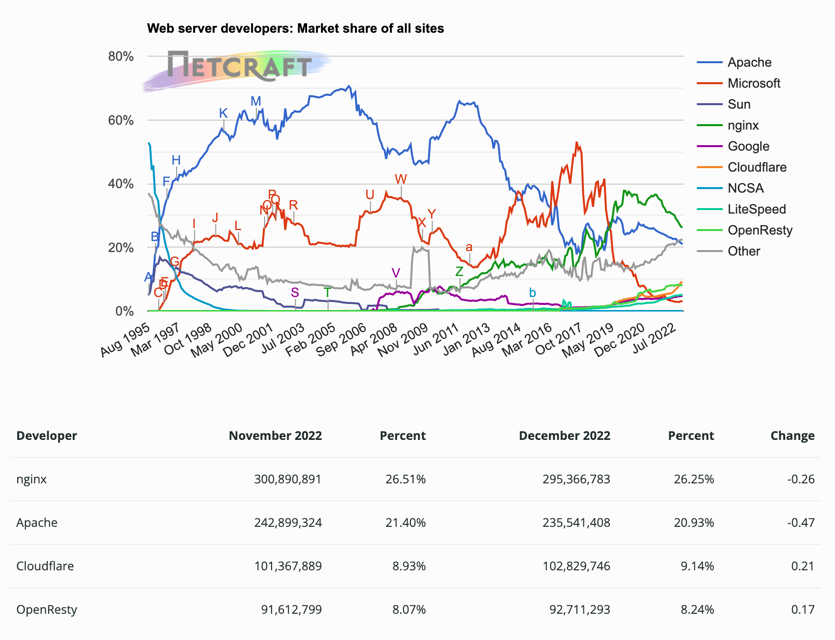

<h1>5장 웹 서버</h1>

- 웹서버는 www의 일꾼
- 여러 종류의 소프트웨어 및 하드웨어 웹 서버
- HTTP 통신을 진단하는 간단한 웹서버 Perl
- 웹 서버의 HTTP 트랜잭션 처리 순서

# Contents

## 1. 다채로운 웹 서버

웹 서버는 HTTP 요청을 처리하고 응답을 제공한다.  
**웹 서버**는 웹 서버 소프트웨어와 소프트웨어가 설치된 장비 모두를 가리킨다.

### 1. 웹 서버 구현

#### 웹 서버의 기능

- HTTP 프로토콜 구현
- 웹 리소스 관리
- 웹 서버 관리기능 제공
- TCP 커넥션 관리 책임을 운영체제와 나눠가짐

운영체제는 컴퓨터 시스템의 하드웨어 관리, TCP/IP 네트워크 지원, 웹 리소스를 위한 파일시스템, 프로세스 관리 기능 등을 제공 support한다.

#### 웹서버의 두가지 형태

- 다목적 소프트웨어 웹서버를 표준 컴퓨터 시스템에 설치, 수행
- 사용자 전자기기 안에 컴퓨터 칩으로 웹서버를 내장시켜 관리 콘솔 제공

### 2. 다목적 소프트웨어 웹 서버

네트워크에 연결된 표준 컴퓨터 시스템에 설치되어 동작한다.  
ex. apache, nginx, IIS, 등

#### 2022년 기준 웹 서버 점유율 (출처 : 넷크래프트 https://news.netcraft.com/archives/2022/)

  

### 3. 임베디드 웹 서버

소비자용 전자 제품 ex. 프린터, 냉장고 등에 내장할 목적으로 만든 웹 서버  
소비자용 기기에 간편한 웹 브라우저 인터페이스를 제공하기 위해 사용

## 2. 간단한 펄 웹 서버

완전한 기능을 갖춘 웹서버를 구축하는 것은 어렵다. 웹서버 설치, 호스팅, 접근제어, 로깅 등  
최소한의 기능을 갖춘 HTTP 서버를 Perl 코드로 작성 가능하다.

#### 펄 코드로 작성한 웹서버가 하는 일

- HTTP 커넥션 기다리기
- 클라이언트에게 응답할 메시지를 타이핑 받기
- 응답 메시지 생성 및 전송

## 3. 진짜 웹 서버가 하는 일

1. 커넥션을 맺기 : 클라이언트의 접속을 허용하거나 거절
2. 요청 메시지 받기 : HTTP 요청 메시지를 네트워크로부터 읽어 들임
3. 요청 처리 : 요청 메시지를 해석하고 행동을 취함
4. 리소스 접근 : 메시지에서 지정한 리소스에 접근k
5. 응답 만들기 : 올바른 헤더를 포함한 HTTP 응답 메시지 생성
6. 응답 보내기 : 응답을 클라이언트에게 보냄
7. 트랜잭션 로깅 : 로그파일에 트랜잭션 기록

## 4. 단계 1 : 클라이언트 커넥션 수락

클라이언트가 지속 커넥션을 통해 이전의 커넥션을 사용 가능하다면, 커넥션 요청이 필요 없으나  
**그렇지 않다면, 클라이언트는 서버에 대한 새 커넥션을 열어야 한다.**

### 1. 새 커넥션 다루기

#### 클라이언트가 TCP 커넥션 요청 시

- 웹서버는 커넥션을 맺고
- TCP 커넥션에서 IP 주소를 추출하여 클라이언트 확인
- 그리고 커넥션에 오가는 데이터를 지켜보기 위한 준비

웹서버는 어떤 커넥션이건 마음대로 수락하고 거절할 수 있다.   
인가되지 않은 호스트나 IP를 악의적인 접근으로 간주하여 커넥션을 닫기도 한다.

### 2. 클라이언트 호스트 명 식별

대부분의 웹 서버는 reverse DNS 역방향 DNS를 사용하여 클라이언트의 IP를 호스트 명으로 변환하도록 설정되어있다.  
웹 서버는 알아낸 호스트명으로 접근제어, 로깅에 사용한다.

hostname lookup 은 시간이 오래 걸리기 때문에, 트랜잭션의 성능을 저하시킨다.  
따라서 **특정 리소스에 대해서만** hostname reslolution 호스트명 분석을 수행하도록 설정하자.

### 3. ident를 통해 클라이언트 사용자 알아내기

ident 신원확인 프로토콜은 웹서버가 HTTP 커넥션을 초기화한 사용자 이름을 알아내는데 사용된다.

#### ident 프로토콜 순서

1. 클라이언트가 HTTP 커넥션 80 port, ident 커넥션 80 port 요청
2. 웹 서버가 HTTP 커넥션을 맺음
3. 웹 서버가 클라이언트 113 포트에 ident 커넥션을 맺음
4. 클라이언트가 ident 응답 반환 ex. 4322,80:USERID:UNIX:mary

#### ident 프로토콜은 내부 조직에서만 쓰고 공공 인터넷에서는 안쓰인다.

- 많은 클라이언트가 ident 프로토콜 데몬 소프트웨어을 실행 안함
- 트랜잭션 지연
- 방화벽이 ident 트래픽을 막는 경우가 많음
- 안전하지 않고, 조작 쉬움
- 가상 IP 주소 지원 어려움
- 클라이언트 식별값 노출하여 사생활 침해 우려

## 5. 단계 2 :  요청 메시지 수신

### 1. 메시지의 내부 표현

### 2. 커넥션 입력/출력 처리 아키텍처

## 6. 단계 3 : 요청 처리

## 7. 단계 4 : 리소스의 매핑과 접근

### 1. Docroot

### 2. 디렉터리 목록

### 3. 동적 콘텐츠 리소스 매핑

### 4. 서버 사이드 인클루드 (Server-Sdie Includes, SSI)

### 5. 접근 제어

## 8. 단계 5 : 응답 만들기

### 1. 응답 엔터티

### 2. MIME 유형 결정하기

### 3. 리다이렉션

## 9. 단계 6 : 응답 보내기

## 10. 단계 7 : 로깅

## 11. 추가 정보

