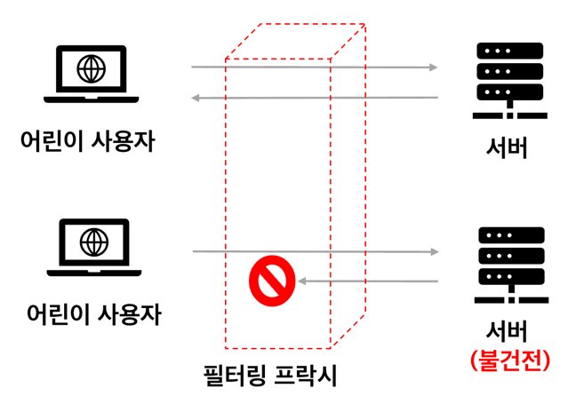
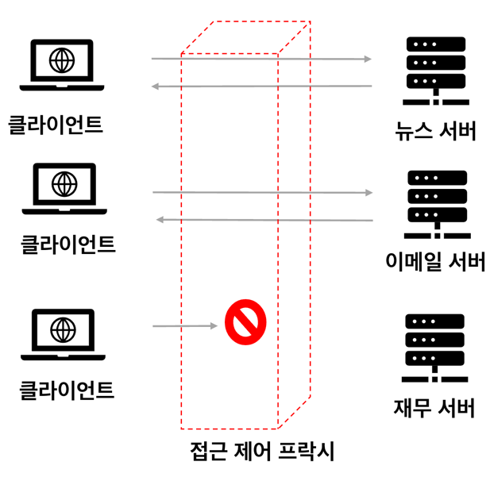
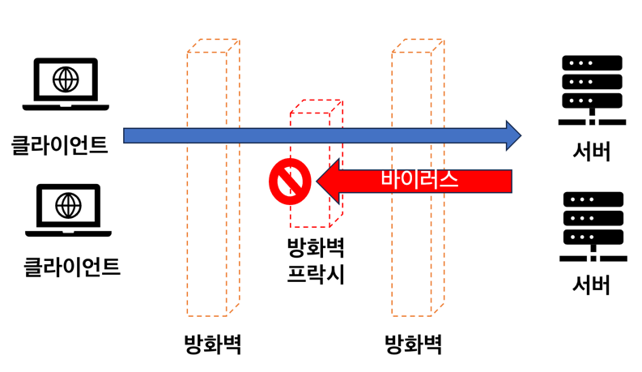

<h1>6장 프락시</h1>

웹 프락시 서버는 중개자다. 클라이언트와 서버 사이에 위치해서 HTTP 메시지 중개인 처럼 동작한다.

- HTTP 프락시와 웹 게이트웨이 비교, HTTP 프락시 배치도
- 유용한 활용방법
- 실제 네트워크에 배치한 HTTP 프락시와 트래픽이 프락시로 가는 방법
- 브라우저에서 프락시를 사용 설정
- HTTP 프락시 요청과 서버요청의 다른점, 프락시가 브라우저의 동작을 미묘하게 바꾸는 방법
- Via 헤더와 TRACE 메서드를 통해 프락시를 통과하는 메시지 경로 기록
- 프락시에 기반한 HTTP 접근 제어
- 프락시가 클라이언트와 서버 사이에서 상호작용하는 방법

# Contents

## 1. 웹 중개자

웹 프락시 서버는 클라이언트 입장에서 트랜잭션을 수행해주는 중개인이다.  
프락시는 클라이언트와 서버 사이에 위치하고, 클라이언트의 요청을 서버에 전달하고, 서버의 응답을 클라이언트에게 전달한다.

따라서, 프락시는 클라이언트이기도하고, 웹서버이기도 하다.

### 1.1 개인 프락시와 공유 프락시

#### 공용 프락시

- 대부분의 프락시는 공용이며 공유된 프락시
- ex. 중앙 집중형 프락시, 캐시 프락시 서버 등

#### 개인 프락시

- 하나의 클라이언트를 위한 프락시
- 흔하지 않으나 꾸준히 사용됨
- 브라우저나 보조 제품들에 내장되어 있음
- 브라우저 기능 확장, 성능 개선, 무료 ISP 서비스를 위한 광고 운영 등

### 1.2 프락시 대 게이트웨이

프락시는 **같은 프로토콜**을 사용하는 둘 이상의 애플리케이션을 연결하고,  
게이트웨이는 서로 다른 프로토콜을 사용하는 둘 이상의 애플리케이션을 연결한다.

그러나 차이점은 모호하다. 프락시도 가끔 프로토콜을 변환해주기도 한다.

## 2. 왜 프락시를 사용하는가?

- 프락시는 실용적이고 유용한 일을 해준다
- 보안 개선, 성능 향상, 비용 절약 등 부가적인 가치를 주는 유용한 서비스
- 어린이 필터
- 문서 접근 제어자
- 보안 방화벽
- 웹 캐시 : 인기있는 문서의 로컬 사본을 관리하고, 해당 문서의 요청을 빠르게 제공
- 대리 프락시 surrogate proxy, 대리, 리버스 프락시
    - 웹서버인것처럼 위장
    - 서버 가속기 : 웹 리소스 위치를 찾기위해 다른 서버와 커뮤니케이션
    - 대리 프락시 : 콘텐츠 라우팅 기능을 가져 주문형 복제 콘텐츠의 분산 네트워크 만들기
- 콘텐츠 라우터 : 특정 요청을 특정 웹서버로 유도
- 트랜스코더 : 본문 포맷을 수정
    - 트랜스코딩 : 데이터 표현방식을 자연스럽게 변환하는 것
    - ex. 이미지 포맷 변환, 압축 포맷 변환, 자연어 번역
- 익명화 프락시 anonymizing proxy : 클라이언트의 신원을 숨기는 프락시
    - 신원 정보 : IP 주소, 쿠키, 사용자 에이전트 등
    - 개인정보 보호, 익명성 보방에 기여

#### 어린이 필터 필터링 프락시

  

#### 문서 접근 제어자

- 대기업 환경, 분산된 관료 조직에 유용
- 각 웹서버들의 접근제어 설정 없이, 중앙 프락시 서버에서 접근제어 설정

  

#### 보안 방화벽

- 네트워크 보안 엔지니어가 보안 강화를 위해 사용
- 프락시 서버가 조직에 들어오고 나가는 응용 프로토콜 통제
- hook 제공

## 3. 프락시는 어디에 있는가?

### 3.1 프락시 서버 배치

### 3.2 프락시 계층

### 3.3 어떻게 프락시가 트래픽을 처리하는가

## 4. 클라이언트 프락시 설정

### 4.1 클라이언트 프락시 설정: 수동

### 4.2 클라이언트 프락시 설정 : PAC 파일

### 4.3 클라이언트 프락시 설정 : WPAD

## 5. 프락시 요청의 미묘한 특징들

### 5.1 프락시 URI는 서버 URI와 다르다

### 5.2 가상 호스팅에서 일어나는 같은 문제

### 5.3 인터셉트 프락시는 부분 URI를 받는다

### 5.4 프락시는 프락시 요청과 서버 요청을 모두 다룰 수 있다

### 5.5 전송 중 URI 변경

### 5.6 URI 클라이언트 자동확장과 호스트 명 분석 (Hostname Resolution)

### 5.7 프락시 없는 URI 분석 (URI Resolution)

### 5.8 명시적인 프락시를 사용할 떄의 URI 분석

### 5.9 인터셉트 프락시를 이용한 URI 분석

## 6. 메시지 추적

### 6.1 Via 헤더

### 6.2 TRACE 메서드

## 7. 프락시 인증

## 8. 프락시 상호운용성

### 8.1 지원하지 않는 헤더와 메서드 다루기

### 8.2 OPTIONS: 어떤 기능을 지원하는지 알아보기

### 8.3 Allow 헤더

## 9. 추가정보
