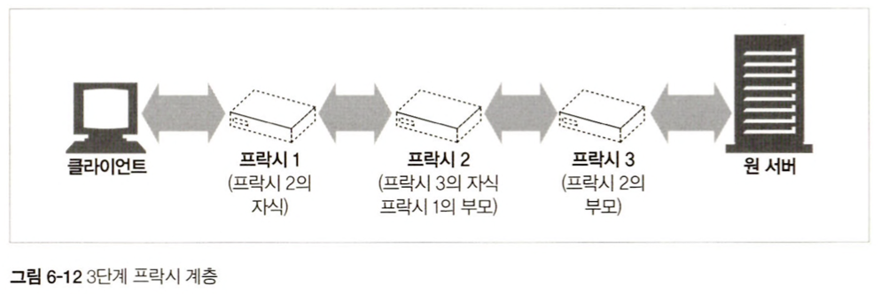
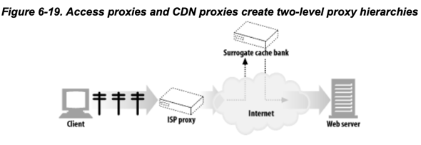
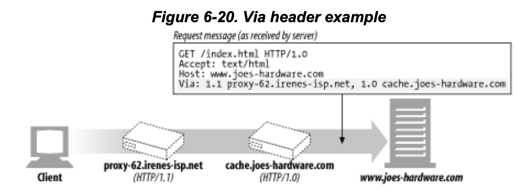
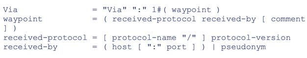
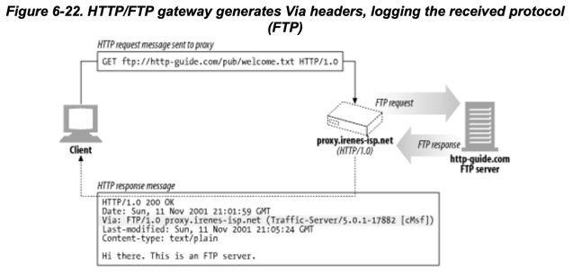
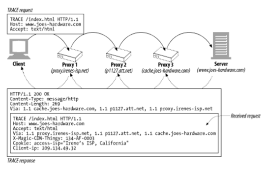
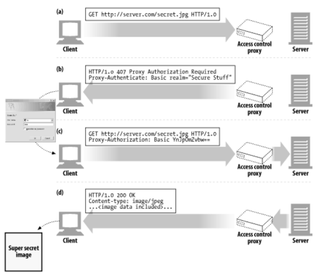
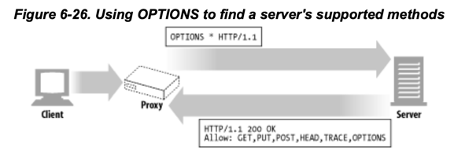

# 6장 프락시

웹 프락시 서버는 중개자다. 클라이언트와 서버 사이에 위치해서 HTTP 메시지 중개인 처럼 동작한다.

- HTTP 프락시와 웹 게이트웨이 비교, HTTP 프락시 배치도
- 유용한 활용방법
- 실제 네트워크에 배치한 HTTP 프락시와 트래픽이 프락시로 가는 방법
- 브라우저에서 프락시를 사용 설정
- HTTP 프락시 요청과 서버요청의 다른점, 프락시가 브라우저의 동작을 미묘하게 바꾸는 방법
- Via 헤더와 TRACE 메서드를 통해 프락시를 통과하는 메시지 경로 기록
- 프락시에 기반한 HTTP 접근 제어
- 프락시가 클라이언트와 서버 사이에서 상호작용하는 방법

## index

1. [웹 중개자](#1-웹-중개자)
    1. 개인 프락시와 공유 프락시
    2. 프락시 대 게이트웨이
2. [왜 프락시를 사용하는가?](#2-왜-프락시를-사용하는가)
3. [프락시는 어디에 있는가?](#3-프락시는-어디에-있는가)
    1. 프락시 서버 배치
    2. 프락시 계층
    3. 어떻게 프락시가 트래픽을 처리하는가
4. [클라이언트 프락시 설정](#4-클라이언트-프락시-설정)
    1. 클라이언트 프락시 설정: 수동
    2. 클라이언트 프락시 설정 : PAC 파일
    3. 클라이언트 프락시 설정 : WPAD
5. [프락시 요청의 미묘한 특징들](#5-프락시-요청의-미묘한-특징들)
    1. 프락시 URI는 서버 URI와 다르다
    2. 가상 호스팅에서 일어나는 같은 문제
    3. 인터셉트 프락시는 부분 URI를 받는다
    4. 프락시는 프락시 요청과 서버 요청을 모두 다룰 수 있다
    5. 전송 중 URI 변경
    6. URI 클라이언트 자동확장과 호스트 명 분석 (Hostname Resolution)
    7. 프락시 없는 URI 분석 (URI Resolution)
    8. 명시적인 프락시를 사용할 떄의 URI 분석
    9. 인터셉트 프락시를 이용한 URI 분석
6. [메시지 추적](#6-메시지-추적)
    1. Via 헤더
    2. TRACE 메서드
7. [프락시 인증](#7-프락시-인증)

# Contents

## 1. 웹 중개자

웹 프락시 서버는 클라이언트 입장에서 트랜잭션을 수행해주는 중개인이다.  
프락시는 클라이언트와 서버 사이에 위치하고, 클라이언트의 요청을 서버에 전달하고, 서버의 응답을 클라이언트에게 전달한다.

따라서, 프락시는 클라이언트이기도하고, 웹서버이기도 하다.

### 1.1 개인 프락시와 공유 프락시

#### 공용 프락시

- 대부분의 프락시는 공용이며 공유된 프락시
- e.g. 중앙 집중형 프락시, 캐시 프락시 서버 등

#### 개인 프락시

- 하나의 클라이언트를 위한 프락시
- 흔하지 않으나 꾸준히 사용됨
- 브라우저나 보조 제품들에 내장되어 있음
- 브라우저 기능 확장, 성능 개선, 무료 ISP 서비스를 위한 광고 운영 등

### 1.2 프락시 대 게이트웨이

프락시는 **같은 프로토콜**을 사용하는 둘 이상의 애플리케이션을 연결하고,  
게이트웨이는 서로 다른 프로토콜을 사용하는 둘 이상의 애플리케이션을 연결한다.

그러나 차이점은 모호하다. 프락시도 가끔 프로토콜을 변환해주기도 한다.

## 2. 왜 프락시를 사용하는가?

- 프락시는 실용적이고 유용한 일을 해준다
- 보안 개선, 성능 향상, 비용 절약 등 부가적인 가치를 주는 유용한 서비스
- 어린이 필터
- 문서 접근 제어자
- 보안 방화벽
- 웹 캐시 : 인기있는 문서의 로컬 사본을 관리하고, 해당 문서의 요청을 빠르게 제공
- 대리 프락시 <sup>surrogate proxy, 대리, 리버스 프락시</sup>
    - 웹서버인것처럼 위장
    - 서버 가속기 : 웹 리소스 위치를 찾기위해 다른 서버와 커뮤니케이션
    - 대리 프락시 : 콘텐츠 라우팅 기능을 가져 주문형 복제 콘텐츠의 분산 네트워크 만들기
- 콘텐츠 라우터 : 특정 요청을 특정 웹서버로 유도
- 트랜스코더 : 본문 포맷을 수정
    - 트랜스코딩 : 데이터 표현방식을 자연스럽게 변환하는 것
    - e.g. 이미지 포맷 변환, 압축 포맷 변환, 자연어 번역
- 익명화 프락시 <sup>anonymizing proxy</sup> : 클라이언트의 신원을 숨기는 프락시
    - 신원 정보 : IP 주소, 쿠키, 사용자 에이전트 등
    - 개인정보 보호, 익명성 보방에 기여

#### 어린이 필터 <sup>필터링 프락시</sup>

  

#### 문서 접근 제어자

- 대기업 환경, 분산된 관료 조직에 유용
- 각 웹서버들의 접근제어 설정 없이, 중앙 프락시 서버에서 접근제어 설정

  

#### 보안 방화벽

- 네트워크 보안 엔지니어가 보안 강화를 위해 사용
- 프락시 서버가 조직에 들어오고 나가는 응용 프로토콜 통제
- hook 제공


## 3. 프락시는 어디에 있는가?

### 3.1 프락시 서버 배치

사용 목적에 따라 어디에든 배치가 가능하다.

#### 출구 프락시 <sup>Egress</sup>

- 네트워크 출구에 위치
- LAN 과 더 큰 인터넷 사이를 오가는 트래픽 제어를 위함
- 회사 LAN 밖의 악의적인 해커 공격을 막는 방화벽 역할
- 인터넷 요금 절약, 트래픽 성능 개선
- 학교의 불건전 컨텐츠 필터링 프락시
- e.g. 회사, 학교, 도서관, 인터넷 카페 등

#### 접근 프락시 <sup>Ingress</sup>

- ISP 접근 지점에 위치
- 클라이언트의 모든 요청을 종합적으로 처리하기 위함
- 다운로드 속도 개선, 캐시

#### 대리 프락시 <sup>Surrogate, Reverse</sup>

- 웹 서버 바로 앞 위치
- 웹 서버로 향하는 모든 요청 처리
- 필요 시에만 웹서버로 요청 보냄
- 웹 서버에 보안기능 추가, 성능 개선
- 일반적으로 웹서버의 이름과 IP 주소로 스스로를 가장하기 떄문에
    - 클라이언트는 대리 프락시를 웹 서버로 착각하고 모든 요청을 대리 프락시로 보냄

#### 네트워크 교환 프락시 <sup>Network Switching</sup>

- 네트워크 사이의 피어링 교환 지점에 위치
- 캐시를 이요해 인터넷 교차로의 혼잡 완화
- 트래픽 흐름 감시

### 3.2 프락시 계층



- 프락시를 계층적 <sup>부모-자식 관계</sup>으로 배치 가능
    - 부모 : 상대적으로 인바운드
    - 자식 : 상대적으로 아웃바운드
- 서버 도착까지 프락시에 프락시를 거쳐 이동

#### 프락시 계층 콘텐츠 라우팅

프락시 계층에서 동적으로 라우팅 가능하다.  
동적 라우팅은 로직은 제품 <sup>설정 파일, 스크립트 언어, 플러그인 등</sup>에 따라 다르게 구현할 수 있다.

- 캐시
    - 프락시는 가까운 캐시서버에 요청을 보내 캐시를 반환하거나 그럴 수 없을 떄만 부모 프락시에 라우팅
- 특정 포맷에 특화된 압축 프락시
    - 특정 파일 포맷에 대한 요청인 경우 특화된 압축 프락시에 보내어 해당 포맷을 압축하여 빠르게 클라이언트에게 반환

#### 동적 라우팅이 필요한 경우

- 부하 균형
    - 현재 부모 프락시의 작업량 수준을 판단하여 부모 프락시에 라우팅
- 지리적 인접성
    - 원 서버의 지역을 담당하는 부모 프락시에 라우팅
- 프로토콜 / 타입 라우팅
    - URI로부터 특별한 자우너의 요청은 특별한 프락시로 라우팅하여 특별한 프로토콜로 처리
- 유료 서비스 가입자
    - 성능을 위해 추가금을 지불했다면, 그에 대응하는 대형 캐시나 압축엔진으로 라우팅

### 3.3 어떻게 프락시가 트래픽을 처리하는가

HTTP 트래픽이 웹서버가 아닌 프락시로 가게 하는 방법

- 클라이언트 수정
    - 브라우저의 자동 프락시 설정
- 네트워크 수정 : 인터셉트 프락시
    - 네트워크 인프라를 가로채서 웹 트래픽을 프락시로 가도록 조정하는 방법
    - 스위칭 장치, 라우팅 장치 필요
- DNS 이름공간 수정 : 대리 프락시 이용
    - DNS 이름 테이블 수동 편집 or 동적 DNS 서버 이용
- 웹 서버 수정 : HTTP 리다이렉션 이용하여 프락시로 리다이렉트

## 4. 클라이언트 프락시 설정

- 수동 설정
- 브라우저 기본 설정
- 프락시 자동 설정 <sup>Proxy Auto-Configuration, PAC</sup>
- WPAD <sup>Web Proxy Auto-Discovery</sup> 프락시 발견

### 4.1 클라이언트 프락시 설정: 수동

- 브라우저에서 프락시의 호스트와 포트를 지정 가능
- 단순하지만 유연하지 못함

### 4.2 클라이언트 프락시 설정 : PAC 파일

- 자바스크립트 프로그램
- 상황에 맞게 동적으로 프락시 설정

#### 설정 방법

- 웹 서버에 PAC 파일을 두고, 브라우저가 PAC 파일을 찾아서 실행하도록 설정
- .pac 파일

#### PAC 파일의 구조

```javascript
/**
 * DIRECT : 프락시를 사용하지 않는다.
 * PROXY [host]:[port] : 프락시를 사용한다.
 * SOCKS [host]:[port] : SOCKS 프락시를 사용한다.
 * */
// http 요청이 들어오면 프락시 proxy.example.com:8080으로 보낸다.
function FindProxyForURL(url, host) {
    if (url.substring(0, 5) == "http:") {
        return "PROXY proxy.example.com:8080";
    } else {
        return "DIRECT";
    }
}
```

### 4.3 클라이언트 프락시 설정 : WPAD

- 웹 프락시 자동발견 프로토콜
- 브라우저에게 알맞는 PAC 파일을 자동으로 찾아주는 알고리즘

#### WPAD 클라이언트 동작

- PAC URI를 WPAD를 사용하여 찾음
- 주어진 URI에서 PAC 파일을 다운로드
- 프락시를 알아내기위해 PAC 실행
- 프락시에 요청

#### WPAD 알고리즘 우선순위

1. DHCP
2. SLP
3. DNS well-known host
4. DNS SRV record
5. DNS TXT record 안의 서비스 URI

## 5. 프락시 요청의 미묘한 특징들

### 5.1 프락시 URI는 서버 URI와 다르다

> ### http 메시지
>
> GET /index.html HTTP/1.1   
> ...
>
> ### 프락시 http 메시지
>
> GET httpL//www.example.com/index.html HTTP/1.1    
> ...

- 프락시의 URI는 full URI
- 프락시가 아닌 서버 요청은 자신의 호스트명과 포트번호를 알아서 불필요
- 프락시 요청은 프락시 서버가 목적지의 스킴, 호스트, 포트를 알아야함

### 5.2 가상 호스팅에서 일어나는 같은 문제

- 가상 호스팅 : 하나의 웹서버를 여러 웹사이트가 공유
- 가상 호스팅 웹서버는 Host 헤더 요구
    - Host 헤더 : 호스트와 포트 정보 담김

### 5.3 인터셉트 프락시는 부분 URI를 받는다

- 클라이언트는 프락시와 통신 중인지 모를 수도 있음
- 완전한 URI를 못 보낼 수도 있음

### 5.4 프락시는 프락시 요청과 서버 요청을 모두 다룰 수 있다

#### 완전 URI와 부분 URI 사용 규칙

- 완전한 URI가 주어졌다면 프락시는 그것을 사용한다.
- 부분 URI가 주어졌고, Host 헤더가 있다면 Host 헤더를 사용해 목적지의 정보를 알아낸다.
- 부분 URI가 주어졌고, Host 헤더가 없다면 다음 방법을 이용해 알아낸다.
    - 대리 프락시라면, 프락시에 이미 실제 서버 정보가 있음
    - 다른 인터셉터 프락시가 가로채었었고, 해당 프락시가 서버정보를 두었다면 사용한다
    - 모두 실패라면 에러 메시지를 보낸다.

### 5.5 전송 중 URI 변경

- 프락시는 가능한 관대해야함
- 안그러면 상호운용성에 문제 발생 가능
- 경로 수정은 예외사항 1가지를 제외 모두 금지한다
    - 빈경로를 '/'으로 대체하는 것 외에

### 5.6 URI 클라이언트 자동확장과 호스트 명 분석 (Hostname Resolution)

- 브라우저는 프락시가 없다면 사용자의 URI를 기반으로 호스트명을 찾아낸다.
- e.g. [확장 URL](../../1부_HTTP_웹의_기초/2장_URL과_리소스/README.md) 등

### 5.7 프락시 없는 URI 분석 (URI Resolution)

1. oreilly를 브라우저 검색창에 검색
2. DNS에 oreilly를 요청했으나 IP 없음
3. http://oreilly.com:80/으로 간주
4. reolution : DNS에 www.oreilly.com을 요청
5. 성공

### 5.8 명시적인 프락시를 사용할 떄의 URI 분석

- 프락시를 사용한다면 URL 확장과 같은 편리한 기능 사용 못함
- 타이핑한 그대로 요청을 보냄

### 5.9 인터셉트 프락시를 이용한 URI 분석

인터셉트 프락시는 클라이언트가 프락시인 줄 모르기 때문에,  
호스트명 확장이 가능함

1. 호스트명을 확장하여 원서버에 접속을 하려했지만
2. 인터셉터 프락시가 가로챔
3. 원 서버의 장애 유무와 상관 없이 인터셉터 프락시가 응답

## 6. 메시지 추적



프락시가 흔해지면서, 프락시를 넘나드는 메시지의 흐름을 추적할 필요가 있어졌다.

### 6.1 Via 헤더



- 메시지가 거쳐온 게이트웨이 홉, 프락시를 알려줌
- waypoint = 경유지

```
## isp http1.1, joes-hardware http1.0 2가지를 거쳐옴
Via : 1.1 prxy-62.irenes-isp.net, 1.0 cache.joes-hardware.com
```

#### Via 헤더의 문법



- 프로토콜 : 중개자가 받은 프로토콜
- 프로토콜 버전 : 중개자가 받은 프로토콜 버전
- 노드 이름 : 중개자의 호스트:포트번호
- 노드 코멘트 : 중개자가 추가한 코멘트 (필수 아님)

#### Via 요청과 응답 경로


- 요청과 응답에 각각 Via 헤더가 있음
- 요청 경로 그대로 응답 경로가 됨

#### Via 와 게이트웨이



- 게이트웨이 : 다른 프로토콜로 변환

#### Server 헤더와 Via 헤더

```
Server : Apache/1.3.0 (Unix) Node/1.2.3
Server : Microsoft-IIS/4.0
```

- Server 헤더 : 서버가 사용하는 소프트웨어 정보
- **프락시는 응답 메시지의 Server 헤더를 수정하면 안됨**

#### Via가 개인정보 보호와 보안에 미치는 영향

- 방화벽 뒤에 있는 호스트의 경우 호스트명 노출을 하면 안된다
- 따라서 Via 헤더에 호스트명을 가명으로 교체한다
- Via헤더의 호스트명을 합칠 수도 있다
    - 프로토콜이 다른 경우 합치치 마라

### 6.2 TRACE 메서드



- 프락시의 흐름을 디버깅할 필요성
- HTTP 프락시 네트워크를 통해 hop by hop으로 메시지 내용이 어떻게 바뀌어갔는지 디버깅
- TRACE 메서드를 사용하면 목적지 서버에 도착했을 때 전체 요청메시지를 HTTP 응답메시지 본문에 포함해서 보내줌
- **널리 구현되어있지는 않음**

#### Max-Forwards 헤더

- Trace 메서드의 특성상 무한루프에 빠질 수 있음
- 프락시 개수 제한
- 정수 : 프락시가 다음 몇 개의 서버까지 전달 될 수 있는지 숫자로 표현
- 0 : 더 이상 다음 서버로 가지말고 TRACE 메시지를 응답

## 7. 프락시 인증



- 요청한 콘텐츠를 차단하는 프락시 인증 메커니즘

> - 제한된 콘텐츠에 대한 요청이 프락시에 도착했을 때 407 Proxy Authentication Required 응답을 보냄 (with Proxy-Authenticate 헤더)
> - 클라이언트는 407 응답을 받고 인증 방식을 추가
> - 클라이언트는 Proxy-Authorization 헤더를 추가해서 다시 요청을 보냄
> - 프락시는 인증을 확인하고 콘텐츠를 전송

## 8. 프락시 상호운용성

- 프락시는 여러 명세, 여러 버전, 여러 벤더에 의해 만들어짐
- 따라서 기능도 여러가지 버그도 각기 여러가지

### 8.1 지원하지 않는 헤더와 메서드 다루기

- 이해할 수 없는 필드 : 새로운 것 or 특정 어플리케이션 전용 등
- 반드시 그대로 보낸다

### 8.2 OPTIONS: 어떤 기능을 지원하는지 알아보기



- 서버가 어떤 메서드를 지원하는지 알아보기 위해 OPTIONS 메서드를 사용

### 8.3 Allow 헤더

- 요청 URI에 대해 지원하는 메서드를 알려줌
- 메서드를 추천하는 용도도 가능

## 9. 추가정보
