# 7장 캐시

자주 쓰이는 문서의 사본을 자동으로 보관하는 HTTP 장치이다.

- 캐시는 불필요한 데이터 전송을 줄여 비용을 절감
- 네트워크 병목을 줄여 대역폭 확보
- 원 서버에 대한 요청을 줄여 부하 감소
- 거리로 인한 지연 시간을 줄여 응답 시간 개선
- 어떻게 캐시가 성능으 ㄹ개선하고 비용을 줄이는가
- 캐시를 어디에 위치시켜야하는가
- 캐시된 사본을 신선하게 유지하는 법
- 캐시의 다른 캐시 혹은 서버와 상호작용

## index

1. 불필요한 데이터 전송
2. 대역폭 병목
3. 갑작스런 요청 쇄도 (Flash Crowds)
4. 거리로 인한 지연
5. 적중과 부적중
    1. 재검사 (Revalidation)
    2. 적중률
    3. 바이트 적중률
    4. 적중과 부적중의 비율
6. 캐시 토폴로지
    1. 개인 전용 캐시
    2. 공용 프락시 캐시
    3. 프락시 캐시 계층들
    4. 캐시망, 콘텐츠 라우팅, 피어링
7. 캐시 처리 단계
    1. 단계 1 : 요청 받기
    2. 단계 2 : 파싱
    3. 단계 3 : 검색
    4. 단계 4 : 신선도 검사
    5. 단계 5 : 응답 생성
    6. 단계 6 : 전송
    7. 단계 7 : 로깅
    8. 캐시 플로 차트
8. 사본을 신선하게 유지하기
    1. 문서 만료
    2. 유효기간과 나이
    3. 서버 재검사
    4. 조건부 메서드와의 재검사
    5. If-Modified-Since: 날짜 재검사
    6. If-None-Match: 엔티티 태그 재검사
    7. 약한 검사기와 강한 검사기
    8. 언제 엔터티 태그를 사용하고 언제 Last-Modified 일시를 사용하는가
9. 캐시 제어
    1. no-cache와 no-store 응답 헤더
    2. Max-Age 응답 헤더
    3. Expires 응답 헤더
    4. Must-Revalidate 응답 헤더
    5. 휴리스틱 만료
    6. 클라이언트 신선도 제약
    7. 주의할 점
10. 캐시 제어 설정
    1. 아파치로 HTTP 헤더 제어하기
    2. HTTP-EQUM을 통한 HTML 캐시 제어
11. 자세한 알고리즘
    1. 나이와 신선도 수명
    2. 나이 계산
    3. 완전한 나이 계산 알고리즘
    4. 신선도 수명 계산
    5. 완전한 서버 신선도 알고리즘
12. 캐시와 광고
    1. 광고 회사의 딜레마
    2. 퍼블리셔의 응답
    3. 로그 마이그레이션
    4. 적중 측정과 사용량 제한
13. 추가 정보

# Contents

## 1. 불필요한 데이터 전송

불필요한 데이터 전송 : 복수의 클라이언트들이 같은 리소스를 반복해서 요청

### 문제점

- 대역폭 낭비
- 전송속도 저하
- 웹 서버에 부하

### 캐시 사용

- 최초 응답을 캐시에 보관
- 이후 요청에 대해 캐시에서 응답을 반환
- 원 서버에 대한 중복 트래픽 감소

## 2. 대역폭 병목

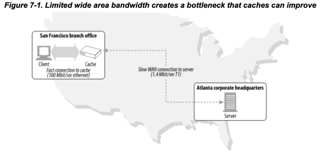

- LAN의 대역폭이 원 서버와의 대역폭보다 빠름
- LAN에 캐싱한다면 대역폭 속도 이슈 해결 가능

## 3. 갑작스런 요청 쇄도 (Flash Crowds)

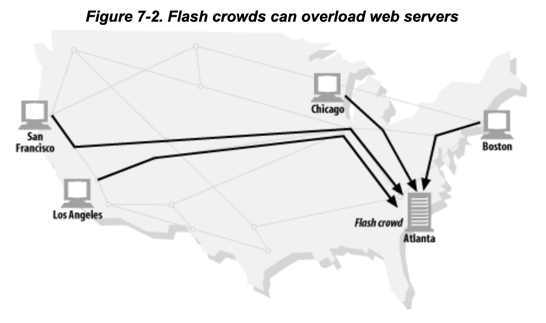

- 갑작스러운 이벤트 <sub>뉴스, 사건 등</sub> 발생 시 원 서버에 대한 요청이 급증
- 일례로, 1998년 9월 11일 클린턴 미대통령 문서가 공개된 미하원 웹서버가 1시간에 3백만건이 넘는 요청을 받음 <sub>평소의 50배</sub>

## 4. 거리로 인한 지연

- 거리가 멀수록 라우터에 의한 지연 발생
- 빛의 속도 자체도 유한하여 지연 유발
- e.g. 원 서버에 4개의 keep-alive 커넥션을 열고, 20개의 이미지 요청 시, 5배가 소요

## 5. 적중과 부적중

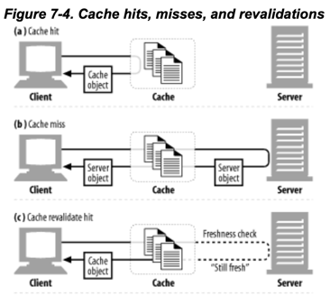

- 모든 문서를 캐싱하지는 않음 (비용 고려)
- 캐시 적중 <sup>cache hit</sup> : 캐시에 사본이 존재
- 캐시 부적중 <sup>cache miss</sup> : 캐시에 사본이 존재하지 않아 원 서버에 요청

### 5.1 재검사 (Revalidation)

- 신선도 검사라고도 함
- 캐시 데이터가 최신인지 원 서버를 통해 검사하는 것

#### 효과적인 재검사를 위한 특별한 요청

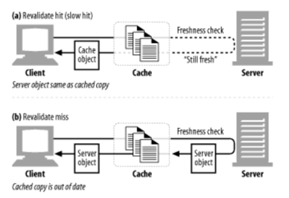

- 대역폭을 고려 대부분의 캐시는 사본을 검사할 필요가 있을정도로 오래된 경우에만 재검사 실시
- 신선도 검사 규칙 존재
- 재검사 적중 <sup>느린 적중, revalidate hit, slow hit</sup>
    - 재검사시 원 서버에 아주 작은 요청을 보냄
    - 서버는 변경되지 않았으면 304 Not Modified 응답
    - 캐시에 신선하다는 임시 표시한 뒤 클라이언트에게 응답
    - 원 서버와의 통신시간이 있어 순수 캐시 적중보다는 느림
    - 캐시 부적중보다는 빠름 <sub>원 서버로부터 객체 데이터를 안받아도 됨</sub>

#### If-Modified-Since 헤더

##### 예시

```
If-Modified-Since: <day-name>, <day> <month> <year> <hour>:<minute>:<second> GMT
```

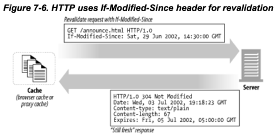

- 신선도 검사를 하기 위해 가장 많이 쓰이는 도구
- Get, Head 요청에 사용 가능
- 헤더 값 이후에 수정된 경우에는 객체를 반환하라는 의미
- 세가지 시나리오 존재
    - revalidate hit : 304 Not Modified, 데이터가 수정되지 않아서 캐시 사용 가능
    - revalidate miss : 200 OK, 데이터가 수정되어서 캐시 사용 불가, 객체 응답
    - Object deleted : 404 Not Found, 객체가 삭제되어서 캐시 사용 불가

### 5.2 적중률 <sup>Hit Rate</sup>

- 캐시가 처리하는 비율
- 캐시 적중률, 캐시 적중비라고도 함
- %로 표현
    - e.g. 캐시 적중률 0% : 모든 요청이 캐시 부적중

#### 적중률에 영향을 미치는 요소

- 캐시의 크기
- 캐시 사용자들의 관심사 비슷 정도
- 캐시된 데이터의 수정 빈도, 개인화 정도
- 캐시 설정 수준
- 40%면 괜찮은 수준

### 5.3 바이트 적중률 <sup>Byte Hit Rate</sup>

- 문서마다 크기가 다름
- 단순 적중률 보다 바이트 단위 적중률을 더 선호
    - 특히, 트래픽의 바이트에 대한 비용 청구를 고려하기 떄문
- e.g. 바이트 적중률 100% : 모든 바이트가 캐시로부터 제공됨

#### 문서 적중률 vs 바이트 적중률

- 문서 적중률
    - 웹 트랜잭션의 개수 측면에서 캐시 성능 측정
    - TCP hand shake 와 같이 고정된 시간이 트랜잭션 수에 영향 <sub>트랝개션 많음 -> 핸드셰이크 시간 많음</sub>
    - 문서 적중률 개선 시 전체 지연 시간이 줄어듦
- 바이트 적중률
    - 얼마나 많은 바이트가 원 서버에서 나가지 않았는지 측정
    - 대역폭 절약 최적화

### 5.4 적중과 부적중의 비율

- HTTP는 캐시 데이터인지, 원 서버 데이터인지 구분해주지 않음
    - 둘 다 200 OK 응답
- Date 헤더
    - 응답 메시지 생성 일시
    - 응답 생성일이 오래되었다면 캐시인 것으로 간주
- Age 헤더 : 프록시 캐시네에 머문 시간

## 6. 캐시 토폴로지 <sup>Topologies</sup>

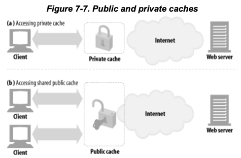

- private cache <sup>개인 전용 캐시</sup> : 하나의 클라이언트에게만 할당된 캐시
- public cache <sup>public proxy cache ,공용 캐시</sup> : 여러 클라이언트에게 할당된 캐시

### 6.1 개인 전용 캐시 <sup>Private Caches</sup>

- 많은 에너지, 저장공간 필요 없음
- 작고 저렴
- 웹 브라우저의 개인 전용 캐시
    - 자주쓰는 문서를 PC 디스크, 메모리에 캐시
    - 인터넷 브라우저 화면에서 캐시 확인 가능

### 6.2 공용 프록시 캐시 <sup>Public Proxy Caches</sup>

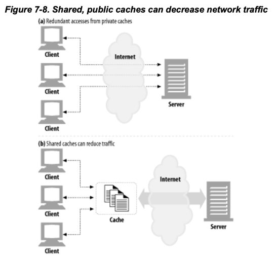

- 프락시 서버의 일종
- 자주 찾는 객체를 단 한번으 캐싱으로 전체 트래픽 감소
- 기본적인 프락시 설정에 따름
    - [수동 설정](../6장_프락시/README.md#41-클라이언트-프락시-설정--수동) : 브라우저가 프락시 캐시를 사용하게 함
    - 인터셉트 프락시 : 브라우저 설정 없이 HTTP 요청을 캐시로 통하도록 강제

### 6.3 프락시 캐시 계층들

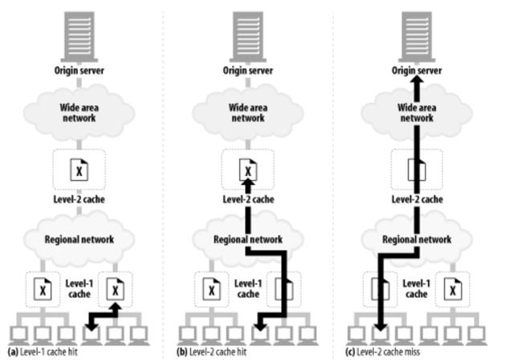

- 캐시 프락시를 계층형으로 구성
- 아래 단계에서 캐시 북적중이 발생하면 위 단계에서 캐시 적중을 발생시켜 트래픽 감소시킴
- 클라이언트 주위에는 작고 저렴한 캐시 배치
- 상단에는 다수의 사용자와 공유하는 캐시 배치

### 6.4 캐시망 <sup>Cache Meshes</sup>, 콘텐츠 라우팅, 피어링

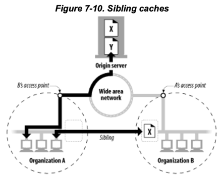

#### 캐시망

- 복잡한 방법으로 서로 대화
- 부모 캐시 대상 선택, 원 서버 요청 등을 동적으로 결정
- sibling caches <sup>형제 캐시</sup> : 선택적인 피어링을 지원하는 캐시
- 서로 다른 조직들이 그들의 캐시를 피어링 <sub>서로 캐시를 찾아보게 허용</sub>

#### 캐시망 안에서의 콘텐츠 라우팅

- URL에 근거하여, 부모 캐시와 원 서버 중 하나를 동적으로 선택
- URL에 근거하여 특정 부모 캐시 동적 선택
- 부모 캐시에 가기 전, 로컬 캐시에서 탐색
- 다른 캐시들이 캐시 컨텐츠에 부분적 접근을 허용하되, 캐시를 통한 internet transit 비허용

## 7. 캐시 처리 단계

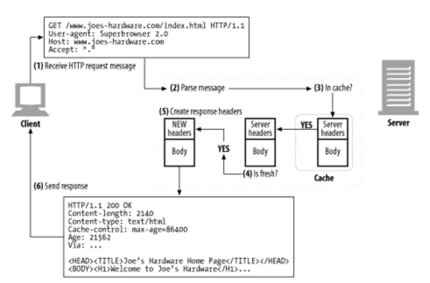

1. 요청 받기 : 캐시가 HTTP 요청 메시지 받음
2. 메시지 파싱 : 메시지를 파싱하여 URL과 헤더 추출
3. 검색 : 캐시가 로컬 복사본이 있는지 검사하고, 사본이 없다면 사본을 받아와 로컬에 저장
4. 신선도 검사 : 캐시된 복사본이 신선한지 검사, 변경 사항이 있는지 원 서버와 통신
5. 응답 생성 : 헤더와 캐시로 응답 메시지 생성
6. 발송 : 캐시가 클라이언트에게 응답
7. 로깅 : 선택적으로 트랜잭션 로깅

### 7.1 요청 받기 <sup>Receive HTTP request message</sup>

- 캐시가 네트워크 커넥션 감지
- 들어오는 HTTP 메시지 받음
- 고성능 캐시는 여러개의 커넥션 요청을 동시에 읽고 동시에 트랜잭션 처리

### 7.2 메시지 파싱 <sup>Parse message</sup>

- 요청 메시지를 여러부분으로 파싱하여 헤더부분을 조작하기 쉬운 자료구조에 담음
- 캐싱 소프트웨어를 이용

### 7.3 검색 <sup>In cache?</sup>

- URL을 추출, 캐시에 저장된 복사본이 있는지 검사
- 메모리, 디스크, 근처 다른 컴퓨터에 있을 수 있음
- 우너서버, 부모 프락시에서 가져오거나 실패 반환

### 7.4 신선도 검사 <sup>Is fresh?</sup>

- 신선하지 않다고 간주되면 원 서버에 변경사항을 검사
- 신선도 검사규칙은 매우 복잡

### 7.5 응답 생성 <sup>Create response headers</sup>

- 캐시가 응답 메시지를 생성
- 캐시가 원 서버로부터 받은 헤더를 기반으로 헤더 생성
- 클라이언트에 맞게 헤더 조정
- 캐시 신선도 정보 삽입 <sub>Expires, Cache-Control, Age</sub>
- Date는 원 서버의 생성일시, 절대 변경 말 것

### 7.6 전송 <sup>Send response</sup>

- 캐시가 클라이언트에게 응답 메시지를 전송

### 7.7 로깅

- 대부분의 캐시가 로그 파일과 캐시 사용에 대한 통계 유지
- 통계 정보 : 적중, 부적중 횟수 등

### 7.8 캐시 처리 플로 차트

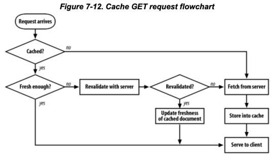

## 8. 사본을 신선하게 유지하기

HTTP는 캐시된 사본이 신선하게 유지될 수 있는 매커니즘을 가짐

### 8.1 문서 만료 <sup>expiration</sup>

```html
Expires: Thu, 01 Dec 1994 16:00:00 GMT
Cache-Control: max-age=3600
```

- 원서버가 응답 헤더에 명시
- 음식의 유통기한 같음
- `Cache-Control` 헤더 : 문서가 만료되는 시간을 명시
- `Expires` 헤더 : 문서가 만료되는 날짜를 명시
- 캐시가 만료되지 않았다면, 원 서버와 접촉 없이 캐시 사본 제공 가능
- 캐시가 만료되었다면, 원 서버와 접촉하여 변경사항이 있는지 확인하여, 새로운 유효긴과 함께 사본을 생성

### 8.2 유효기간과 나이

- `Expires` , `Cache-Control`, `Max-Age` 를 이용해 유효기간 명시

```html
<!--캐시가 최대 3600초의 수명을 가짐-->
Cache-Control: max-age=3600

<!--캐시는 다음 날짜까지 유효-->
Expires: Thu, 01 Dec 1994 16:00:00 GMT
```

### 8.3 서버 재검사 <sup>server revalidation</sup>

- 문서의 만료가 재검사 시점이 도래함을 의미
    - 원 서버와 캐시 사본이 다르다는 의미는 아님
- 서버 재검사 : 원 서버에게 문서의 변경여부를 물어볼 필요가 있음
- 재검사 결과 : 컨텐츠 변경됨
    - 새로운 캐시 사본을 만들어 저장한뒤 클라이언트에게 응답
- 재검사 결과 : 컨텐츠 변경되지 않음
    - 캐시 사본을 그대로 사용
    - 새본의 새 만료일을 포함한 헤더만 원 서버에서 가져와 갱신

#### HTTP가 캐시로부터 받을 수 있는 응답

- 신선한 캐시 사본
- 원 서버와 재검사한 신선하다고 검증된 사본
- 에러 메시지 <sub>원 서버의 다운 등으로 재검사 불가</sub>
- 경고메시지가 붙은 캐시 사본

### 8.4 조건부 메서드와의 재검사

```html
If-Modified-Since: Thu, 01 Dec 1994 16:00:00 GMT
If-None-Match: "xyzzy"
```

- 캐시가 서버에게 **조건부** GET 요청 가능
- 조건 : 캐시 사본이 우너서버의 문서와 다를 경우에만 객체 본문을 보낼 것
- `If-Modified-Since` 헤더 : 문서가 해당 날짜 이후로 수정되었다면 객체 본문을 보낼 것
- `If-None-Match` 헤더 : 문서가 해당 태그와 다르다면 객체 본문을 보낼 것

### 8.5 If-Modified-Since <sup>IMS 요청</sup> : 날짜 재검사

- 원 서버에게 리소스가 특정날짜 이후로 변경된 경우에만 본문을 보내라는 요청
- 문서가 날짜 이후에 변경되었다면,
    - 조건 만족, GET 요청 성공
    - 새로운 문서, 만료날짜 그 외 정보들의 헤더가 캐시에게 반환
- 문서가 변경되지 않았다면,
    - 조건 거짓, `304 Not Modified` 응답 반환
    - 응답 헤더에는 원래 돌려줄 정보 중 갱신된 정보만 포함
        - e.g. Content-Type헤더는 잘 안바뀌어서 그대로 반환

#### Last-Modified 헤더

- IMS 요청에 대한 응답에 Last-Modified 헤더 사용
- 원 서버가 제공하는 문서의 최근 수정 일시를 담음
- 몇몇 웹서버는 IMS 헤더를 단순 문자열 비교로함
    - e.g. 해당 날짜에 수정이 일어나지 않았다면, `304 Not Modified` 응답 반환

### 8.6 If-None-Match : 엔터티 태그 재검사

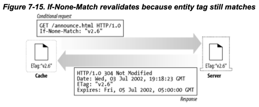

#### 변경 일시만으로 재검사가 어려운 경우

- 내용에 변화가 없더라도, 변경일시가 바뀌는 경우
- 변경이 있지만, 신선도에 영향을 주지 못할 정도인 경우
- 원 서버의 변경일시 판별 능력이 정확하지 못한 경우
- 1초보다 작은 간격으로 갱신되는 문서의 경우 변경일시 정밀도

#### 엔터티 태그 <sup>entity tag</sup> 이용

```html
<!--여러개 가능-->
If-None-Match: "v2.5"
If-None-Match: "v.26", "v.261", "v.27"
If-None-Match: "foo", "zoo", "lion"
```

- 문서가 변경되면 퍼블리셔는 엔터티 태그 수정
- 캐시는 사본을 얻을 때 `If-None-Match` 헤더 사용

### 8.7 약한 검사기와 강한 검사기

```html
<!--약한 검사기-->
ETag: W"v1.2"
If-None-Match: W"v1.2"
```

- 검사기 <sup>validator</sup> : 문서가 변경되었는지 확인하는 데 사용되는 것
    - e.g. 엔터티 태그, 최근 변경일시
- 약한 검사기 <sup>weak validator</sup> : 작은 수정은 허용하여 "그 정도면 같은 문서" 로 판단하는 것
- 강한 검사기 <sup>strong validator</sup> : 작은 수정도 허용하지 않고, "정말로 같은 문서" 로 판단하는 것
- 주의점 : 원 서버는 엔터티 태그값을 다른 엔터티들과 공유하지 말 것
    - 유효 기간에 상관 없이 캐시가 문서가 갱신되지 않고 있을 수 있음

### 8.8 언제 엔터티 태그를 사용하고 언제 Last-Modified 일시를 사용하는가

#### 클라이언트

- 서버가 엔터티 태그를 응답했으면, 클라이언트는 반드시 엔터티 태그를 사용해야 함
- 서버가 `Last-Modified` 값만을 응답했으면, 클라이언트는  `If-Modified-Since` 검사 가능
- 서버가 둘 다 응답했으면, 클라이언트는 둘 다 적절한 정책으로 사용 가능

#### 원 서버

- 가능하면 엔터티 태그 검사를 응답
- 이점이 있다면 약한 엔터티 검사를 보낼 수도 있음
- `Last-Modified` 값을 같이 보내는 것도 선호
- 엔터티 태그, `If-Modified-Since` 둘 다 받았다면 모든 조건에 참일 때만 `304 Not Modified` 응답

## 9. 캐시 제어

서버가 캐시 기간을 설정하는 방법

#### 우선순위

1. `Cache-Control : no-store`
2. `Cache-Control : no-cache`
3. `Cache-Control : must-revalidate`
4. `Cache-Control : max-age`
5. `Expires` 헤더
6. 아무런 정보를 주지 않고, 휴리스틱 방법으로 결정하게 함

### 9.1 no-cache와 no-store 헤더

````html
Cache-Control: no-cache
Cache-Control: no-store
Pragma: no-cache
````

- 검증되지 않은 캐시를 사용하지 않도록 함
- `no-store` : 캐시가 응답의 사본을 만드는 것을 금지
    - 캐시는 클라이언트에게 응답한 뒤 객체 삭제
- `no-cache` : 재검사 없이 캐시를 제공하지 마라
    - 로컬 캐시 저장소에 저장 가능
- `Pragma : no-cache` : HTTP/1.0 호환을 위해 사용

### 9.2 Max-Age 응답 헤더

````html
Cache-Control: max-age=3600
Cache-Control: s-maxage=3600
````

- 캐시가 신선하다고 판단할 최대 시간
- `s-maxage` : 공유 캐시에만 적용

### 9.3 Expires 응답 헤더

```html
Expires: Thu, 01 Dec 1994 16:00:00 GMT
```

- `Expires` : 캐시가 만료되는 일시를 명시
- 서버마다 시간이 다를 수 있어서 일시보다는 `max-age` 를 사용하는 것이 좋음

### 9.4 Must-Revalidate 응답 헤더

```html
Cache-Control: must-revalidate
```

- 캐시를 사용하기 이전에 반드시 재검사를 해야함
- 신선도 검사 시, 원서버가 사용할 수 없는 사태라면 캐시는 `504 Gateway Timeout` 응답

### 9.5 휴리스틱 만료 <sup>Heuristic Expiration</sup>

- `Expires` 헤더가 없거나, `Cache-Control` 헤더가 없는 경우
- 캐시는 스스로 휴리스틱한 방법으로 최대 나이 계산
- 어떠한 알고리즘에 의해 24시간이 지났다면, `Heuristic Expiration` 응답 헤더를 추가
- LM 인자 알고리즘
    - 캐시가 변경된 것이 상당히 예전이면 정적인 문서로 간주하여 더 오래 보관
    - 캐시가 최근에 변경되었다면, 자주 변경이 있는 문서로 간주하여 짧은 시간만 보관
- 일반적으로 휴리스틱 신선도 시간에 상한을 둠 (e.g. 1주일)
- 신선도 검사에 근단서가 없는 문서는 기본 신선도 유지기간을 설정 (e.g. 1시간)

### 9.6 클라이언트 신선도 제약

- 웹 브라우저는 신선하지 않은 컨텐츠를 강제로 갱신해주는 리프레시 기능을 가짐
- `Cache-Control` 요청 헤더를 Get 요청에 추가해서 강제로 재검사하거나 원서버로부터 가져옴

### 9.7 주의할 점

- 퍼블리셔가 유효기간을 까마득한 미래로 설정한다면 만료되기 전까지 어떠한 캐시도 갱신되지 않음
- 유효기간을 아예 설정하지 않아서 캐시가 알기 어렵게 하는 경우도 있음

## 10. 캐시 제어 설정

웹 서버 마다 캐시를 제어하기위한 헤더 설정 매커니즘이 다름  
각 웹 서버 레퍼런스를 참고할 것

### 10.1 아파치로 HTTP 헤더 제어하기

#### `mod_headers` 모듈

- `Header` 지시어를 사용해 HTTP 헤더를 설정
- 아파치 정규식과 필터를 조합 가능

```html

<Files *.html>
    Header set Cache-Control "max-age=3600"
</Files>
```

#### `mod_expires` 모듈

적절한 만료날짜가 담긴 `Expires` 헤더를 추가할 수 있는 프로그램 로직 제공

````
ExpiresDefault A3600
ExpiresByType "access plus 1 hour"
ExpiresByType text/html "modification 2 days 6 hours 12 minutes" 
````

#### `mode_cern_meta` 모듈

- 제어하고자 하는 파일에 각각 메타 파일을 생성해줌

### 10.2 HTTP-EQUIV를 통한 HTML 캐시 제어 <sub>HTML 2.0</sub>

- 웹 서버 설정 없이도 HTML 문서에 HTTP 헤더를 추가할 수 있음
- 대부분의 웹 서버, 프락시가 무시하는 설정
    - 캐시 동작에 혼란을 초래함

```html

<HTML>
<HEAD>
    <TITLE>HTML 문서</TITLE>
    <META HTTP-EQUIV="Cache-Control" CONTENT="no-cache">
</HTML>

``` 

- HTML이 아닌 다른 타입의 파일에 적용 불가능
- 서버의 부하 증가시킴
- 설정이 정적임

## 11. 자세한 알고리즘

캐시 서버에서 문서가 충분히 신선한지 판단하는 알고리즘

### 11.1 나이와 신선도 수명

````
$is_fresh_enough = ($age <  $freshness_lifetime) ;
````

- 신선도 판단의 2가지 기준
    - 나이
    - 신선도 수명
- 나이가 신선도 수명보다 작다면 **신선**

#### 나이 : 서버가 보낸 시점부터 지금까지 문서가 먹은 나이

- up-stream에서 온것인지, 서버가 보낸것인지 모름
- 따라서 `Age`, `Date` 헤더를 사용해 나이를 계산

#### 신선도 수명 : 아직 문서가 신선하다고 볼 수 있는 수명

- 문서의 유효기간과 신선도에 영향을 주는 클라이언트의 모든 요청 고려
    - `Cache-Control: max-state` 헤더 : 클라이언트가 약간 신선하지 않은 문서도 받겠다는 표시
    - `Cache-Control: min-fresh` 헤더 : 클라이언트가 조만간 신선하지 않을 문서도 받지 않겠다는 표시

### 11.2 나이 계산

- 응답의 나이 : 응답이 서버에서 생성된 이후 지금까지의 총 시간
    - 라우터에서 떠돌던 시간, 캐시에 머물던 시간 모두 포함

````
$apparent_age = max(0, $time_got_response - $Date_header_value) ;
$corrected_apparent_age = max($apparent_age, $Age_header_value) ;
$response_delay_estimate = ($time_got_response - $time_issued_request) ;
$age_when_document_arrived_at_our_cache = $corrected_apparent_age + $response_delay_estimate ; 
$how_long_copy_has_been_in_our_cache = $current_time - $time_got_response ;

$age = $age_when_document_arrived_at_our_cache + $how_long_copy_has_been_in_our_cache ;
````

- 나이 = 응답의 나이 + 로컬 캐시 나이
    - 로컬 캐시 나이는 계산이 매우 쉬움
    - 응답의 나이는 계산이 어려움
        - 어디서 왔는지 알 수 없고, 각 서버가 동기화된 시각을 갖지 않음

#### 겉보기 나이 : `Date` 헤더 기반

````
$apparent_age = $time_got_response - $Date_header_value ;
$age_when_document_arrived_at_our_cache = $apparent_age ;
````

- clock skew : 서버와 클라이언트의 시간이 다른 경우 발생하는 문제
    - 음수를 반환한 경우 즉시 0으로 만들어야 함

````
$apparent_age = max(0, $time_got_response - $Date_header_value) ;
$age_when_document_arrived_at_our_cache = $apparent_age ;
````

#### Hop-by-hop 나이 계산

- Http/1.1은 clock skew의 우회책
- 문서가 프락시나 캐시를 통과할때마다 `Age` 상대적인 나이를 더함
- `Age` 헤더값은 hop을 통과하면서 점점 늘어남

````
$apparent_age = max(0, $time_got_response - $Date_header_value) ;
$corrected_apparent_age = max($apparent_age, $Age_header_value) ;
$age_when_document_arrived_at_our_cache = $corrected_apparent_age ;
````

#### 네트워크 delay에 대한 보상

- `Date` 헤더는 언제 원 서버를 떠났는지를 알려줌, 문서가 얼마나 걸려 도착했는지는 모름
- 캐시 요청 시각과 도착 시각을 이용해 네트워크 dealy 시간을 보수적으로 알아냄

````
$appaernt_age = max(0, $time_got_response - $Date_header_value) ;
$corrected_apparent_age = max($apparent_age, $Age_header_value) ;
$response_delay_estimate = ($time_got_response - $time_issued_request) ;
$age_when_document_arrived_at_our_cache = $corrected_apparent_age + $response_delay_estimate ;
````

### 11.3 완전한 나이 계산 알고리즘

캐시에 대한 요청이 들어왔을 때 문서가 캐시에 머무른 시간도 계산해야함

````
$age = $age_when_document_arrived_at_our_cache + $how_long_copy_has_been_in_our_cache ;
````

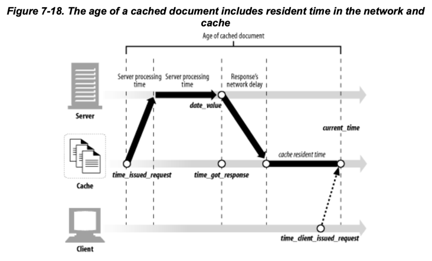

### 11.4 신선도 수명 계산

캐시의 나이 계산과 더불어 클라이언트의 제약조건에 따라 신선도를 계산해야함

- 신선도 수명은 클라이언트와 서버의 제약 조건에 의존
- 서버는 문서의 갱신 빈도를 알고 있음
- 클라이언트는 캐시 가이드라인을 가질 수 있음
    - 신선도보다 속도를 우선시하거나, 신선도를 우선시하거나

### 11.5 완전한 서버 신선도 알고리즘

- 서버 신선도 제약 계산 + 클라이언트 신선도 대조 계산
- 나이가 신선도 한계보다 작다면 문서는 신선하다

<details>   
    <summary>서버 신선도 제약 계산 </summary>

````
sub server_freshness_limit{
    local($heuristic, $server_fresh_ness_limit, $time_since_last_modify) ;
    $heuristic = 0 ;
    
    if($Max_Age_value_set){
        $server_freshness_limit = $Max_Age_value_set ;
    } elseif ($Expires_value_set){
        $server_freshness_limit = $Expires_value - $Date_value ;
    } elseif($Last_Modified_value_set){
        $time_since_last_modify = max(0, $Date_value - $Last_Modified_value) ;
        $server_freshness_limit = int($time_since_last_modify * $lm_factor) ;
        $heuristic = 1 ;
    } else {
        $server_freshness_limit = $Default_Freshness_Limit ;
        $heuristic = 1 ;
    }
    
    if($heuristic){
        if($server_freeshness_limt > $default_cache_max_lifetime){
            $server_freshness_limit = $default_cache_max_lifetime ;
        }
        if($server_freshness_limit < $default_cache_min_lifetime){
            $server_freshness_limit = $default_cache_min_lifetime ;
        }
    }
    return $server_freshness_limit ;
}
````

</details>

<details>   
    <summary>클라이언트 신선도 대조 계산</summary>

````
sub client_modified_freshness_limit{
    
    $age_limit = server_freshness_limit() ;
    
    if($Max_Stale_value_set){
        if($Max_stale_value == $INT_MAX){
            $age_limit = $INT_MAX ;
        } else {
            $age_limit = server_freshness_limit() + $Max_Stale_value ;
        }
    }
    
    if($Min_Fresh_value_set){
        $age_limit = min($age_limit, server_freshness_limit() - $Min_Fresh_value_set) ;
    }
    
    if($Max_Age_value_set){
        $age_limit = min($age_limit, $Max_Age_value_set) ;
    }
}
````

</details>