# 8장. 통합점 : 게이트웨이, 터널, 릴레이

1. 게이트웨이
2. 프로토콜 게이트웨이
3. 리소스 게이트웨이
4. 애플리케이션 인터페이스와 웹 서비스
5. 터널
6. 릴레이
7. 추가정보

---

- HTTP로 여러 종류의 리소스 접근하기
- 다른 프로토콜, 애플리케이션과 HTTP로 통신하기
- 게이트 웨이 : 서로 다른 프로토콜, 애플리케이션 간의 HTTP 인터페이스
- 애플리케이션 인터페이스 : 서로 다른 웹 애플리케이션 간의 통신하는데 사용
- 터널 : HTTP 커넥션으로 HTTP가 아닌 트래픽 전송
- 릴레이 : 단순한 HTTP 프락시, 한번에 한개의 Hop에 데이터 전달

## 1. 게이트웨이

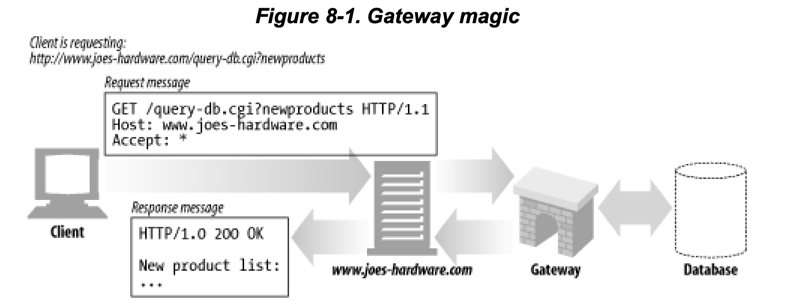

- 모든 리소스를 하나의 애플리케이션으로 처리가 힘들어짐
- 게이트웨이 : 리소스를 받아 다른 서버로 라우팅해주는 역할
    - 리소스와 애플리케이션의 연결
- HTTP는 게이트웨이에 리소스 처리 요청
- 게이트웨이는 요청을 받아 응답을 보냄
    - 으답 : 동적인 컨텐츠, 데이터 베이스 질의 등

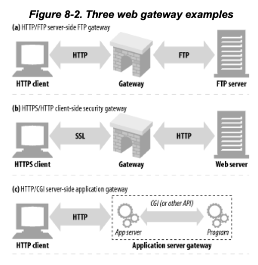

- HTTP 요청에 대해 FTP 프로토콜을 사용하는 게이트웨이
- SSL(HTTPS) 요청에 대해 HTTP를 사용하는 게이트웨이
    - 보안 가속기 역할
    - 웹서버 바로 앞단에 위치
- 애플리케이션 서버 게이트웨이
    - HTTP 요청을 받아 애플리케이션 서버로 연결
    - e.g. 커머스 애플리케이션, 주식 거래 애플리케이션 등

### 1.1 클라이언트 측 게이트웨이와 서버 측 게이트웨이

````
<클라이언트 프로토콜>/<서버 프로토콜>

# 예시 (HTTP 클라이언트, FTP 서버)
HTTP/FTP
````

- server-side gateway `HTTP/*` : 클라이언트와 HTTP 통신, 서버와 외래 프로토콜 통신
    - HTTP로 들어오는 트래픽을 다른 프로토콜로 변환
- client-side gateway `*/HTTP` : 클라이언트와 외래 프로토콜 통신, 서버와 HTTP 통신
    - 외래 프로토콜로 들어오는 트래픽을 HTTP로 변환

## 2. 프로토콜 게이트웨이

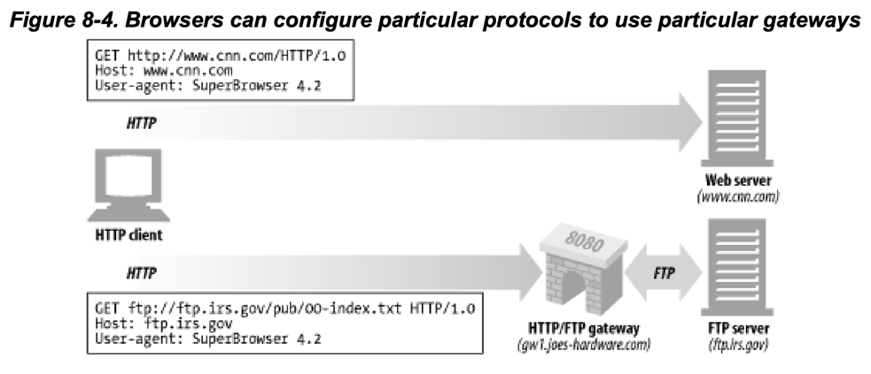

1. 브라우저는 `gw1.joes-hardware.com`에 HTTP 요청
2. `gw1.joes-hardware.com`은 HTTP 요청을 받아 `ftp.irs.gov`에 FTP 요청
3. `ftp.irs.gov`은 FTP 요청을 받아 `gw1.joes-hardware.com`에 FTP 응답
4. `gw1.joes-hardware.com`은 FTP 응답을 받아 HTTP 응답
5. 브라우저는 HTTP 응답을 받아 화면에 표시

### 2.1 HTTP/*: 서버 측 게이트웨이

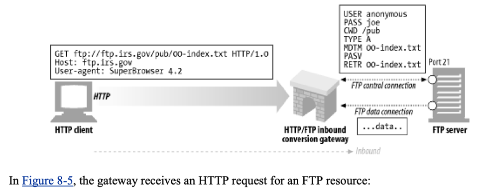

- `USER`, `PASS` 명령어를 사용해 FTP 서버에 로그인
- `CWD` 명령어를 사용해 디렉토리 변경
- 다운로드 형식을 ASCII로 설정
- `MDTM` 명령어를 사용해 파일의 최종 수정 시간을 확인
- `PASV` 명령어로 수동모드 진입
- `RETR` 명령어로 파일 요청
- FTP 커넥션이 맺어지면 게이트웨이로 FTP 응답을 보냄

### 2.2 HTTP/HTTPS: 서버 측 보안 게이트웨이

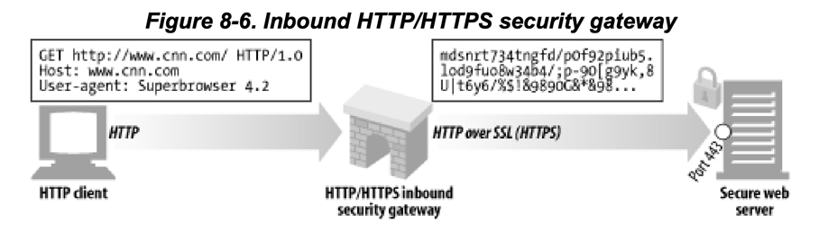

- 기업 내부로 들어오는 모든 웹 요청을 암호화
- 사용자는 HTTP로 탐요청하지만, 게이트웨이가 자도응로 모든 세션 암호화

### 2.3 HTTPS/HTTP: 클라이언트 측 보안 가속 게이트웨이

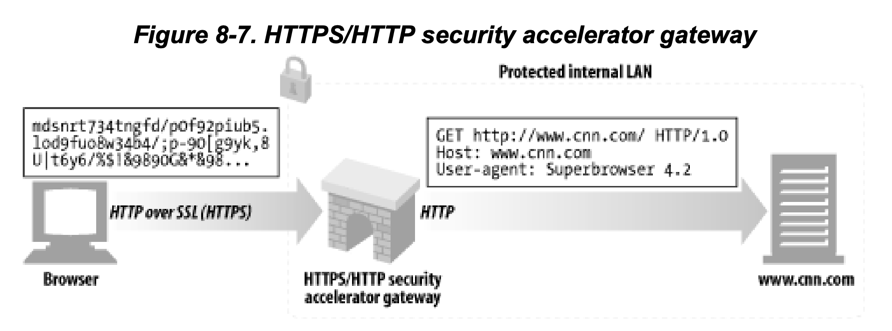

- 웹서버 앞 단에 위치해 인터셉트 게이트웨이, 리버스 프락시 역할
- HTTPS 트래픽을 받아 복호화하여 웹서버에 HTTP 요청
- 장점 : 암/복호화를 게이트웨이 하드웨어에서 처리 -> 원 서버 부하 감소
- 단점 : 네트워크 보안 안정성 검증 필요

## 3. 리소스 게이트웨이

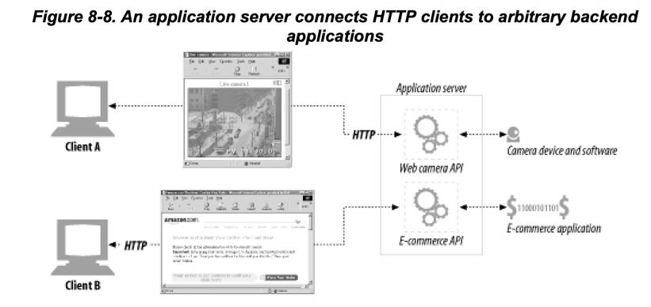

- 리소스 게이트웨이 : web server가 application과 통신할 때 사용
- application server = destination server + gateway 를 하나의 서버에 통합
    - 클라이언트와 HTTP 통신
    - 서버측의 다른 backend application과 통신
    - API (Application Programming Interface) 제공
- CGI (Common Gateway Interface) : application gateway의 최초 API

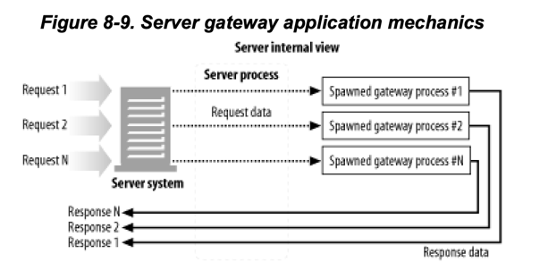

### 3.1 공용 게이트웨이 인터페이스 (CGI)

- 웹 서버가 사용하는 표준 인터페이스 집합
- 특정 URL의 HTTP 요청에 따라 프로그램 실행
- 최초의 서버 확장이자 지금도 가장 널리쓰이는 확장방법
- 동적인 HTML, 신용카드 처리, DB query 등 실행
- 단점 : 성능 문제
    - 모든 CGI 요청마다 프로세스 생성
- Fast CGI : CGI와 유사하지만 데몬으로 동작하여 프로세스 생성, 제거

### 3.2 서버 확장 API

- HTTP 서버 자체의 성능이나 동작을 바꾸고 싶을 때 사용
- Apache는 API를 제공하여 개발자가 웹 서버의 동작을 바꿀 수 있게 해줌

## 4. 애플리케이션 인터페이스와 웹 서비스

- 웹 서비스 : 어플리케이션이 정보를 공유하는데 사용하는 메커니즘
    - HTTP 같은 표준 웹 기술 위에서 개발, 동작
- 더 복잡한 정보를 서로 교환하기에 HTTP header로는 제한적
- SOAP을 통해 XML 메시지를 주고받음
    - SOAP (Simple Object Access Protocol) : HTTP 메시지에 XML을 실어 보내는 방식의 표준

## 5. 터널

- 웹 터널 : HTTP 프로토콜을 지원하지 않는 애플리케이션에 HTTP 애플리케이션으로 접근할 수 있게 해줌
- 목적 : HTTP 커넥션에서 HTTP가 아닌 트래픽을 전달하기 위함

### 5.1 CONNECT로 HTTP 터널 커넥션 맺기

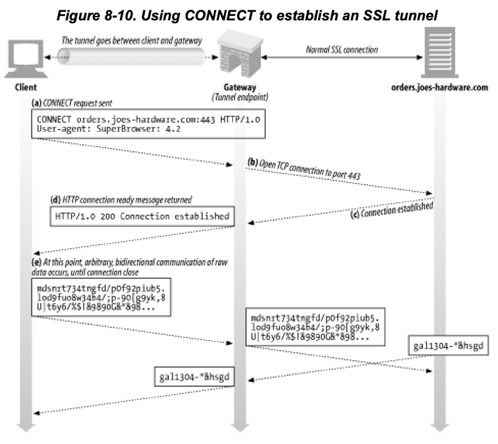

- HTTP CONNECT 메서드로 터널 커넥션 맺음
- 터널 게이트웨이가 임의 의 목적 서버+포트와 TCP 커넥션을 맺고 클라이언트와 서버 간의 데이터를 무조건 전달

#### CONNECT 요청

````
CONNECT home.netscape.com:443 HTTP/1.0
User-agent: Mozilla/4.0
````

#### CONNECT 응답

````
HTTP/1.0 200 Connection established
Proxy-agent: Netscape-Proxy/1.1
````

- 클라이언트는 게이트웨이의 응답을 기다림
- `Content-Type` 헤더가 없음

### 5.2 데이터 터널링, 시간, 커넥션 관리

- 터널로 전달되는 데이터는 게이트웨이에서 확인 불가
- 클라이언트는 전송 속도를 높이기 위해 CONNECT 요청에 대한 응답 없이 데이터를 바로 전송할 수 있음
- 터널의 끝단 어느부부인든 커넥션이 끊어지면 끊어진 곳으로부터 전송된 데이터는 반대편으로 전달됨

### 5.3 SSL 터널링


- 웹 터널은 원래 방화벽을 통해 암호화된 SSL 트래픽 전송을 위해 개발됨
- HTTP가 아닌 트래픽이 특정 포트만 통과하게하는 방화벽을 통과하게 해줌
    - e.g. HTTP 커넥션에 HTTP가 아닌 메시지를 담아 80포트로 전송
- 즉, HTTP 메시지 안에 암호화된 raw 데이터를 담아서 전송

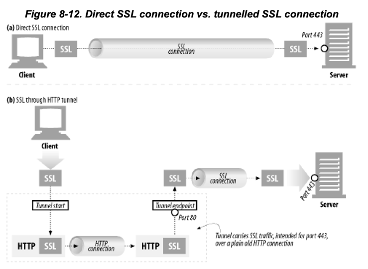

- 단점 : 악의적인 트래픽이 통과할 수 있음

### 5.4 SSL 터널링 vs HTTP/HTTPS 게이트웨이

- HTTP/HTTPS 게이트웨이 : HTTP 트래픽을 HTTPS로 변환
    - 단점 1 : 클라이언트-게이트웨이 간의 보안이 취약한 HTTP 커넥션이 맺어짐
    - 단점 2 : 프락시가 인증을 담당하기 떄문에, X509 인증서를 사용할 수 없음
    - 단점 2 : 게이트웨이가 SSL을 완벽히 지원해야함
- SSL 터널링 : 프락시에 SSL을 구현할 필요 없음
    - 장점 1 : 클라이언트부터 목적지 서버까지 모두 암호화된 커넥션을 맺음

### 5.5 터널 인증

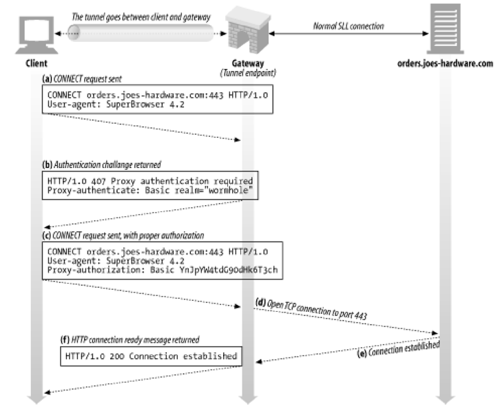

- a. CONNECT 요청
- b. 게이트웨이가 인증 요구 응답
- c. 클라이언트가 인증 정보를 담아 CONNECT 요청
- d. 게이트웨이가 인증 정보 검증 -> 443 포트로 TCP 커넥션 맺음
- e. 원서버가 TCP 커넥션 결과를 게이트웨이에 응답
- f. 게이트웨이가 클라이언트에 TCP 커넥션 결과를 응답 `200 Connection established`

### 5.6 터널 보안에 대한 고려사항들

- 어떤 직원이 회사 방화벽에 터널을 생성해서 게임 트래픽을 유입시킨다면?
- 악의적인 사용자가 회세에 텔넷 세션을 열어 터널로 이메일 차단 장치를 우회한다면?
- 터널 오용을 최소화하자 : 게이트웨이는 HTTPs 전용 포트 443만 터널링을 허용하도록 설정

## 6. 릴레이

## 7. 추가정보

