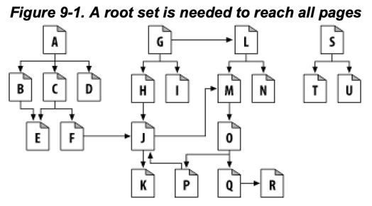
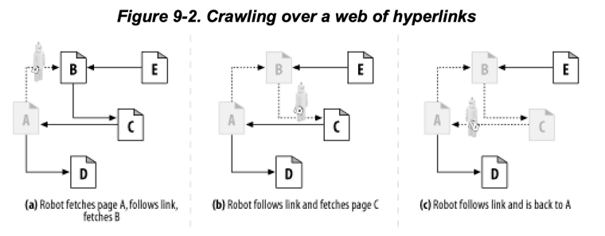
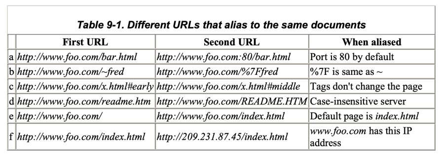
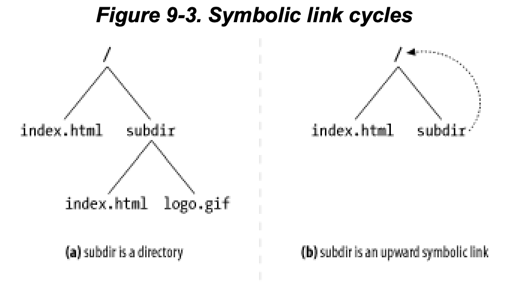
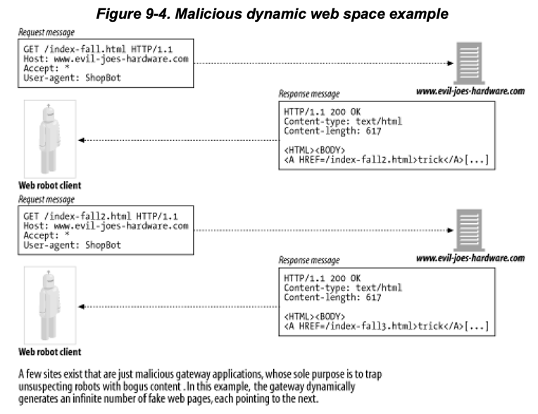

# 9장 웹 로봇

1. 크롤러와 크롤링
2. 로봇의 HTTP
3. 부적절하게 동작하는 로봇들
4. 로봇 차단하기
5. 로봇 에티켓
6. 검색엔진

---

### 웹 로봇?

- 사람과의 상호작용 없이 연속된 웹 트랜잭션을 자동으로 수행하는 소프트웨어 프로그램
- 웹 로봇은 웹사이트를 떠돌아다니며 콘텐츠를 가져오고, 하이퍼링크를 따라가고, 발견한 데이터를 처리
- 방식에 따라 크롤러, 스파이더, 웜, 악성 로봇 등으로 불림

### 웹 로봇 예시

- 주식시장 서버에 분마다 HTTP GET 요청에 대한 응답을 기준으로 그래프 작성
- WWW 웹 규모, 진화에 대한 통계 정보를 수집하는 조사 로봇 (페이지 개수, 크기, 언어, 미디어 타입 등)
- 검색엔진 로봇 : 검색 데이터베이스를 만들기 위해 문서를 수집
- 가격비교 로봇 : 상품에 대한 가격 데이터베이스를 만들기 위해 쇼핑몰 카탈로그의 웹페이지를 수집

## 1. 크롤러와 크롤링

- 웹 크롤러 (web crawler) : 웹페이지에 대한 모든 하이퍼링크를 방문해가며 재귀적으로 웹페이지를 탐색하는 로봇
    - 크롤러, 스파이더라고 불림
- e.g. 검색엔진은 웹 크롤러를 사용해 모든 문서를 끌어옴
    - 그 이후 검색 데이터베이스 구축 -> 사용자는 특정 단어를 포함한 문서 검색 가능

### 1.1 어디에서 시작하는가: '루트 집합' (Root Set)

- 루트 집합 : 크롤러가 방문을 시작하는 URL 초기 집합
- 루트집합에서 시작해 모든 문서를 수집해야함
- 위 그림에서는 루트 집합에 `A`, `G`, `S` 면 충분함

### 1.2 링크 추출과 상대 링크 정상화

- 웹을 돌아다니며 꾸준히 HTML 문서 검색 -> 그 안의 URL 링크를 파싱해 크롤링 대상에 추가
- 새링크를 발견할수록 목록이 기하급수적으로 늘어남
- 따라서 상대링크를 절대링크로 변환하여 크롤링 대상에 추가해야함
    - 상대링크 : 현재 문서를 기준으로 한 링크
    - 절대링크 : 문서의 위치와 상관없이 항상 같은 링크

### 1.3 순환 피하기

- a. 로봇은 `A`를 방문하고 `B` 를 크롤링 대상에 추가
- b. 로봇은 `B`를 방문하고 `C` 를 크롤링 대상에 추가
- c. 로봇은 `C`를 방문하고 `A` 를 크롤링 대상에 추가
- `A` -> `B` -> `C` -> `A` 순환 발생
- 로봇들은 자기가 어딜 방문했었는지 반드시 알아야함

### 1.4 루프와 중복 (dups)

- 루프(loop)는 크롤러가 루프에 빠져 무한정으로 같은 문서를 방문하게함
    - 크롤러가 대역폭을 다 차지하고, 추가적인 페이지를 수집할 수 없음
- 웹 서버 성능 저하: 크롤러가 반복적으로 같은 문서를 요청하면 웹 서버는 반복적으로 같은 문서를 전송해야함
- 중복 문서 : 크롤러가 이미 방문한 문서
    - 크롤러 애플리케이션에는 중복 문서로 가득참
    - e.g. 검색엔진에 검색하면 똑같은 문서가 여러개 나옴

### 1.5 빵 부스러기의 흔적

- 방문 이력을 유지하기 위한 복잡한 자료구조가 필요
- 크롤러가 방문한 모든 문서를 기록하는 것은 불가능
    - 웹은 너무 커서
    - 크롤러가 방문한 모든 문서를 기록하면 메모리가 부족해짐
- 크롤러가 빠르게 방문 여부를 검색할 수 있는 검색트리, 해시 테이블이 필요

#### 트리와 해시 테이블

- URL 방문 이력을 검색트리나 해시테이블로 유지
- URL을 훨씬 빨리 검색할 수 있음

### 느슨한 존재 비트맵

- 존재 비트 배열 (presence bit array) 와 같은 느슨한 자료구조
- URL을 크롤링하면, URL 별로 해시 함수를 사용해 고정된 크기의 비트 배열을 만들고 존재 비트 생성
- 존재 비트가 이미 존재하면, 해당 URL은 이미 방문한 것으로 간주

### 체크포인트

- 크롤러가 중단 (shutdown)되면, 다시 시작할 때 중복 문서를 방문하지 않도록 체크포인트를 사용
- 디스크에 저장

### 파티셔닝

- 크롤러가 웹을 돌아다니며 수집하는 문서의 수가 너무 커져 하나의 컴퓨터로는 불가능
- farm : 한대의 컴퓨터(크롤러) 가 동시에 일함
    - 각 로봇들은 특정 URL 부분에 할당되어 책임을 지고 크롤링

### 1.6 별칭 (alias)와 로봇 순환

- 별칭 : 같은 문서를 가리키는 여러 URL
- 별칭이 달라도 동일한 문서를 가리키는 경우가 있음

### 1.7 URL 정규화하기 (Canonicalizing)

- 정규화하여 별칭이 동일한 URL을 가리키고있으면 제거
- 방법 1. 포트 번호가 명시되어있지 않다면 <host>:80으로 정규화
- 방법 2. 모든 %xx 이스케이핑 문자열을 변환
- 방법 3. # 태그 제거

### 1.8 파일 시스템 링크 순환

- 심벌링 링크 (symbolic link) : 파일 시스템의 파일을 가리키는 특별한 파일
- 위 두 그림은 모두 `/index.html` 문서에서 `subdir/index.html` 로 가는 링크가 있음
- 심벌릭 링크는 웹 크롤러가 루프에 빠지게 만듬
    - `GET /index.html` -> `GET /subdir/index.html` -> `GET /subdir/index.html` -> ...

### 1.9 동적 가상 웹 공간

- 동적 가상 웹 공간 (dynamic virtual web space) : 웹 서버가 URL을 생성하는 방법
- e.g. 게이트웨이 애플리케이션이 가상의 URL이 포함된 문서를 즉석에서 만들어냄
- URL과 HTML이 매번 달라 순환인지 알 수 없음

### 1.10 루프와 중복 피하기

- 완벽한 방법은 없음, 아래와 같이 휴리스틱한 방법을 조합해 사용
- 일반적으로 크롤러가 자율적일수록 루프에 빠짐 (trade-off)

#### URL 정규화

- URL을 표준 형태로 변환하여 같은 리소스에 대한 중복 URL 식별

### 너비 우선 크롤링

- 크롤링 대상의 큰 URL 집합을 가짐
- URL들을 너비우선으로 스케쥴링하여 탐색

#### 스로틀링

- 로봇이 웹 사이트에서 일정 시간동안 크롤링할 페이지 숫자를 제한

#### URL 크기 제한

- 로봇이 일정 길이 (보통 1KB)를 초과하는 URL 크롤링 거부
- 순환으로 URL이 길어지고 있다면 순환 중단됨

#### URL/사이트 블랙리스트

- 순환이나 함정을 만드는 사이트나 URL 목록을 블랙리스트에 추가
- 대부분의 대규모 크롤러들은 다양한 형태의 블랙리스트를 사용

#### 패턴 발견

- URL을 분석해 순환을 발견하는 패턴을 찾음
- e.g. `/subdir/index.html/subdir/index.html/subdir/index.html/...`

#### 콘텐츠 지문 (fingerprint)

- 컨텐츠 전체에 대한 몇 byte 기반으로 checksum을 계산
    - checksum : 페이지에 대한 간략한 표현, 지문
- 두 문서가 서로 달라도 같은 지문을 가질 수 있음
- 방해요소 : 동적인 컨텐츠 (날짜 등)

#### 사람의 모니터링

- 로봇은 결국 자기가 해결하지 못할 문제에 봉착하게됨
- 모니터링하여 특이한 일이일어나면 즉각 인지 후 진단, 조치하도록 설계되어야함

## 2. 로봇의 HTTP

## 3. 부적절하게 동작하는 로봇들

## 4. 로봇 차단하기

## 5. 로봇 에티켓

## 6. 검색엔진