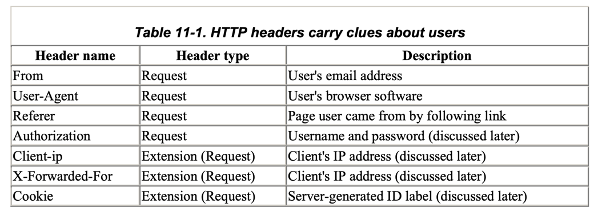

# 11장 클라이언트 식별과 쿠기

1. 개별 접촉
2. HTTP 헤더
3. 클라이언트 IP 주소
4. 사용자 로그인
5. 뚱뚱한 URL
6. 쿠키
7. 추가 정보

---

- 웹 서버는 서로 다른 수천개의 클라이언트들과 동시에 통신
- 서버와 통신하는 클라이언트를 추적할 필요
- 서버가 통신하는 대상을 식별하는데 사용하는 기술

## 1. 개별 접촉

- HTTP는 익명, 무상태 프로토콜
- 서버는 클라이언트가 요청을 처리하고 나서 응답을 클라이언트에게 전송
- 웹 서버는 사용자를 식별하기 위해 약간의 정보를 이용
- 현대 웹 사이트는 사용자에 대해 더 많은 것을 알고싶어 함
    - e.g. 아마존에서 사용자 개인화

#### 개별 인사

- 개인화를 위해 사용자 트고하된 환영 메시지, 페이지 내용

#### 사용자 맞춤 추천

- 온라인 상점에서 고객의 흥미에 따른 제품 추천
- 기념일 등에 제품 추천

#### 저장된 사용자 정보

- 고객이 사전에 저장한 정보 (복잡한 주소, 신용카드 정보)
- 사전 정보를 데이터베이스에 저장하여 사용자 식별 후 사용

#### 세션 추적

- HTTP 트랜잭션은 무상태
- HTTP 트랜잭션으로 사용자 정보를 식별항 방법 필요

## 2. HTTP 헤더

- `From` : 사용자의 이메일 주소
    - 이상적으로 각 사용자는 서로 다른 이메일 주소를 가짐
    - 악의적으로 이메일주소를 모아서 스팸 발송 가능
- `User-Agent` : 사용자가 사용 중인 브라우저 이름, 버전 정보, OS(어떤 경우에는)
    - 특정 브라우저에 최적화 컨텐츠 제공시 유용
- `Referer` : 사용자가 현재 페이지로 유입하게 된 웹 페이지 URL
    - 사용자가 이전에 방문한 페이지 식별

## 3. 클라이언트 IP 주소

- 초기 웹 개발자들이 사용하던 방식
- HTTP 헤더에는 IP 주소가 없지만, TCP 커넥션의 IP 주소를 알 수 있음
    - 유닉스 시스템의 `getpeername` 함수를 사용하여 알 수 있음

#### 단점

- 클라이언트를 사용자 컴퓨터로 식별
    - 1 PC에 여러 사용자가 사용하는 경우 제한적
- ISP는 사용자가 로그인하면 대부분 IP를 동적 할당
- 사용자는 NAT (Network Address Translation) 방화벽을 통해 인터넷 사용
    - 실제 IP 주소를 숨기고, 하나의 방화벽 IP 주소로 변환
- 프락시나 게이트웨이 사용 시 원서버에 새로운 TCP 커넥션이 생김
    - 클라이언트 IP 대신 프락시 IP 주소가 나타남

## 4. 사용자 로그인

## 5. 뚱뚱한 URL

## 6. 쿠키

## 7. 추가 정보