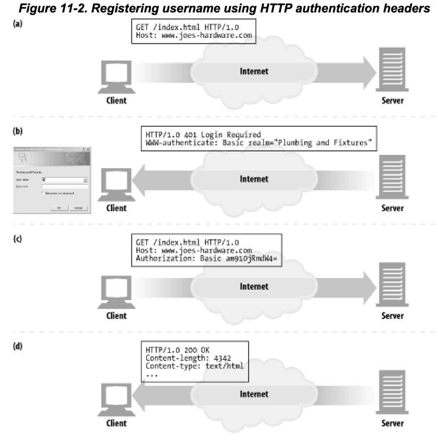
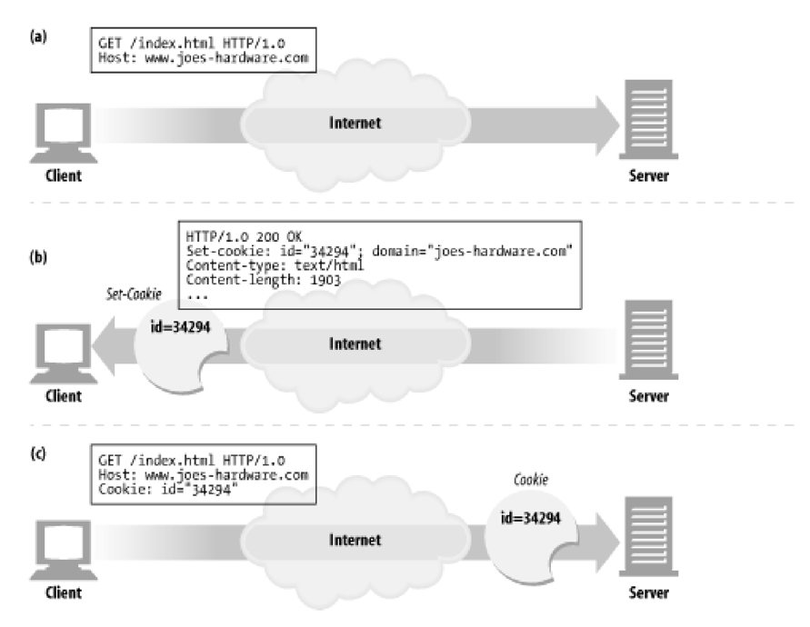
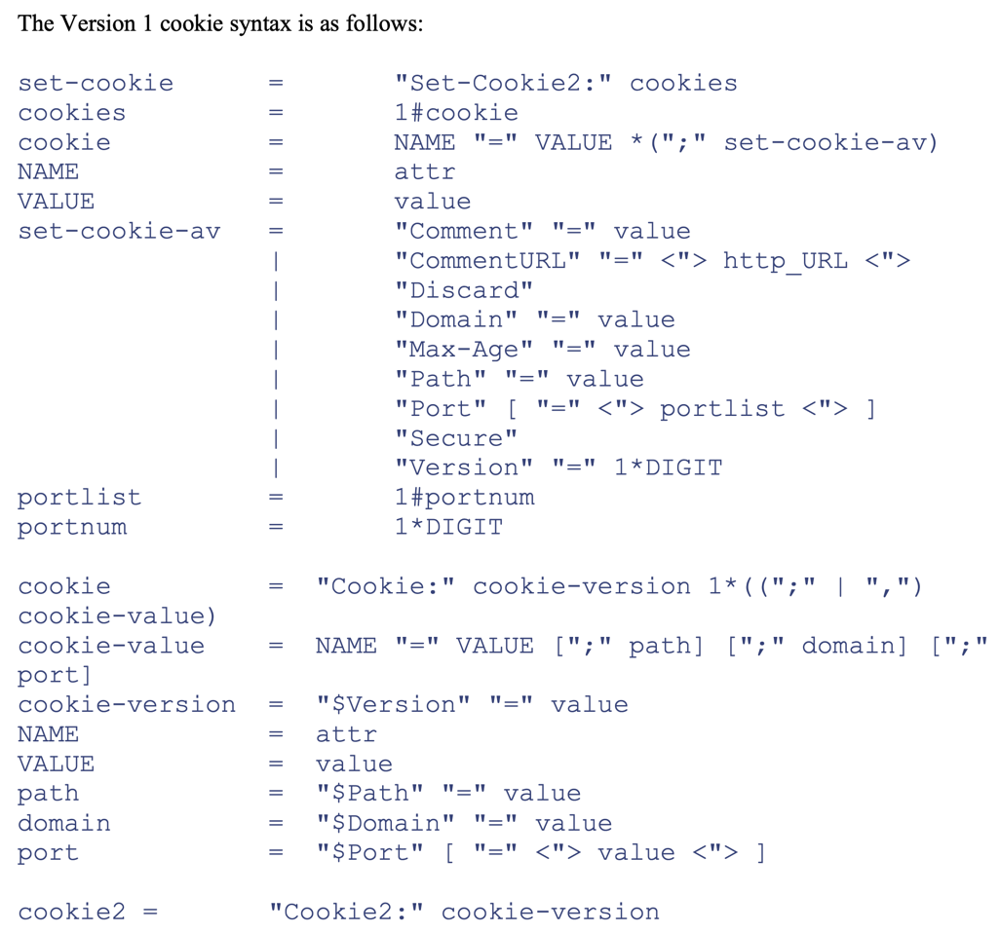
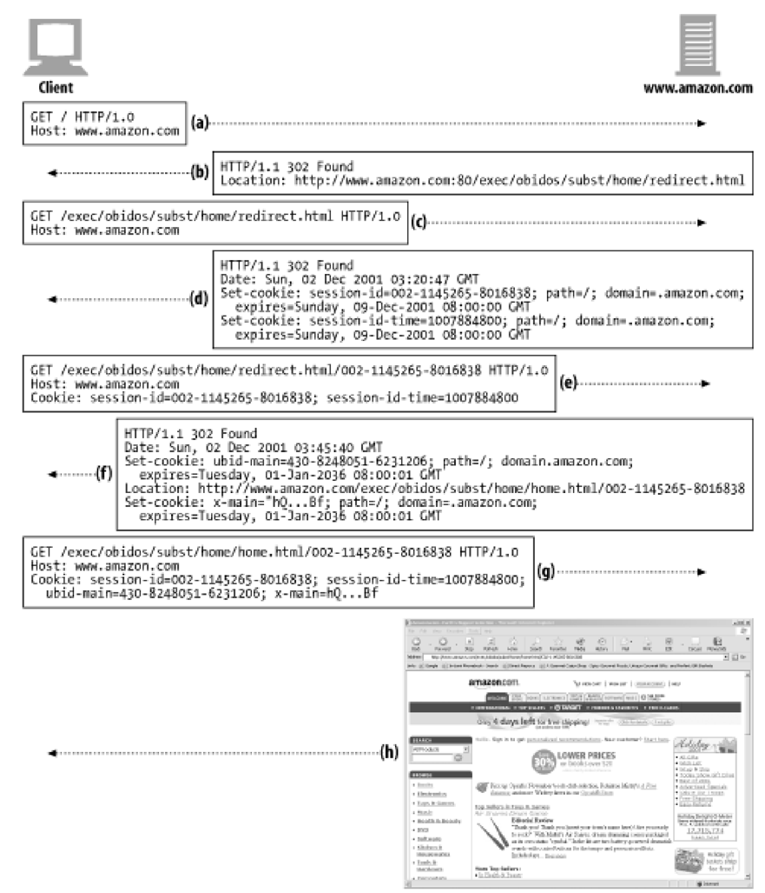

# 11장 클라이언트 식별과 쿠기

1. 개별 접촉
2. HTTP 헤더
3. 클라이언트 IP 주소
4. 사용자 로그인
5. 뚱뚱한 URL
6. 쿠키
7. 추가 정보

---

- 웹 서버는 서로 다른 수천개의 클라이언트들과 동시에 통신
- 서버와 통신하는 클라이언트를 추적할 필요
- 서버가 통신하는 대상을 식별하는데 사용하는 기술

## 1. 개별 접촉

- HTTP는 익명, 무상태 프로토콜
- 서버는 클라이언트가 요청을 처리하고 나서 응답을 클라이언트에게 전송
- 웹 서버는 사용자를 식별하기 위해 약간의 정보를 이용
- 현대 웹 사이트는 사용자에 대해 더 많은 것을 알고싶어 함
    - e.g. 아마존에서 사용자 개인화

#### 개별 인사

- 개인화를 위해 사용자 트고하된 환영 메시지, 페이지 내용

#### 사용자 맞춤 추천

- 온라인 상점에서 고객의 흥미에 따른 제품 추천
- 기념일 등에 제품 추천

#### 저장된 사용자 정보

- 고객이 사전에 저장한 정보 (복잡한 주소, 신용카드 정보)
- 사전 정보를 데이터베이스에 저장하여 사용자 식별 후 사용

#### 세션 추적

- HTTP 트랜잭션은 무상태
- HTTP 트랜잭션으로 사용자 정보를 식별항 방법 필요

## 2. HTTP 헤더


- `From` : 사용자의 이메일 주소
    - 이상적으로 각 사용자는 서로 다른 이메일 주소를 가짐
    - 악의적으로 이메일주소를 모아서 스팸 발송 가능
- `User-Agent` : 사용자가 사용 중인 브라우저 이름, 버전 정보, OS(어떤 경우에는)
    - 특정 브라우저에 최적화 컨텐츠 제공시 유용
- `Referer` : 사용자가 현재 페이지로 유입하게 된 웹 페이지 URL
    - 사용자가 이전에 방문한 페이지 식별

## 3. 클라이언트 IP 주소

- 초기 웹 개발자들이 사용하던 방식
- HTTP 헤더에는 IP 주소가 없지만, TCP 커넥션의 IP 주소를 알 수 있음
    - 유닉스 시스템의 `getpeername` 함수를 사용하여 알 수 있음

#### 단점

- 클라이언트를 사용자 컴퓨터로 식별
    - 1 PC에 여러 사용자가 사용하는 경우 제한적
- ISP는 사용자가 로그인하면 대부분 IP를 동적 할당
- 사용자는 NAT (Network Address Translation) 방화벽을 통해 인터넷 사용
    - 실제 IP 주소를 숨기고, 하나의 방화벽 IP 주소로 변환
- 프락시나 게이트웨이 사용 시 원서버에 새로운 TCP 커넥션이 생김
    - 클라이언트 IP 대신 프락시 IP 주소가 나타남

## 4. 사용자 로그인

- 사용자 이름, 비밀번호로 인증 (로그인)
- 로그인 적븐 시 HTTP 401 Login Required 응답
- 브라우저는 로그인하고, 다음 요청부터 `Authorization` 헤더에 사용자 이름과 비밀번호를 담아서 전송
- 한계
    - 사용자는 웹 사이트마다 로그인을 해야함
    - 사용자는 웹 사이트마다 로그인 정보를 기억해야함



## 5. 뚱뚱한 URL (Fat URLs)

- URL 마다 버전을 기술하여 사용자를 식별, 추적
- 사용자가 웹 사이트를 돌아다니면, 웹 서버는 URL에 있는 상태정보를 유지하는 동적 하이퍼링크 생성
- 뚱뚱한 URL : 사용자의 상태정보를 포함한 URL

#### 단점

- 못생긴 URL : 사용자에게 가독성이 떨어지는 URL 제공
- 공유하지 못하는 URL : 주소를 다른 사람과 공유하면 다른 사람은 사용자의 상태정보를 알 수 있음
- 캐시 사용 불가 : URL이 달라지기 떄문
- 서버 부하 : 뚱뚱한 URL을 포함하는 HTML 페이지 동적 생성
- 이탈 : 사용자가 URL을 이탈하면 처음부터 다시해야함 (e.g. 장바구니 정보가 담긴 URL 초기화)
- 세션 간 지속성 부재 : URL을 북마킹 하지 않으면 상태정보 사라짐

## 6. 쿠키

- 사용자를 식별하고 세션을 유지하는 방식 중 가장 널리 사용되는 방식
- 넷스케이프 (Netscape)에서 최초 개발, 모든 브라우저에서 지원하게 됨
- 캐시와 충돌 가능성이 있어 대두분의 캐시나 부라우저는 쿠키를 캐싱하지 않음

### 6.1 쿠키의 타입

- session cookie와 persistent cookie로 나뉨
- session cookie : 브라우저가 종료되면 삭제
    - 사이트 탐색 시 관련 설정, 상호 작용 등을 임시 저장
- persistent cookie : 브라우저가 종료되어도 삭제되지 않음
    - 주기적으로 방문하는 사이트의 로그인 이름 유지, 상태 저장 등
- `Expires`, `Max-Age` 파라미터가 없으면 세션 쿠키

### 6.2 쿠키는 어떻게 동작하는가



- "안녕 내 이름은..."
- 최초 웹 사이트 방문 시 사용자 정보 없음
- 웹 서버는 다음 방문을 위해 사용자에게 유일값을 쿠키에 할당
    - `Set-Cookie`, `Set-Cookie2` 헤더를 사용하여 쿠키를 생성 후 응답

### 6.3 쿠키 상자 : 클라이언트 측 상태

- HTTP State Management Mechanism
- 클라이언트 측에 서버 관련 정보를 브라우저에 저장하는 것
- 브라우저는 쿠키 정보를 저장할 책임이 있음

#### 구글 크롬 쿠키

- 크롬 브라우저는 Cookies 라는 SQLite 데이터베이스를 사용
- `creation_utc` : 쿠키 생성 시점
- `host_key` : 쿠키가 속한 도메인
- `name` : 쿠키 이름
- `value` : 쿠키 값
- `path` : 쿠키 관련 도메인 경로
- `expires_utc` : 쿠키 만료 시점
- `secure` : 이 쿠키를 SSL 커넥션에서만 사용할지 여부

#### Microsoft Internet Explorer 쿠키

- 캐시 디렉터리에 각 개별 파일로 저장
- 파일의 첫번 째 줄 : 쿠키 이름
- 다음 줄 : 값

### 6.4 사이트마다 각기 다른 쿠키들

- 브라우저가 가진 모든 쿠키를 웹사이트에 전송하지 않음
- 보통 브라우저는 쿠키를 생성한 서버에만 쿠키 전달
- 쿠키를 모두 전달하면 성능 저하
- 쿠키는 대부분 사이트에 의존적
- 쿠키 Domain 활용 에시 : 광고사 원서버
    - 광고사는 페이지의 일부에 광고를 게시하고, 지속 쿠키를 생성
    - 같은 광고사에서 제공하는 서로다른 광고 웹 사이트에 사용자 방문
    - 사용자 지속쿠키는 동일한 광고사 서버로 전송
    - 광고사 쿠키 Domain이 같기 때문에 가능

#### 쿠키 Domain 속성

- 서버가 쿠키 생성 시 `Set-Cookie` 헤더에 `Domain` 속성을 지정
- `Domain` 속성 : 어떤 웹 사이트가 해당 쿠키를 읽을 수 있는지 제어

````
// user=12345 쿠키를 example.com 도메인에 전송
Set-cookie : user=12345; domain=.example.com
````

#### 쿠키 Path 속성

- 웹 사이트의 일부에만 쿠키 적용

````
// /account 경로에만 쿠키 전송
Set-cookie : user=12345; domain=.example.com; path=/account
````

### 6.5 쿠키 구성요소

- 현재 사용중인 쿠키는 Version 0 (넷스케이프 쿠키), Version 1 (RFC 2965) 두 가지
- Version 1은 잘 안쓰임
- https://www.erikoest.dk/cookies.htm

### 6.6 Vresion 0 (넷스케이프) 쿠키

- 최초의 쿠키를 넷스케이프가 정의

````
Set-Cookie: name=value [; expires=date] [; domain=domain] [; path=path] [; secure]
Cookie: name1=value1 [; name2=value2] [; name3=value3] ...
````

#### Version 0 Set-Cookie 헤더

- 쿠키의 이름과 값을 가져야함
- `;` 으로 옵션 속성을 이어 기술
- `name=value` : 쿠키 이름과 값
    - 큰따옴표로 감싸지 않음, 세미콜론, 쉼표, 등호, 공백 포함 안한 문자열
- `expires` : 쿠키의 생명 주기
    - optional
    - 파기일에 다다르면 쿠키가 삭제되고 전송되지 않음
- `Domain` : 브라우저는 이 속성의 값에 기술된 도메인을 사용하는 서버 host로만 쿠키 전송
    - optional
    - 없으면, `Set-Cookie` 응답을 생성한 서버 host 이름 사용
- `Path` : 브라우저는 이 속성의 값에 기술된 경로에만 쿠키 전송
    - optional
    - 없으면, `Set-Cookie` 응답을 생성한 URL 사용
- `Secure` : 이 속성이 있으면, 브라우저는 SSL 보안 연결 시에만 쿠키 전송
    - optional

#### Version 0 Cookie 헤더

````
Cookie: sesion-id=002-11321; sesion-id-time=jan-15-2001
````

- 아직 파기되지 않은 전송할 쿠키들

### 6.7 Version 1 (RFC 2965) 쿠키

- 쿠키의 확장된 버전
- Version 0 쿠키와 호환
- 넷스케이프 표준보다 좀더 복잡
- 브라우저나 서버가 완전 지원 안함

#### 구조

- 쿠키마다 그 목적을 설명하는 설명문
- 파기 주기에 상관 없이 브라우저가 닫히면 강제 상제 가능
- URL 포트 번호로 쿠키 제어 가능
- 쿠키에 `$` 접두어 있음



#### Version 1 Set-Cookie2 헤더

- `name=value` : 쿠키 이름과 값
    - required
- `Version` : 쿠키의 명세 버전을 가리키는 정수 값
    - RFC 2965에서는 1
    - required
- `Comment` : 쿠키의 목적을 설명하는 설명문
    - optional
    - 반드시 UTF-8 인코딩
- `CommentURL` : 쿠키의 목적을 설명하는 설명문이 있는 URL
    - optional
- `Discard` : 이 속성이 있으면, 브라우저가 닫히면 쿠키 파기
    - optional
- `Domain` : 브라우저는 이 속성의 값에 기술된 도메인을 사용하는 서버 host로만 쿠키 전송
    - optional
    - 없으면, `Set-Cookie` 응답을 생성한 서버 host 이름 사용
- `Max-Age` : 쿠키의 생명 주기
    - optional
    - 초 단위
- `Path` : 브라우저는 이 속성의 값에 기술된 경로에만 쿠키 전송
    - optional
    - 없으면, `Set-Cookie` 응답을 생성한 URL 사용
- `Port` : 쿠키를 전송할 포트 번호
    - optional
    - 여러개 기술 가능
- `Secure` : 이 속성이 있으면, 브라우저는 SSL 보안 연결 시에만 쿠키 전송
    - optional

#### Version 1 Cookie 헤더

- 전송하려는 각 쿠키에 추가 정보를 담음
- 해당 웹 사이트에서 생성된 쿠키 중에서, 현재 요청 필터에 맞는 쿠키만 기술

#### Version 1 Cookie 2 헤더와 버전 협상

````
Cookie2: $Version="1"
````

- 각기 다른 쿠키 버전을 지원하는 클라이언트, 서버 간의 버전 호환성 협상 용도
- 만일 서버가 새로운 형식의 쿠키를 인식하면 `Cookie2` 헤더를 받고, `Set-Cookie2` 헤더를 사용하여 쿠키를 생성
- 클라이언트가 Version 0, 1 모두 지원해도 서버로부터 Version 0의 `Set-Cookie` 헤더를 받으면 Version 0 쿠키 헤더를 요청

### 6.8 쿠키와 세선 추적



- a. 브라우저가 Amazon.com 루트 페이지 요청
- b. 서버가 클라이어트에게 전자상거래 URI로 Redirect
- c. 브라우저가 전자상거래 URI 요청
- d. 서버가 응답에 세션 쿠키 추가
    - 사용자에게 Redirect
- e. 브라우저는 요청에 2개의 쿠키 추가
- f. 서버가 home.html로 Redirect + 쿠키 2개 추가
- g. 브라우저는 home.html로 요청, 쿠키 4개 전달
- h. 서버가 콘텐츠 제공

### 6.9 쿠키와 캐싱

- 쿠키 트랜잭션 관련 문서를 캐싱에 주의
- 쿠키가 다른 사용자에게 할당되거나, 개인정보 누출 우려

#### 캐시되지 말하야할 문서가 있다면 표시하라

- `Cache-Control: no-cache="set-cookie"` : `Set-Cookie` 헤더가 있는 문서는 캐시하지 말라는 의미
- `Cache-Control: public` : 캐시해도 좋다는 의미 (웹 대역폭 절약)

#### Set-Cookie 헤더를 캐시하는 것에 유의하라

- `Set-Cookie` 헤더를 캐시하면, 같은 `Set-Cookie` 헤더를 가진 여러 사용자에게 보낼 시 개인정보 누출 우려
- 더 보수적으로 하면, 컨텐츠가 캐시되었더라도 `Set-Cookie` 헤더를 포함한 응답을 캐시하지 않음

````
// 캐시가 모든 요청마다 원 서버와 재 검사를 시킴
Cache-Control: must-revalidate, max-age=0
````

#### Cookie 헤더를 가지고 있는 요청을 주의하라

- 요청이 Cookie 헤더와 같이 오면, 응답이 개인정보를 담고 있을 거라는 힌트
- 보수적인 캐시는 Cookie 헤더가 포함된 요청에 대한 응답은 캐시하지 않음

### 6.10 쿠키, 보안 그리고 개인정보

- 쿠키는 개인정보를 담고 있을 수 있음
- 원격 DB에 정보를 저장하고, key를 쿠키에 저장하는 식으로 구현도 가능
- 쿠키에 대한 부정적인 여론이 많기는 하지만,
- 쿠키에 관한 위험성도 있으나, 세션 조작, 트랜잭션상 편리함도 큼

## 7. 추가 정보