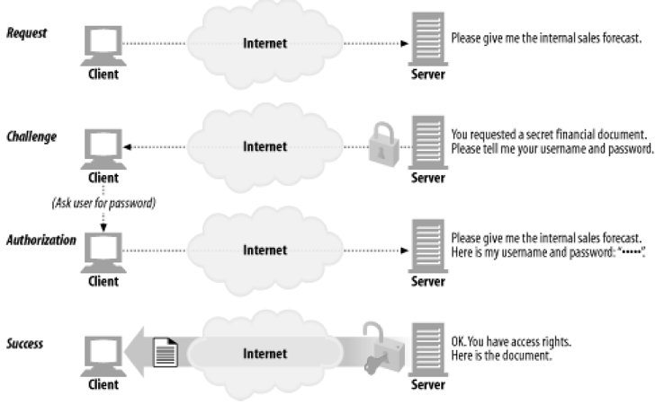
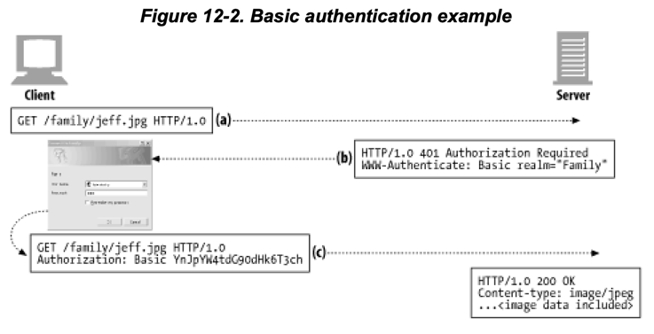
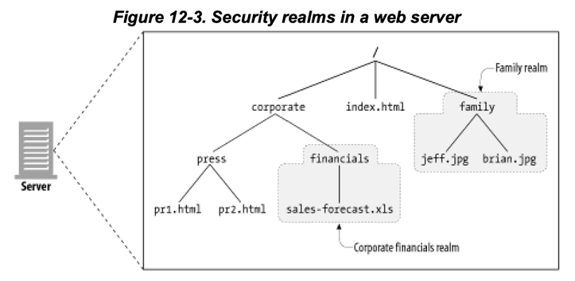

# 12장 기본 인증

1. 인증
2. 기본 인증
3. 기본 인증의 보안 결함

---

- 서버는 사용자가 누구인지 식별할 수 있어야함
- 보통 사용자 이름 / 비밀번호를 사용하여 인증
- 인증 : 당신이 누구인지 증명하는 것

## 1. 인증

- 인증은 사용자가 누구인지 확인하는 것
- e.g. 여권, 신분증
- 완벽한 인증이란 없음. 비밀번호를 탈취, 위조 가능

### 1.1. HTTP의 인증요구/응답 프레임워크



- HTTP는 자체 인증요구/응답 프레임워크 제공
- "authentication challenge" : 서버가 클라이언트에게 인증을 요구하는 것
- 인증정보가 맞지 않으면 서버는 클라이언트에게 에러를 보내거나, 다시 인증 요구

### 1.2 인증 프로토콜과 헤더

- HTTP의 공식 인증 프로토콜 : 기본 인증 (basic authentication), 다이제스트 인증 (digest authentication)

| 단계                  | 헤더                  | 설명         | 메서드/상태           |
|---------------------|---------------------|------------|------------------|
| request             |                     | 인증정보 없이 요청 | GET              |
| challenge           | WWW-Authenticate    | 인증정보 요구    | 401 Unauthorized |
| authorization       | Authorization       | 인증정보 포함 요청 | GET              |
| Authentication-Info | Authentication-Info | 인증정보 포함 응답 | 200 OK           |



- `WWW-Authenticate` : 서버가 클라이언트에게 인증을 요구하는 헤더
    - 어디서 어떻게 인증할 지 기술
- `Authorization` : 클라이언트가 서버에게 인증정보를 보내는 헤더
    - 인증정보를 포함한 요청을 보냄
- `Authentication-Info` : 서버가 클라이언트에게 인증정보를 보내는 헤더
    - 추가적인 인증 알고리즘에 대한 정보를 포함

### 1.3 보안 영역

- 보안 영역 (realm) : 서버가 보호하는 영역
- 웹 서버는 기밀 문서를 보안 영역 그룹으로 묶음
- 보안 영역은 저마다 다른 사용자 권한 요구



````
HTTP/1.1 401 Unauthorized
WWW-Authenticate: Basic realm="Corporate Financials"
````

## 2. 기본 인증

### 2.1 기본 인증의 예

### 2.2 Base-64 사용자 이름/비밀번호 인코딩

### 2.3 프락시 인증

## 3. 기본 인증의 보안 결함