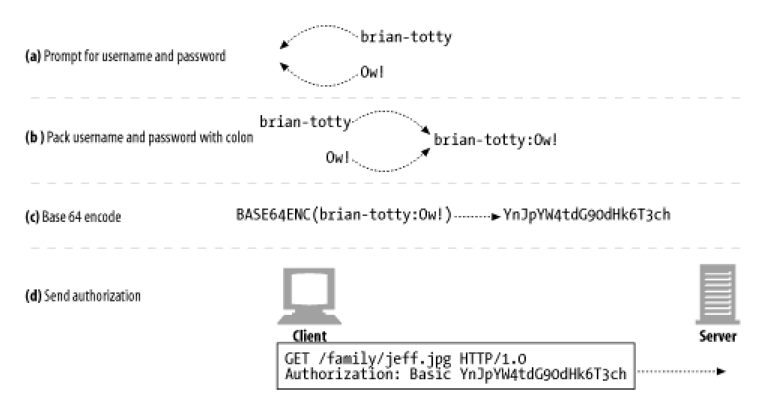

# 12장 기본 인증

1. 인증
2. 기본 인증
3. 기본 인증의 보안 결함

---

- 서버는 사용자가 누구인지 식별할 수 있어야함
- 보통 사용자 이름 / 비밀번호를 사용하여 인증
- 인증 : 당신이 누구인지 증명하는 것

## 1. 인증

- 인증은 사용자가 누구인지 확인하는 것
- e.g. 여권, 신분증
- 완벽한 인증이란 없음. 비밀번호를 탈취, 위조 가능

### 1.1. HTTP의 인증요구/응답 프레임워크


- HTTP는 자체 인증요구/응답 프레임워크 제공
- "authentication challenge" : 서버가 클라이언트에게 인증을 요구하는 것
- 인증정보가 맞지 않으면 서버는 클라이언트에게 에러를 보내거나, 다시 인증 요구

### 1.2 인증 프로토콜과 헤더

- HTTP의 공식 인증 프로토콜 : 기본 인증 (basic authentication), 다이제스트 인증 (digest authentication)

| 단계                  | 헤더                  | 설명         | 메서드/상태           |
|---------------------|---------------------|------------|------------------|
| request             |                     | 인증정보 없이 요청 | GET              |
| challenge           | WWW-Authenticate    | 인증정보 요구    | 401 Unauthorized |
| authorization       | Authorization       | 인증정보 포함 요청 | GET              |
| Authentication-Info | Authentication-Info | 인증정보 포함 응답 | 200 OK           |


- `WWW-Authenticate` : 서버가 클라이언트에게 인증을 요구하는 헤더
    - 어디서 어떻게 인증할 지 기술
- `Authorization` : 클라이언트가 서버에게 인증정보를 보내는 헤더
    - 인증정보를 포함한 요청을 보냄
- `Authentication-Info` : 서버가 클라이언트에게 인증정보를 보내는 헤더
    - 추가적인 인증 알고리즘에 대한 정보를 포함

### 1.3 보안 영역

- 보안 영역 (realm) : 서버가 보호하는 영역
- 웹 서버는 기밀 문서를 보안 영역 그룹으로 묶음
- 보안 영역은 저마다 다른 사용자 권한 요구


````
HTTP/1.1 401 Unauthorized
WWW-Authenticate: Basic realm="Corporate Financials"
````

## 2. 기본 인증

- 가장 잘 알려진 HTTP 인증 규약
- 거의 모든 주요 클라이언트/서버 인증에서 구현되어있음
- 웹 서버는 401 응답과 함께 `WWW-Authenticate` 헤더를 보냄
- `Authentication-Info` 헤더 사용 안함

### 2.1 기본 인증의 예

1. 사용자가 가족사진 /family/jeff.jpg 요청
2. 서버는 401 응답과 함께 `WWW-Authenticate` 헤더를 보냄
3. 브라우저가 401 응답을 받으면 사용자에게 인증정보를 요구하는 대화상자를 보여줌
4. 사용자가 브라우저에 인증 정보를 입력하고 (이름/비밀번호)
5. 브라우저가 base-64로 인코딩하여 `Authorization` 헤더를 만들어 서버에게 보냄
6. 서버는 인증정보를 디코딩하고, 검사 후 문제 없으면 200 OK 응답과 함께 문서를 보냄

### 2.2 Base-64 사용자 이름/비밀번호 인코딩



- base 64 인코딩 : 8 bit 로 이루어진 시퀀스를 6 bit 덩어리의 시퀀스로 변환
- base64 인코딩을 사용하면 서버/네트워크 관리 시 인증정보 노출 예방에 도움

### 2.3 프락시 인증

- 중개 프락시 서버를 통해 인증
- 회사에서 LAN이나 무선 네트워크에 접근하기 전에 프락시를 거치게 함

| 웹 서버                  | 프락시 서버                      |
|-----------------------|-----------------------------|
| 401                   | 407                         |
| `WWW-Authenticate`    | `Proxy-Authenticate`        |
| `Authroization`       | `Proxy-Authorization`       |
| `Authentication-Info` | `Proxy-Authentication-Info` |

## 3. 기본 인증의 보안 결함