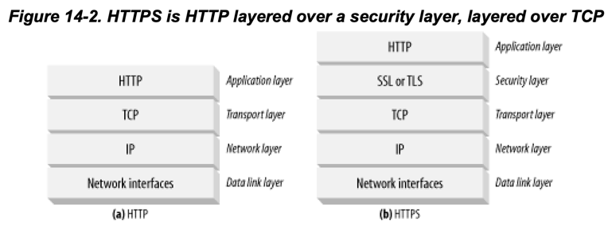

# 14장 보안 HTTP

1. HTTP를 안전하게 만들기
2. 디지털 함호학
3. 대칭키 암호법
4. 공개키 암호법
5. 디지털 서명
6. 디지털 이증서
7. HTTPS의 세부사항
8. 진짜 HTTPS 클라이언트
9. 프락시를 통한 보안 트래픽 터널링

---

- HTTP 기본 인증은 중요한 트랜잭션을 보호하기에는 부족
- 디지털 암호화를 통해 도청/위조로부터 트랜잭션을 보호

## 1. HTTP를 안전하게 만들기

- HTTP와 디지털 암호화 기술을 결합
- 효율, 이식성, 관리, 적응이 좋아야함

#### HTTP 보안 기술 요구사항

- 서버 인증 : 클라이언트는 위조된 서버가 아닌 진짜 서버와 통신
- 클라이언트 인증 : 서버는 위조된 클라이언트가 아닌 진짜 클라이언트와 통신
- 무결성 : 메시지가 도중에 변조되지 않음
- 암호화 : 도청에 걱정하지 않아도 됨
- 효율 : 저렴한 클라이언트나 서버도 이용 가능하도록 충분히 알고리즘이 빨라야함
- 편재성(Ubiquity) : HTTP를 사용하는 모든 곳에서 사용 가능해야함
- 관리상 확장성 : 누그든 어디서 즉각적인 보안통신이 가능해야함
- 적응성 : 가장 좋은 보안방법을 지원해야함
- 사회적 생존성 : 문화/정치적 요구사항 만족

### 1.1. HTTPS

- HTTP를 안전하게 하는 방식 중 가장 인기있는 방식
- Netscape Communications Corporation이 개발
- `https://`로 시작하는 URL
- HTTPS를 사용하면 모든 HTTP 요청/응답 데이터는 암호화된 다음 네트워크에 전송
- 전송레벨 암호 보안 계층 위에서 동작 (transport-level cryptographic security layer)
    - 안전 소켓 계층 (Secure Sockets Layer, SSL)
    - 전송 계층 보안 (Transport Layer Security, TLS)
- 인코딩/디코딩 작업은 SSL 라이브러리에서 수행

## 2. 디지털 암호학

## 3. 대칭키 암호법

## 4. 공개키 암호법

## 5. 디지털 서명

## 6. 디지털 인증서

## 7. HTTPS의 세부사항

## 8. 진짜 HTTPS 클라이언트

## 9. 프락시를 통한 보안 트래픽 터널링

