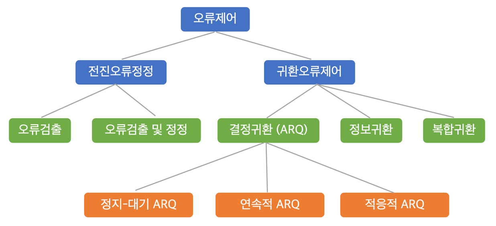

# 주소지정, 오류제어

- 주소지정
    - 주소지정 방식
    - 주소할당 모드
- 오류제어
    - 오류와 오류제어, 오류검출 방식
    - 귀환오류제어
    - 전진오류정정

# 주소지정

## 주소지정 addressing

- 명명naming, 식별 identification
- 컴퓨터 통신망에서 사용자 컴뮤터, 파일 등을 식별하는 방법
- 문자, 수를 이용

### 주소지정 방식의 등장 배경

컴퓨터 통신망은 ICT 자원 resources를 공유한다.  
따라서 ICT 자원 공유를 위해 주소 지정이 필요해졌다.

## 주소지정 방식

- 계층의 수
    - 단일 계층, 복수 계층
- 부 네트워크가 제공하는 주소 서비스
    - 논리 주소, 물리 주소
- 같은 주소를 갖는 지국의 수
    - 단일 지국
    - 복수 지국
        - 복수 목적지 주소, 그룹 주소
        - broadcasting 주소, flooding 주소
- **주소할당 모드**
    - 정적 주소, 동적 주소

### 논리주소와 물리주소

방송통신대학교 웹사이트 주소

- 논리주소 **32비트 10진수**: 023.232.172.105
- 물리주소 48비트, 16진수: 00:13:77:52:67:78

# 오류제어

## 오류와 오류제어

### 오류 (error)

- 송신 데이터와 수신데이터가 다른 거나
- 송신 데이터가 주어진 시간 안에 수신 측에 도착하지 못한 경우

#### 오류 발생 이유

열, 자기장, 간섭, 고장 등

#### 잔류 오류율 RER : Residual Error Rate

오류가 있는 비트 (문자, 블럭)수 / 전송된 총 비트 (문자, 블럭) 수

### 오류제어

잡음, 고장 등의 영향에 대비하여 RER을 주어진 한계 이내로 유지하는 통신 기능

#### 오류제어 방식

- 후지오류 제어 backward error control
    - 오류 검출 후 재전송 요청
- 전진오류 정정 forward error correction
    - 오류 검출 및 수정

## 오류검출 방식

- 패리티  parity 검사
- 검사 합 checksum 검사
- 순환 인영검사 CRC, Cyclic Redundancy Check

### 패리티 검사

- 홀수 전략 : 단순 패리티 검사
    - **동시에 짝수개의 비트오류가 있는 경우 오류 검출 못함**
- **짝수 전략** : 홀수 전략의 한계 극복

### 검사 합 검사 Check Sum

검사합 생성 후 검사합 검사

#### 검사합 생성기

- 데이터를 세그먼트로 분할
- 세그먼트들을 2진수로 간주하고 합
- carry bit 도 합
- 합한 결과를 1의 보수로 만듦 Check Sum

#### 검사합 검사기

- 비트열을 수신하여 세그먼트로 분할
- 세그먼트들을 2진수로 간주하고 합
- carry bit 도 합
- 합한 결과를 1의 보수로 만듦
- 결과가 0이면 오류 없음

### 순환 인영검사 CRC, Cyclic Redundancy Check

- 패리티 검사 : 문자 단위 검사
- 순환 잉여 검사 : 비트의 블록 단위 검사
    - 사진, 소리, 영상과 같은 데이터 전송에 사용
    - block or frame 끝에만 오류제어 정보 첨가
        - BCC : block check character
        - FCS : frame check sequence

#### BCC 생성 과정

1. 비트의 다항식 표현 M(X)
2. 생성 다항식 G(X)에 의한 부호화

## 귀환오류제어

- 지국 사이의 역방향 채널을 이용하는 오류제어 방법
- 귀한오류제어의 분류 : 오류검출 위치에 따라 분류
    - 결정귀환
        - 오류검출 위치가 수신 측에 있음
        - ARQ Automatic Repetition Request
    - 정보귀환
        - 오류검출 위치가 송신 측에 있음
    - 복합귀환
        - 오류율을 줄이기 위해 오류제어방법을 복합적으로 이용
            - 결정귀환, 정보귀환 이용
                - 수신측에서 오류검출 하면 REJ 송신
                - 수신측에서 오류검출 못하면 정보귀환 방식으로 BCC 송신
            - 결정귀환, 전진오류정정(FEC)를 이용
            - 수신측에서 오류 검출하면,
                1. REJ 송신
                2. 송신측에서는 전진오류정정방식으로 송신

### 결정귀환 ARQ

1. 정지-대기 stop-and-wait ARQ
    - 1개의 데이터 프레임을 송신하고 기다림
        - ACK를 수신하면 다음 프레임 송신 후 기다림
        - REJ를 수신하면 처음 프레임 재송신 후 기다림
        - 대기시간을 초과하면 처음 ㅡ프레임 재송신 후 기다림
    - 특징
        - 구현 단순, 비용 버퍼 저렴
        - 전송효율이 떨어짐 대기시간
2. 연속적 continuous ARQ
    - 여러개의 데이터프레임을 송신하고 기다림
    - N-프레임 후퇴 go-back-N ARQ
        - sliding window
    - 선택적 반복 selective-repeat ARQ
        - 여러 개의 데이터 프레임을 송신하고 기다림
        - REJ가 수신된 프레임만 재전송
        - 특징
            - 전송효율이 go-back-N ARQ 보다 높음
            - 프레임의 송수신 순서가 달라 재배열이 필요함 복잡도
3. 적응적 adaptive ARQ
    - 프레임의 깅리을 동적으로 변경시킴
        - 수신측은 통신오류발생률을 송신 측에 통보
        - 송신측은 그에 적합한 프레임 길이로 전송
    - 전송 효율 높임
        - 오류발생률이 높을 떄 짧은 프레임으로 전송
        - 오류 발생율이 낮을 때 긴 프레임으로 전송
    - 구현이 복잡함

## 전진오류정정 FEC, Forward Error Correction

- 수신 측에서 오류 검출 및 정정까지 가능한 방식
- 연속적인 데이터 흐름이 필요, 역방향 채널의 제공이 어려울 때 적합
- **오류정정코드** 를 전송
    - 데이터 프레임에 잉여 비트를 추가
        - 해밍Hamming 코드
        - 리드-뮬러 Reed-Muler 코드
        - 리드-솔로몬 Reed-Solomon 코드 등
- 잉여 비트 크기만큼 전송효율이 떨어짐