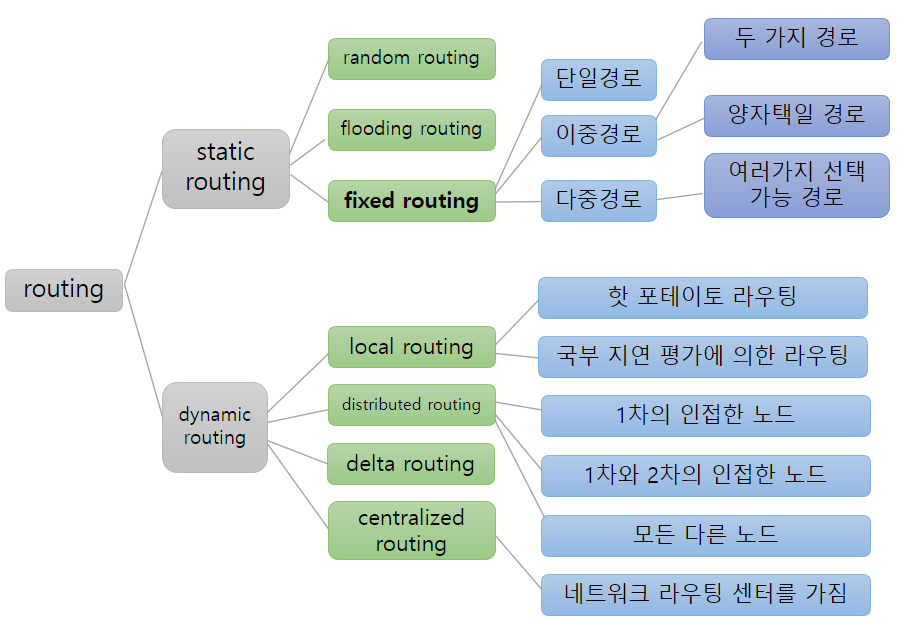

# 흐름제어, 혼잡제어, 라우팅

- 흐름제어와 혼잡제어의 비교
- 흐름제어의 4가지 원칙
- 혼잡제어의 목적
- 라우팅 방법

- 흐름제어 flow control
- 혼잡제어 체증 제어, congestion control
- 경로선택 routing
- 오류제어 error control; sliding window, stop-and-waint ARQ
- 접근제어 access control

## 흐름제어

### 흐름제어의 정의

- flow control
- 송 / 수신 블록 수, 통신 메체의 조절

### 흐름제어의 목적

- 통신망 성능 최적화
    - 부 네트워크 subnetwork의 내부 환경에 관계 없이 통신망의 성능을 유지하기 위함
- 혼잡 방지

### 흐름제어의 네가지 원칙

1. 속도조절 : 블록간의 도착 간격 변경
    - ex. 감속 방법 choke packet
2. 거부 rejection : 송신측에 대한 거부상태 통지
    - ex. 무시 방법 송신 측에대한 거부, **stop-and-go 방법** 송신 이전의 수신 거부
3. 단일 승낙 single permission : 매번 송신 허락을 받아야함
    - ex. wait-before-go 방법, **ask-and-wait 방법**
4. 다중 승낙 multiple permission : 정해진 개수의 블록만 송신 가능
    - ex. **sliding window 방법**

## 혼잡제어

### 혼잡제어의 정의

#### 혼잡 현상이란

- congestion
- 전송 데이터의 급격한 증가로 인해 통신망 과부하 발생
- 그리하여 데이터 전송 속도 급감하거나 전송 불가 상태가 되는 현상
- 단계적 발생 과입력 전송지역 => 전체 부네트워크
    - 버퍼 혼잡 : 여러 버퍼들의 오버플로우
    - 노드 혼잡 : 한 노드
    - 국부 혼잡 : 특정 노드들
    - 전체 혼잠 : 전체 부네트워크

#### 혼잡 제어 방법

- 전송량의 제한
    - 허가증 permit을 이용하여 전송량을 일정 수준 이하로 유지
    - ex. Isarithmic 흐름제어 방법
- 부네트워크 내의 부하 감소
    - 어떤 패킷을 버림
    - 흐름제어 거부원칙 방법 이용
- 국부적 전송량의 재분배
    - 국부적인 체증 방지 및 국부적 과다 교통량 해소
    - 경로선택 방법 이용

## 라우팅

### 라우팅의 정의와 목적

- 데이터 블록이 목적노드로 전달되기 위해 출발노드부터 목적노드까지의 **경로**를 결정하는 것
- 목적
    - 네트워크 성능 최적화
    - 임계갑 경계조건 유지
        - 평균패킷전송시간 최소화
        - 네트워크 자원 활용도 최대화
    - 네트워크 전부 또는 일부의 혼잡 방지
    - 네트워크의 전송 신뢰도

### 라우팅 방법 분류

#### 비적응적 라우팅

1. random routing랜덤 라우팅
    - 다음 노드를 임의로 결정
    - 모든 경로는 동일한 확률로 선택
    - loop 허용 안함
2. flooding routing플러딩 라우팅
    - 블록이 들어온 노드만 제외한 모든 노드에 전송
    - 매우 큰 트래픽 형성 가능
3. **fixed routing** 고정 경로 선택
    - 다음 노드가 일단 정해지면 환경이 변해도 경로 유지
    - 대표적 비적응적 경로 선택 방법
    - 고정 **단일** 경로선택
        - 다음 노드가 오직 하나 고정된 경우
        - 범람 경로선택 flooding routing과 정반대
        - 노드나 선로 고장의 경우 경로 완전 차단됨
    - 고정 **이중** 다중 경로선택
        - by-pass link 첨가

#### 적응적 라우팅

1. local routing 국부 라우팅, 국부 경로선택
    - 라우팅 정보를 한 노드에서만 활용
    - 다음 노드의 결정은 해당 노드에서 수행
    - hot potato 경로 선택 shortest queue routing method
        - 가장 짧은 큐를 가진 출력 선로를 선택하여 데이터 전송
    - local delay estimate 경로 선택 국부지연평가
        - 과거의 정보를 이용
        - 데이터를 반대 방향으로 전송하는데 소요 시간을 계산한 뒤 다음 노드 결정 backward routing
2. distributed routing 분산형 경로선택
    - 라우팅 정보를 인접 노드사이에서만 교환
    - 각 노드에서는 제한된 크기의 전송지연표 활용, 목적 노드까지의 최소지연 노드를 결정
    - 최소 지연 벡터는 쥐적으로 갱신되고, 인접 노드끼리 공유
    - 종류
        - 1차 인접노드
        - 1차, 2차 인접 노드
        - 모든 다른 노드
3. centralized routing 중앙집중형 경로선택
    - NRC Network Routing Center
        - 모든 노드는 경로 선택 관련 정보를 NRC에 제공
        - NRC가 라우팅 벡터를 갱신하여 각 노드에게 제공
    - 분산형 경로선택과 정반대
    - 각 노드는 편리
    - NRC는 복잡
4. delta routing 델타 경로선택
    - 분산형 경로선택 + 중앙집중형 경로선택
    - 분산형 : 인접 노드 사이의 경로 선택
    - 중앙집중형 : 통신망 전체의 경로 선택