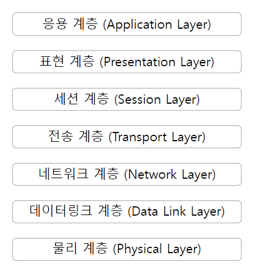
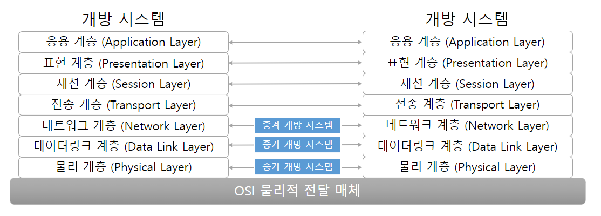
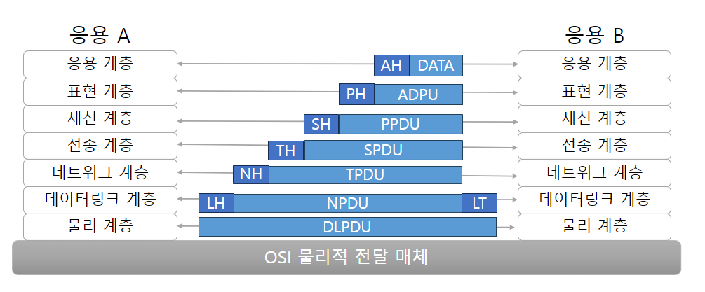
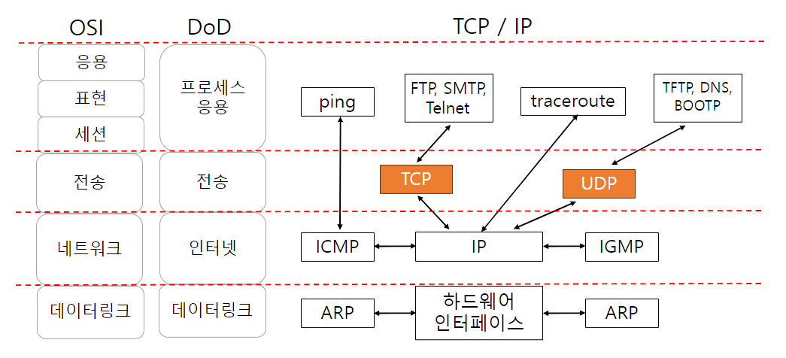
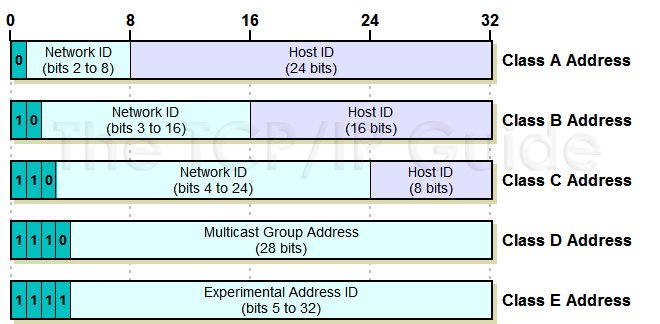

# 컴퓨터 통신망 구조

- 컴퓨터 통신망 구조
- OSI 참조 모델
- 인터넷 통신망 구조 (TCP/IP)

## 컴퓨터 통신망 구조

### 네트워크 아키텍처

- 컴퓨터 통신망의 기본 뼈대를 이루는 핵심
- 컴퓨터 통신망의 물리적 요소드로가 기능, 구성, 동작 원칙, 절차, 통신 프로토콜 등을 위한 프레임워크
- ex. IBM SNA, DEC NDA, Honeywell DSA, ISO OSI, TCP/IP
- SNA System Network Architecture
    - IBM 컴퓨터 간의 데이터 통신과 메시지 전송을 위한 폐쇄형 네트워크
- DNA Digital Network Architecture
    - 최초의 P2P 네트워크 구조 중 하나로 발전
- DSA Distributed Systems Architecture
    - IBM SNA 와 경쟁하기 위해 개발

### 개방형 네트워크 아키텍처

초기에는 보안상의 이유로 자원 공유가 없었지만 점차 사용자간의 자원 공유 이점을 인식하여  
상호 간에 접소을 자유롭게 할 수 있는 **개방형 네트워크 아키텍처** 등장

- ex. OSI 참조 모델, TCP/IP Transmission Control Protocol / Internet Protocol

## OSI 참조 모델

- 개방형 시스템의 상호 접속을 위한 참조 모델
- 이기종 시스템간의 통신이 가능하도록 표준 제정
- OSI 참조모델은 우편을 데이터 메시지의 비교하자면,
    - 우편 -> 우편물 -> 우체국 -> 공항 -> 비행기 -> 공항 -> 우체국 -> 우편물 -> 도착
- 중계 개방 시스템을 갖는 계층

### 계층 구성요소

1. 물리 계층
    - 종단 간 연결을 위해 다양한 물리적 매체를 사용
2. 데이터 링크 계층
    - 전화회선, 광섬유 등의 물리적 통신 메체에 따라 서로 다른 데이터 링크 절차 필요
3. 네트워크 계층
    - 전송 주체 사이에 중간 노드가 있는 경우에도 네트워크 연결 통로를 제공해야함
4. 전송 계층
    - 발신지 시스템에서 목적지 시스템까지의 신뢰성 있는 데이터 이동을 위한 제어
5. 세션 계층
    - 대화를 조직, 동기화, 데이터 교환을 관리
6. 표현 계층
    - 응용 프로그램의 구조화된 데이터를 표현하고 조정
7. 응용 계층
    - 응용프로그램을 위한 프로토콜을 관리

### 계층의 분리 원칙

> 1. 너무 많은 계층으로 분리하여 조합과 설명이 필요이상 많아지지 않아야 한다.
> 2. 서비스의 양이 적고 경계를 중심으로 최소의 상호 작용이 일어나도록 경계를 정해야 한다.
> 3. 수행하는 일의 측면에서나 필요로하는 기술의 측면에서 명백히 서로 다른 기능을 다룰 수 있게 한다.
> 4. 비슷한 기능들은 같은 계층에 존재하도록 한다.
> 5. 과거의 경험에 의해 성공적이라 판단되는 곳에 경계를 설정한다.
> 6. 쉽게 세분화되는 기능을 하나의 계층으로 한다.
> 7. 필요한 경우 표준화된 인터페이스를 가질 수 있는 곳에 경계를 설정한다.
> 8. 데이터에 대한 조작, 즉 syntax, semantic 등의 추상적 개념에 대해 서로 다른 수준을 필요로 하는 곳에서 계층을 설정한다.
> 9. 각 계층은 단지 상위-하위 계층의 경계를 갖도록 한다.

### 캡슐화 Encapsulation

- 데이터에 대해 각 계층의 제어 정보를 추가하는 것
- Service Data Unit + Protocol Control Information = Protocol Data Unit

## 인터넷 통신망 구조 (TCP/IP)

### TCP/IP 의 등장

1. Internetworking Technology
    - 네트워크들을 상호 연결하는 기술
    - 서로 다른 네트워크에 연결된 컴퓨터 간의 통신이 가능
    - DoD ARPA (Advanced Research Project Agency) 에서 개발
2. Transmission Control Protocol / Internet Protocol
    - TCP / IP Internet Protocol Suite
    - 1970년대 Robert Kahn, Vinton Cerf 에 의해 개발
    - 1982년 미국 컴퓨터 네트워킹의 표준으로 제정

### TCP / IP 기본 구조

- 연결형 서비스 및 비연결형 서비스 제공
- 패킷 교환
- 동적 경로 할당
- 공통의 응용 프로그램 제공
    - CASE Common Application Service Element : 응용에 무관하게 개방시스템 접속을 위한 방법 제공

### TCP / IP 구성 요소

1. 데이터링크 계층
    - 네트워크 인터페이스
    - device driver와 interface card로 구성
    - 대표적인 프로토콜
        - ARP Address Resolution Protocol : IP 주소를 물리적 주소로 변환
        - RARP Reverse Address Resolution Protocol : 물리적 주소를 IP 주소로 변환
2. 인터넷 계층
    - 네트워크 상에서 패킷의 이동 처리 패킷 라우팅 등
    - 대표적인 프로토콜
        - IP Internet Protocol : 패킷의 이동을 처리
        - ICMP Internet Control Message Protocol : 오류 메시지 전송
        - IGMP Internet Group Management Protocol : 멀티캐스트 그룹 관리
3. 전송 계층
    - 호스트 컴퓨터 사이의 데이터 전송 서비스
    - 대표적인 프로토콜
        - TCP Transmission Control Protocol : 연결형 서비스 제공
        - UDP User Datagram Protocol : 비연결형 서비스 제공
4. 응용 계층
    - 응용 프로세스를 위한 프로토콜
    - 대표적인 프로토콜
        - TCP
            - FTP File Transfer Protocol : 파일 전송
            - SMTP Simple Mail Transfer Protocol : 전자 메일 전송
            - Telnet : 원격 로그인
        - UDP
            - DNS Domain Name System : 도메인 이름을 IP 주소로 변환
            - TFTP Trivial File Transfer Protocol : 파일 전송
            - BOOTP Bootstrap Protocol : 부팅 시 IP 주소 할당
        - IP 직접 이용 : traceroute 프로그램
        - ICMP 직접 이용 : ping 프로그램

### 호스트 식별 방법

- 인터넷에 연결되어있는 호스트 식별
- 3가지 종류의 주소
    1. 물리주소 : 하나의 네트워크에서 호스트를 식별하는 물리적 하드웨어 주소이자 네트워크 인터페이스 주소
    2. 인터넷 주소 IP 주소 : 서로 다른 네트워크 간에 호스트를 식별하는 논리주소
    3. 포트주소 : 프로세스를 식별하는 포트번호

#### IP 주소

- 4 바이트 32비트로 구성

#### 포트 주소

- port number
- TCP 및 UDP 에 의해 응용 프로그램 식별
- 2바이트 16비트로 구성
- 포트 범위
    - 0 : 사용되지 않는 포트
    - 1 ~ 255 : well-known port
    - 256 ~ 1023 : 기타 well-known port
    - 1024 ~ 4999 : 임시 client port
    - 5000 ~ 65535 : 사용자 정의 server
- 포트 주소 예시
    - 21 : FTP
    - 23 : Telnet
    - 25 : SMTP
    - 80 : HTTP

#### 캡슐화

- 캡슐화 Encapsulation
    - 테이터에 각 계층의 제어 정보를 추가하는 것
    - Service Data Unit + Protocol Control Information = Protocol Data Unit
- 역캡슐화 Decapsulation
    - 수신측 시스템의 해당 계층에서 제어 정보를 제거하는 것
    - 캡슐화의 반대 과정
    - Protocol Data Unit - Protocol Control Information = Service Data Unit
