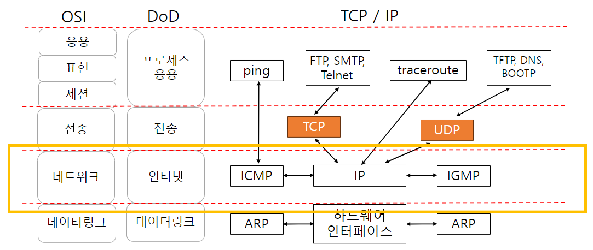
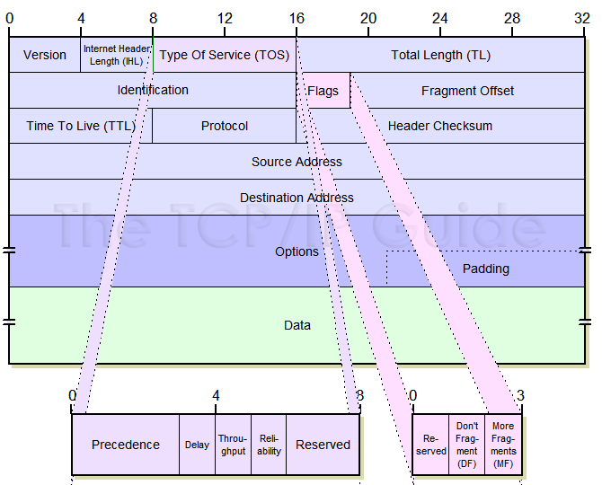
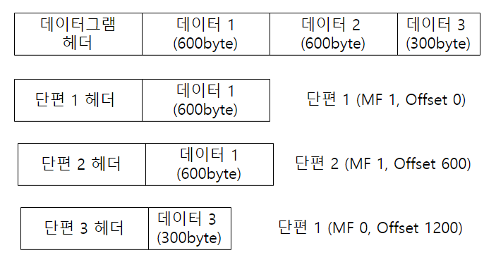
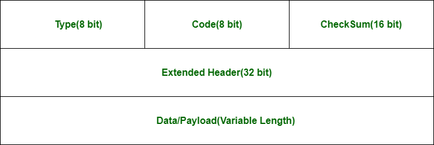
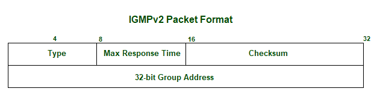
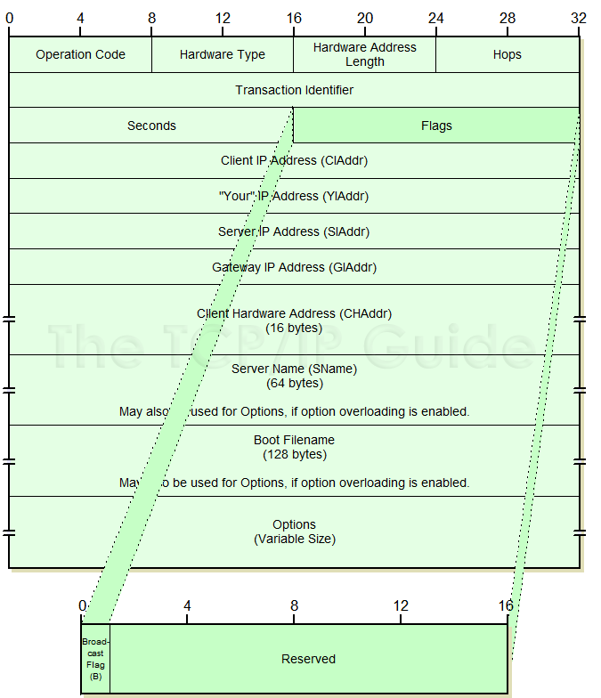

# TCP / IP 네트워크 계층

- IP
- 주소변환
- ICMP
- IGMP
- DHCP

## IP

### IP 란

- Internet Protocol : OSI 모델의 네트워크 계층에 해당하는 프로토콜
- 사용자에게 복잡한 인터넷 개별 네트워크 구조를 숨김
- 모든 호스트들을 연결하는 1개의 가상 네트워크로 보이게 함

### 투명성 transparency

- 송신자 호스트는 수신자 호스트까지 경유해야하는 데이터링크, 라우터에 대한 물리적 세부사항을 모름
- 그럼에도 데이터 그램 전송 가능

## 비연결형 connectionless 서비스

### 인터넷 계층의 투명성

- IP 역할 : 호스트의 주소 지정, 데이터그램 전송
- 경유해야하는 데이터 링크, 라우터 정보 무시
- 신뢰성 없는 데이터 전송

## 데이터그램

- 데이터 그램 : IP 계층에서 사용하는 패킷

### 데이터그램의 구성

1. Version : 4비트, IP version 식별 번호
2. Internet Header Length : 4비트, IP 헤더의 길이
3. Type of Service TOS : 8비트, 서비스 유형
    - 3개 비트 : 우선순위
    - 4개 비트 : 서비스 유형
        - 0000 : 기본
        - 0001 : 비용 최소
        - 0010 : 신뢰성 최대
        - 0100 : 처리량 최대
        - 1000 : 지연 최소
    - 1개 비트 : 미사용
4. Total Length TL : 16비트, IP 데이터그램의 길이
5. Identification : 16비트, 데이터그램의 식별자
    - 데이터그램이 단편되었을 때 각 단편은 동일한 식별자를 가진다
6. Flags : 3 비트, 단편화 관련 정보
    - 1개 비트 : 미사용
    - 1개 비트 (DF)
        - 1 : Don't Fragment
        - 0 : Fragment
    - 1개 비트 (MF)
        - 1 : More Fragment
        - 0 : Last Fragment, 유일한 단편
7. Fragment Offset : 13비트, 단편의 오프셋
    - 메시지가 단편되었을 때 데이터그램 내의 데이터가 원래 메시지의 어디에 위치하는지를 나타냄
8. Time to Live TTL : 8비트, 데이터그램의 수명
    - 거쳐야하는 라우터의 최대 수
    - 일반적으로 두 호스트 사이 라우터 수의 2배로 지정
    - 라우터 지날 때마다 1씩 감소
    - 0이 되면 데이터그램 폐기
9. Protocol : 8비트, 데이터그램의 상위 계층 프로토콜
    - 1 : ICMP
    - 2 : IGMP
    - 6 : TCP
    - 17 : UDP
10. Header Checksum : 16비트, 헤더의 체크섬
    - 헤더의 오류 검출
    - 헤더만의 검사합

## IP 단편화 fragmentation

- IP 데이터그램의 분할
- MTU Maximum Transmission Unit : 데이터 링크 계층에서 전송 가능한 최대 데이터 길이
    - Ethernet LAN : 1500 byte
    - CCCITT X.25 : 128 byte
- IP 데이터그램은 전송 중 각 네트워크에서 MTU에 적합한 크기로 분할 됨
- 목적지 호스트에서 각 fragment를 재조립

## 라우팅

- IP 데이터그램이 목적지 호스트까지 진행되면서 경유할 경로를 결정하는 것
- Hop by Hop : 데이터그램이 한 라우터에서 다음 라우터로 전달되는 것
- 비교
    - IP : 송신자, 수신자, 그 사이 경로 상에 있는 모든 라우터들이 IP 데이터그램 전달에 관여
    - TCP : 송신자와 수신자만 TCP 세그먼트 전달에 관여

### 라우팅 테이블

- 호스트가 자신의 물리적 네트워크에 연결된 라우터에 대한 정보를 관리하는 테이블
- 테이블 구조 (7개 필드로 구성)
    - 마스크
    - 목적지 주소
    - 다음 홉 주소
    - 플래그
    - 참조횟수
    - 사용
    - 인터페이스

### 동일한 이더넷에 연결된 호스트간 통신 (호스트 A -> 호스트 B)

- 호스트 A IP 주소 : 163.100.21.35
- 호스트 B IP 주소 : 163.100.21.33
- 목적지 네트워크 주소 : 163.100.21.0

1. 링크헤더에 호스트 B의 물리주소 지정
2. IP 헤더에 호스트 B의 IP 주소 지정
3. 전송 완료

### 다른 이더넷에 연결된 호스트간 통신 (호스트 A -> 호스트 C)

- 호스트 A IP 주소 : 163.100.21.35
- 호스트 C IP 주소 : 163.100.23.43
- **서로 다른 네트워크**

1. 다음 홉에 라우터 주소 지정 및 라우터로 전송
2. 라우터 주소에서 호스트 C 네트워크의 라우터로 전송
3. 호스트 C 네트워크 라우터에서 호스트 C로 전송
4. 전송 완료

## 주소변환

### ARP Address Resolution Protocol

- IP 주소를 물리주소로 매핑해주는 프로토콜
- 상대방 호스트의 IP 주소를 알고 있을 때,
- 상대 호스트의 물리주소를 알고자 할때 사용하는 프로토콜
- IP 주소 : 32bit
- 물리 주소 : 48bit

#### 동적 바인딩

- ARP는 호스트의 IP 주소를 대응하는 물리주소로 변환하여 실제 데이터 통신을 가능케 함

1. ARP 요청 : broadcasting
    - 모든 호스트들에게 ARP 요청을 보냄
2. ARP 응답 : unicasting
    - ARP 요청을 받은 호스트 중 IP 주소가 일치하는 호스트가 ARP 응답을 보냄

### RARP Reverse Address Resolution Protocol

- 물리주소를 IP 주소로 매핑해주는 프로토콜
- 물리주소만 알고있을 때,
- 자신의 IP 주소를 찾을 때 상용하는 프로토콜
- 일반적으로 호스트의 IP 주소는 디스크에 저장된 구성 파일에서 확인
- 디스크에 저장되지 않은 호스트는 물리주소만 알고 있으므로 RARP를 사용하여 IP 주소를 알아냄

1. RARP 요청 : broadcasting
    - RARP 서버에 RARP 요청을 보냄
2. RARP 응답 : unicasting
    - RARP 서버가 IP 주소를 알려줌

## ICMP Internet Control Message Protocol

### ICMP 프로토콜

- 인터넷 계층 프로토콜
- 전송 오류 제어
    - IP는 비연결성 비신뢰성 전송 서비스이므로 실패 가능성이 있음
    - IP 데이터그램 전송의 오류가 발생할 경우 오류 메시지 도는 제어 메시지를 제공하는 프로토콜
    - IP 데이터그램 전송 과정에서 발생하는 오류를 라우터나 발신지 호스트에게 보고하는 메커니즘 제공

### ICMP 메시지 유형

- 0 : Echo Reply
- 3 : Destination Unreachable
- 4 : Source Quench
- 5 : Redirect
- 8 : Echo Request
- 11 : Time Exceeded
- 12 : Parameter Problem
- 13 : Timestamp Request
- ...

- error reporting
    - 오류를 수정하지 않고 단순 보고
    - IP 주소를 이용하여 발신지에 오류 전송
    - 발신지 억제 : 데이터그램이 라우터와 호스트의 처리능력을 초과할 정도로 도착 포화 상태
    - 시간 초과 : TTL 필드 값이 0으로 감소되어 폐기
    - 목적지 도달 불가 : 라우터가 데이터그램을 최종 목적지에 전달 불가
    - 재지정 : 다른 라우터를 통할 수 있는 좋은 경로가 있음
- simple query
    - 일부 네트워크의 문제 진단
    - 에코 요청 및 응답 : 두 호스트 사이에 통신 가능여부 확인
    - 주소 마스크 요청 및 응답 : 호스트가 라우터에 서브넷 마스크 요청
    - 타임 스탬프 요청 및 응답 : 두 시스템 간에 IP 데이터 그램이 오가는데 필요한 시간 결정
    - 라우터 요청 및 응답 : 다른 네트워크의 호스트에 데이터 전송 시 자신의 네트워크에 연결된 라우터의 주소 요청

## IGMP Internet Group Management Protocol

#### Multicast?

하나의 그룹에 속한 호스트들에게 메시지를 전송하는 것 (1:N)

- unicast : 1:1
- broadcast : 1:all

### IP 멀티캐스트

- 인터넷 게층 프로토콜
- 인터넷에서 multicast를 지원하기 위한 프로토콜
- IP 호스트가 어떤 멀티캐스트 그룹에 속하는지 알려주는 프로토콜
    - 멀티캐스트 라우터를 통해 알려줌
- 클래스 D 주소 사용
    - 주소 범위 : 224.0.0.0 ~ 239.255.255.255

### IGMP 메시지

1. Type : 8bit
    - Query (general/special)
    - Membership Report
    - Leave report
2. Max Response Time : 8bit
    - 질의에 응답해야하는 최대 허용시간
3. Checksum : 16bit
    - 오류 검출
4. Group Address : 32bit
    - 멀티캐스트 그룹 주소
    - 클래스 D IP 주소

## DHCP Dynamic Host Configuration Protocols

### IP 주소관리

- IP 주소는 기억하기 어려워 관리 방법이 필요함
- 관리 방법
    - Host Table
    - DNS Domain Name System
    - BOOTP Bootstrap Protocol
    - DHCP Dynamic Host Configuration Protocol

#### Host Table

- 모든 IP 주소와 매핑되는 호스트 이름으로 구성된 테이블
- 장점
    - 중앙 집중 관리
    - host table 구조 간단
- 단점
    - 호스트 개수 증가와 변화에 대응 어려움 매핑 정보 일관성 유지의 어려움
    - 평면구조이기 때문에 중복 정보 포함

#### DNS Domain Name System

- 계층적 구조 및 분산관리 특성
    - 도메인 이름 : naver.com
- 분산관리 문제
    - name server는 특정 네트워크만의 정보를 가짐
- name server 데이터 복잡성
    - 수작업에 의한 데이터 오류 가능성

#### BOOTP Bootstrap Protocol

- 동적으로 IP 주소를 할당하는 프로토콜sss
- 디스크가 없는 호스트에 대해 주소, 설정정보를 자동으로 할당하고 관리

#### DHCP Dynamic Host Configuration Protocol

- 응용계층 프로토콜
- BOOTP 에서 발전된 동적 주소 할당 프로토콜
- IP 주소 재사용 가능
- 메시지 형식은 BOOTP 와 동일
- IP 주소 pool 에서 사용가능한 IP 주소를 선택하여 원하는 호스트에게 일정기간 임대

### DHCP 프로토콜 순서

1. DHCP Discover
    - "DHCP 서버가 있습니까?"
2. DHCP Offer
    - "IP 주소 210.22.31.100으로 2일간 사용가능합니다."
3. DHCP Request
    - "IP 주소 210.22.31.100으로 2일간 사용가능?"
4. DHCP ACK
    - "네, 이 서브넷 마스크, DNS 서버 주소, WING 서버, 노드 유형, 도메인 이름을 쓰세요."
