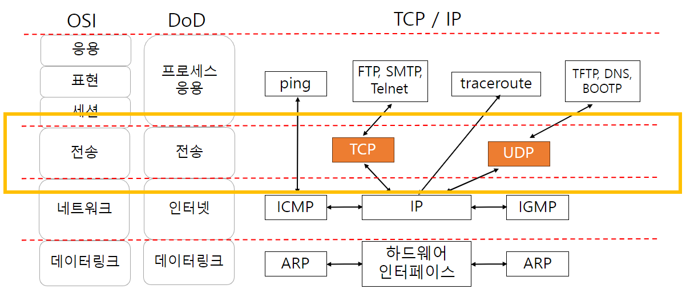
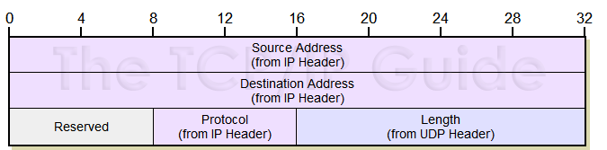

# TCP / IP 전송 계층

- 전송 계층
- UDP
- TCP

## 전송 계층

### 전송 계층 개요

- 시스템 종단 endpoint에서 투명한 데이터를 양방향으로 전달하는 계층
- 오류를 점검하여 오류 발생시 재전송하여 신뢰성 제공
- 네트워크 계층은 데이터 전송에 대한 신뢰성 보장하지 않음

#### 전송 계층 통신 예시

1. foo.com
2. IP 주소
3. GET http://foo.com?....

### 전송 계층 프로토콜

- **인터넷에서 가장 많이 사용되는 프로토콜**
- 응용 프로세스에서 다른 응용프로세스로 데이터 전송을 위함 process to process
    - 포트 번호 사용 프로세스 구별
- TCP Transmission Control Protocol : 연결형 프로토콜
- UDP User Datagram Protocol : 비연결형 프로토콜

#### process to process 통신

- socket address = IP 주소 + port 번호
- 포트번호
    - 서버 프로세스는 well-known port 사용
    - 클라이언트 프로세스는 임시포트 사용

### 전송 계층의 통신 방식

#### 연결형 프로토콜

#### 비연결형 프로토콜

## UDP User Datagram Protocol

### UDP 비연결형 서비스

- 전송 계층 프로토콜 : process to process
    - IP : host to host
- 비연결성, 비신뢰성
- 기본적인 **IP 데이터 전달 서비스**에 **프로로세스 간 통신**이 추가
    - 비연결형 IP 전달 서비스 + checksum
- 연결성 보장, 신뢰성 전송에 발생하는 오버헤드 없음
- 간단한 메시지 송수신에 적합

#### 특징

- 데이터 손실 가능성 : 최종 목적지에서 데이터 수신여부 확인 안함
- 데이터 순서 보장 X : 메시지의 도착 순서 재조정 안함
- 수신자 처리 용량 초과 데이터 발생 가능성 : 호스트 사이에 흐름제어 없음
- 장점 : TCP 보다 데이터 전송 속도 빠르고, 응용프로그램 간단
- 단점 : UDP를 사용하는 응용프로그램은 신뢰성을 제어하기위한 기능을 제공해야함
    - UDP는 데이터 손실 가능성, 순서 보장 X 등으로 신뢰성이 없기 때문에

### UDP 사용자 데이터그램

1. Source Port : 16bit, 발신지 프로세스 포트 번호
2. Destination Port : 16bit, 수신지 프로세스 포트 번호
3. Length : 16bit, 데이터그램 전체 길이 = UDP 헤더 + 데이터 길이
4. Checksum : 16bit, 오류 검출을 위한 필드

### UDP 가짜 헤더 pseudo header

- Checksum 계산을 위해 12byte 가짜헤더 사용
- UDP 데이터그램이 정확히 목적지에 도착했는지 2중 검사를 위함 (IP 주소 확인 + Checksum)
    - UDP 헤더에는 IP 주소가 없기 때문에 가짜 헤더 사용

### UDP 포트 번호 well-known port

## TCP

### 전송제어 프로토콜

- 전송 계층 프로토콜 : process to process
- connection-oriented 연결 지향 전송 서비스
    - 연결 설정 connection establishment
    - 데이터 전송
    - 연결 해제 connection termination
- 신뢰성
    - 흐름제어 sliding window protocol
    - 오류제어 : 응답 패킷, 시간초과, 재전송 방식
- 대량 데이터 전송시 적합
- 신뢰성이 요구되는 응용
    - UDP : 응용 프로그램에서 신뢰성 보장 필요
    - TCP : 전송 계층 TCP에서 신뢰성 보장 필요

### 신뢰성 제공

- 연결 지향 connection-oriented 데이터 전송
- **MSS** Maximum Segment Size : 최대 세그먼트 크기 단위의 전송
- 흐름제어 사용 : flow control, sliding window
- 오류제어 사용 : 응답 패킷, 시간 초과, **재전송** 방식
    - **타이머 관리**
    - Checksum, 순서 보장, 중복 패킷 방지

#### 신뢰성 제공 (1) - 타이머 이용

##### 패킷 손실 시나리오

1. 패킷 전송 and 타이머 on
2. 패킷 손실!
3. 패킷 재전송 and 타이머 on
4. 정상 응답 and 타이머 종료

##### 응답 손실 시나리오

1. 패킷 전송 and 타이머 on
2. 응답 패킷 전송 and 패킷 손실!
3. 패킷 재전송 and 타이머 on
4. 응답 패킷 전송
5. 응답 수신 and 타이머 종료

#### 신뢰성 제공 (2) - sliding window

- 한정된 버퍼 용량으로 흐름 제어
- 수신자가 송신자에게 수신할 수 있는 윈도우 크기를 알려줌
- TCP 세그먼트 헤더의 Window 필드

### TCP 세그먼트 구조

1. 헤더 전체 = 20~60bytes + 데이터
2. Source Port : 2bytes, 발신지 프로세스 포트 번호
3. Destination Port : 2bytes, 수신지 프로세스 포트 번호
4. Sequence Number : 4bytes, 전송되는 데이터 필드의 첫번째 바이트의 순서 번호
5. Acknowledgement Number : 4bytes, 세그먼트에 대한 송신자의 응답, 다음에 받기를 희망하는 순서 번호
    - e.g. n 세그먼트 수신 완료 시 ACK = n+1
6. Data Offset : 4bits, TCP 헤더 길이
7. Reserved : 6bits, 예약 필드
8. Control Bits : 6bits
    - URG : 긴급 포인터 urgent pointer 필드가 유효함을 나타냄
    - ACK : ACK 필드가 유효함을 나타냄
    - PSH : 가능한 빨리 현재 세그먼트를 상위 계층에 전달해야함
    - RST : 연결을 reset 함
    - SYN : 연결 초기화를 위해 순서번호 동기화시킴
    - FIN : 연결 해제를 위해 세그먼트가 마지막 데이터임을 표시
9. Window : 2bytes, 흐름제어를 위해 수신자가 송신자에게 알려주는 윈도우 크기
10. Checksum : 2bytes, 오류 검출을 위한 필드
11. Urgent Pointer : 2bytes, 긴급 데이터의 마지막 바이트의 순서 번호 = 긴급 포인터 + 순서번호
12. Options : 0~40bytes, 선택적 필드
    - MSS : 최대 세그먼트 크기
    - Window Scale : 윈도우 크기 확장
    - 등...

### TCP 연결형 서비스

- TCP는 연결 지향 프로토콜
- 데이터 전송 이전에 발신지와 목적지간의 가상 경로 설정
- **full-duplex** : 전이중 데이터 전송 서비스
- 데이터 전송 후 가상 경로 해제
- TCP 모든 세그먼트는 가상경로를 통해 전송
- 이에 따른 손상 또는 손실된 세그먼트의 재전송 및 확인 응답 처리 가능
- TCP 종단 식별자 socket address
    - 호스트 **IP 주소**와 **포트 번호**의 조합
    - A 호스트의 a 프로세스와 B 호스트의 b 프로세스의 TCP 연결
        - a 프로세스 163.100.21.21:12345
        - b 프로세스 163.199.21.52:80

#### TCP 연결 설정 : 3-way handshaking

- SYN : 현재 세그먼트가 연결 초기화에 사용되고 있음을 나타냄
- ACK : 세그먼트 발신지에 대한 승인을 전달함을 나타냄

#### TCP 연결 종료 : 양방향 모두 연결 종료

## 참고

- http://www.tcpipguide.com/
