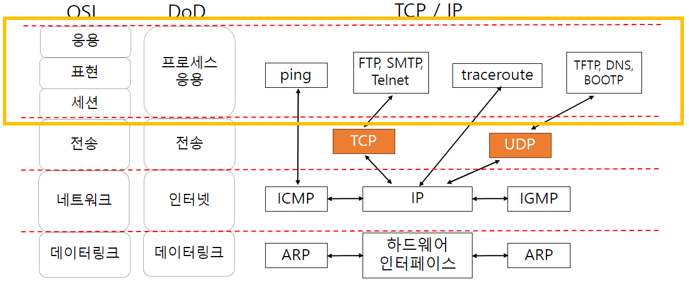
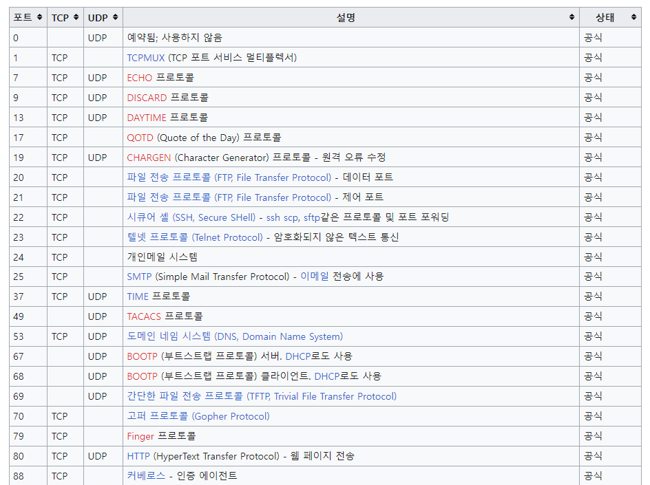
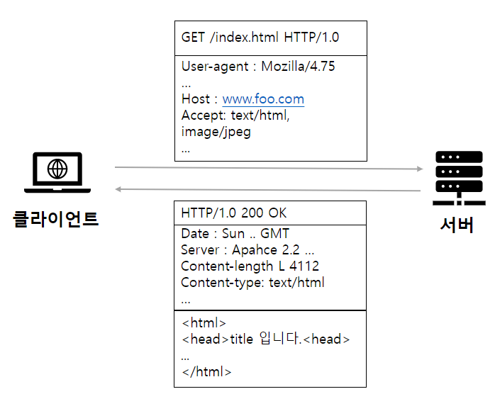
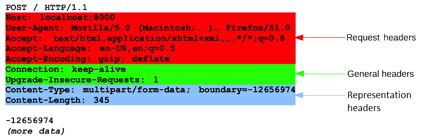
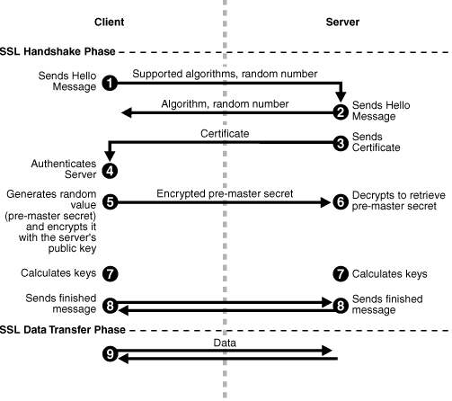

# TCP / IP 응용 계층

- 응용 계층
- 웹서비스
- 파일 전송 서비스
- 원격 접속 서비스
- 메일 서비스

## 응용계층

- 컴퓨터에서 웹사이트에 접속할 떄 필요한 프로토콜, 프로그램이 있는 계층
- 클라이언트의 요청을 전달하기 위해 서버가 이해할 수 있는 메시지로 변환하여 전송계층에 전달
- 응용 계층 프로토콜이 TCP, UDP를 통해 기능 수행
- 클라이언트는 TCP / UDP에 직접 접속 않고, 응용 계층을 통해 통신 서비스 사용
- 클라이언트 : 서비스 요청
- 서버 : 서비스 제공
- 클라이언트 < - > 서버 예시
    - 웹 브라우저 < - > 웹 서버 프로그램
    - FTP 클라이언트 < - > FTP 서버 프로그램
    - 메일 프로그램 < - > 메일 서버 프로그램

### 응용 계층 프로토콜의 종류

- TCP
    - HTTP : 웹 사이트 접속
    - FTP : 파일 전송
    - TELNET : 원격 접속
    - POP3 : 이메일 수신
    - SMTP : 이메일 발신
    - IMAP, ...
- UDP
    - DHCP, SNMP

### 포트번호 : 프로세스 구분

- 프로토콜 사용시 프로세스를 상호 구분하기 위한 포트번호 필요

## 웹 서비스

- World Wide Web WWW 개발
- 웹은 TCP / IP에 의해 동작
- 응용계층 HTTP 프로토콜 사용
- 프로토콜 리소스 대상은 HTML Hyper Text Markup Language 문서

### HTTP 프로토콜

- 클라이언트가 사이트 정보를 요청
- 서버가 정보를 응답
- URL : 요청하고자하는 리소스의 위치 주소
- MIME Multipurpose Internet Mail Extensions 정보

#### HTTP 특징

- Stateless 무상태 + Connectionless 비연결성
    - 모든 요청과 응답은 이전 http 프로토콜과 독립적
    - 요청에 필요한 모든 정보를 매번 보냄
    - 무상태 단점을 보완하기 위해 **쿠키, 세션** 사용
- 1 : N 서비스에 적합

#### HTTP 메시지

- 요청 메시지와 응담 메시지로 구분

##### 요청 메시지

##### 응답 메시지

### HTTPS 프로토콜

- HTTP + SSL Secure Socket Layer / TLS Transport Layer Security
- HTTP 의 보안 강화 버전
- SSL 이나 TLS 프로토콜을 통해 세션 데이터 암호화
- 기본 포트 443

#### HTTPS 보안키

- 대칭키
    - 암호화와 복호화에 같은 키 사용
    - 클라이언트와 서버가 공유키를 가짐
- 공개키
    - 공개키와 개인키를 함께 사용
    - 암호화할 때 공개키, 복호화할 때 개인기
- SSL Secure Socket Layer
    - 인증서 필요
    - 인증서에 서비스 정보, 서버 측 공개키 포함
- CA Certificate Authority : 인증서 발급 기관
    - 브라우저 클라이언트가 CA 리스트를 보유
    - CA 존재 확인 후 CA 공개키를 이용해 인증서 복호화

### HTTPS 동작 방식

- 대칭키, 공개키 둘 다 사용
- 대칭키 : 데이터 전송
- 공개키 : 대칭키를 안전하게 전달

*출처 : https://docs.oracle.com/cd/B14099_19/core.1012/b13995/ssl_intro.htm

1. Client Sends Hello Message : 암호화 알고리즘, SSL 버전 등 정보 전송
2. Server Sends Hello Message : 암호화 알고리즘, SSL 버전 등 정보 전송
3. Server Sends Certificate : CA 로부터 발급받은 인증서 전송
4. Authenticate Server : CA 리스트에서 인증서 확인
5. Generate random value : pre-master secret 생성
    - pre-master secret : 대칭키 생성에 사용되는 임시 키
    - pre-master secret 를 서버 측 공개키로 암호화하여 전송
6. Decrypts to retrieve pre-master secret : 서버 측 개인키로 pre-master secret 복호화
7. Calculates keys : 클라이언트와 서버 각자 SSL 세션에서 사용할 키 생성
8. Send Finished Message : Finish 메시지를 서로 전송
9. SSL handshake 종료, 데이터 전송

## 파일 전송 서비스 FTP, SFTP

- 클라이언트와 서버 간의 파일 전송을 위한 서비스
- FTP File Transfer Protocol : TCP / IP 기반
- HTTP 프로토콜로 인해 FTP 사용 줄어드는 추세
    - HTTP MIME 타입으로 파일 전송 가능
    - 클라우드, 웹 하드

### 파일 전송 서비스 개요

### FTP 프로토콜

### SFTP 프로토콜

## 참고

- https://ko.wikipedia.org/wiki/TCP/UDP%EC%9D%98_%ED%8F%AC%ED%8A%B8_%EB%AA%A9%EB%A1%9D
- https://developer.mozilla.org/en-US/docs/Web/HTTP/Messages
- https://www.ssl.com/article/ssl-tls-handshake-overview/
- https://docs.oracle.com/cd/B14099_19/core.1012/b13995/ssl_intro.htm
