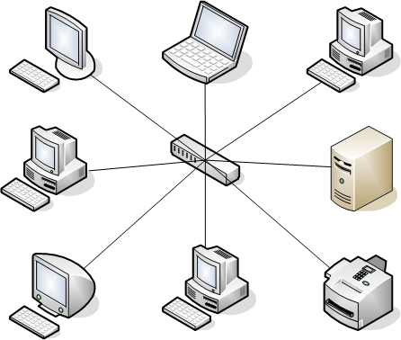
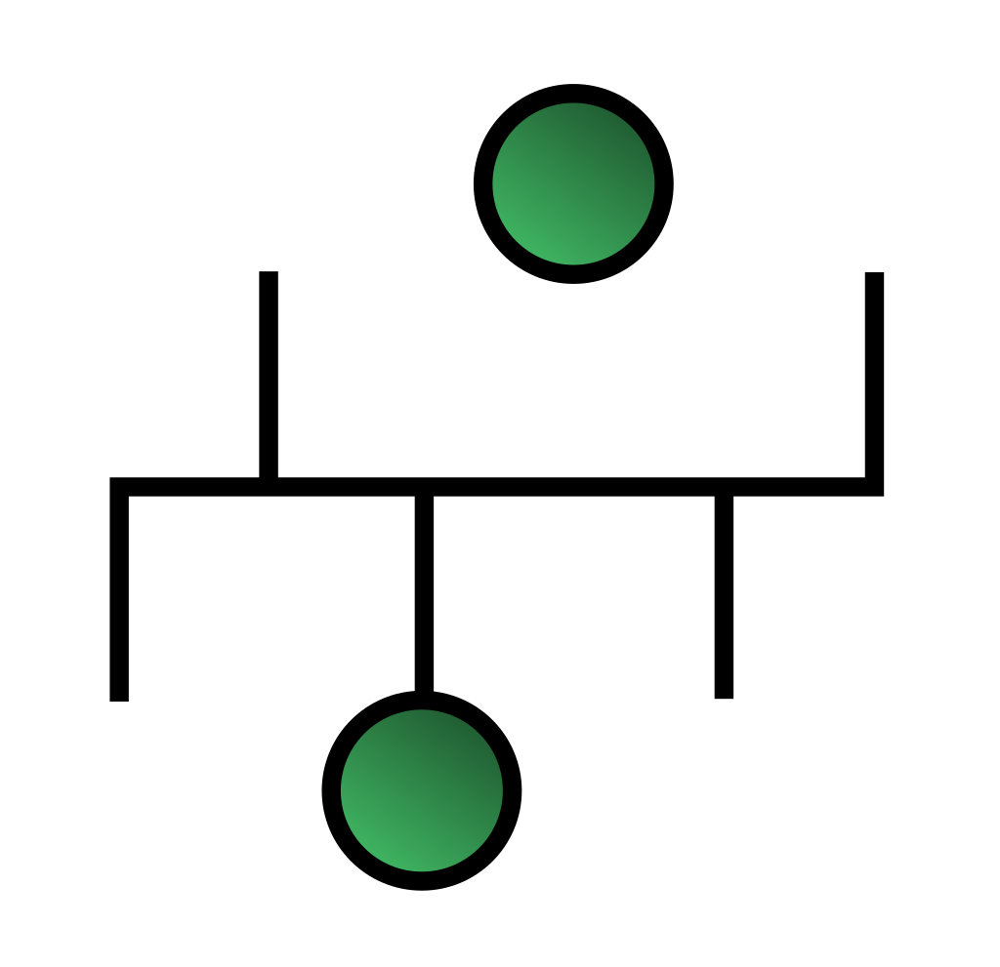
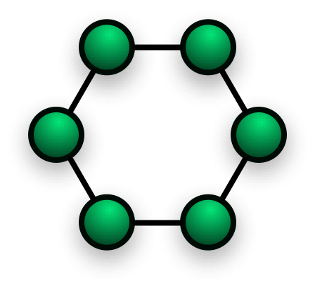
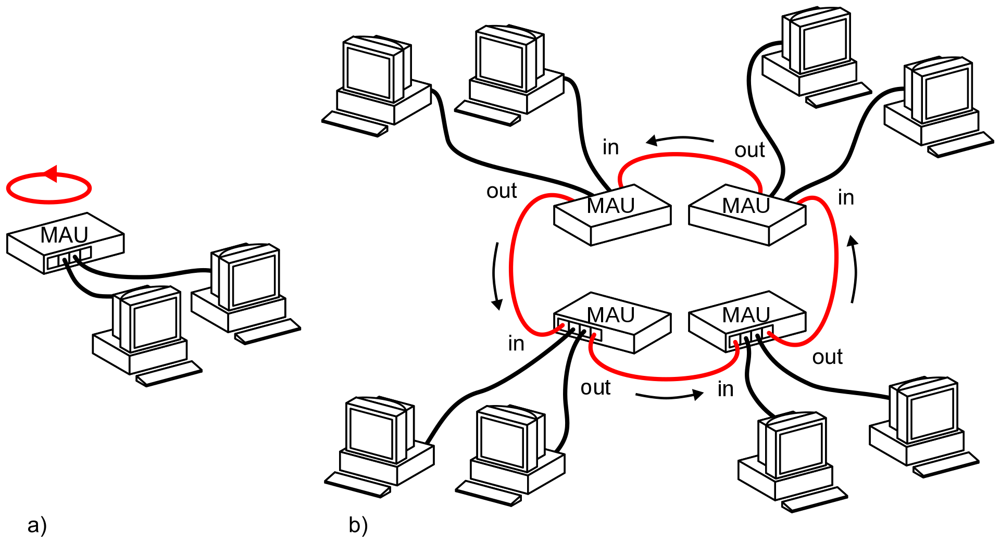
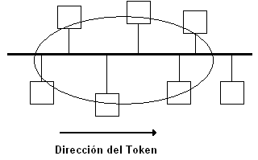

# 근거리 통신망

- 근거리 통신망
- 근거리 통신망 분류

## 근거리 통신망 Local Area Network, LAN

- 다수의 독립된 컴퓨터 기기들이 상호 통신 가능하도록 하는 데이터 통신 시스템 IEE 컴퓨터 표준위원회
- 좁은 지역 내에서 다양한 통신기기의 상호 연결을 가능케 하는 네트워크 William Stallings

> LAN의 4가지 특성
> 1. 단일기관 소유여야 한다.
> 2. 수마일 범위 이내의 지역으로 한정되어야 한다.
> 3. 어떠한 종류의 교환 기술을 사용해야 한다.
> 4. WAN과 비교하여 고속통신이 가능해야 한다.

### LAN의 특성

- **단일기관** 소유이다.
    - 행정/기술 적 제약없이 다양한 네트워크 구성 가능
- 광대역 전송매체의 사용으로 **고속통신** 가능
- 네트워크 내의 어떤 기기와도 전송 가능
    - 경우에 따라 우선순위 부여
- 패킷 지연 최소화
    - 통신거리가 제한
    - 고속 정보 전송
    - 버퍼 크기 줄임
- **라우팅 필요 없음**
    - 다른 네트워크에 연결되지 않기 때문에 별도의 전략이 필요 없음
- 낮은 오류율
    - 신뢰성
- **확장성과 재배치성**
- 종합적인 정보처리능력
    - 문자정보, 음성, 영상, 비디오 전송 가능

### LAN의 효과

- 정보자원 하드웨어/소프트웨어 공유
- 정보의 실시간 처리와 일관성
    - LAN에 연결된 모든 기기 온라인화
- 비용 절감
    - 기존에는 하나의 대형 컴퓨터에 대수의 단말기 연결
    - 새로운 컴퓨터 추가시 회선 추가 구축 필요
- 이기종 간의 통신
    - 서로 다른 노드들과 정보 교환
    - 프로토콜 변환 기능
- N:N 접속

### LAN 이용 분야

- 데이터 처리
    - 데이터 입력, 파일 전송, 질의/응답, 일괄처리, 트랜잭션
- 사무자동화
    - 문서처리, 이메일
- 공장 자동화
    - CAD/CAM, 재고관리, 장치 감독
- 원격 회의
    - 음성, 화상 정보 전송
    - 전화, 팩시밀리 등

## 근거리 통신망의 분류

#### 위상에 따라

- 성형
- 버스형
- 트리형
- 환형

#### 전송 매체에 따라

- 꼬임선 케이블 Twisted Pair Cable
- 동축 케이블 Coaxial Cable
- 광섬유 케이블 Optical Fiber Cable
- 무선 Wireless

#### 매체 접근 방식에 따라

- CSMA/CD
- Token Ring
- Token Bus

#### 전송 방식에 따라

- 베이스밴드 Baseband
- 브로드밴드 Broadband

### 성형 LAN Star

- 중앙 제어기와 모든 노드가 점대점 연결
- 장점
    - 고장 발견 쉽고 유비보수 용이
    - 한노드의 고장이 전체 네트워크에 영향 적음
- 단점
    - 중앙제어기의 고장으로 인한 마비
    - LAN 초기 설치 비용

### 버스형 LAN

- 버스 케이블에 모든 노드가 접속
- 장점
    - LAN 설치가 쉽고 구축 비용 낮음
    - 노드의 고장이 다른 네트워크에 영향 적음
- 단점
    - 베이스밴드 전송방식을 사용할 경우,
    - 전송거리가 멀어지면 신호 세기가 급격히 약해짐
    - repeater 필요

### 환형 LAN Ring

- 각 노드가 양쪽 노드와 점대점 연결
- 신호는 보통 한 방향으로만 전송
- 장점
    - 설치, 재구송 쉽고 구축 비용 낮음
- 단점
    - 노드 추가 시 선로 절단 필요
    - 통신 제어 복잡

### 트리형 LAN

- 계층형 구조
- 성형 LAN의 변형
- 장단점이 성형 LAN과 유사
- 성형 LAN에 비해
    - 여러 노드 연결 가능
    - 노드간 전송거리 증가

### 베이스밴드 LAN

- 디지털 신호 직접 전송
    - 최대 1km 마다 리피터 필요
- 하나의 고속 10Mbps ~ 채널 사용
    - 양방향 전송 가능
    - 시분할 다중화 방식 사용
- 꼬임선 케이블 or 동축 케이블 사용

### 브로드밴드 LAN

- 디지털 신호를 아날로그 신호로 변조하여 전송
- 단방향 전송 방식
    - 송신채널, 수신채널 별도 필요
- 주파수 분할 다중화
    - RF Radio Frequency 모뎀 사용
- 동축 케이블 or 광섬유 사용

### CSMA/CD

- Carrier Sense Multiple Access with Collision Detection
- 여러 통신 주체들이 동시에 통신하여 발생하는 충돌을 막기위한 프로토콜
- Ethernet에서 사용

#### 동작 방식

1. 노드는 데이터를 전송하기 전에 다른 기기가 통신 회선을 사용 중인지 점검
2. 통신회선이 사용중이라면 임의의 시간만큼 기다린 후 다시 확인
3. 사용중이지 않는 것이 확인되면 데이터 전송
4. 데이터 전송 중 충돌이 발생하면 통신 회선에 연결된 모든 노드에 jam 신호를 전송하여 충돌 사실 전파
5. 충돌이 발생하면 임의의 시간만큼 기다린 후 다시 전송

### Token Ring

- 환형 형태의 LAN을 구성한 뒤 토큰을 가진 노드만이 데이터 전송을 하게하는 제어방식
- IBM의 Ring-LAN

#### 동작 방식

1. A 노드가 자유 토큰의 상태를 '사용 중'으로 바꿈
2. A 노드가 목적지 C, 송신지 A로 기록한 뒤 데이터를 토큰에 실어 B에게 전송
3. B 는 A가 전송한 토큰의 목적지 확인 후 자기 것이 아니므로 이웃 C에게 전송
4. C는 자신의 것이므로 데이터를 수신
5. C는 토큰을 수신 완료 상태로 변경하고 이웃 D에게 전송
6. D는 자신의 것이 아니므로 이웃 A에게 전송
7. A는 자신이 보냈던 토큰이 C에게 전송되었음을 확인
8. A는 자유토큰에서 데이터 제거 후 이웃 B에게 전송

### Token Bus

- Ethernet + Token Ring
- 물리적 구성은 버스형
- 논리적 구성은 토큰링
- Data Point 사의 ARCNET

