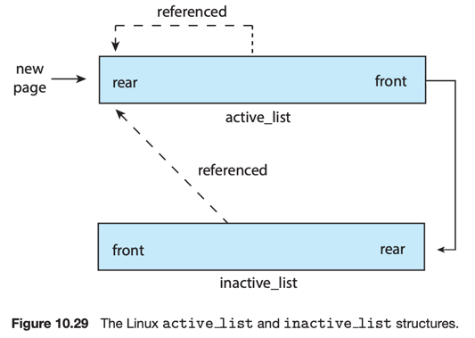

# 10. Operating System Examples

1. Linux
2. Windows
3. Solaris

---

## 1. Linux

- slab allocation, demand paging, global page-replacement (LRU-approximation clock algorithm과 유사)
- 2가지 타입의 page list : active list, inactive list
- active list : 사용 중으로 간주하는 페이지
- inactive list : 최근에 사용되지 않았고, 페이지 교체 대상으로 간주하는 페이지
- 각 페이지마다 _accessed_ bit을 가짐
    - 페이지가 사용될 때마다, _accessed_ bit을 1로 설정

### 동작

- 페이지가 최초로 할당되면, _accessed_ bit을 설정하고, active_list 의 rear에 추가
- 정기적으로 active_list의 accessed bit을 reset
- 시간이 흘러, 가장 최근에 사용된 페이지는 active_list의 front에 위치
- inactive_list의 페이지가 참조되면, _accessed_ bit을 1로 설정하고, active_list의 rear에 추가

### 밸런스 조정

- active_list가 inactive_list보다 길어지면, active_list의 front에 있는 페이지를 inactive_list로 이동
- `kswapd` 데몬 : linux의 page-out daemon process
    - 정기적으로 system의 여유 메모리 공간을 체크
    - 여유 메모리 공간이 특정 기준치에 비해 부족해지면, inactive_list를 스캔하고, 페이지를 swap out

## 2. Windows

## 3. Solaris

