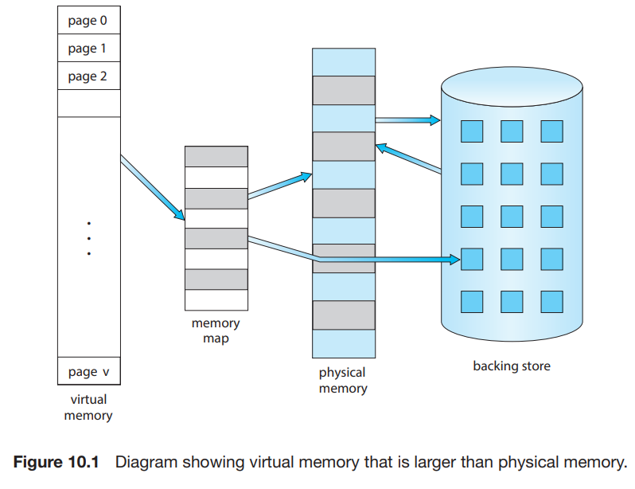
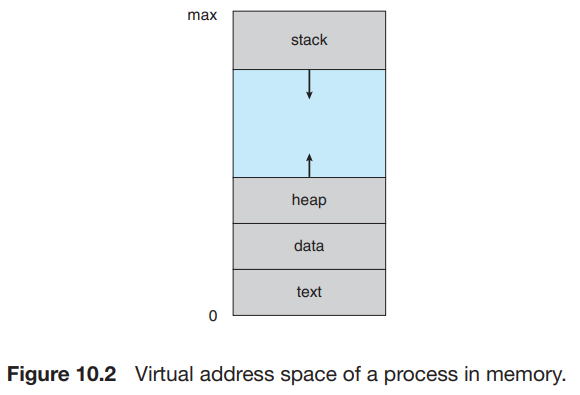

# 1. Background

### 실행할 프로그램의 모든 명령어가 physical memory에 있어야 하는가?

- 기본 전제 : 실행할 명령어는 반드시 physical memory에 있어야 함
- 프로그램 전체를 physical memory에 올리는 것은 비효율적
- 프로그램이 너무 커서 physical memory에 올릴 수 없는 경우
- 에러 처리 코드 : 에러는 발생할 수도 있고, 안할수도 있음
- 많은 메모리를 요구하는 자료구조 (Array, list, table)
- 프로그램에서 거의 사용하지 않는 기능
- 모든 명령어가 실행에 필요한다해도, 동시에 필요하지 않음

### 프로그램의 일부만 memory에 올리는 것의 장점

- physical memory 용량보다 큰 프로그램 실행 가능
- multi-programming 능력 향상 : 더 많은 프로그램을 동시에 실행 가능
- load, swap하는데 더 낮은 I/O 비용

### Virtual Memory : logical memory와 physical memory의 구분

- 개발자가 인식하는 logical memory, physical memory의 구분
- 아주 큰 logical memory를 가지고 있는 것처럼 보임
- 개발자가 physical memory 용량을 신경쓰지 않음

### Virtual address space

- process의 가상 주소 공간 (view)
- 특정 logical address에서 시작, 연속적 (인접)으로 주소 할당
    - 실제 physical memory에는 연속적으로 할당되지 않음, 각 page frame에 할당
    - MMU가 logical address를 physical address로 변환

#### sparse address space

- heap과 stack 사이에 빈 공간 (hole)
- 위로 동적으로 증가 가능
- stack은 아래로 동적으로 증가 가능
- 실제 hole은 physical memory에 존재하지 않음 (=page frame 할당 안됨)
- hole은 프로그램 실행 중에 필요할때만 동적으로 physical memory에 할당
    - e.g. stack, heap segment 증가, 동적으로 library link

### Virtual Memory : page sharing

- file, memory를 프로세스 간에 공유할 수 있음
- 표준 C library와 같은 시스템 라이브러리를 공유 가능
    - 각 프로세스는 라이브러리가 자신의 virtual address space에 있는 것처럼 인식
    - 실제 라이브러리는 physical memory에 한번만 존재
    - 일반적으로 read-only로 매핑되어 있음
- 메모리를 프로세스 간의 공유 가능 (shared memory)
    - 프로세스가 공유 메모리 공간을 만들고, 다른 프로세스가 해당 공간을 자신의 logical address space처럼 사용
    - 실제 공유 메모리 공간은 physical memory에 한번만 존재
- system call `fork()` 를 통해 page 공유 가능
    - 프로세스 생성 속도 향상
