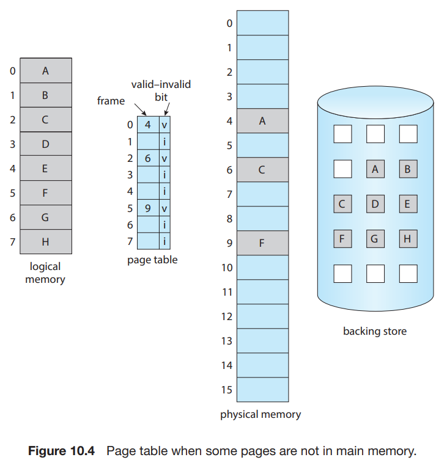
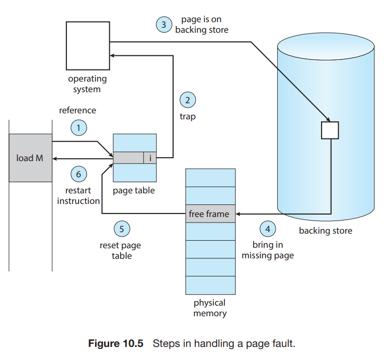

# 2. Demand Paging

1. Basic Concepts
2. Free-Frame List
3. Performance of Demand Paging

---

- 프로그램을 최초에 laod 할 때 프로그램 전체가 메모리에 올라갈 필요 없음
- **demand paging** : 필요한 부분만 메모리에 올리는 기법
    - 필요한 page만 메모리에 올림
    - swapping paging system과 비슷

## 1. Basic Concepts

- 프로세스의 일부는 2차 저장소에 있고, 일부는 메모리에 있음
- 두가지를 구분할 수 있도록 valid-invalid bit 방법을 사용
- valid : page가 유효하고, 메모리에 있는 경우
    - _유효_ : process의 logical address space에 있는 page
- invalid : page가 유효하지 않거나, 아직 메모리에 올라오지 않은 경우
    - _유효하지 않음_ : process의 logical address space에 없는 page
- page table : valid-invalid bit (or 보호 bit)
- secondary memory : main memory에 올라오지 않은 page
    - 주로 고속 Disk, NVM (Non-Volatile Memory) Device 사용
    - **swap device** : storage의 일부를 swap 목적으로 사용

### page fualt

- invalid page에 접근하려하면 **page fault** 발생

#### page fualt 처리 절차

1. internal table (주로 PCB)에서 해당 참조가 valid 여부 확인
2. invalid 라면 process termination, valid 라면 3번
3. free frame list에서 free frame 하나 가져옴
4. 2차 저장소에서 page 읽어서 free frame에 적재
5. internal table 업데이트 (page table에 valid, memory를 참조)
6. 명령 다시 시작

#### pure demand paging

- 요청하지 않은 페이지는 메모리에 올라오지 않음
- process 최초 시작 시, 아무것도 메모리에 없음
- 계속해서 page fault가 발생하면서 필요한 page를 메모리에 올림
- **locality of reference**
    - 명령어 한번에 1개 이상의 page에 접근하는 경우가 많음
    - page fault가 발생하면, 해당 page와 인접한 page를 메모리에 올림 (성능 목적)

#### page fault 문제 예시 1 : C = A ADD B

1. 명령어 `ADD` fetch
2. fetch `A`
3. fetch `B`
4. `C`에 결과 저장

- 4 에서 page fault 발생 시 최악의 경우 1~3을 다시 수행해야함

#### page fault 문제 예시 2 : 명령어가 서로 다른 위치를 수정할 떄

- IBM System 360/370 의 `MVC` 명령어 (문자 이동)
- 이동이 부분적으로 완료된 후 page fault 발생 시 재시작 과정이 복잡해짐

#### 해결방법

- 방법 1. 마이크로 코드로 block 양 끝 계산 후 access
    - 수정이 시작되기 전에 page fault 발생하게 만듦
- 방법 2. 임시 레지스터 사용
    - page fault 발생 시 이전 값을 memory 기록

## 2. Free-Frame List

- free frame pool
- page fault 발생 시 2차 저장소의 page를 메모리에 올리기 위해 사용
- system 시작 시 모든 memory가 free-frame list에 추가됨
    - 그 후 demand paging에 의해 free-frame list가 점점 줄어듦
- 어느 시점에 특정 임계값 아래로 떨어지거나 비게 되면, 전략적으로 다시 채움

#### zero-fill-on-deman

- OS가 free frame을 할당하는 방식
- page fault 발생 시, free frame에 0으로 채워진 page를 할당

## 3. Performance of Demand Paging

- **effective access time** 측정하기
- _ma_ : memory access time, 10ns
- page fualt가 없으면 _ma_ 만큼의 시간이 걸림
- page fault가 발생하면, _ma_ + @ (2차 저장소 접근 시간 등) 시간이 걸림
- _p_ : page fault rate (0~1)
- effective access time = (1 - _p_) * _ma_ + _p_ * (@ + _ma_)

### page fault 순서

1. OS를 Trap
2. register, process 상태 저장
3. pinteruupt가 page fault인지 확인
4. page 참조가 유효한지 확인 후 2차 저장소에 있는지 확인
5. storage에 free frame 읽기 명령
    1. 읽기 요청이 완료될 때까지 queue에서 대기
    2. device seek, latency 시간만큼 기다림
    3. page를 free frame에 전송 시작
6. 기다리는 동안, CPU core 는 다른 process에 할당
7. 5번이 완료되어 interrupt 발생
8. 6번에서 무언가를 하고있었다면, 2번처럼 register, process 상태 저장
9. interrupt가 5번에 의해 발생했는지 확인
10. page table, 기타 테이블 업데이트해서 page가 memory에 있는 것으로 표시
11. CPU core가 다시 process에 할당되도록 기다림
12. 2번의 데이터를 복구해서 interrupt된 명령 재시작

### page fault의 주요 task

- page fault interrupt service
- page 읽기 (가장 오래 걸림)
- process 재시작

### memory access time은 pate fault rate에 따라 달라짐

- memory access time은 apge fault rate (_p_)로부터 가장 큰 영향을 받음
- HDD로 page 장치를 사용할 경우 8ms 정도 소요됨
- 만일 다른 process가 사용중이어서 읽기까지 queue에 대기해야한다면 추가 시간 발생
- memory access time = 200ns, 평균 page-fault time = 8ms 일때
    - effective access time = (1 - _p_) * 200 + _p_ * (8ms)
    - = (1- _p_) * 200 + _p_ * (8,000,000)
    - = 200 + _p_ * (7,999,800)

### Swap space 활용 방안

- swap space : 2차 저장소에서 page를 읽어오는데 사용하는 공간
- file system으로의 I/O가 swap space보다 성능이 느림
- 방안 1. process 시작 시 file image 전체를 swap sapce에 복사해두는 것
    - 단점 : process 시작 시 file image를 복사해야함
- 방안 2. 초기에는 file system을 통해 demand paging을 실시하고, page 교체 시 swap space에 page 저장
    - 여러 OS에서 사용중인 방법 (Windows, Linux)
- 방안 3. demand paging을 file system에서만 진행
    - file system 자체가 backing store 역할
    - anonymous memory는 swap space에 저장
        - e.g. heap, stack
    - Linux, BSD UNIX 등

#### Mobile OS

- 기본적으로 swap 을 지원안함
- file system에서 demad paging 진행
- 메모리가 부족하면 application으로부터 read-only page (code)를 회수
- iOS에서는 application이 종료되지 않는한 anonymous memory page를 회수하지 않음