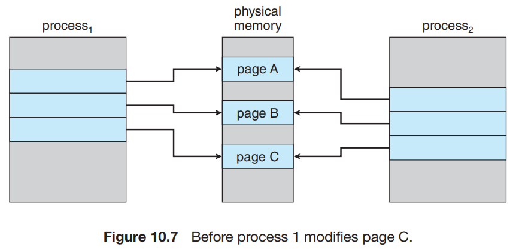
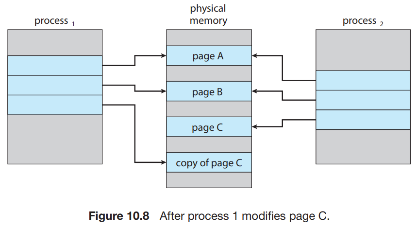

# 3. Copy-on-Write

### copy-on-write

  

- parent와 child process가 초기에 같은 page를 공유하는것
    - 공유 page에 쓰기가 발생하면, page 사본이 생성됨
- Linux, Winodows, macOS

#### 예시 : child process가 copy-on-write page를 수정 시도한다면

- OS가 free-frame list로부터 frame 획득
- page를 복사 후 주소공간을 child process에 매핑
- child process는 복사된 새로운 page에 쓰기 수행

### `vfork()` (virtual memory fork) : `fork()` 변형

- copy-on-write을 위한 `fork()` 변형
- copy-on-write를 사용안함
- child process가 parent process의 주소공간을 공유
    - **parent process의 주소 공간을 수정하지 않는다는 전제하에 사용**
- child process 가 생성 직후 `exec()`를 호출할 때 사용

#### 동작

1. `vfork()` 호출
2. parent process 중지
3. child process가 parent process의 주소공간을 공유
4. child process가 parent process의 page를 수정
5. parent process가 다시 시작 시 수정된 page를 볼 수 있음