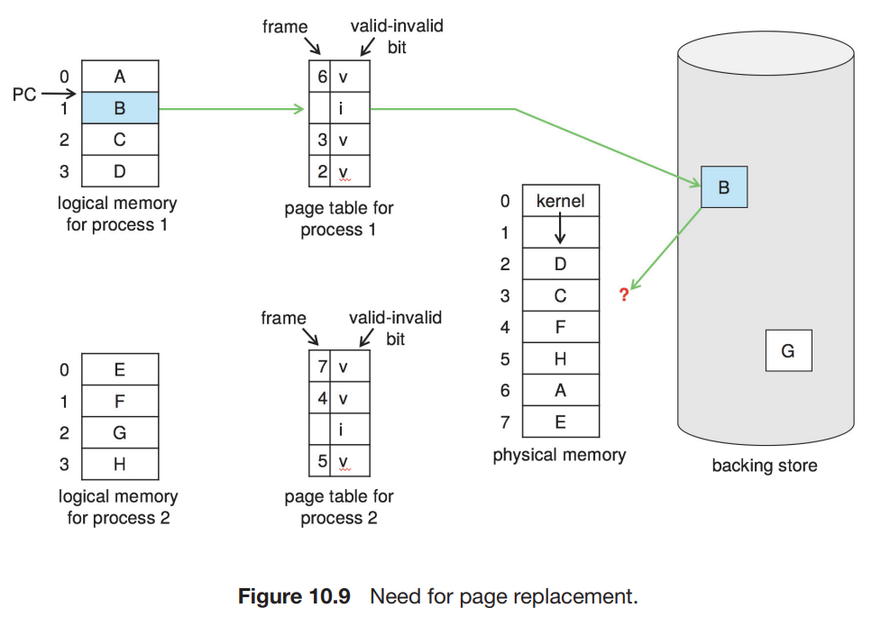
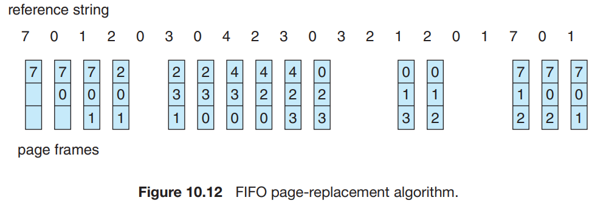
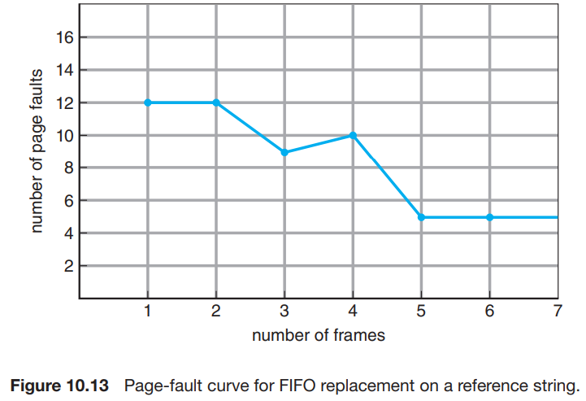
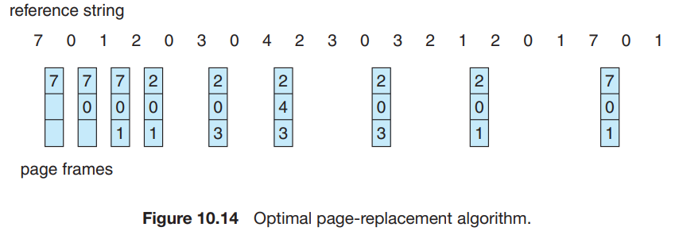
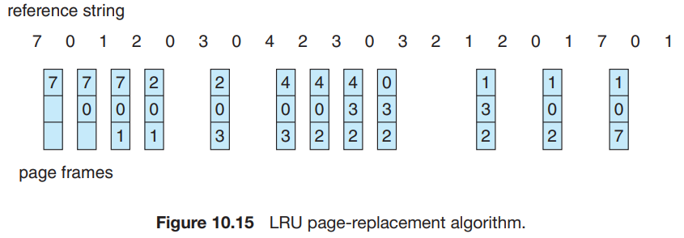
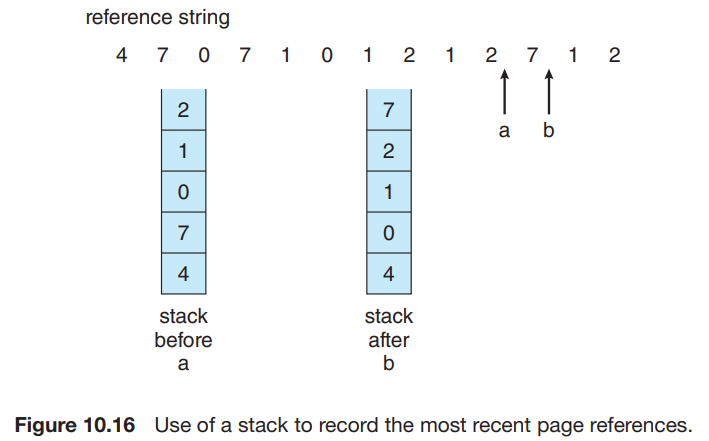
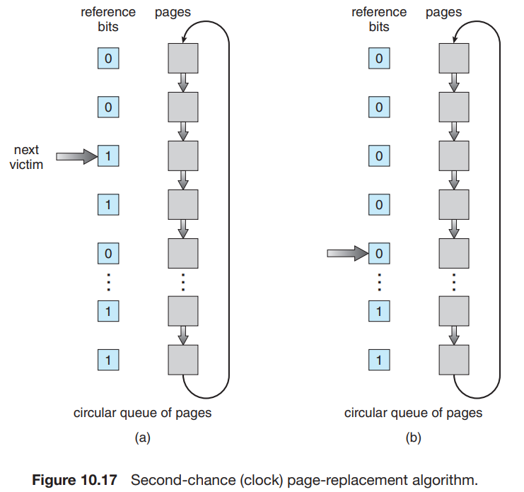

# 4. Page Replacement

1. Basic Page Replacement
2. FIFO Page Replacement
3. Optimal Page Replacement
4. LRU Page Replacement
5. LRU Approximation Page Replacement
6. Counting-Based Page Replacement
7. Page-Buffering Algorithms
8. Applications and Page Replacement

---

### over-allocating

- **over-allocating** : 실제 프로세스 frame 크기보다 더 multiprogramming 하는 것
    - 더 높은 CPU 활용도
- 총 frame 크기가 40일때,
    - 1개의 프로세스 크기가 10 page, 그 중 5개만 사용한다면,
    - multiprogramming 8개 가능

### memory-placement algorithm

- I/O, 프로그램 page에 얼마나 많은 메모리를 할당할 것인가
- I/O Buffer도 메모리를 사용

### page replacement

- page fault 발생시,
    - 찾으려는 page가 secondary storage에 있으나, **free frame이 없다면,**
- 몇가지 방법
    - 방법 1. process 종료
    - 방법 2. **page replacement** (swapping 일종)

## 1. Basic Page Replacement

최근 frame 중 사용되지 않는 것과 교체하는 방법

1. 요구한 page를 secondary storage에서 찾음
2. free frame 탐색
    1. free frame이 있다면 사용
    2. 없다면, page-replacement algorithm 실행 -> victim frame 결정
    3. page-out : victim freame을 secondary storage에 쓰고, 각 page table 수정 (valid -> invalid)
3. page-in :  요구한 page를 free frame에 쓰고, page table 수정 (invalid -> valid)
4. page fault가 발생한 process 재게

### modify bit (dirty bit)

- victim page를 page-out할 때 사용
- 각 page, frame에 modify bit를 둠
- page에 수정이 일어나면 하드웨어가 modfiy bit를 수정해 수정 여부 표시
- modify bit이 설정되어있으면 (= memory에 올린 후 수정이 일어난 적 있음)
    - page를 storage에 써야함
- modify bit이 설정되어있지 않으면 (= memory에 올린 후 수정이 일어난 적 없음)
    - page를 storage에 쓰지 않아도 됨

### frame-allocation algorithm

- multi-programming시, 각 process에 몇개의 frame을 할당할 것인가?

### page-replacement algorithm

- page replacement시, 어떤 page를 victim으로 할 것인가?
- OS마다 고유의 page-replacement algorithm을 가짐
- page-fault rate가 낮을수록 좋은 알고리즘

#### reference string

- reference string : 문자열 memory reference
- page-replacement algorithm을 테스트하기 위함
- 문자열, 난수 숫자 등의 페이지 참조를 연속으로 일으켜, page fault를 발생시키고 알고리즘을 테스트

## 2. FIFO Page Replacement

- 가장 먼저 memory에 올라온 page를 victim으로 선택
- FIFO queue 사용
    - page가 memroy에 올라오면 enqueue
- 프로그램, 알고리즘이 단순
- 성능은 별로
- 사용중인 page가 교체되면
    - 즉시 page fault가 발동되어 다른 page를 교체
    - 사용중이었던 page는 다시 memory에 올라옴
    - page-fualt rate가 높음

### Belady's Anomaly

- FIFO page-replacement algorithm이 더 많은 frame을 사용할수록 page fault가 늘어나는 현상
- `1, 2, 3, 4, 1, 2, 5, 1, 2, 3, 4, 5` reference string 예시
- 4개의 frame을 사용할 때, page fault가 10번 발생
- 3개의 frame을 사용할 때, page fault가 9번 발생
    - frame이 많으면 많을수록 page fault가 더 많이 발생

## 3. Optimal Page Replacement (OPT, MIN, statistic algorithm)

- 알고리즘 중 가장 낮은 page fault rate를 가짐
- Belady’s anomaly 해소
- 가장 오랜 시간동안 사용되지 않을 페이지를 교체
- 구현이 어려움
    - SJF CPU scheduling과 유사
- 다른 알고리들의 성능을 측정하거나 비교할 때 사용

## 4. LRU Page Replacement (Least Recently Used, stack algorithm)

- 가장 오랜 시간동안 사용되지 않은 page를 교체
    - page의 마지막 사용시점 사용
- Belady’s anomaly 해소

### 구현 방법 : 하드웨어의 도움을 받아 마지막 사용 시점을 알아내는 방법

- Counter : page table entry에 사용시점 field를 둠
    - CPU 에 logical clock (or counter)를 추가
    - memory 참조가 일어날 때마다 clock 값을 증분 후 page table entry에 저장
    - field를 기준으로 탐색 필요
- Stack : page number를 stack에 저장
    - page 참조가 일어날 떄마다 stack에서 `pop()` 후 `push()`
    - 가장 최근에 사용한 page가 항상 stack의 top에 위치
    - 가장 오랜 시간동안 사용되지 않은 page는 stack의 bottom에 위치
    - doubly linked list 사용 : stack 중간의 요소를 `pop()` 할 수 있어야함

## 5. LRU Approximation Page Replacement

- **reference bit** : page가 참조되었는지 여부를 나타내는 bit (hardware가 설정)
    - 최초에는 0
    - page 참조가 일어나면 1로 설정
- reference bit을 활용해 LRU page replacement을 흉내낼 수 있음

### 1. Additional-Reference-Bits Algorithm

- 주기적으로 reference bit 값을 추적해 ordering information 생성
- Additional-Reference-Bits (추가 참조 비트) 필요

### 동작 예시

- page마다 Additional-Reference-Bits 8-bit byte 공간을 둠
- 100ms 마다 timer interrupt 발생
- OS가 각 page들의 referenc bit을 Additional-Reference-Bits의 최상위 bit에 둠
    - 나머지 bit는 오른쪽으로 shift
- e.g. `00000000` : 8시간 동안 사용되지 않음
    - `11111111` : 100ms마다 적어도 1번 사용됨

### 2. Second-Chance Algorithm (clock algorithm)

- FIFO page replacement algorithm을 기반으로 함

### 동작 예시

- FIFO로 탐색
- page의 referenc bit이 0 -> 교체
- page의 referenc bit이 1 -> 2번째 기회를 주고 다음 FIFO page로 이동
    - 2번째 기회를 줄 때, reference bit을 0, page 도착시간 = 현재시간으로 설정
    - 따라서 다른 모든 FIFO page가 교체될 때까지 교체되지 않음

### circular queue

- Second-Chance Algorithm 구현 방법
- pointer가 다음 fifo page를 가리키도록 함
- frame이 필요해지면, pointer가 가리키는 reference bit = 0인 page를 찾을때까지 탐색
- **최악의 경우 : 모든 page의 reference bit이 1이면,**
    - queue 전체를 탐색해서 reference bit을 0으로 만들어야함
    - 즉, queue의 모든 page에 second chance를 줘야함

### 3. Enhanced Second-Chance Algorithm

- modifiy bit을 추가로 사용
- `(0, 0)` : 교체 최우선 대상, 최근에 사용되지 않음, 수정되지 않음
- `(0, 1)` : 최근에 사용되지 않음, 수정됨
- `(1, 0)` : 최근에 사용됨, 수정되지 않음
    - 바로 다시 사용될 가능성
- `(1, 1)` : 최근에 사용됨, 수정됨
    - 바로 다시 사용될 가능성
    - 교체 이전 2차 저장소에 쓰여져야함
- 위 4가지 경우를 clock algorithm으로 탐색
- **일반 clock algorithm의 차이점** : I/O수를 줄이기 위해 modify bit이 1인 page는 교체되지 않음
    - modify bit이 1인 page는 secondary storage에 쓰여져야함
    - 즉, I/O가 일어남
    - 따라서, modify bit이 1인 page는 교체되지 않음

## 6. Counting-Based Page Replacement

## 7. Page-Buffering Algorithms

## 8. Applications and Page Replacement