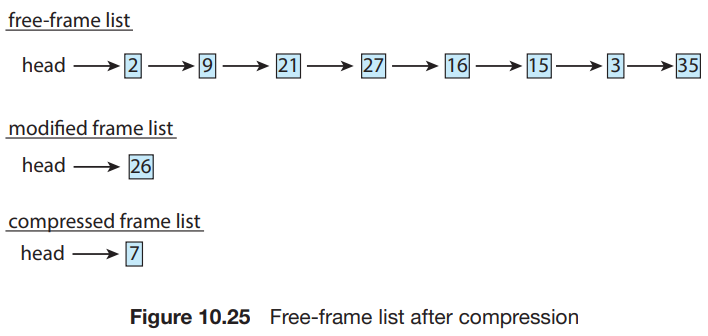

# 7. Memory Compression

### memory compression

- paging 하는 방법
- 수정된 frame을 swap sapce로 paging out 하는 대신, 압축하여 single frame에 저장

1. frame 7을 free frame list에서 제거
2. frame 15, 3, 35를 압축하여 frame 7에 저장
3. frame 7은 compressed frame list에 추가
4. 나중에 압축된 프레임 중 하나라도 참조가 일어나면 page fault가 발생 -> 압축 해제

### 적용

- 모바일 OS는 일반적인 swapping을 지원하지 않으므로, memory compression을 사용
- Windows 10, macOS도 사용
- Universal Windows Platform(UWP)
    - MS에서 개발한 앱을 위한 application platform
    - UWP 앱은 memory compression을 사용함
- macOS는 10.9 버전부터 memory compression을 사용함
    - 성능 측정 결과, memroy compression이 paging보다 빠름

### compression algorithm

- 얼마나 빨리 압축할 수 있는가?
- 얼마나 많은 압축률을 가지는가? (**compression ratio**)
    - 일반적으로, 높은 compression ratio를 가지면 더 느림
- 최근의 알고리즘들은 2가지에 균형을 맞춤
- 다중 core, 병렬로 알고리즘을 실행하면, 알고리즘 성능이 좋아짐
    - e.g. MS Xpress, Apple WKdm
