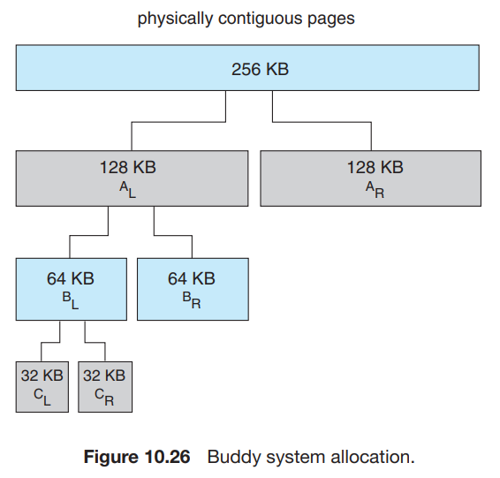
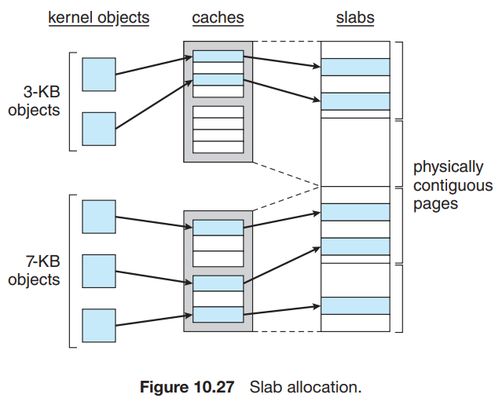

# 8. Allocating Kernel Memory

1. Buddy System
2. Slab Allocation

---

- user process가 메모리를 요청하면 kernel이 관리하는 free page frame list에서 할당
- user process가 1 byte를 요청하면 internal fragmentation이 발생
- kernel 메모리는 user process가 사용하는 free-memory pool이 아닌 다른 곳에서 메모리를 할당받아야 함
    - 이유 1. Kernel은 다양한 사이즈의 메모리를 요청 (e.g. page보다 작은 메모리)
        - fragmentation 방지를 위해
    - 이유 2. 특정 하드웨어가 사용하는 메모리는 가상 메모리 없이 직접 물리 메모리에 접근
        - 따라서 메모리가 연속적으로 할당되어야 이점이 있음

## 1. Buddy System

- 물리적으로 연속된 페이지로 이루어진 고정된 크기의 segment를 할당
- **power-of-2 allocator** : 2의 거듭제곱 크기의 메모리를 할당 e.g. 4KB, 8KB, 16KB, ...
    - e.g. 11KB를 요청하면 16KB segment를 할당

### 예시

- 256 KB의 메모리 세그먼트, kernel이 21KB 요청
- 세그먼트를 2개의 buddy로 나눔
    - AL : 128KB
    - AR : 128KB
- 그중 하나 (AL) 을 2개의 buddy로 나눔
    - BL : 64KB
    - BR : 64KB
- 그중 하나 (BL) 을 2개의 buddy로 나눔
    - CL : 32KB
    - CR : 32KB

### 장점

- **coalescing** : 메모리를 해제할 때 buddy를 합칠 수 있음
    - e.g. 32KB를 해제하면 CL과 CR을 합쳐서 BL을 만듦
- 빠르게 인접한 buddy끼리 합체할 수 있음
    - e.g. kernel이 Cl을 release하면, 시스템이 CL과 CR을 합쳐서 64KB를 만듦
- 단점 : fragmentation 발생
    - e.g. 32KB를 요청하면 64KB를 할당해야 함

## 2. Slab Allocation

- **Slab** : 1개 이상의 물리적으로 연속된 페이지로 이루어짐
- **cache** : 1개 이상의 slab로 이루어짐
    - kernel object를 저장
    - cache가 생성되면, 각각 `free` 로 마킹
- **objects** : kerner 자료구조의 인스턴스

### 동작

- 12kB slab (4KB 3개의 페이지로 이루어짐)는 2KB object 6개를 저장가능
- 최초에는 cache의 모든 object들을 free 로 마크
- kernel 자료구조에서 새로운 object가 필요해지면, allocator가 cache에서 free object를 찾아서 할당
    - use로 마크

### 예시 : process descriptor (Linux)

- process descriptor : process에 대한 정보를 저장하는 자료구조
    - `struct task_struct` 타입, 1.7 kB 필요
- Linux kernel이 새로운 task를 만들면, cache에서 `struct task_struct` 를 위한 메모리를 cache에 요청
    - cache가 slab에 free로 마크된 `struct task_struct` 를 찾아서 할당

| 상태      | 설명                         |
|---------|----------------------------|
| Full    | slab의 모든 object가 used로 마크됨 |
| Empty   | slab의 모든 object가 free로 마크됨 |
| Partial | slab의 일부 object가 used로 마크됨 |

- slab allocator는 첫번째로 partial slab에서 free object를 찾음
    - 없으면, empty slab에서 free object를 찾음
    - 없으면, 새로운 slab을 연속되 page에 할당하고, cache에 추가한 뒤 할당

### 장점

- fragmentation이 발생하지 않음
    - 각 고유한 kernel 자료구조마다 cache가 있음
    - 각 cache는 1개 이상의 slab으로 이루어짐
- 메모리 할당이 빠름
    - object가 자주 할당/비할당 될 때 유용

### Linux

- Linux는 budyy system을 사용하다 2.2 부터 kernel이 slab allocator를 사용
- `SLAB` 으로 slab을 구현
- 최근 Linux는 2개의 kernel memory allocator를 사용
- `SLOB` : 한정된 메모리 자원에 적합 (e.g. embedded system)
    - "simple list of blocks"
    - _small_ : 256 bytes 이하의 object를 할당
    - _medium_ : 1024 bytes 이하의 중간 크기 object를 할당
    - _large_ : page size보다 작은 크기의 object를 할당
- `SLUB` : Linux kernel 기본 allocator
    - SLAB 대체
    - processor가 많은 시스템에 적합
    - SLAB는 메타데이터를 각 slab에 저장하는 반면에,
        - SLUB는 `page` sturuture에 저장
    - SLUB는 CPU마다 queue를 유지하지 않음