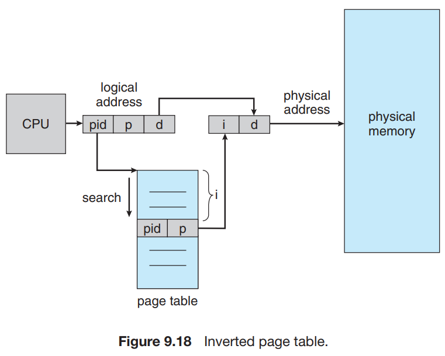
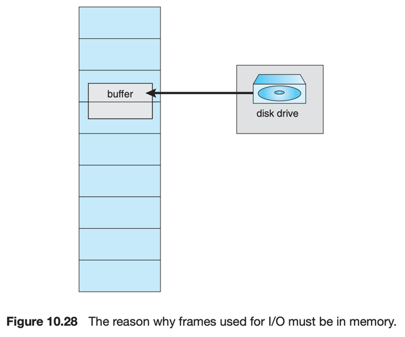

# 9. Other Considerations

1. Prepaging
2. Page Size
3. TLB Reach
4. Inverted Page Tables
5. Program Structure
6. I/O Interlock and Page Locking

---

- paging system의 가장 메인 이슈는 replacement algorithm, allocation policy
- 그 외의 고려사항들은?
    - prepaging
    - page size
    - TLB reach
    - inverted page tables
    - program structure
    - I/O interlock and page locking

## 1. Prepaging

- **Prepaging** : 메모리에서 필요할 일정량 (또는 전체)의 page를 미리 한번에 가져오는 전략
- e.g. working-set model에서 미리 process마다 page 리스트를 만들어두고, 이 리스트에 있는 page를 미리 가져옴
    - process가 중단되면 working set을 기억해두었다가 다시 시작할때 전체 page 리스트를 가져옴
- 고려사항 : prepaging 비용 vs page-fault 비용
- Linux `readahead()` system call : contents의 파일을 메모리에 prefetch

## 2. Page Size

- 새로운 머신을 설계할 때 최적의 페이지 사이즈를 결정해야함
- 2의 거듭제곱으로 정의됨 (4096 ~ 4194304 bytes)
- 페이지 사이즈가 작으면 -> 내부 fragmentation, locality 이득
- 페이지 사이즈가 크면 -> 테이블 사이즈, I/O time 이득
- 역사적으로 트렌드는 더 큰 page size

#### 고려사항 : page table 크기

- 페이지 사이즈가 작을수록 page 수가 증가
- 가상 메모리 4MB가 주어지면, 1024 bytes(1 KB) 페이지 사이즈는 4096개의 page 수를 가짐
    - 실제로는 8192 bytes(8 KB) 페이지 사이즈로 512개의 page 수를 가짐
    - 각 active process가 자신의 page table의 복사본을 가져야하기 떄문 (* 2)

#### 고려사항 : page read/write 시간, 페이지 크기

- HDD이면 I/O 시간은 탐색, 대기, 전송으로 구성 (seek, latency, transfer)
- 탐색 시간이 페이지 크기와 연관
- 총 I/O 시간에서 탐색 시간은 0.01 %
- 페이지 크기를 늘려도 I/O 시간은 크게 변화하지 않음

#### 고려사항 : 페이지 크기

- 페이지 크기가 줄어들면 전체 I/O가 줄어듦 (locality 증가)
- 각 페이지의 program locality 정확도가 올라감
- e.g. 200KB 크기의 process가 100KB 를 실행 중이면,
    - 큰 페이지를 하나 가지고 있으면, page 전체를 가져와 200KB 전체를 transfer, allocate
    - 1byte page를 가지고 있으면, 100KB만 가져와 100KB만 transfer, allocate
- 페이지 크기가 작을수록 page fault 수가 늘어남
    - page fault 오버헤드 : 인터럽트, register 저장, page 교체, queueing, table 업데이트

## 3. TLB Reach

- TLB (Translation Lookaside Buffer) : page table의 일부를 저장하는 cache
- TLB **hit ratio** : 가상주소 변환이 page table이 아닌 TLB에서 일어나는 비율
- hit ratio는 TLB entiry 수에 비례
- TLB 관련 메모리는 비용이 비쌈

#### TLB Reach

- **TLB Reach** : TLB가 접근할 수 있는 메모리 공간 (page size의 배수의 entiry 수)
- 방법 1 : working set을 TLB에 저장
    - working set이 TLB에 저장됨
    - TLB에 없으면, 프로세스는 page table을 통해 메모리 참조를 일으킴
    - memory-intesive application은 비효율 적인 방법
- 방법 2 : page size를 증가하거나, page size를 2배로 제공하는 방법
    - page size를 증가하면 (4KB -> 16KB) TLB reach가 4배로 증가
    - 큰 page size를 요구하지 않는 application에서는 fragmentaion 증가
    - e.g. Linux는 4KB 페이지 사이즈를 제공하고, **huge page** 를 (더큰 사이즈의 page) 제공

#### 예시 : ARMv8 architecture

- page와 region들의 크기가 서로 다름
- 각 TLB entry에 **contiguous bit**을 둠
- 특정 TLB entry에 있는 contiguous bit은 연속적인 메모리 block에 매핑됨
    - 방법 1. 64-KB TLB entryf를 16 * 4KB 근접 block으로 구성
    - 방법 2. 1-GB TLB entry를 32 * 32MB 근접 block으로 구성
    - 방법 3. 2-MB TLB entry를 32 * 64KB 혹은 128 * 16KB 근접 block으로 구성

## 4. Inverted Page Tables



- 물리 메모리의 page마다 entry에 매핑되는 하나의 table
- 가상 메모리와 physical frame간의 매핑 정보를 table에 저장

#### external page table(각 process마다 가지는 page table)

- Inverted Page Table 단점 : process의 가상 주소 공간에 대한 완전한 벙보를 포함하지 않음
- 참조가 일어난 페이지가 memory에 있는지 알 수 없음
- 따라서 external page talbe(각 process마다 가지는 page table)을 유지해야함
    - 전통적인 page table과 비슷
    - virtual page의 위치를 저장
- external page table은 page fault 시에만 사용

## 5. Program Structure

- demand paging은 메모리 구조를 분석하여 잘 설계할수록 시스템 성능이 좋아짐

#### 예시 : - 1 page 크기가 128 word 일 때

- `data`는 1 row당 1 page를 사용

````
int i, j;
int[128][128] data;

for (j = 0; j < 128; j++)
    for (i = 0; i < 128; i++)
        data[i][j] = 0;
````

- `data[0][0], data[1][0], data[2][0], ...` 순으로 메모리에 올라감
- 각 페이지마다 0씩 초기화하면서 시작
- 문제 : OS가 128 frame 미만으로 할당하면, 16,384 (128 * 128) page fault가 발생

````
int i, j;
int[128][128] data;
for (i = 0; i < 128; i++)
    for (j = 0; j < 128; j++)
        data[i][j] = 0;
````

- `data[0][0], data[0][1], data[0][2], ...` 순으로 메모리에 올라감
- 다음 페이지를 할당하기 전에, 이전 페이지를 모두 0으로 초기화

#### compiler와 loader 성능

- code와 data를 분리하면, code page는 read-only로 설정 가능
- clean page는 page-out 할 필요가 없음
    - clean page : page가 disk에 있는 것과 동일한 내용을 가지고 있는 page
- loader는 page boundary를 가로지르는 routine을 피함

## 6. I/O Interlock and Page Locking



- Demand paging에서 몇 page를 memory에 **locked** 을 허용할 필요가 있음
    - user memory로부터 I/O가 완료되었을 떄
        1. USB storage device의 controller 가 전송할 bytes 수와 buffer 메모리 주소를 받음
        2. 전송이 완료되면, CPU에 interrupt를 발생시킴

#### 문제점

1. process A가 I/O request를 보내고, I/O device를 위해 enqueue
2. CPU는 다른 process들을 실행하러감
3. 다른 프로세스들에서 page fault 발생 (global replacement alorithm을 사용 중)
    - waiting process를 위한 memory buffer를 포함하는 페이지를 교체
    - page out
4. 조금 뒤
5. process A의 I/O request가 queue의 head에 도달
6. I/O 가 지정된 주소를 발행하지만, 해당 주소의 frame은 다른 process의 page로 사용중

#### 해결방안 1. I/O를 절대 user memory에서 실행하지 않음

- data를 항상 system memory와 user memeory간에 복사해서 사용
- I/O는 system memroy와 I/O device에서만 발생
- e.g. tape에 wirte을 해야한다면,
    1. system memory로 block을 copy
    2. I/O device로 block을 write
- 문제점 : overhead
    - 추가 copy가 필요함

#### 해결방안 2. memeory에 page를 locked

- 모든 frame에 lock bit
- frame이 locked되면, replacement algorithm은 해당 frame을 무시
- e.g. disk에 blockd을 write해야한다면,
    1. block을 가진 page를 memory에 lock
    2. lock된 page는 replacement algorithm에서 무시
    3. wirte이 종료되면, page를 unlock

### Lock bit

- Lock bit의 위험함
    - on되지만 절대 off되지 않을 수 있음
    - 즉, locked frame이 unusable이 될 수 있음

#### Lock bit 사용처 1. user process (e.g database)

- 자주 몇몇 혹은 모든 OS kernel이 memory에 locked
    - 대부분의 OS는 kernel (or kernel module)이 일으킨 page fualt를 막음
- user process도 page locking이 필요할 수 있음
    - e.g. database process는 memory chunk를 관리
        - e.g. 2차 저장소와 memory간에 block을 복사할 때
- page **pinning** (고정) : page를 memory에 lock하는 것
    - 대부분의 OS에서 application이 논리적 주소공간을 특정 영역에 고정되도록 허용하는 system call을 제공

#### Lock bit 사용처 2. 일반적인 page 교체 알고리즘

1. 낮은 우선순위의 process 가 page fault를 일으킴
2. paging system이 필요한 page를 찾아 memory에 올림
3. process는 ready queue에 enqueue
4. 프로세스의 우선순위가 낮기 때문에 CPU scheduler는 해당 process를 얼마동안 실행하지 않음
5. 높은 우선순위의 프로세스가 page fault를 일으킴
6. 낮은 프로세스 떄문에 올라갔지만 사용되지 않는 page로 교체