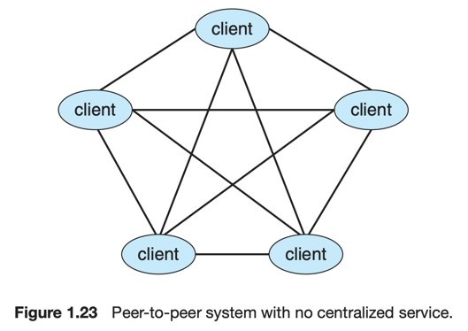
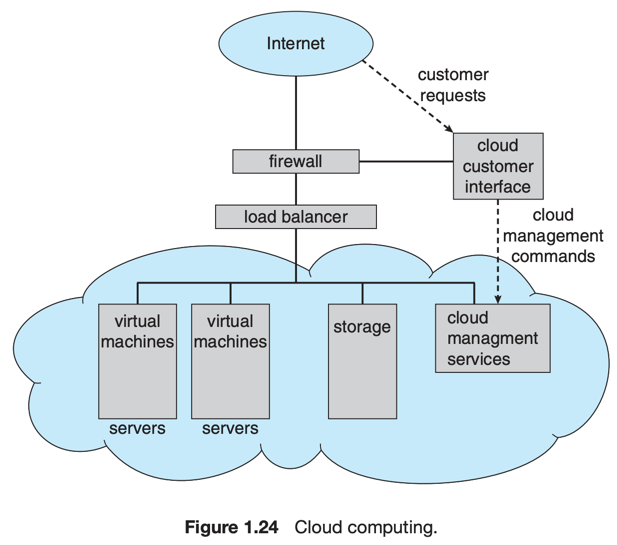

# 10. Computing Environments

1. [Traditional Computing](#1-traditional-computing)
2. [Mobile Computing](#2-mobile-computing)
3. [Client-Server Computing](#3-client-server-computing)
4. [Peer-to-Peer Computing](#4-peer-to-peer-computing)
5. [Cloud Computing](#5-cloud-computing)
6. [Real-Time Embedded Systems](#6-real-time-embedded-systems)

---

OS는 다양한 컴퓨팅 환경에서 사용되고 있다.

## 1. Traditional Computing

### 컴퓨팅 기술의 발전

- 발전에 따라 전통적인 컴퓨팅 환경이 사라져감
    - PC -> 모바일 기기
    - WAN 대역폭 증가, 무선 네트워크
    - 네트워크 비용 감소로 가정에서도 많은 데이터에 접근
    - 가정에서도 방화벽으로 네트워크 보호

### time-sharing system

- 컴퓨팅 자원이 부족하던 20세기 후반,
    - 여러 사용자가 컴퓨터를 공유하는 시스템이 등장
- 컴퓨팅 자원을 최적화하기 위해 타이머, 스케쥴링 알고리즘을 사용 각 사용자에게 자원 할당
- 현재도 스케쥴링 기술을 사용하지만 기술의 발전으로 인해 사용자가 느끼는 시스템의 응답성이 향상되었다.

## 2. Mobile Computing

- 손에 들고 있는 컴퓨팅
- 휴대성, 가벼움
- 과거의 기능제약이 많이 사라짐 e.g. 이메일, 웹 서핑 등
- 모바일 OS : 안드로이드, iOS

### 특징

- global positioning system (GPS)
    - 위성 사용 가능
    - 네비게이션, 위치 추적 등
- accelerometer 가속도계
    - 기기 방향, 기울기, 흔들림 등을 감지
    - 게임 등에서 사용
- gyroscope 자이로스코프
- PC 보다 떨어지는 메모리 용량과 처리 속도

## 3. Client-Server Computing

- 현대 네트워크 아키텍쳐의 기본 특징
- 서버 시스템이 클라이언트 시스템의 요청을 처리하는 구조
- 분산 시스템 특화

### 종류

- compute-server system 컴퓨팅 서버 시스템
    - 클라이언트 시스템이 요청을 보낼 수 있는 인터페이스 제공 e.g. 데이터 읽기
    - 응답으로 요청을 처리하고 결과를 클라이언트 시스템에 전달
    - e.g. 데이터베이스 시스템 : 클라이언트가 데이터를 읽거나 쓸 수 있도록 인터페이스 제공
- file-serve system 파일 서버 시스템
    - 클라이언트가 파일을 읽거나 쓸 수 있도록 인터페이스 제공
    - e.g. 웹서버 : 클라이언트가 요청한 리소스를 웹브라우저로 전달

## 4. Peer-to-Peer Computing P2P

- 클라이언트와 서버의 구분이 없는 시스템
- 각 시스템이 서로 클라이언트와 서버의 역할을 수행
- 클라이언트-서버 시스템보다 더 이점을 가짐
    - 서버의 bottleneck 문제

### 구조

- p2p에 참여하기 위해 노드는 먼저 피어 네트워크에 참여
- 어떤 서비스를 이용 가능한지 확인하는 방법
    - centralized lookup service
        - centralized lookup service에 본인 노드를 등록
        - 본인이 원하는 서비스를 제공하는 peer를 찾기 위함
        - 이후 해당 peer와 통신
    - broadcast
        - 다른 모든 노드에게 본인이 원하는 서비스를 제공하는지 알림
        - 해당 서비스 제공 노드는 응답
        - discovery protocol 필요 : 네트워크 내 서비스를 제공하는 peer를 찾는 프로토콜

### 예시

- file sharing e.g. Napster, Gnutella
    - peer가 파일을 공유
    - 다른 peer가 해당 파일을 요청하면 peer가 파일을 전송
    - 저작권 관련 법적 이슈로 shutdown
- Skype
    - voice over IP VoIP 기술 사용
    - 클라이언트가 음성, 비디오, 메시지를 다른 클라이언트에게 전송
    - 하이브리드 방식
        - peer-to-peer 방식으로 음성, 비디오 전송
        - 서버를 사용하여 사용자가 온라인인지 확인

## 5. Cloud Computing

- 컴퓨팅, 스토리지, 어플리케이션 등을 네트워크를 통해 서비스로서 제공하는 컴퓨팅
- 논리적으로 가상화의 확장 형태
- Amazon Elastic Compute Cloud EC2
    - 수천개의 서버, 수만개의 가상머신, PB 단위의 스토리지를 인터을 통해 사용하게 제공
    - 사용자는 월별로 사용한 만큼만 비용 지불

### 클라우드의 다양한 형태

- Public Cloud : 누구든지 인터넷을 통해 돈을내고 사용 가능한 클라우드
- Private Cloud : 특정 조직이나 기업 내부에서만 사용 가능한 클라우드
- Hybrid Cloud : Public Cloud와 Private Cloud를 혼합한 형태
- Software as a Service SaaS : 인터넷을통해 하나 이상의 어플레케이션을 제공 e.g. google spreadsheet
- Platform as a Service PaaS : 인터넷을 통해 하나 이상의 어플리케이션을 개발, 실행, 관리할 수 있는 소프트웨어 스택 제공 e.g. google app
  engine
- Infrastructure as a Service IaaS : 인터넷을 통해 하드웨어, 스토리지, 네트워크 등의 컴퓨팅 리소스를 제공 e.g. Amazon EC2

## 6. Real-Time Embedded Systems

### Embedded System

- 가장 보현화된 컴퓨터
- e.g. 자동차, 비행기 등의 하드웨어 장치 모니터링, 관리
- 원시적이고 OS는 제한된 기능을 제공
- 사용자 인터페이스가 거의 없음
- 네트워크, 웹과 조합되어 사용량이 늘고 있음
    - e.g. 집 전체를 네트워크화하여 웹을 통해 관리 등

### Real-Time System

- 프로세서 동작, 데이터 흐름에 대해 **엄격한 시간 요구사항**이 부과
    - 시간 제약 조건 : 시간과 관련하여 동작해야하는 제약 조건
- 주로 전용 어플레키에션의 제어장치로 사용
- 센서가 데이터를 컴퓨터로 가져와 분석, 시스템 제어, 센서 입력 수정 등을 수행
- e.g. 의료 영상 시스템, 산업 제어 시스템 등
- 임베디드 시스템은 대부분 실시간 시스템를 사용