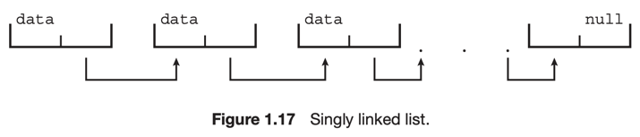
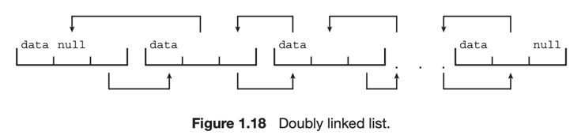

# 9. Kernel Data Structures

1. [Lists, Stacks, and Queues](#1-lists-stacks-and-queues)
2. [Trees](#2-trees)
3. [Hash Functions and Maps](#3-hash-functions-and-maps)
4. [Bitmaps](#4-bitmaps)

---

OS가 시스템에서 데이터를 구조화하는 방법

> ### LINUX KERNEL DATA STRUCTURES
>
> 리눅스 커널 코드에서 자료구조 사용 가능
> ```shell
> # include file linked-list
> <linux/list.h>
> ```

## 1. Lists, Stacks, and Queues

### List

- 순서를 가지는 데이터 집합 <sub>e.g. linked list</sub>

  
  
  

- linked list : 노드가 자신의 후계자 노드를 가리킴
- doubly linked list : 노드가 자신의 후계자 노드와 선행자 노드를 가리킴
- circular linked list : 마지막 노드가 첫번째 노드를 가리킴

#### 특징

- 노드의 추가/삭제가 용이함
- 크기가 n인 리스트의 최악 시간 복잡도는 O(n)
- 커널 알고리즘에서 직접 사용되기도 함
- 스택, 큐를 구현하기 위한 수단으로도 사용

### Stack

- Last In First Out <sub>LIFO</sub>
- push : 스택에 데이터를 추가
- pop : 스택에서 데이터를 제거

#### 특징

- OS는 스택을 사용하여 함수 호출을 관리함
- push : 함수 호출 시 파라미터, 지역 변수, 리턴 주소를 스택에 저장
- pop : 함수 호출이 끝나면 스택에서 제거

### Queue

- First In First Out <sub>FIFO</sub>
- e.g.
    - 프린터에 출력할 문서들의 대기열
    - CPU에서 실행할 프로세스들의 대기열

## 2. Trees


- 데이터구조가 계층 구조를 가짐
- general tree : 각 노드가 무한히 자식을 가질 수 있음
- binary tree : 각 노드가 최대 두개의 자식을 가질 수 있음
- binary search tree
    - 각 노드가 최대 두개의 자식을 가질 수 있음, 왼쪽 자식은 부모보다 작고 오른쪽 자식은 부모보다 큼
    - 특정 노드를 찾는데 최악의 시간 복잡도는 O(n)
- balanced binary search tree
    - 트리의 높이가 O(log n)이 되도록 트리를 재구성
    - CPU 스케줄링 알고리즘에서 사용

## 3. Hash Functions and Maps

- 데이터를 입력받아 숫자연산을 수행하여 값 반환
- 반환된 숫자값을 테이블의 인덱스로 사용하여 데이터를 빠르게 검색
- 구현에 따라 시간 복잡도는 O(1)
- OS에 광범위하게 사용
- 서로 다른 입력에 같은 출력이 나올 수 있음

### Hash Map


- 해시함수를 사용해 키와 값의 쌍으로 데이터를 저장하는 자료구조
- 해시 함수에 키를 입력하면 해시값을 얻을 수 있음

## 4. Bitmaps


- n개의 이진숫자로 구성된 문자열
- n개의 항목의 상태를 표현
- 예를 들어, 0 : available, 1 : not available 일 떄
    - 위 사진에서 리소스 2, 4, 5, 6, 8 사용 불가

### 특징

- 공간 효율성이 좋음
    - 8 비트 부울 변수를 사용하는 것보다 1 비트를 사용하는 것이 효율
- 주로 많은 리소스의 사용 여부를 표현하는데 사용
    - e.g. 디스크 드라이브의 디스크 블록 사용 여부를 표현하는데 사용