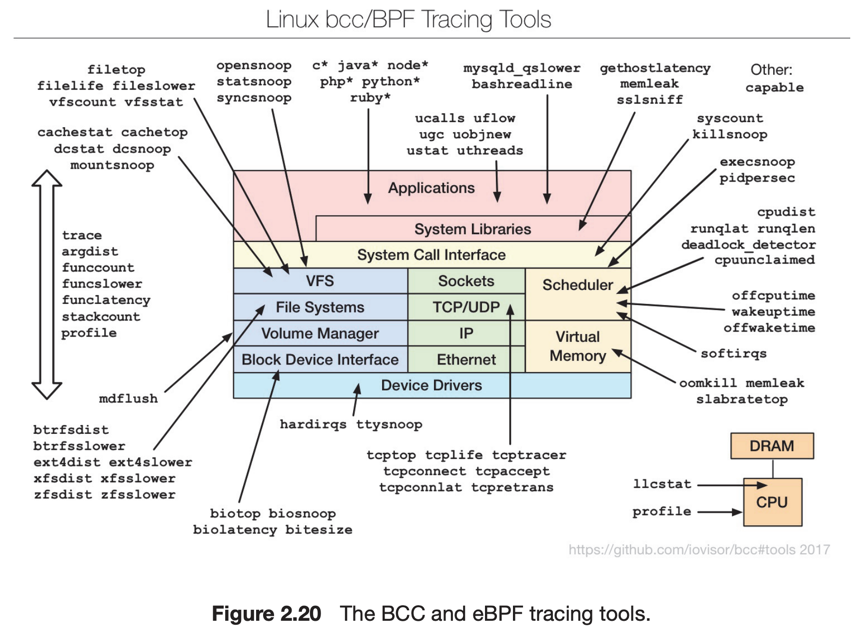

# 10. Operating-System Debugging

1. Failure Analysis
2. Performance Monitoring and Tuning
3. Tracing
4. BCC

---

debugging 은 하드웨어, 소프트웨어 전반에 걸친 문제를 잡는 것.  
프로세스 병목현상을 제거하는 성능 튜닝 등

## 1. Failure Analysis

- log file : OS가 에러정보를 로깅
- core dump : 프로세스의 메모리 정보에 대한 캡쳐
- crash : 커널의 작업 실패
- crash dump : crash 발생시 메모리의 메모리의 상태 정보

## 2. Performance Monitoring and Tuning

프로세스 병목현상을 제거하려면 시스템 성능을 모니터링 해야함

- 프로세스별 모니터링
- 시스템 전체 모니터링
- Counter, Tracing 방법 이용

### 2.1 Counters

- 만들어진 System call의 수, network 기기, 디스크를 위해 수행하는 명령 수 등
- ex. Linux `/proc` 파일 시스템 , Windows 작업 관리자
    - 프로세스별 : `ps`, `top`
    - 시스템 전체 : `vmstat`, `iostat`, `netstat`

## 3. Tracing

- 시스템의 특정 이벤트를 추적
- ex. Linux
    - 프로세스별 : `strace`, `ltrace`
    - 시스템 전체 : `perf`, `tcpdump`

## 4. BCC

- BPF Compiler Collection
- 동적이고, 안정적이며, 성능에 영향을 주지 않는 리눅스 디버깅 toolkit
- live production을 모니터링하는데 특화
- Python으로 프론트엔드 인터페이스 제공
- 내부는 C로 구현된 eBPF extended Berkeley Packet Filter
- `./disksnoop.py` : 디스크 I/O 추적
- `./opensnoop -p 1225` : `open()` System call 을 유발한 1225 PID 프로세스 추적