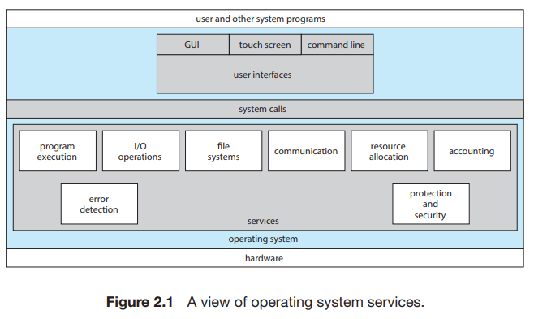

# 1. Operating-System Services

--- 

### OS는 사용자에게 유용한 실행 환경을 제공한다

 

#### User interface UI, 사용자 인터페이스

- 주로 graphical user interface GUI, 그래픽 사용자 인터페이스를 사용
    - 윈도우 시스템 : 마우스 인터헤이스
    - 모바일 시스템 : 터치 스크린 인터페이스
- command-line interface CLI : 텍스트 명령어를 통해 제어

#### Program execution 프로그램 실행

- 프로그램 실행을 위해서는 반드시 메모리에 로드해야함
- 실행은 정상/비정상적으로 종료 가능

#### I/O operations 입출력 연산file, device을 수행할 수 있음
- OS는 반드시 I/O 제어 수단을 제공해야 함
    - 효율과 보호를 위해, 사용자는 직접적으로 I/O 장치를 제어할 수 없음

#### FIle-system manipulation 파일 시스템 조작ㅐ

- 프로그램은 파일/디렉터리를 읽고 써야함
- 몇 OS는 파일이나 디렉터리에 파일 소유권 기반의 접근 제어를 제공
- OS는 다양한 파일 시스템을 가지므로 특수한 선택권이나, 제어 옵션을 제공하기도 함

#### Communications 통신

- 프로세스는 다른 프로세스와 정보를 교환할 환경에 놓여짐
- 같은 컴퓨터 내의 프로세스 통신 or 다른 컴퓨터 내의 프로세스 통신 via network
- 통신 수단 : shared memory, message passing
    - shared memory 공유 메모리 : 2개 이상의 프로세스가 공유 메모리 부분에 읽고 씀
    - message passing 메시지 전달 : 사전에 정의된 포맷의 패킷형태로 프로세스 간에 메시지를 교환

#### Error detection 오류 탐지

- 에러는 CPU, 메모리, I/O 장치 등의 하드웨어에서 언제든지 발생 가능
    - e.g. 메모리 에러, 네트워크 접속 에러, 프린터기 종이 부족 등
- OS는 에러를 탐지하고 컴퓨팅을 지속할 수 있는 적절한 행동을 취해야함
- 에러가 발생하면 다음과 같은 조치들이 가능
    - 에러 유발 프로세스 종료
    - 에러코드 반환하여 프로세스가 적절히 조치하도록 함

#### Resource allocation 자원 할당

- 동시에 여러 프로세스가 실행 중일때, 각각 리소스가 할당되어야함
- OS는 다양한 형태의 리로스를 관리함
- e.g. CPU 스케쥴링, I/O 장치 관리 등

#### Logging

- 어떤 프로그램을 얼마나 사용하는지, 어떤 종류의 프로그램을 사용하는지 등에 대한 추적
- 사용 통계 등을 축적
- 이런 정보는 시스템 관리자에게 유용

#### Protection and security 보호와 보안

- 컴퓨터 혹은 정보 소유자가 그에 대한 제어권을 제어
- protection : 컴퓨터 시스템 자원에 대한 접근 제어
- security
    - 시스템 외부로부터의 보안
    - e.g. 비밀번호, 사용자 인증 등
