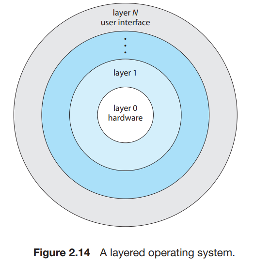
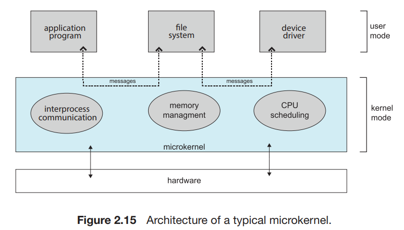
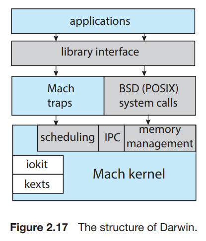

# 8. Operating-System Structure

1. Monolithic Structures
2. Layered Approach
3. Microkernels
4. Modules
5. Hybrid Systems

---

### 최근의 OS 구조 동향

- 태스크를 작은 컴포넌트, 모듈, 싱글 시스템 등으로 분할
- 각 모듈들은 인터페이스와 기능이 정의됨
    - such as, main()에 모든 코드보다, 메서드로 모듈화 하는 것

--- 

OS의 컴포넌트들이 상호작용하는 법과 커널에 녹아드는 법

## 1. Monolithic Structures

- tightly coupled system 강결합 시스템
- 구조가 없음
- 커널의 모든 기능 배치, 하나의 주소 공간에서 정적 바이너리파일 실행

#### 원조 UNIX OS

- 2 부분으로 이루어짐 : 커널, 시스템 프로그램
- 커널 : 파일시스템, CPU 스케쥴링, 메모리 관리와 같은 기능을 system call을 통해 제공
- 많은 양의 기능이 단일 주소 공간에서 실행

#### Linux OS based on UNIX

- 어플리케이션은 `glbc` 표준 C 라이브러리를 이용해 system call
- 커널 모드에서는 모놀리식 단일 주소공간을 사용
- 모듈러 설계 : 커널이 실행 중에 수정될 수 있음

### Monolithic Systems의 특징

- 단순함, 빠름
    - 아직도 Linux, Winodw 에서 사용하는 이유
- 구현과 확장에 어려움
- 오버헤드 : System call 인터페이스, 커널에서의 상호 작용

## 2. Layered Approach

- loosely coupled system 약결합 시스템
- 모듈러 방식
- 커널 : 작은 기능을 하는 컴포넌트들의 집합
- 컴포넌트 하나의 영향이 다른 곳에 미치지 않음
- OS를 몇 개의 레벨로 나눔
    - 0은 하드웨어, 높이 갈수록 유저 인터페이스
- 컴퓨터 네트워크 TCP/IP, 웹 어플리케이션에서 쓰임

### Layered Approach의 특징

- 구조와 디버깅이 단순함
- 각 레이어는 자신보다 낮은 레벨의 레이어에 대한 기능과 서비스만 사용
    - e.g. level 0은 하드웨어만 사용하기 때문에 디버깅 대상이 단순함
- 각 레이어는 자신보다 낮은 레이어가 제공한 기능으로 그현
    - 기능의 내부 구현은 알 필요가 없음
- 모든 레이어는 자료구조, 기능, 하드웨어를 상위 레이어로부터 숨김
- 순수 Layered는 사용하기 힘듦
    - 각 계층 기능을 명확히 정의하기 어려움
    - 계층을 가로질러 통신하는 것의 오버헤드
- 일반적으로 레이어 수를 줄이고, 레이어가 가진 기능을 늘려서
    - Layered의 단점을 보완함

## 3. Microkernels

- 커널이 커짐에 따라 커널 관리가 힘들어짐
- microkernel : 커널을 모듈화하고, 분리된 주소 공간을 가짐
- 커널에서 중요치 않은 컴포넌트를 뗴어네어, 사용자 모드에 구현
- 사용자 공간에서 사용자 프로그램과 다양한 서비스가 마이크로 커널을 통해 간접적으로 통신
- e.g. Mach, QNX

### Microkernels의 특징

- OS를 쉽게 확장 가능 : 새로운 서비스가 필요하면 사용자 공간에 추가, 커널의 수정 필요 없음
- 커널의 수정이 필요해도 마이크로 커널이라 수정 범위가 작음
- 시스템 기능에 대한 오버헤드 존재
    - 사용자 레벨의 서비스가 서로 통신하기 위해 메시지가 각 커널 공간에 복사되어야함
- 메시지 교환을 위해 메시지를 복사하고, 프로세스간에 컨텍스트 스위칭이 필요함

## 4. Modules

- e.g. 현대의 Unix, Linux, macOS, Windows 등
- loadable kernel modules LKM
- 커널은 핵심 컴포넌트를 가지고, 부팅 시간이나 런타임에 모듈을 통해 추가 서비스 연결
- 커널은 핵심 서비스를 제공하고, 다른 서비스는 커널 동작 중에 동적으로 구현
- 커널의 수정이 있을 때마다 재컴파일이 필요 없음

## 5. Hybrid Systems

- 주소 할당 성능, 보안, 사용성 이슈를 감안하여 혼합된 시스템
- e.g. Linux
    - monolithic : OS가 단일 주소 공간에 위치
    - modular : 새로운 기능은 동적으로 커널에 추가

### macOS and iOS

- Apple 모바일 기기 전용
- 폐쇄적인 시스템
- User experience layer
    - 사용자와 기기가 상호작용하기 위한 소프트웨어 인터페이스 정의
    - Mac OS의 Aqua : 마우스, 트랙패드에 대한 인터페이스
    - iOS의 Springboard : 터치 기기에 대한 인터페이스
- Application frameworks layer
    - Cocoa, Cocoa Touch : Objective-C, Swift 언어의 API
    - Cocoa : maOS 어플리케이션 개발을 위함
    - Cocoa Touch : iOS 어플리케이션 개발을 위함
- Core frameworks : 그래픽과 미디어를 위한 프레임워크
- Kernel environment : Mach microkernel, BSD UNIx kernel

#### Darwin

- Layered system
- Mach microkernel, BSD Unix kernel의 주요 부분
- 2개의 System call 인터페이스
    - C 라이브러를 통해 system call과 상호작용하는 Unix와 달리
- Mach System call traps, BSD System call
    - 표준 C 라이브러리와 네트워킹, 보안 등에 대한 라이브러리 제공

### Android

- 안드로이드 모바일 기기와 태블릿 PC 전용
- 오픈소스, 다양한 기기에서 동작
- 안드로이드 어플리케이션은 Java 언어로 개발
    - Google이 Java를 안드로이드 개발 전용으로 설계
    - ART Android Runtime : Java 바이트코드를 안드로이드 기기에서 실행
    - class 파일로 검파일 후 `.dex` 실행 파일로 변환

### Windows subsystem for LINUX

- 다른 OS 환경을 에뮬레이트하기위한 hybrid architecture
- Windows sybsystem for Linux WSL
    - native Linux 어플리케이션 구동 가능
- Windows Pico 프로세스 : native Linux 바이너리를 프로세스의 고유 주소 공간에 load
- LXSS : Linux System call을 Windows System call로 변환
    - e.g. `fork()` -> `CreateProcess()`

