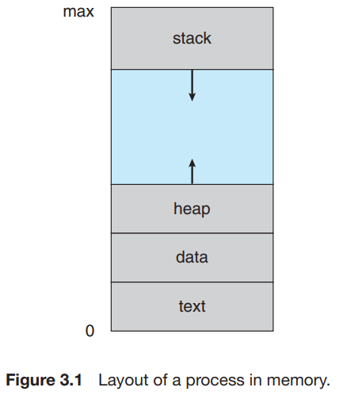
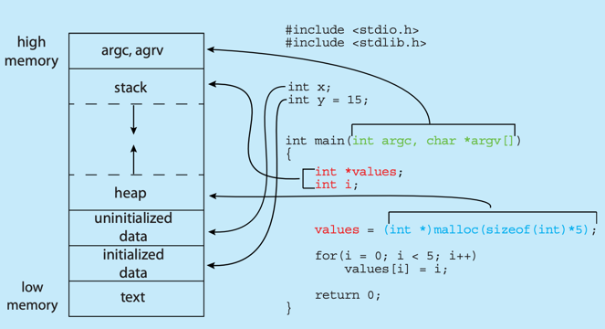
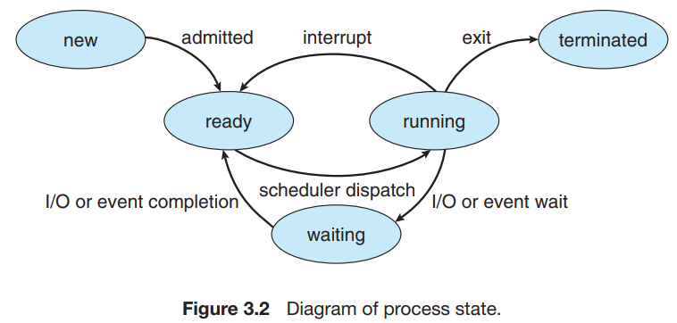
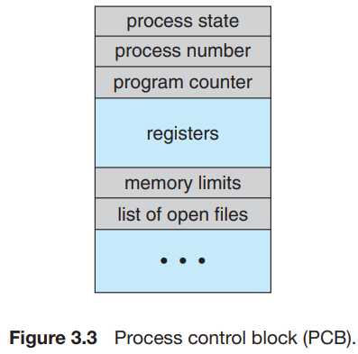

# 1. Process Concept

1. The Process
2. Process State
3. Process Control Block
4. Threads

---
job이 먼저 등장하고, 이후에 process가 등장함.  
job과 process 는 비슷한 의미로 사용되기도 함.

## 1. The Process

- Text section : 프로그램 코드
- Data section : 전역변수
    - Data section과 Text section은 크기가 고정되어 런타임 중에 수정되지 않음
- Heap section : 프로그램 런타임 중 동적으로 할당되는 메모리
- Stack section : 함수 호출 시 데이터를 임시로 저장하는 공간 파라미터, 리턴 주소, 지역 변수 등
    - Heap과 Stack은 런타임 중에 동적으로 크기를 수정함
        - OS는 Heap과 Stack이 각자 서로와 겹치지 않도록 보장함
    - 함수 호출 시 activation record 가 stack에 `push`되고, 함수 종료 시 `pop`됨

### Memory layout of a C program

- initialized data : 초기화된 전역변수 `int y`
- uninitialized data : 초기화되지 않은 전역변수 `int x`
- `args`, `argv` : `main()`에 전잘할 매개변수 영역
- GNU  `size` command : 프로그램의 각 섹션의 크기 bytes를 보여줌

### Process 의 특징

- 프로세스는 active entity, 메모리에 load하면 실행됨
    - 프로그램은 passive entity
- program counter : 다음에 실행할 명령어나 관련 리소스를 가리킴
- 실행파일을 메모리에 load하는 방법
    - 아이콘 더블클릭
    - 명령어로 실행파일 실행 `prog.exe`
- 같은 프로그램을 2개의 프로세스로 실행하면 서로 분리된 실행으로 간주
- 프로세스가 프로세스를 생성하기도 함

### 프로세스 스스로가 실행환경 :  JVM

- Java Virtual Machine JVM : Java 프로그램을 실행하기 위한 프로세스
- `java Program` : `Program.class`를 실행하기 위한 java 명령어

## 2. Process State

프로세스는 프로세스 최근의 활동에 따라 상태가 구분됨  
**프로세서 코어는 한번에 하나의 프로세스만 실행 가능**

- New : 프로세스가 생성됨
- Running : 명령어 실행 중
- Waiting : 프로세스가 어떤 이벤트가 일어나기를 기다림 I/O 완료 등
- Ready : 프로세스가 프로세서에게 할당되기를 대기
- Terminated : 프로세스가 종료됨

## 3. Process Control Block PCB, task control block

특정 프로세스에 대한 많은 정보를 가짐  
PCB는 프로세스 구동에 필요한 데이터 저장소

- Process state : 프로세스 상태 New, Ready, Running, Waiting, Terminated
- Program counter : 이 프로세스에서 다음에 실행할 명령어 주소
- CPU registers : 컴퓨터 architecture에 따라 다름. 누적기, 스택 포인터, 범용 레지스터 등의 정보 포함
- CPU scheduling information : 프로세스의 우선순위, 스케쥴링 큐에 대한 포인터 등
- Memory-management information : 메모리 관리 정보 페이지 테이블, 세그먼트 테이블 등
- Accounting information : CPU 사용량, 시간 제한, job or process number 등
- I/O status information : 프로세스에 할당된 I/O 장치들과 열린 파일 목록 등

## 4. Threads

- single-thread : 프로세스가 하나의 실행 스레드를 가짐
    - 동시에 하나의 Task만 실행 가능
- **multi**-thread : 프로세스가 여러개의 실행 스레드를 가짐
    - 동시에 1개 이상의 Task 실행 가능
- 멀티 코어 시스템에서 다수의 스레드가 병렬적으로 실행할 수 있게 함
- 스레드가 지원되는 시스템에서는 PCB에 스레드 정보를 저장함

