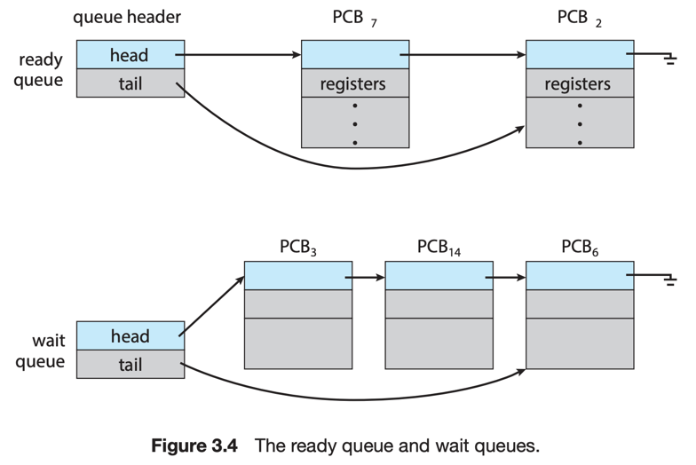

# 2. Process Scheduling

1. Scheduling Queues
2. CPU Scheduling
3. Context Switch

---

멀티 프로그래밍의 목표는 CPU를 최대한 활용하여 프로세스를 실행하는 것이다.  
시분할 시스템의 목적은 CPU 코어를 프로세스간에 빠르게 전환하면서 유저가 실행 중인 프로그램과 상호작용 할 수 있게 하는 것이다.

### Single Core system vs Multi Core system

- CPU 코어는 한번에 하나의 프로세스만 실행 가능
- process scheduler 는 코어에서 실행할 수 있는 프로세스를 선택
- Single Core system  : 한번에 하나의 프로세스만 실행 가능
- Multi Core system : 동시에 여러 프로세스를 실행 가능

#### 프로세스 대기

- 코어 수보다 많은 프로세스가 실행되어야할 경우,
- 프로세스는 코어에게 스케쥴링 되기를 기다려야 함

#### 프로세스 동작

- I/O bound process : 연산보다 I/O가 더 많은 프로세스
- CPU bound process : I/O보다 CPU 연산이 더 많은 프로세스

## 1. Scheduling Queues

- ready queue : 실행을 기다리는 프로세스들의 집합
- linked list
    - 헤더는 첫번째 PCB를 가리키는 포인터
- 각 PCB는 다음 PCB를 가리키는 포인터를 가짐

### other queues

- wait queue : 실행 상태였던 프로세스가 대기 상태로 기다리는 큐
- 코어가 할당된 프로세스는 실행 중 특정 이벤트로 중단, 인터럽트, 대기 상태에 빠짐
    - ex. I/O 응답 대기

## 2. CPU Scheduling

## 3. Context Switch