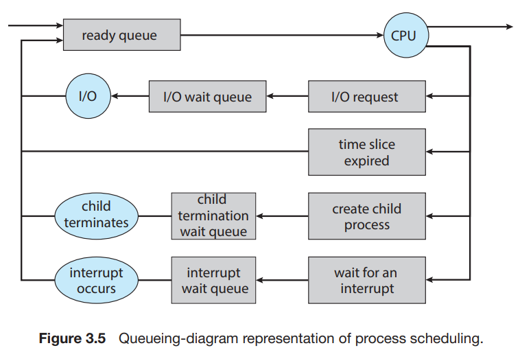
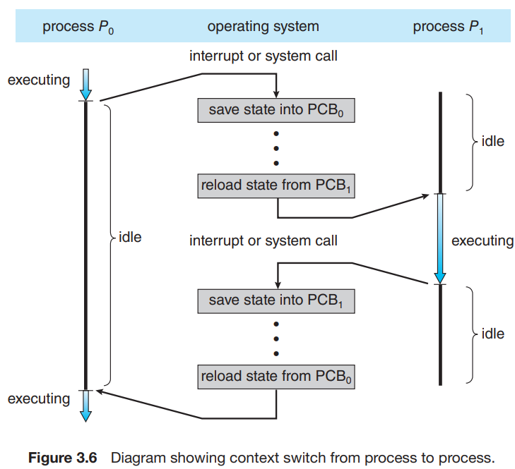

# 2. Process Scheduling

1. Scheduling Queues
2. CPU Scheduling
3. Context Switch

---

#### multiprograming의 목적은

- 동시에 프로세스를 여러개 실행하는 것
- CPU를 최대한 활용하는 것

#### time sharing <sup>시분할 시스템</sup>의 목적은

- CPU core를 프로세스간에 빠르게 전환해가면서
- 사용자가 마치 동시에 프로그램이 실행 중이게 느낄 수 있게 하는 것

### Single Core system vs Multi Core system

- CPU 코어는 한번에 하나의 process만 실행 가능
- process scheduler 는 코어에서 실행할 수 있는 process를 선택
- Single Core system  : 한번에 하나의 process만 실행 가능
- Multi Core system : 동시에 여러 process를 실행 가능

#### process 대기

- 코어 수보다 많은 process가 실행되어야할 경우,
- process는 코어에게 스케쥴링 되기를 기다려야 함

#### process 동작

- I/O bound process : 연산보다 I/O가 더 많은 process
- CPU bound process : I/O보다 CPU 연산이 더 많은 process
- degree of multiprogramming : 현재 메모리에 있는 process의 수

### Linux의 process 표현

- `task_struct` : process의 모든 정보를 포함하는 C 구조체
    - `<include/linux/sched.h>`에 정의
    - process 상태, scheduling, memory 관리 정보, open files 등을 포함

```c
long state; /* state of the process */
struct sched_entity se; /* scheduler-specific information */
struct task_struct *parent; /* this process's parent */
struct list_head children; /* this process's children */
struct files_struct *files; /* list of open files */
struct mm_struct *mm; /* address space of this process */
```

## 1. Scheduling Queues


- ready queue : 실행을 기다리는 process들의 집합
- linked list
    - 헤더는 첫번째 PCB를 가리키는 포인터
- 각 PCB는 다음 PCB를 가리키는 포인터를 가짐
- wait queue : 실행 상태였던 process가 대기 상태로 기다리는 큐
- 코어가 할당된 process는 실행 중 특정 이벤트로 중단, 인터럽트, 대기 상태에 빠짐
    - e.g. I/O 응답 대기

### Process Scheduling

process는 종료될 때까지 아래 사이클을 반복    
종료 : 모든 큐에서 제거되고, PCB와 자원 할당 해제됨



1. 생성된 process는 최초에 ready queue에 `put`
    - 실행 상태로 가거나, 디스패치 되기 전까지 대기
2. Core에 할당되면 실행 상태로 전환
    - process는 I/O 요청을 보내고 I/O wait queue에 `put`
    - process는 새로운 자식 process를 생성하고 wait queue에 `put`
    - process는 코어로부터 강제로 제거되어 다시 ready queue에 `put` 가능
        - 인터럽트 발생 or 시간 만료

## 2. CPU Scheduling

- CPU scheduler는 ready queue에서 process를 선택하여 코어에 할당
- scheduler는 여러 process에게 코어를 짧은 시간 할당하려함
- scheduler는 매 100ms 보다 짧게 실행됨

### swapping

- degree of multiprogramming을 조절
- `swap out` : process는 메모리에서 디스크로 swap out 될 수 있음
- `swapped in` : process는 다시 메모리로 되어 실행 상태로 돌아감
- 메모리가 과다로 할당되어있을 때 유용

## 3. Context Switch <sup>문맥 교환</sup>

- context : process의 PCB에 저장된 정보
    - process의 상태, PC, 레지스터 값, 메모리 할당 정보 등



- interrupt가 발생하면, 시스템은 현재 process의 context를 저장하여,
    - 코어가 다른 process를 실행할 수 있게 함
    - 나중에 다시 process를 실해할 때 저장한 정보를 불러옴
  - state save : 현재 CPU 코어의 상태 저장
- state restore : 상태 복원

### Context Switch란

- 현재 process를 state save 후 다른 프로세스의 state restore
- kernel은 프로세스의 context를 해당 process PCB에 저장하고,
    - 새로운 process에 copntext를 load & 실행
- overhead : Context Switch는 switching 시간에 아무것도 못함
- 하드웨어 성능에 의존함
    - memory 속도, register 개수
