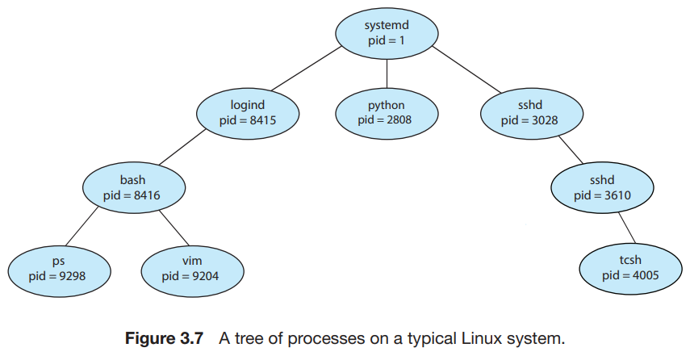
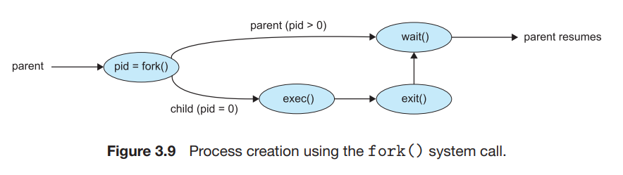

# 3. Operation on Process

1. Process Creation
2. Process Termination

---

#### process 는 concurrent, dynamic

- concurrent 하게 실행되고,
- 동적으로 생성, 종료 됨
- 따라서, OS는 process를 생성, 종료, 동시 실행하는 메커니즘을 가짐

## 1. Process Creation

- `fork()`
- process가 process를 생성 가능
- parent process <sup>부모 프로세스</sup> : process를 생성한 process
- child process <sup>자식 프로세스</sup>: 부모 process에 의해 생성된 process
- Process Identifie <sup>PID</sup> : OS는 각 process에 고유한 PID를 할당
    - kernel 에서 process의 다양한 속성에 접근할 수 있는 index 역할

### process tree <sub>LINUX</sub>



- `systemd` : 시스템 부팅 시 생성되는 첫번째 user process, 모든 user process의 root process
- `lonind` : 시스템에 직접 로그인한 사용자를 관리
    - 로그인한 사용자는 `bash` shell을 실행,
        - 'ps', `vim` 프로세스 생성 가능
- `sshd` : 사용자가 시스템과의 ssh 연결을 관리

### Parent & Child process

- 자식 프로세스는 실행 시 resource가 필요 <sub>ex. 메모리, 파일</sub>
- resource는 직접 얻거나, 부모 프로세스로부터 리소스 일부를 제한 받을 수 있음
- 자식 프로세스에게 리소스를 제한하는 것은 너무 많은 자식 프로세스로 인한 시스템 부하 방지 가능
- 자식 프로세스에게 data input을 전달할 수 있음

### Parent 가 Child를 생성하면,

- 자식과 부모가 동시에 실행하거나,
    - 부모가 자식이 종료될 때까지 Wait
- 주소 공간
    - 부모 프로세스의 주소 공간을 복사하여 자식 프로세스의 주소 공간을 생성하거나,
    - 새로운 프로그램을 load함

#### 실행 예시

- `fork()` : 자식 프로세스를 생성하는 System call
    - return 0 : 새로운 자식 프로세스가 호출했을 때
    - return PID : 부모 프로세스가 호출했을 때
- `exec()` : 바이너리 파일을 메모리에 load하고, 실행하는 System call
- `wait()` : 자식 프로세스 실행 동안 할일이 없다면, 자신을 ready queue에서 해제

```C
#include <sys/types.h>
#include <stdio.h>
#include <unistd.h>

int main()
  {
  pid t pid;
    /* fork a child process */
    pid = fork();
      if (pid < 0) { /* error occurred */
        fprintf(stderr, "Fork Failed");
        return 1;
      }
      else if (pid == 0) { /* child process */
        execlp("/bin/ls","ls",NULL);
      }
      else { /* parent process */
        /* parent will wait for the child to complete */
        wait(NULL);
        printf("Child Complete");
      }
    return 0;
  }
```

- 같은 프로그램에 대해 2개의 실행 복사본이 생김



## 2. Process Termination

- 종료 방법
    - 마지막 문장을 실행 완료하거나
    - `exit()` system call을 호출
- 종료 시 integer value를 부모 프로세스에게 return
- OS에 의해 할당된 리소스를 해제
- 주로 부모 프로세스에 의해 종료
- system call을 통해 다른 프로세스 종료 가능 <sub>ex. TerminateProcess() in Windows</sub>
- `exit(1)` system call : 프로세스를 종료시킴
- `wait()` system call : 자식 프로세스가 종료될 때까지 기다림

#### 부모가 자식을 종료시키는 경우

- 자식 프로세스가 resource 사용량을 초과할 때
- 자식 프로세스에게 할당한 작업이 더 이상 필요 없을 때
- 부모프로세스가 종료될 때
- cascading termination : 부모프로세스가 종료되어 그 모든 자식 프로세스가 종료되어버리는 것

#### zombie, orphan process

- zombie process : 부모 프로세스가 `wait()` system call을 호출하지 않은 상태에서 종료된 자식 프로세스
- orphan process : 부모 프로세스가 종료된 상태에서 실행되는 자식 프로세스
    - init process : 주기적으로 `wait()` system call을 호출하여 orpan을 수집하고 PID와 프로세스 테이블 해제
        - Linux의 경우, `systemd`가 init process 역할

### 2.1 Android Process Hierarchy

- Android는 process의 중요성을 계층적으로 관리
- resource 부족 시, 우선순위가 낮은 프로세스를 kill
- 우선순위
    1. Foreground process
    2. Visible process
    3. Service process
    4. Background process
    5. Empty process
