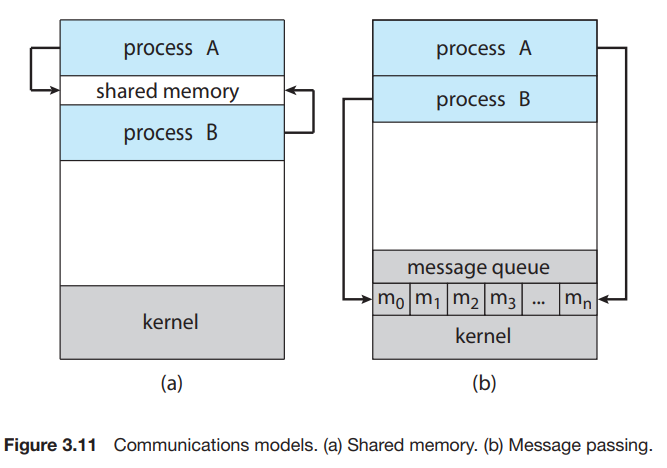

# 4. Interprocess Communication

- independent process : 다른 프로세스와 데이터를 공유하지 않음
- cooperating process : 다른 프로세스와 영향 데이터을 주고받음

### process cooperation

- Information sharing : 프로세스들의 공통 관심 정보에 대한 동시 접근 제공
- Computation speedup : 프로세스를 subtask로 쪼개어서 병렬적으로 수행 multi core
- Modularity : 기능을 별도의 프로세스나 스레드로 분할, 모듈화

### interprocess communication IPC

- 프로세스 간에 데이터를 교환할 수 있는 메커니즘
- shared memory, message passing
- 대부분의 OS가 둘다 구현

#### shared memory model

- shared region을 프로스세스 간에 공유
- 프로세스들은 shared region에 read/write
- messgae passing에 비해 빠름
- 데이터 교환 시 kernel의 개입이 없음
    - shared memmory 초기화 시점에만 kernel이 필요

#### message passing model

- 프로세스간에 메시지를 주고받음
- 작은 양의 데이터 교환에 유용
- 분산 시스템 환경에 적합
- sytstem call을 구현하고, 커널의 개입으로 시간이 소모되므로 느림

## multiprocess architecture - CHROME BROWSER

- 크롬 브라우저는 각 탭마다 별도의 프로세스를 생성
- 각 tab의 web site를 다른 web site와 독립적으로 isolation 해서 실행

#### 프로세스의 3가지 타입

- browser process : 하나만 생성, user interface 관리, disk, network I/O 등
- Renderer process : 각 tab 별로 생성, web page rendering 관리,
- plug-in process : 각 plug-in 마다 생성, 다른 Renderer process, browser process와 통신하기 위한 코드 포함

