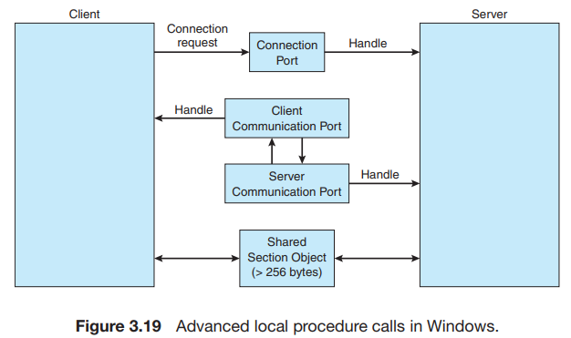
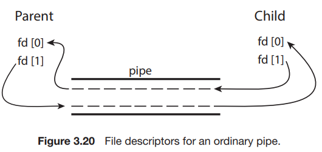

# 7. Examples of IPC Systems

1. POSIX Shared Memory
2. Mach Message Passing
3. Windows
4. Pipes

---

## 1. POSIX Shared Memory

- `shm_open()` system call : shared memory object를 생성
    - `fd = shm_open(name, O_CREAT | O_RDWR, mode)`
        - `name` : shared memory object의 이름
        - `O_CREAT` : shared memory object가 존재하지 않으면 생성
        - `O_RDWR` : shared memory object를 읽고 쓰기 위해 open
        - `mode` : shared memory object의 권한
- `ftruncate()` system call : shared memory object의 크기를 설정
    - `ftruncate(fd, length)`
        - `fd` : shared memory object의 file descriptor
        - `length` : shared memory object의 크기
- `mmap()` system call : shared memory 객체를 담은 memory-mapped file 생성
- `shm_unlink()` system call : shared memory object를 삭제

#### 예제

<details>
    <summary>Producer</summary>

```c
#include <stdio.h>
#include <stdlib.h>
#include <string.h>
#include <fcntl.h>
#include <sys/shm.h>
#include <sys/stat.h>
#include <sys/mman.h>

int main()
{
/* the size (in bytes) of shared memory object */
    const int SIZE = 4096;
/* name of the shared memory object */
    const char *name = "OS";
/* strings written to shared memory */
    const char *message 0 = "Hello";
    const char *message 1 = "World!";
/* shared memory file descriptor */
    int fd;
/* pointer to shared memory obect */
    char *ptr;
/* create the shared memory object */
    fd = shm open(name,O CREAT | O RDWR,0666);
/* configure the size of the shared memory object */
    ftruncate(fd, SIZE);
/* memory map the shared memory object */
    ptr = (char *)
            mmap(0, SIZE, PROT READ | PROT WRITE, MAP SHARED, fd, 0);
/* write to the shared memory object */
    sprintf(ptr,"%s",message 0);
    ptr += strlen(message 0);
    sprintf(ptr,"%s",message 1);
    ptr += strlen(message 1);
    return 0;
}
```

</details>

<details>
    <summary>Consumer</summary>

```c
#include <stdio.h>
#include <stdlib.h>
#include <fcntl.h>
#include <sys/shm.h>
#include <sys/stat.h>
#include <sys/mman.h>

int main()
{
/* the size (in bytes) of shared memory object */
    const int SIZE = 4096;
/* name of the shared memory object */
    const char *name = "OS";
/* shared memory file descriptor */
    int fd;
/* pointer to shared memory obect */
    char *ptr;
/* open the shared memory object */
    fd = shm open(name, O RDONLY, 0666);
/* memory map the shared memory object */
    ptr = (char *)
            mmap(0, SIZE, PROT READ | PROT WRITE, MAP SHARED, fd, 0);
/* read from the shared memory object */
    printf("%s",(char *)ptr);
/* remove the shared memory object */
    shm unlink(name);
    return 0;
}
```

</details>

## 2. Mach Message Passing

### Mach OS

- 분산 시스템 특화 OS
- macOS, iOS 에서도 쓰임
- 대부분의 프로세스간 통신이 message passing을 기반으로 함

### port

- port : Mach OS의 mailbox
    - 사이즈 유한, 한쪽으로만 open
    - send port, receive port로 구분
    - 다수의 sender, 한명의 receiver
- port마다 다른 port와 상호작용하기 위한 권한 모음 존재
- 동일 task에 있는 모든 thread가 동일한 권한을 가짐
- `MACH_PORT_RIGHT_SEND` : port에 message를 보낼 수 있는 권한
- `MACH_PORT_RIGHT_RECEIVE` : port로부터 message를 받을 수 있는 권한
- Task 생성시 기본생성 port
    - Task self port : task가 kernel에게 message를 보내기 위한 port
    - Task notify port : kernel이 task에게 message를 보내기 위한 port
- `mach_port_allocate()` : port 생성, 메시지 큐 할당
- port를 부트스트랩 서버에 등록 가능
    - 다른 task가 레지스트리에서 port를 조회하고, 해당 port로 메시지를 보낼 수 있음

```C
mach port t port; // the name of the port right

mach port allocate(
    mach task self(), // a task referring to itself
    MACH PORT RIGHT RECEIVE, // the right for this port
    &port); // the name of the port right
```

### Messages queue

- port마다 유한한 queue가 존재
- 최초에는 비어있음
- 메시지가 port에 보내지면, queue에 메시지 복사
- 동일한 송신자에 한해 FIFO 보장
- 메시지 구성요소
    - header : 메타데이터 포함, 고정 사이즈
    - body : 실제 데이터 포함, 가변 사이즈
- 간단한 메시지 : 커널에서 해석되지 않는 일반적이고 비구조화된 데이터
- 복잡한 메시지 : 데이터 위치에 대한 포인터 <sub>out-line data</sub> 포함
- `mach_msg()` : 메시지를 송/수신
    - `MACH_SEND_MSG` : 메시지 송신
    - `MACH_RCV_MSG` : 메시지 수신
- `mach_msg()` -> `mach_msg_trap()` system call -> `mach_msg_overwrite_trap()`

#### 성능 저하

- 메시지를 송신 port에서 수신 port로 복사하는 작업에서 성능저하 발생
- 가상 메모리 관리 기법으로 해결
    - 실제 메시지를 복사하지 않고, 메시지의 가상 주소만 복사
    - 시스템 내부 메시지일 경우에만 사용 가능

### queue가 full일 때

- queue에 공간이 생길 때까지 대기
- n ms동안 대기
- 대기하지않고 return
- 메시지 내용 임시 cache에 저장

### 예제

<details>
    <summary>Producer</summary>

```c
#include<mach/mach.h>

struct message {
    mach msg header t header;
    int data;
};

mach port t client;
mach port t server;

/* Client Code */
struct message message;

// construct the header
message.header.msgh size = sizeof(message);
message.header.msgh remote port = server;
message.header.msgh local port = client;

// send the message
mach msg(&message.header, // message header
        MACH SEND MSG, // sending a message
        sizeof(message), // size of message sent
        0, // maximum size of received message - unnecessary
        MACH PORT NULL, // name of receive port - unnecessary
        MACH MSG TIMEOUT NONE, // no time outs
        MACH PORT NULL // no notify port
);


/* Server Code */
struct message message;

// receive the message
mach msg(&message.header, // message header
        MACH RCV MSG, // sending a message
        0, // size of message sent
        sizeof(message), // maximum size of received message
        server, // name of receive port
        MACH MSG TIMEOUT NONE, // no time outs
        MACH PORT NULL // no notify port
);
```

</details>

## 3. Windows

### advanced local procedure call <sup>ALPC</sup>

- 같은 머신에서 다른 두 프로세스간의 통신을 위한 메커니즘
- Windows API 아니어서 application 프로그래머에겐 안보임
    - Window API가 RPC를 호출하면 간접적으로 APLC를 사용
- Mach와 같은 port 사용
    - connection ports
    - communication ports

### port

- 서버 프로세스가 connection port를 생성
    - 모든 프로세스에게 보여짐
- 채널 구성
    1. 클라이언트가 handle을 열고 connection 요청을 보냄
    2. 서버는 채널을 생성하고 클라이언트에게 handle 반환
    3. 이 채널을 client-server 간의 메시지 통신 포트 쌍으로 구성
    4. 콜백 메커니즘 제공

### ALPC 기술



- 256bytes 이하의 작은 메시지는 messeage queue에 직접 저장 후 메시지 복사
- 더 큰 메시지는 section object를 통해 전달
    - section object : 채널과 연관된 공유 메모리 영역
- 아주 큰 메시지 (section object 보다 큼)는 API를 통해 공유
    - API : 서버 프로세스가 클라이언트 주소 공간에 직접 읽기 / 쓰기 가능
- 클라이언트는 채널 설정 시 큰 메시지를 전송해야하는 지 판단
    - session object 생성을 위해 작은 메시지 전송
        - 작은 메시지에는 포인터와 크기 정보를 포함

## 4. Pipes

두 프로세스가 통신하는 conduit

#### Pipes issue

1. 파이프의 통신이 양방향인가, 단방향인가
2. 양방향이라면, half duplex인가, full duplex인가
3. 프로세스간의 parent-child 관계가 있는가, 없는가
4. 파이프가 네트워크를 통해 통신할 수 있는가, 아니면 machine 내부 통신인가

### 4.1 Ordinary pipes



- 단방향
- producer-consumer 관계처럼 동작

- producer : wirte end, consumer : read end
- `pipe(int fd[])`: pipe 생성
    - `fd[0]` : read end
    - `fd[1]` : write end

#### UNIX

- Unix는 pipe를 file처럼 취급
    - `read()` : pipe로부터 읽을 수 있음
    - `write()` : pipe에 쓸 수 있음
- `fork()` : child process 생성
    - 부모가 자식에게 메시지 전송

<details>
    <summary>Demo</summary>

```C
#include <sys/types.h>
#include <stdio.h>
#include <string.h>
#include <unistd.h>
#define BUFFER SIZE 25
#define READ END 0
#define WRITE END 1


int main(void)
{
    char write msg[BUFFER SIZE] = "Greetings";
    char read msg[BUFFER SIZE];
    int fd[2];
    pid t pid;

    /* create the pipe */
    if (pipe(fd) == -1) {
        fprintf(stderr,"Pipe failed");
        return 1;
    }

    /* fork a child process */
    pid = fork();

    if (pid < 0) { /* error occurred */
        fprintf(stderr, "Fork Failed");
        return 1;
    }

    if (pid > 0) { /* parent process */
        /* close the unused end of the pipe */
        close(fd[READ END]);

        /* write to the pipe */
        write(fd[WRITE END], write msg, strlen(write msg)+1);

        /* close the write end of the pipe */
        close(fd[WRITE END]);
    }

    else { /* child process */
        /* close the unused end of the pipe */
        close(fd[WRITE END]);

        /* read from the pipe */
        read(fd[READ END], read msg, BUFFER SIZE);
        printf("read %s",read msg);

        /* close the read end of the pipe */
        close(fd[READ END]);
    }
    return 0;
}
```

</details>

#### Windows anonymous pipes

- 단방향, 프로세스 간의 부모-자식 관계 형성
- `CreatePipe()` : pipe 생성
- `ReadFile()` : pipe로부터 읽을 수 있음
- `WriteFile()` : pipe에 쓸 수 있음

<details>
    <summary>Demo : parent</summary>

```C
#include <stdio.h>
#include <stdlib.h>
#include <windows.h>

#define BUFFER SIZE 25

int main(void)
{
    HANDLE ReadHandle, WriteHandle;
    STARTUPINFO si;
    PROCESS INFORMATION pi;
    char message[BUFFER SIZE] = "Greetings";
    DWORD written;
    
    /* set up security attributes allowing pipes to be inherited */
    SECURITY ATTRIBUTES sa = {sizeof(SECURITY ATTRIBUTES),NULL,TRUE};
    
    /* allocate memory */
    ZeroMemory(&pi, sizeof(pi));
    
    /* create the pipe */
    if (!CreatePipe(&ReadHandle, &WriteHandle, &sa, 0)) {
        fprintf(stderr, "Create Pipe Failed");
        return 1;
    }
    
    /* establish the START INFO structure for the child process */
    GetStartupInfo(&si);
    si.hStdOutput = GetStdHandle(STD OUTPUT HANDLE);
    
    /* redirect standard input to the read end of the pipe */
    si.hStdInput = ReadHandle;
    si.dwFlags = STARTF USESTDHANDLES;
    
    /* don’t allow the child to inherit the write end of pipe */
    SetHandleInformation(WriteHandle, HANDLE FLAG INHERIT, 0);
    
    /* create the child process */
    CreateProcess(NULL, "child.exe", NULL, NULL,
                  TRUE, /* inherit handles */
                  0, NULL, NULL, &si, &pi);
    
    /* close the unused end of the pipe */
    CloseHandle(ReadHandle);
    
    /* the parent writes to the pipe */
    if (!WriteFile(WriteHandle, message,BUFFER SIZE,&written,NULL))
        fprintf(stderr, "Error writing to pipe.");
    
    /* close the write end of the pipe */
    CloseHandle(WriteHandle);
    
    /* wait for the child to exit */
    WaitForSingleObject(pi.hProcess, INFINITE);
    
    CloseHandle(pi.hProcess);
    CloseHandle(pi.hThread);
    
    return 0;
}
```

</details>

<details>
    <summary>Demo : child</summary>

```C
#include <stdio.h>
#include <windows.h>
#define BUFFER SIZE 25
int main(VOID)
{
HANDLE Readhandle;
CHAR buffer[BUFFER SIZE];
DWORD read;

    /* get the read handle of the pipe */
    ReadHandle = GetStdHandle(STD INPUT HANDLE);

    /* the child reads from the pipe */
    if (ReadFile(ReadHandle, buffer, BUFFER SIZE, &read, NULL))
        printf("child read %s",buffer);
    else
        fprintf(stderr, "Error reading from pipe");
    
    return 0;
}
```

</details>

### 4.2 Named pipes

- 양방향
- 부모-자식 관계 없음
- pipe가 생성되면 프로세스들이 사용 가능
- 통신이 끝나도 제거되지 않음
- UNIX, Windows 모두 지원

#### UNIX

- FIFO
- `mkfifo()` : named pipe 생성
- `open()`, `read()`, `write()`, `close()`
- 명시적으로 제거 전까지 안사라짐
- 양방향, half duplex
- 통신하는 프로세스들이 같은 머신에 있어야 함
    - 네트워크를 통해 통신하려면 socket 사용

#### Windows

- Unix보다 풍부한 기능
- full duplex 통신 허용
- 다른 머신의 프로세스간에 통신 가능
- byte, 메시지 모두 가능
- `CreateNamedPipe` : named pipe 생성
- `ConnectNamedPipe` : named pipe에 연결
- `ReadFile`, `WriteFile`
