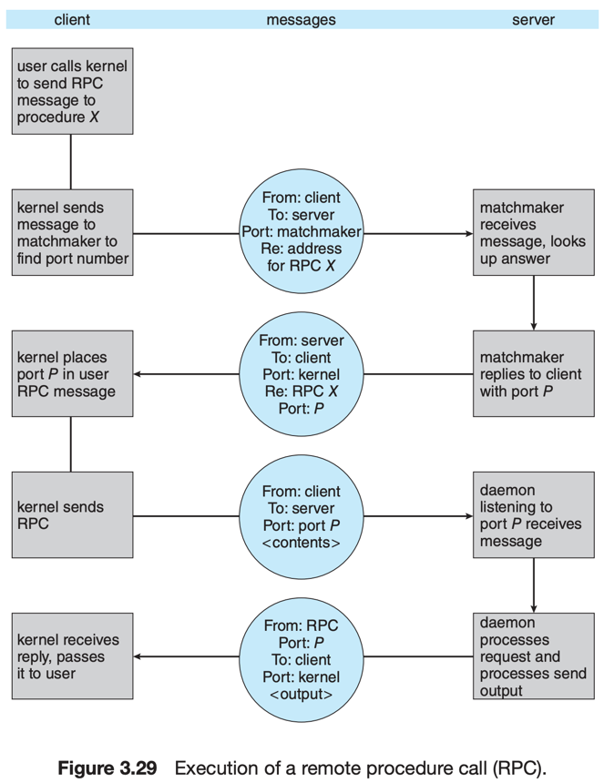

# 8. Communication in Client–Server Systems

1. Sockets
2. Remote Procedure Calls

---

client-server system 에서 통신하는 2가지 방법. Socket <sup>1</sup> 과 Remote Procedure Call <sup>2</sup>

#### Sockets vs RPC

- Socket : low-level communication mechanism
    - 구조화되지 않은 스트림을 통해 데이터를 전송
- RPC : 분산 시스템에 유용
    - RPC 데몬과 Client 집합으로 이루어짐

## 1. Sockets

- socket : 네트워크를 통한 프로세스 간 통신의 endpoint
- socket 식별값 = IP 주소 + port 번호
- 같은 host 간의 또 다른 연결 시 client socket은 다른 port 번호를 사용
- 모든 connection은 unique 함
    - 모두 다른 쌍의 socket으로 이루어짐

### client-server architecture의 Socket


- server는 well-known port로 listen 중
- client는 자신에게 1024 이상의 임의의 port번호 할당
- server가 요청을 받을 때, client socket으로부터 connection 수락

### JAVA Socket Programming

- `Socket` class : Connection-oriented <sup>TCP</sup> socket을 생성
- `DatagramSocket` class : Connectionless <sup>UDP</sup> socket을 생성
    - `MultiCastSocket` class : 멀티캐스트 그룹으로 데이터를 보내는데 사용

<details>
    <summary>Host : Date server</summary>

- listens on port 6013
- Connection을 맺고, Client에게 현재 시간을 보냄
- `accept()` : client의 connection 요청을 기다림. blocking
- date를 보내면 client socket을 닫고, 다음 connection을 기다림

```java
import java.net.*;
import java.io.*;

public class DateServer {
    public static void main(String[] args) {
        try {
            ServerSocket sock = new ServerSocket(6013);
            /* now listen for connections */
            while (true) {
                Socket client = sock.accept();
                PrintWriter pout = new
                        PrintWriter(client.getOutputStream(), true);
                /* write the Date to the socket */
                pout.println(new java.util.Date().toString());
                /* close the socket and resume */
                /* listening for connections */
                client.close();
            }
        } catch (IOException ioe) {
            System.err.println(ioe);
        }
    }
}
```

</details>


<details>
    <summary>Client</summary>

- date server에 요청을 보낼 `Socket` 생성
- loopback : `127.0.0.1`
    - host 본인과 TCP/IP 통신

```java
import java.net.*;
import java.io.*;

public class DateClient {
    public static void main(String[] args) {
        try {
            /* make connection to server socket */
            Socket sock = new Socket("127.0.0.1", 6013);
            InputStream in = sock.getInputStream();
            BufferedReader bin = new
                    BufferedReader(new InputStreamReader(in));
            /* read the date from the socket */
            String line;
            while ((line = bin.readLine()) != null)
                System.out.println(line);
            /* close the socket connection*/
            sock.close();
        } catch (IOException ioe) {
            System.err.println(ioe);
        }
    }
}
```

</details>

## 2. Remote Procedure Calls <sup>RPC</sup>

- network로 연결된 시스템간의 procedure call을 추상화함
- 메시지는 구조화되어있음
- RPC 데몬에게 메시지를 전송
    - RPC 데몬은 remote 시스템 port listener
- 메시지에는 함수와 매개변수 포함

#### Stub

- client 측에 제공하는 인터페이스
- Stub을 제공하고 내부사항은 숨김
- Client가 remote procedure를 호출하면, RPC 시스템이 Stub을 호출
- Stub이 서버의 port를 가리키고, 파라미터를 marshalling하여 전송

#### issue 1 : marshal

- 서버의 architecture와 관계없이 데이터를 전송 가능한 형태로 변환하는 과정
- e.g. big-endian vs little-endian
- external data representation <sup>XDR</sup>

#### issue 2 : network issue

- RPC 시스템은 network의 이슈로 인해 실패할 수 있음
- 메시지 전송을 **딱 한번만** 전송하게 함 <sub>최대 한번이 아님</sub>
- 서버가 Ack message를 보내지 않으면, client는 다시 전송

#### issue 3 : communication



- shared memory가 아니기 떄문에 서로에 대한 정보를 완전히 알지 못함
- server의 port 번호를 알아야함
- 해결방안 (2)
    - 고정됨 port 번호를 제공하여 compile 시점에 포트 번호를 알수 있게함
    - OS의 rendezvous 데몬을 사용 a.k.a matchmaker

### 2.1 Android RPC

- Android는 RPC를 사용하여 IPC를 구현
- binder framework에 RPC를 구현하여 서로 다른 프로세스에게 메시지를 전송
- service : user interface 없이, 백그라운드에서 실행되는 component
- `bindService()` : service가 bound 되고, 메시지 패싱이나 RPC가 가능해짐
- `onBind()` : service가 bind 되었을 때 호출되는 method
    - remote Object의 메서드를 가리키는 인터페이스 반환