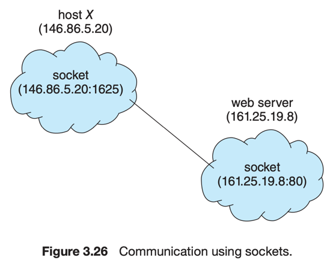

# 8. Communication in Client–Server Systems

1. Sockets
2. Remote Procedure Calls

---

client-server system 에서 통신하는 2가지 방법. Socket <sup>1</sup> 과 Remote Procedure Call <sup>2</sup>

## 1. Sockets

- socket : 네트워크를 통한 프로세스 간 통신의 endpoint
- socket 식별값 = IP 주소 + port 번호
- 같은 host 간의 또 다른 연결 시 client socket은 다른 port 번호를 사용
- 모든 connection은 unique 함
    - 모두 다른 쌍의 socket으로 이루어짐

### client-server architecture의 Socket



- server는 well-known port로 listen 중
- client는 자신에게 1024 이상의 임의의 port번호 할당
- server가 요청을 받을 때, client socket으로부터 connection 수락

### JAVA Socket Programming

- `Socket` class : Connection-oriented <sup>TCP</sup> socket을 생성
- `DatagramSocket` class : Connectionless <sup>UDP</sup> socket을 생성
    - `MultiCastSocket` class : 멀티캐스트 그룹으로 데이터를 보내는데 사용

<details>
    <summary>Host : Date server</summary>

- DateServer listens on port 6013
- Connection을 맺고, Client에게 현재 시간을 보냄
- `accept()` : client의 connection 요청을 기다림. blocking
  - 
- 

```java
import java.net.*;
import java.io.*;

public class DateServer {
    public static void main(String[] args) {
        try {
            ServerSocket sock = new ServerSocket(6013);
            /* now listen for connections */
            while (true) {
                Socket client = sock.accept();
                PrintWriter pout = new
                        PrintWriter(client.getOutputStream(), true);
                /* write the Date to the socket */
                pout.println(new java.util.Date().toString());
                /* close the socket and resume */
                /* listening for connections */
                client.close();
            }
        } catch (IOException ioe) {
            System.err.println(ioe);
        }
    }
}
```

</details>


<details>
    <summary>Client</summary>

```java
import java.net.*;
import java.io.*;

public class DateClient {
    public static void main(String[] args) {
        try {
            /* make connection to server socket */
            Socket sock = new Socket("127.0.0.1", 6013);
            InputStream in = sock.getInputStream();
            BufferedReader bin = new
                    BufferedReader(new InputStreamReader(in));
            /* read the date from the socket */
            String line;
            while ((line = bin.readLine()) != null)
                System.out.println(line);
            /* close the socket connection*/
            sock.close();
        } catch (IOException ioe) {
            System.err.println(ioe);
        }
    }
}
```

</details>

## 2. Remote Procedure Calls <sup>RPC</sup>